# Linux Conntrack

# The Hidden Brain Behind Linux Networking

---

# Why This File Exists

Imagine Google.

Millions of users are accessing:

```text
api.google.com

youtube.com

gmail.com
```

Question:

> How does Linux remember who initiated which connection?

The answer:

```text
Connection Tracking

(conntrack)
```

Conntrack is a kernel subsystem that remembers network conversations.

Without it:

* NAT breaks
* Stateful firewalls break
* Docker breaks
* Kubernetes breaks

---

# Learning Goals

After this file you should understand:

```text
Packet

↓

Conntrack

↓

State Tracking

↓

NAT

↓

Firewall

↓

Response Mapping

↓

Cleanup
```

---

# What Is Conntrack?

Think of it as memory for networking.

Without conntrack:

```text
Packet

↓

Packet

↓

Packet

↓

Packet
```

Linux sees independent packets.

With conntrack:

```text
Packet

↓

Conversation

↓

State

↓

Session
```

Linux now understands relationships.

---

# Mental Model

Think of a hotel receptionist.

Every guest entering:

```text
Guest

↓

Room Number

↓

Check In

↓

Check Out
```

Linux does something similar.

---

# Big Picture

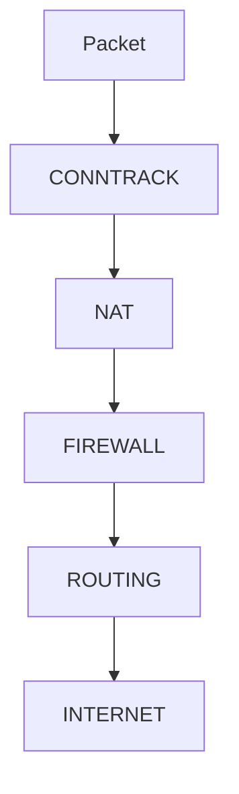

Conntrack sits very early in the pipeline.

---

# Linux Networking Architecture

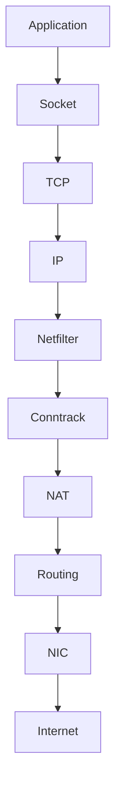

---

# Why Conntrack Exists

Three huge reasons.

```mermaid
mindmap

root((Conntrack))

NAT

Stateful Firewall

Load Balancing

Kubernetes

Docker

VPN

Cloud Networking
```

---

# How Linux Identifies Connections

Linux uses a 5-tuple.

---

# 5-Tuple

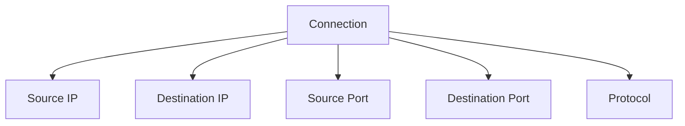

Example:

```text
172.17.0.2

↓

8.8.8.8

↓

52311

↓

443

↓

TCP
```

---

# Visualizing A Connection

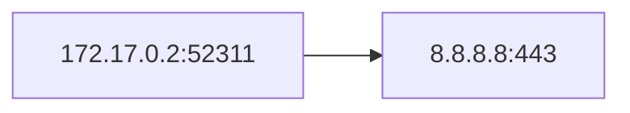

Linux creates an entry.

---

# First Packet Journey

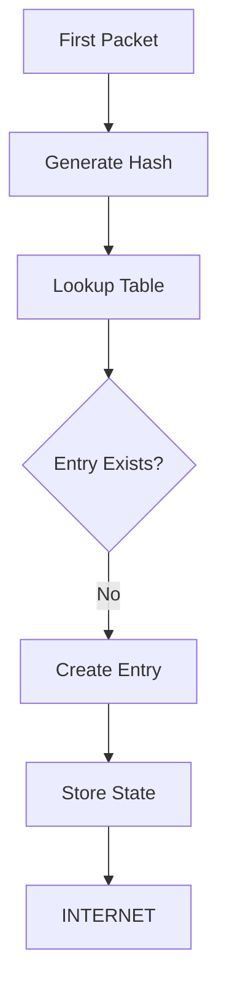

---

# Subsequent Packets

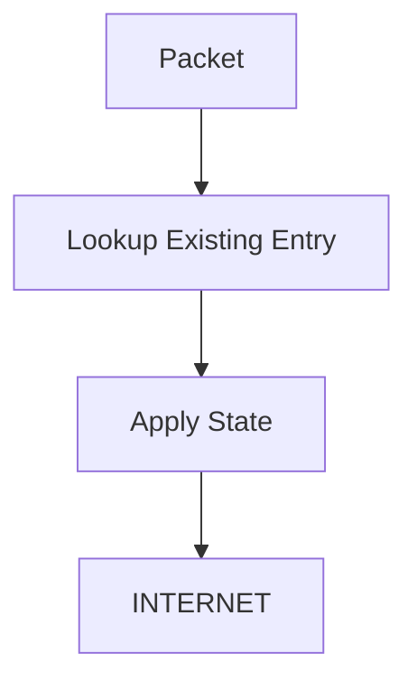

Much faster.

---

# Conntrack Table

Linux maintains a huge table.

Visualization:

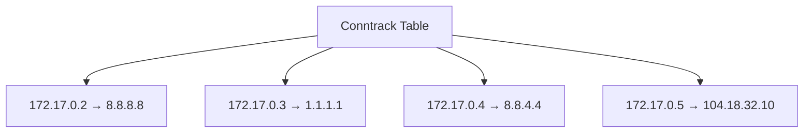

Millions of entries can exist.

---

# Internal Architecture

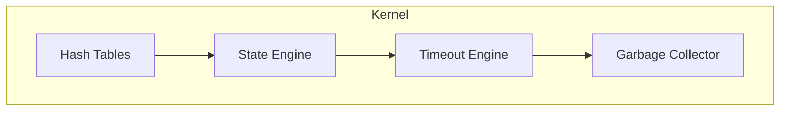

---

# Connection States

Very important.

---

# TCP State Machine

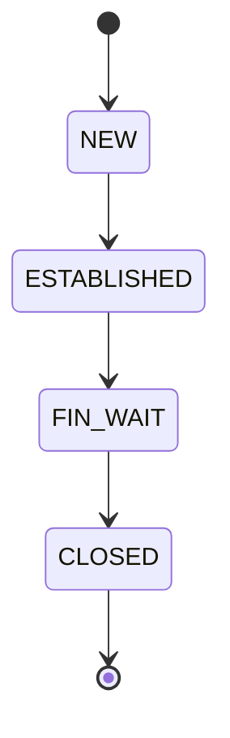

---

# Linux Conntrack States

```text
NEW

ESTABLISHED

RELATED

INVALID
```

These appear everywhere.

Especially firewall rules.

---

# NEW

First packet.

Example:

```text
Laptop

↓

Google

↓

HTTPS Request
```

---

# ESTABLISHED

Conversation already exists.

```text
Request

↓

Response

↓

Request

↓

Response
```

---

# RELATED

Connected to an existing flow.

Example:

```text
FTP

↓

Data Connection

↓

Related
```

---

# INVALID

Linux cannot classify it.

Usually suspicious.

Examples:

```text
Corrupt packet

Out of order packet

Broken packet
```

---

# Visualizing States

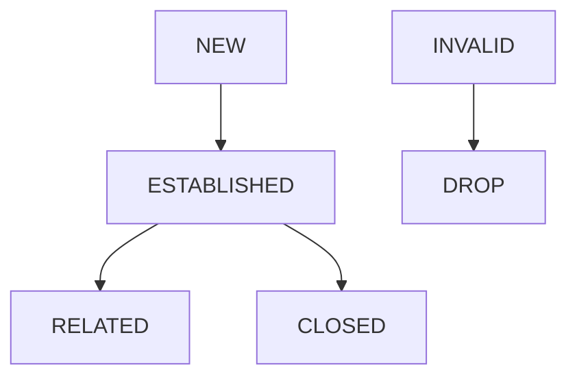

---

# Conntrack + Firewall

Stateful firewalls depend on conntrack.

---

# Firewall Flow

```mermaid
flowchart TD

PACKET

↓

CONNTRACK

↓

STATE

↓

FIREWALL

↓

ALLOW OR DROP
```

---

# Example Firewall Rule

Allow established traffic.

```bash
sudo nft add rule inet filter input ct state established accept
```

or

```bash
sudo iptables -A INPUT -m conntrack --ctstate ESTABLISHED -j ACCEPT
```

---

# NAT Dependency

NAT cannot work without conntrack.

---

# NAT Workflow

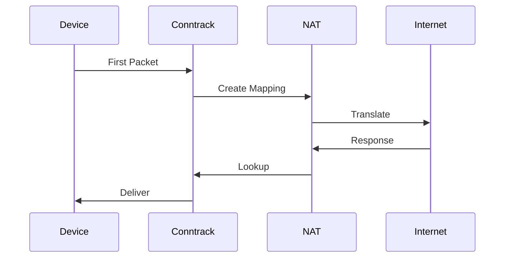

---

# Internal Data Flow

```mermaid
flowchart TD

PACKET

↓

HASH

↓

TABLE

↓

STATE

↓

TIMEOUT

↓

OUTPUT
```

---

# Hash Tables

Linux uses hash tables.

Reason:

```text
Millions of connections

↓

Need O(1) lookup
```

Without hashes:

```text
Performance disaster
```

---

# Visual

```mermaid
flowchart TD

PACKET

↓

HASH FUNCTION

↓

BUCKET

↓

ENTRY
```

---

# Timeouts

Connections cannot live forever.

Linux automatically removes them.

---

# Timeout Architecture

```mermaid
flowchart TD

ENTRY

↓

START TIMER

↓

EXPIRE

↓

DELETE
```

---

# Different Protocols Have Different Timeouts

| Protocol        | Approximate Timeout |
| --------------- | ------------------- |
| TCP Established | Hours               |
| TCP FIN_WAIT    | Minutes             |
| UDP             | Seconds             |
| ICMP            | Seconds             |

---

# Garbage Collector

Linux constantly cleans old entries.

---

# Garbage Collection Flow

```mermaid
flowchart TD

SCAN

↓

OLD ENTRY

↓

DELETE

↓

FREE MEMORY
```

---

# Kernel Internals

Kernel modules:

```text
net/

├── netfilter/

├── nf_conntrack/

├── nf_nat/
```

---

# Internal Components

```mermaid
mindmap

root((Conntrack Internals))

Hash Tables

State Machine

Timeout Engine

Garbage Collector

Event Engine

Tuple Engine

Expectation Engine
```

---

# Expectation Engine

Advanced concept.

Used for protocols like:

```text
FTP

SIP

H323
```

Creates future expected connections.

---

# Docker Architecture

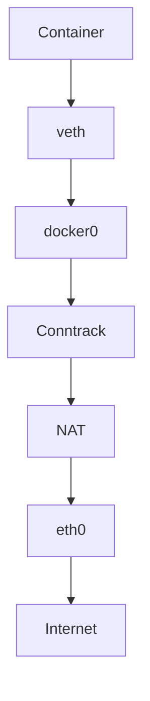

---

# Kubernetes Architecture

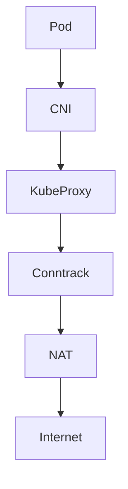

---

# Production Problem 1

### Conntrack Table Full

Symptoms:

```text
Intermittent packet loss

Random failures

Pods timeout

DNS issues
```

---

# Production Failure Visual

```mermaid
flowchart TD

TRAFFIC[Millions Of Connections]

↓

TABLE[Conntrack Table]

↓

FULL{Full?}

FULL -->|Yes| DROP[Packet Drops]

FULL -->|No| HEALTHY[Healthy]
```

---

# Production Problem 2

### Kubernetes DNS Randomly Fails

Often caused by:

```text
Conntrack saturation
```

---

# Production Problem 3

### Docker Loses Internet

Possible causes:

```text
Conntrack corruption

Conntrack full
```

---

# View Conntrack Entries

Install:

```bash
sudo apt install conntrack
```

Show all:

```bash
sudo conntrack -L
```

---

# Count Entries

```bash
sudo conntrack -C
```

---

# Statistics

```bash
sudo conntrack -S
```

---

# Show Maximum Size

```bash
sysctl net.netfilter.nf_conntrack_max
```

---

# Current Usage

```bash
cat /proc/sys/net/netfilter/nf_conntrack_count
```

---

# Increase Size

Temporary:

```bash
sudo sysctl -w net.netfilter.nf_conntrack_max=524288
```

Permanent:

```bash
sudo nano /etc/sysctl.conf
```

Add:

```text
net.netfilter.nf_conntrack_max=524288
```

---

# Troubleshooting Flow

```mermaid
flowchart TD

START[Service Timeout]

START --> TABLE[Conntrack Full?]

TABLE -->|Yes| INCREASE[Increase Size]

TABLE -->|No| NAT[NAT Working?]

NAT -->|No| FIXNAT[Fix NAT]

NAT -->|Yes| FIREWALL[Firewall Issue?]

FIREWALL --> SUCCESS[Healthy]
```

---

# Security Considerations

Watch for:

```text
Connection floods

DDoS attacks

SYN floods

State exhaustion attacks
```

Attackers may target conntrack itself.

---

# Engineer Mental Model

Never think:

```text
Packet

↓

Internet
```

Think:

```mermaid
flowchart TD

Packet

Conntrack

NAT

Firewall

Routing

NIC

Internet

Packet --> Conntrack

Conntrack --> NAT

NAT --> Firewall

Firewall --> Routing

Routing --> NIC

NIC --> Internet
```

---

# Capability Checklist

After this file you should understand:

✅ Conntrack

✅ Why NAT works

✅ Why Docker works

✅ Why Kubernetes works

✅ Stateful firewalls

✅ Connection states

✅ Hash tables

✅ Timeouts

✅ Garbage collection

✅ Production failures

✅ Production tuning

At this point, your repository is slowly transitioning from **Linux fundamentals** into a **Linux systems engineering encyclopedia**.
