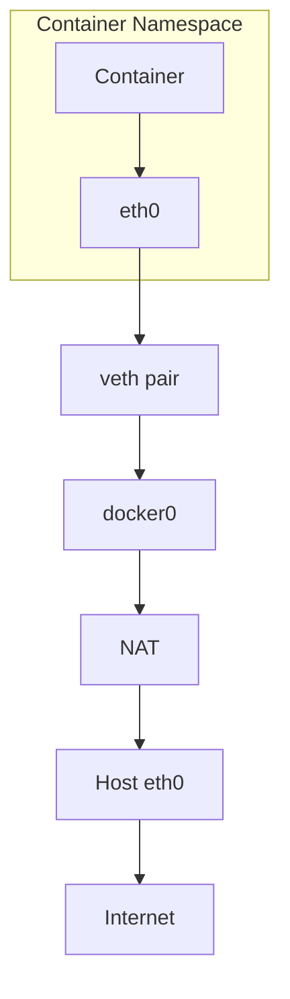
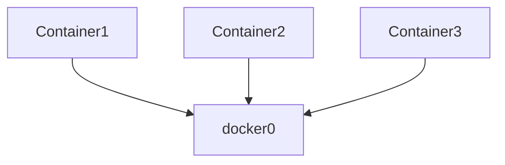
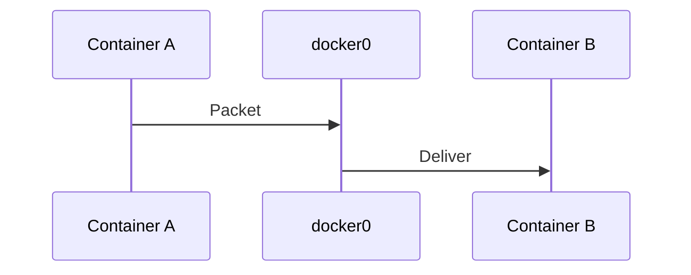
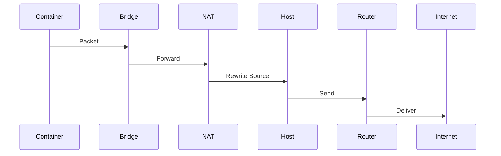
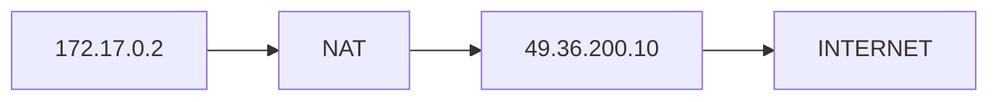
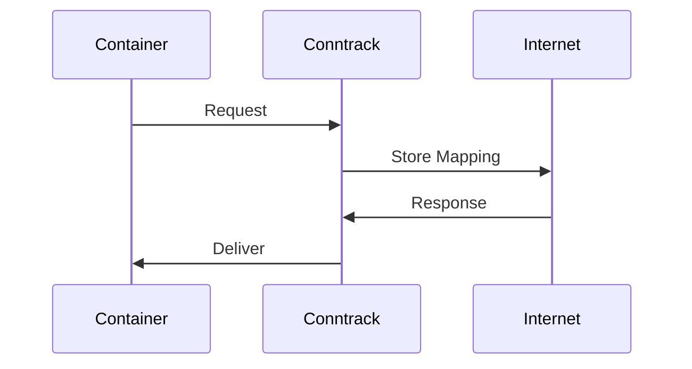
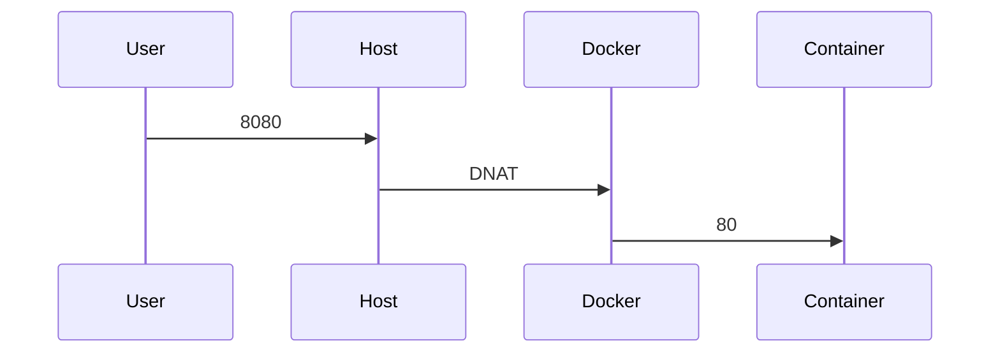

# Docker Networking Internals

# Understanding What Actually Happens When Containers Talk

---

# Why This File Exists

Most engineers know this:

```bash
docker run nginx
```

But internally Docker creates an entire networking infrastructure.

Docker automatically creates:

```text
Network Namespace

veth pair

Linux Bridge

NAT

iptables/nftables

Conntrack

Routing

DNS
```

without you noticing.

This file will expose the hidden system.

---

# Learning Goals

After this file you should understand:

* How containers get network access
* How internet access works
* How container-to-container communication works
* Linux primitives Docker uses
* docker0
* veth pairs
* Namespaces
* Bridge networking
* NAT
* Port forwarding
* DNS
* Production networking

---

# The Big Picture

Docker networking is NOT Docker magic.

It is Linux networking automation.

---

# Docker Is Built On Linux Primitives

```mermaid
mindmap

root((Docker Networking))

Namespaces

veth

Bridge

NAT

Conntrack

Routing

iptables

DNS
```

---

# Mental Model

Never think:

```text
Container

↓

Internet
```

Think:

```text
Container

↓

Namespace

↓

veth

↓

Linux Bridge

↓

NAT

↓

Host NIC

↓

Internet
```

This mental model explains everything.

---

# Full Architecture

```mermaid
flowchart TD

Container

↓

Namespace

↓

veth

↓

docker0

↓

NAT

↓

eth0

↓

Router

↓

Internet
```

---

# What Happens When You Run A Container?

Suppose:

```bash
docker run nginx
```

Docker performs many operations.

---

# Step 1

Create namespace.

```mermaid
flowchart TD

Host

↓

Create Namespace

↓

Container
```

---

# Step 2

Create veth pair.


Think of it as a virtual ethernet cable.

---

# Step 3

Attach veth to bridge.

```mermaid
graph TD

Container

↓

veth

↓

docker0
```

---

# Step 4

Assign IP.

Example:

```text
172.17.0.2
```

---

# Step 5

Configure NAT.

Docker automatically enables internet access.

---

# Visualizing Everything



---

# What Is docker0?

docker0 is a Linux bridge.

Docker creates it automatically.

Verify:

```bash
ip link
```

Example:

```text
docker0
```

---

# Bridge Architecture



---

# Container To Container Communication

Suppose:

```text
Container A

172.17.0.2

Container B

172.17.0.3
```

---

# Packet Journey



No internet involved.

Everything stays inside host.

---

# Container To Internet Journey

This is one of the most important visuals.



---

# NAT In Action

Before:

```text
172.17.0.2
```

After:

```text
49.36.200.10
```

Docker uses host IP.

---

# Visual



---

# Conntrack Is Also Involved

Question:

```text
How does the response come back?
```

Conntrack remembers.

---

# Visual



---

# Port Mapping

Suppose:

```bash
docker run -p 8080:80 nginx
```

Docker configures:

```text
Host 8080

↓

Container 80
```

---

# Visual

```mermaid
flowchart TD

User

↓

Host8080

↓

DNAT

↓

Container80
```

---

# Actual Packet Journey



---

# Docker Network Drivers

Docker supports multiple drivers.

```mermaid
mindmap

root((Drivers))

Bridge

Host

None

Overlay

Macvlan

IPvlan
```

---

# Bridge Driver

Default.

```mermaid
flowchart TD

Container

↓

docker0

↓

Internet
```

---

# Host Driver

No namespace isolation.

```mermaid
flowchart TD

Container

↓

Host Network

↓

Internet
```

Container shares host stack.

---

# None Driver

No networking.

```mermaid
flowchart TD

Container

↓

Nothing
```

---

# Overlay Driver

Multi-host networking.

Uses VXLAN.

```mermaid
flowchart TD

Container

↓

VXLAN

↓

Remote Host

↓

Container
```

Docker Swarm uses this.

---

# Macvlan

Container appears as a physical machine.

```mermaid
flowchart TD

Container

↓

Macvlan

↓

Switch

↓

Router
```

---

# DNS Internals

Docker runs an embedded DNS server.

Inside user-defined networks:

```text
Container names resolve automatically.
```

Example:

```text
api

↓

172.18.0.3
```

---

# DNS Architecture

```mermaid
flowchart TD

Container

↓

Docker DNS

↓

IP

↓

Destination Container
```

---

# User Defined Networks

Docker strongly prefers these.

Instead of:

```text
docker0
```

Create isolated networks.

```bash
docker network create backend
```

---

# Visual

```mermaid
graph TD

API

Redis

Worker

BackendNetwork

API --> BackendNetwork

Redis --> BackendNetwork

Worker --> BackendNetwork
```

---

# Production Architecture

```mermaid
graph TD

Internet

Nginx

API

Worker

Redis

docker0

Internet --> Nginx

Nginx --> API

API --> Redis

API --> Worker

Nginx --> docker0

API --> docker0

Redis --> docker0

Worker --> docker0
```

---

# Production Multi Network Architecture

```mermaid
graph TD

Frontend

Backend

Database

frontend-net

backend-net

db-net

Frontend --> frontend-net

Frontend --> backend-net

Backend --> backend-net

Backend --> db-net

Database --> db-net
```

---

# Security Segmentation

Frontend cannot directly access database.

```mermaid
graph TD

Frontend

Backend

Database

Frontend --> Backend

Frontend -. blocked .-> Database
```

---

# Modern World

Docker is no longer the center.

Infrastructure evolved.

```mermaid
timeline

title Container Networking Evolution

2013 : Docker

2015 : Kubernetes

2017 : CNI Growth

2019 : Service Mesh

2021 : eBPF

2025 : eBPF Expansion
```

Docker concepts still matter because Kubernetes uses the same Linux primitives.

---

# Modern Relationship

```mermaid
flowchart TD

Docker

↓

Linux Networking

↓

Kubernetes

↓

Cloud Native
```

---

# Production Bottlenecks

Problem 1:

docker0 becomes congested.

Symptoms:

```text
Latency

Packet drops
```

---

# Problem 2

Conntrack full.

Symptoms:

```text
Random failures

Timeouts
```

---

# Problem 3

iptables explosion.

Symptoms:

```text
Slow networking
```

---

# Problem 4

DNS failures.

Symptoms:

```text
Containers cannot resolve names
```

---

# Troubleshooting Flow

```mermaid
flowchart TD

START[Container Cannot Reach Internet]

START --> NS[Namespace Exists?]

NS --> VETH[veth Healthy?]

VETH --> BRIDGE[docker0 Healthy?]

BRIDGE --> NAT[NAT Working?]

NAT --> DNS[DNS Working?]

DNS --> CONNTRACK[Conntrack Healthy?]

CONNTRACK --> SUCCESS[Healthy]
```

---

# Essential Commands

List networks:

```bash
docker network ls
```

Inspect network:

```bash
docker network inspect bridge
```

View bridge:

```bash
ip link
```

View routes:

```bash
ip route
```

View namespaces:

```bash
lsns
```

View NAT:

```bash
sudo nft list ruleset
```

or

```bash
sudo iptables -t nat -L
```

View conntrack:

```bash
sudo conntrack -L
```

Capture packets:

```bash
sudo tcpdump -i docker0
```

---

# Common Misconceptions

### ❌ Docker creates networking itself

Wrong.

Docker automates Linux networking.

---

### ❌ docker0 is Docker code

Wrong.

docker0 is a Linux bridge.

---

### ❌ Containers have independent kernels

Wrong.

Containers share the host kernel.

---

### ❌ Docker networking knowledge is obsolete

Wrong.

Docker networking teaches Kubernetes networking foundations.

---

# Engineer Mental Model

Never think:

```text
Container

↓

Internet
```

Always think:

```mermaid
flowchart TD

Container

↓

Namespace

↓

veth

↓

Linux Bridge

↓

Conntrack

↓

NAT

↓

Host NIC

↓

Router

↓

Internet
```

---

# Capability Checklist

After this file you should understand:

✅ docker0

✅ veth

✅ Namespaces

✅ NAT

✅ Conntrack

✅ Port mapping

✅ DNS

✅ Multi-network architecture

✅ Production bottlenecks

✅ Modern container networking

