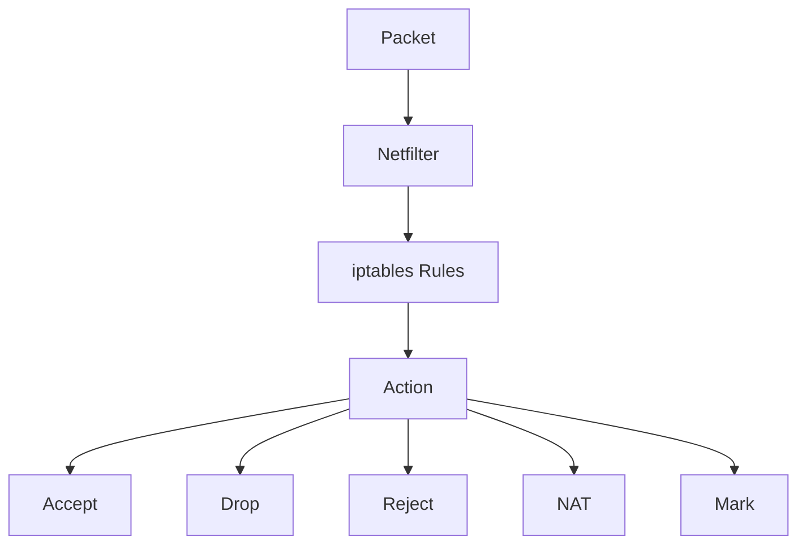
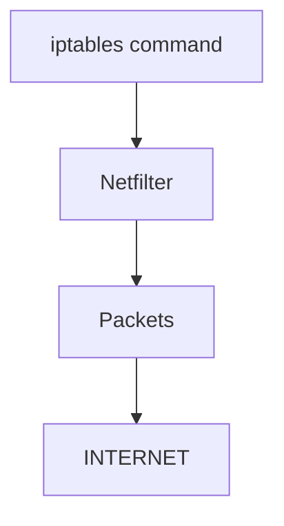
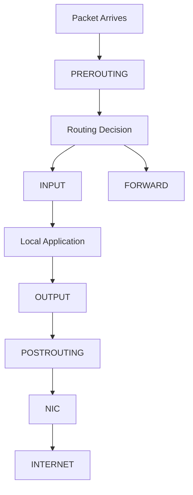
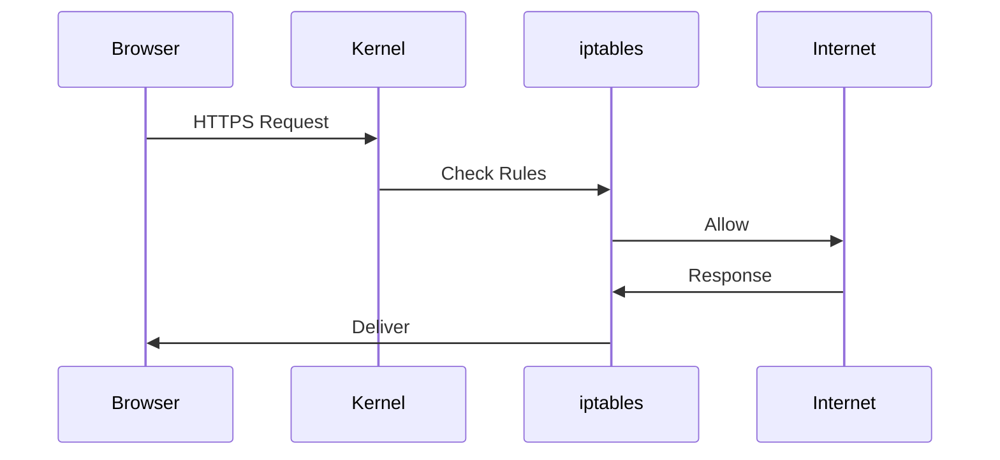
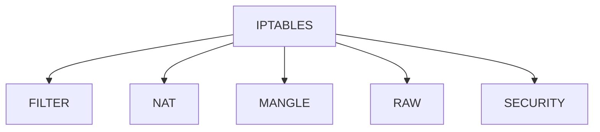
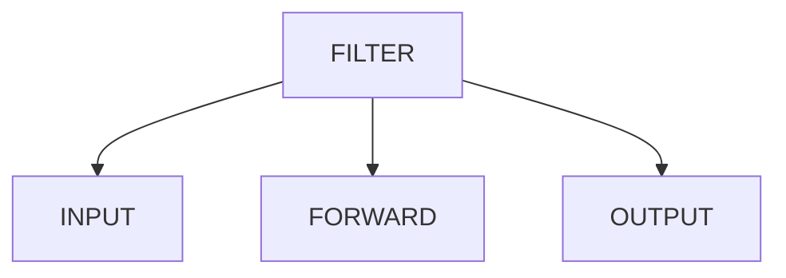
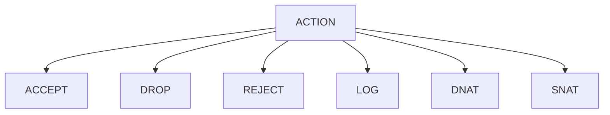
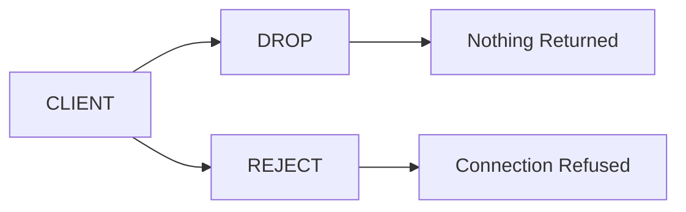
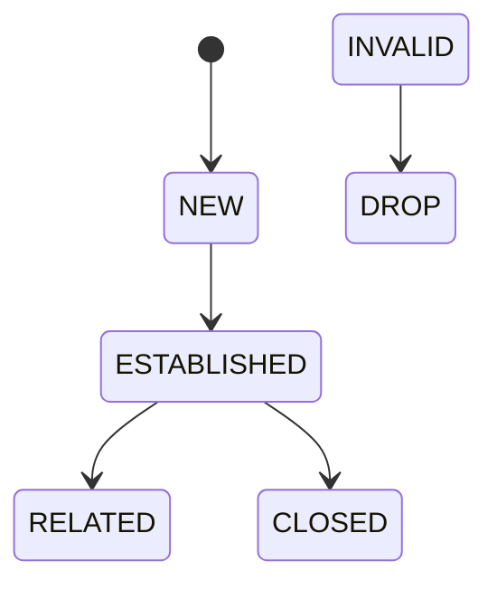

# Linux iptables

# Understanding Linux Packet Decision Engine

---

# Why This File Exists

Many engineers think:

```text
iptables = Linux firewall
```

That is incomplete.

iptables is actually:

> A packet processing engine built on top of Linux Netfilter.

It can:

```text
Allow packets

Drop packets

Reject packets

Translate packets

Track connections

Redirect packets

Forward packets

Mark packets
```

Modern infrastructure depends on it.

Examples:

```text
Docker

Kubernetes

AWS Nodes

Cloud VMs

VPNs

Routers

Load Balancers

Firewalls
```

---

# Learning Goals

After this file you should understand:

```text
Packet

↓

Netfilter

↓

iptables

↓

Decision

↓

Internet
```

And understand:

> Why Linux networking works.

---

# Mental Model

Think of iptables as airport security.

Every packet is a passenger.

At every checkpoint Linux asks:

```text
Who are you?

Where are you going?

Should I allow you?

Should I modify you?

Should I reject you?

Should I remember you?
```

---

# The Big Picture



---

# Very Important

Linux has:

```text
Netfilter
```

inside kernel.

```text
iptables
```

is just a userspace tool.

Many engineers confuse these.

---

# Architecture



---

# Modern World Architecture

```mermaid
flowchart TD

Application

↓

Socket

↓

TCP

↓

IP

↓

Netfilter

↓

iptables

↓

Routing

↓

NIC

↓

Internet
```

---

# Linux Packet Pipeline

This is one of the most important visuals.



Memorize this.

You'll use it for years.

---

# Netfilter Hooks

There are 5 hooks.

```mermaid
mindmap

root((Netfilter))

PREROUTING

INPUT

FORWARD

OUTPUT

POSTROUTING
```

---

# Hook Responsibilities

| Hook        | Responsibility            |
| ----------- | ------------------------- |
| PREROUTING  | Before routing            |
| INPUT       | Local machine traffic     |
| FORWARD     | Forward traffic           |
| OUTPUT      | Locally generated traffic |
| POSTROUTING | Before leaving            |

---

# Visualizing Hooks

```mermaid
flowchart TD

Internet

↓

PREROUTING

↓

Routing

↓

INPUT

↓

Application

↓

OUTPUT

↓

POSTROUTING

↓

Internet
```

---

# Example 1

User opens Google.



---

# Tables

iptables contains multiple tables.

Think:

> Different departments.

---

# Table Architecture



---

# Filter Table

Most commonly used.

Responsibilities:

```text
Allow

Drop

Reject
```

---

# NAT Table

Responsibilities:

```text
SNAT

DNAT

Port Forwarding

Masquerade
```

---

# Mangle Table

Responsibilities:

```text
Modify packet fields

QoS

Packet marking
```

---

# Raw Table

Responsibilities:

```text
Bypass conntrack
```

Advanced use case.

---

# Security Table

Responsibilities:

```text
SELinux integration
```

Rarely used directly.

---

# Chains

Inside tables are chains.

---

# Visual



---

# Packet Decision Tree

```mermaid
flowchart TD

PACKET

↓

RULE1

↓

MATCH?

↓

YES

↓

ACTION

↓

STOP

↓

NO

↓

RULE2

↓

MATCH?

↓

ACTION
```

Linux reads sequentially.

---

# Rule Matching

Linux checks many attributes.

```text
Source IP

Destination IP

Source Port

Destination Port

Protocol

Interface

Connection State
```

---

# Visual

```mermaid
mindmap

root((Rule Matching))

Source IP

Destination IP

Source Port

Destination Port

Protocol

State

Interface
```

---

# Rule Actions

Most common actions.



---

# ACCEPT

Allow traffic.

```text
Packet continues.
```

---

# DROP

Silently destroy packet.

```text
No response.
```

---

# REJECT

Destroy packet.

Send response back.

```text
Connection refused.
```

---

# DROP vs REJECT



---

# Connection States

iptables heavily uses conntrack.

---

# State Machine



---

# Stateful Firewalls

This is huge.

Old firewall:

```text
Packet filtering
```

Modern firewall:

```text
Conversation filtering
```

---

# Visual

```mermaid
flowchart TD

PACKET

↓

CONNTRACK

↓

STATE

↓

FIREWALL

↓

ALLOW
```

---

# Example Production Rule

Allow established traffic.

```bash
sudo iptables -A INPUT \
-m conntrack \
--ctstate ESTABLISHED \
-j ACCEPT
```

---

# NAT Relationship

iptables and NAT work together.

---

# Visual

```mermaid
flowchart TD

PACKET

↓

CONNTRACK

↓

NAT

↓

ROUTING

↓

INTERNET
```

---

# Docker Uses iptables

Many engineers don't know this.

Docker automatically creates rules.

---

# Docker Architecture

```mermaid
flowchart TD

Container

↓

veth

↓

docker0

↓

iptables NAT

↓

eth0

↓

Internet
```

---

# Docker Example

Container:

```text
172.17.0.2
```

Internet:

```text
8.8.8.8
```

Docker rewrites:

```text
172.17.0.2

↓

49.36.200.10
```

using iptables.

---

# Kubernetes Uses iptables

Historically:

```text
Pod

↓

Service

↓

iptables

↓

Destination Pod
```

---

# Kubernetes Architecture

```mermaid
flowchart TD

CLIENT

↓

Service IP

↓

kube-proxy

↓

iptables

↓

Pod A

Pod B

Pod C
```

---

# Modern Kubernetes

Historically:

```text
iptables mode
```

Modern trend:

```text
IPVS

eBPF
```

Examples:

```text
Cilium

Calico eBPF

EKS eBPF

GKE Dataplane V2
```

---

# Evolution Of Linux Packet Processing

```mermaid
flowchart LR

iptables

↓

IPVS

↓

eBPF

↓

Modern Cloud Networking
```

Important:

> eBPF is growing.

But iptables knowledge is still foundational.

---

# Production Architecture

```mermaid
flowchart TD

Internet

↓

Load Balancer

↓

Linux Server

↓

iptables

↓

Docker

↓

Application
```

---

# Cloud Architecture

```mermaid
flowchart TD

Internet

↓

Cloud Firewall

↓

VM

↓

iptables

↓

Application
```

---

# Real Production Example

Microservices.

```text
Auth

Payment

Notification

Redis
```

Firewall requirements:

```mermaid
graph TD

Auth --> Payment

Payment --> Redis

Notification --> Auth

Internet -. blocked .-> Redis
```

iptables enforces this.

---

# Production Failure Example

Problem:

```text
Pods randomly timeout.
```

Possible causes:

```text
Too many iptables rules

Slow rule traversal

Conntrack saturation
```

---

# Scaling Problem

Linux evaluates rules sequentially.

---

# Visual

```mermaid
flowchart TD

Packet

↓

Rule1

↓

Rule2

↓

Rule3

↓

Rule4

↓

Rule5000

↓

Decision
```

Thousands of rules become expensive.

---

# Why Modern Systems Are Moving Away

Problem:

```text
10000+ rules

↓

Slow lookup
```

Solution:

```text
nftables

IPVS

eBPF
```

---

# nftables Evolution

```mermaid
flowchart LR

iptables

↓

nftables

↓

eBPF
```

---

# Important Reality

Do NOT think:

```text
iptables is obsolete
```

Wrong.

Millions of systems still use it.

You absolutely need to understand it.

---

# Troubleshooting Flow

```mermaid
flowchart TD

START[Service Unreachable]

START --> PORT[Port Listening?]

PORT --> FW[iptables Blocking?]

FW --> NAT[NAT Correct?]

NAT --> CONNTRACK[Conntrack Healthy?]

CONNTRACK --> ROUTE[Route Exists?]

ROUTE --> SUCCESS[Healthy]
```

---

# Essential Commands

Show all rules

```bash
sudo iptables -L
```

Show NAT

```bash
sudo iptables -t nat -L
```

Show counters

```bash
sudo iptables -L -v
```

Save rules

```bash
sudo iptables-save
```

Restore rules

```bash
sudo iptables-restore
```

---

# Common Misconceptions

### ❌ iptables = Firewall

Wrong.

It is a packet processing engine.

---

### ❌ iptables = Kernel

Wrong.

Netfilter lives in kernel.

---

### ❌ Docker networking = Docker code

Wrong.

Docker heavily depends on iptables.

---

### ❌ Kubernetes networking = Kubernetes magic

Wrong.

Kubernetes heavily uses Linux primitives.

---

# Engineer Mental Model

Never think:

```text
Application

↓

Internet
```

Always think:

```mermaid
flowchart TD

Application

Socket

TCP

IP

Netfilter

Conntrack

iptables

Routing

NIC

Internet

Application --> Socket

Socket --> TCP

TCP --> IP

IP --> Netfilter

Netfilter --> Conntrack

Conntrack --> iptables

iptables --> Routing

Routing --> NIC

NIC --> Internet
```

---

# Capability Checklist

After this file you should understand:

✅ Netfilter

✅ Hooks

✅ Tables

✅ Chains

✅ Rule matching

✅ Stateful firewalls

✅ NAT relationship

✅ Docker internals

✅ Kubernetes internals

✅ Modern eBPF transition

✅ Production troubleshooting

s for modern DevOps, SRE, backend, and cloud engineers.
