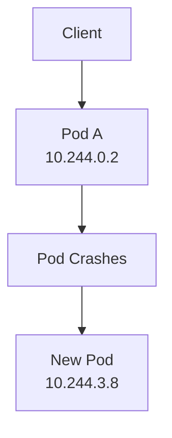
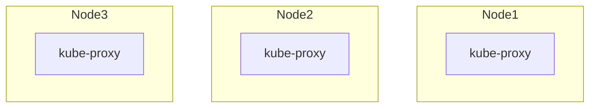
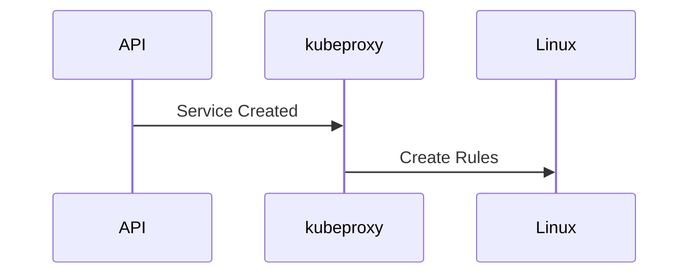
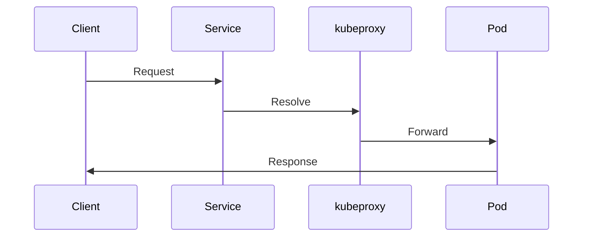
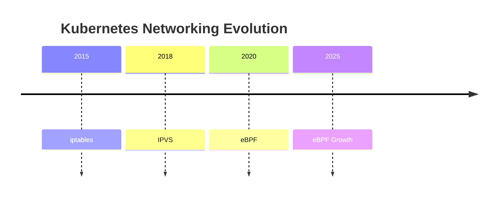

# Kubernetes kube-proxy

# The Distributed Linux Networking Orchestrator

---

# Why This File Exists

Imagine Kubernetes without kube-proxy.

Suppose:

```text
Pod A

↓

Service

↓

3 Backend Pods
```

Question:

> How does Pod A know which backend Pod to contact?

Pods are constantly:

```text
Created

Destroyed

Rescheduled

Scaled
```

IPs constantly change.

Yet applications keep working.

Why?

Because kube-proxy continuously programs Linux networking.

---

# Learning Goals

After this file you should understand:

* Why kube-proxy exists
* Why Kubernetes Services exist
* Why Pods cannot be used directly
* How kube-proxy works
* iptables mode
* IPVS mode
* eBPF evolution
* Packet journeys
* Linux internals
* Production bottlenecks
* Modern Kubernetes networking

---

# The Big Problem

Pods are ephemeral.

This means:

```text
Pod dies

↓

New Pod created

↓

New IP assigned
```

Applications cannot depend on Pod IPs.

---

# Visualizing The Problem



The IP changed.

Applications would break.

---

# Kubernetes Solution

Introduce a stable abstraction.

```text
Service
```

---

# Service Architecture

```mermaid
flowchart TD

CLIENT

↓

SERVICE

↓

Pod1

Pod2

Pod3

CLIENT --> SERVICE

SERVICE --> Pod1

SERVICE --> Pod2

SERVICE --> Pod3
```

Applications only know the Service.

---

# Important Reality

Services are NOT applications.

Services are NOT containers.

Services are NOT processes.

Services are:

```text
Linux networking rules
```

This is one of the biggest Kubernetes misconceptions.

---

# Who Creates These Rules?

Answer:

```text
kube-proxy
```

---

# Mental Model

Think of kube-proxy as a traffic controller.

```text
Packet arrives

↓

Read destination

↓

Find service

↓

Choose backend

↓

Forward packet
```

---

# The Big Picture

```mermaid
flowchart TD

Client

↓

Service

↓

kube-proxy

↓

Linux Kernel

↓

Pod
```

---

# kube-proxy Runs On Every Node

Very important.



Each node runs its own kube-proxy.

---

# Architecture

```mermaid
flowchart TD

API[API Server]

↓

kube-proxy

↓

Linux Networking

↓

Pods

API --> kube-proxy

kube-proxy --> Linux Networking

Linux Networking --> Pods
```

---

# kube-proxy Watches The API Server

It continuously watches:

```text
Services

Endpoints

EndpointSlices
```

---

# Visual



---

# Packet Journey

Suppose:

```text
Service IP

10.96.0.20
```

Backend Pods:

```text
10.244.0.2

10.244.1.4

10.244.2.9
```

---

# End-to-End Journey



---

# Important Concept

Services are virtual IPs.

They do not physically exist.

---

# Visual

```mermaid
flowchart TD

CLIENT

↓

10.96.0.20

↓

Virtual IP

↓

Pod
```

---

# kube-proxy Modes

There are three major modes.

```mermaid
mindmap

root((kube-proxy))

iptables

IPVS

eBPF
```

---

# Mode 1: iptables

Historically most common.

---

# Architecture

```mermaid
flowchart TD

Client

↓

Service

↓

iptables

↓

Pod
```

---

# How It Works

kube-proxy generates Linux rules.

```text
Service IP

↓

Backend Pods

↓

iptables rules
```

---

# Example

```text
10.96.0.20

↓

10.244.0.2

10.244.1.4

10.244.2.9
```

becomes many rules.

---

# iptables Visualization

```mermaid
flowchart TD

Packet

↓

iptables

↓

Rule1

↓

Rule2

↓

Rule3

↓

Pod
```

---

# Problem With iptables

Sequential processing.

```text
10 rules

↓

100 rules

↓

1000 rules

↓

10000 rules
```

Latency grows.

---

# Visual

```mermaid
flowchart TD

Packet

↓

Rule1

↓

Rule2

↓

Rule3

↓

Rule5000

↓

Decision
```

---

# Mode 2: IPVS

Much faster.

IPVS = IP Virtual Server.

---

# IPVS Architecture

```mermaid
flowchart TD

Packet

↓

IPVS Table

↓

Pod
```

Instead of thousands of rules.

Linux uses optimized structures.

---

# Visualization

```mermaid
graph TD

Service

↓

IPVS

↓

Pod1

Pod2

Pod3
```

---

# IPVS Advantages

```text
Fast

Scalable

Hash Tables

Load Balancing Algorithms
```

---

# Load Balancing Algorithms

```mermaid
mindmap

root((IPVS))

Round Robin

Least Connections

Weighted RR

Source Hashing
```

---

# Mode 3: eBPF

This is the modern direction.

Examples:

```text
Cilium

GKE Dataplane V2

Calico eBPF
```

---

# eBPF Architecture

```mermaid
flowchart TD

Packet

↓

eBPF Program

↓

Pod
```

No iptables traversal.

Very fast.

---

# Evolution Timeline



---

# Service Types

Important concept.

```mermaid
mindmap

root((Service Types))

ClusterIP

NodePort

LoadBalancer

ExternalName
```

---

# ClusterIP

Internal cluster communication.

```mermaid
flowchart TD

Pod

↓

ClusterIP

↓

Pod
```

---

# NodePort

Exposes service externally.

```mermaid
flowchart TD

Internet

↓

NodeIP

↓

NodePort

↓

Pod
```

---

# LoadBalancer

Cloud integration.

```mermaid
flowchart TD

Internet

↓

Cloud LB

↓

Service

↓

Pods
```

---

# EndpointSlice

Modern Kubernetes optimization.

Old:

```text
Endpoints
```

New:

```text
EndpointSlice
```

Scales much better.

---

# Architecture

```mermaid
flowchart TD

Pods

↓

EndpointSlice

↓

kube-proxy

↓

Linux Rules
```

---

# Packet Journey Across Nodes

Very important.

```mermaid
sequenceDiagram

participant Client

participant Node1

participant Service

participant Node2

participant Pod

Client->>Node1: Request

Node1->>Service: Service IP

Service->>Node2: Backend Pod

Node2->>Pod: Deliver
```

---

# Production Kubernetes Architecture

```mermaid
graph TD

subgraph Node1

PodA

kubeproxy1

end

subgraph Node2

PodB

kubeproxy2

end

subgraph Node3

PodC

kubeproxy3

end

PodA --> kubeproxy1

kubeproxy1 --> PodB

kubeproxy1 --> PodC
```

---

# Full Cluster Architecture

```mermaid
flowchart TD

Internet

↓

Ingress

↓

Service

↓

kube-proxy

↓

Pods

↓

Database
```

---

# Modern Cloud Native Stack

```mermaid
flowchart TD

Internet

↓

Load Balancer

↓

Ingress

↓

Service

↓

eBPF

↓

Pod
```

Notice:

```text
kube-proxy is slowly disappearing
```

in some environments.

---

# Is kube-proxy Dying?

Partially.

Modern systems:

```text
Cilium

↓

eBPF

↓

Replace kube-proxy
```

This is called:

```text
kube-proxy replacement
```

---

# Production Bottlenecks

Problem 1:

Too many Services.

Symptoms:

```text
High CPU

Slow networking

Node latency
```

---

# Problem 2

iptables explosion.

```text
10000 Services

↓

50000 Rules
```

Performance suffers.

---

# Problem 3

Conntrack saturation.

Symptoms:

```text
Random timeouts

DNS failures

Packet loss
```

---

# Production Debugging Flow

```mermaid
flowchart TD

START[Service Unreachable]

START --> POD[Pod Healthy?]

POD --> SERVICE[Service Exists?]

SERVICE --> ENDPOINT[EndpointSlice Healthy?]

ENDPOINT --> KUBEPROXY[kube-proxy Running?]

KUBEPROXY --> CONNTRACK[Conntrack Healthy?]

CONNTRACK --> SUCCESS[Working]
```

---

# Essential Commands

View kube-proxy:

```bash
kubectl get pods -n kube-system
```

Logs:

```bash
kubectl logs -n kube-system kube-proxy-xxxxx
```

Services:

```bash
kubectl get svc
```

Endpoints:

```bash
kubectl get endpoints
```

EndpointSlices:

```bash
kubectl get endpointslices
```

iptables:

```bash
sudo iptables -L
```

IPVS:

```bash
sudo ipvsadm -L
```

---

# Common Misconceptions

### ❌ Service is a Pod

Wrong.

---

### ❌ Service is a process

Wrong.

---

### ❌ kube-proxy forwards packets itself

Wrong.

It programs Linux networking.

---

### ❌ Kubernetes networking is Kubernetes magic

Wrong.

It is Linux networking orchestration.

---

# Engineer Mental Model

Never think:

```text
Pod

↓

Service

↓

Pod
```

Think:

```mermaid
flowchart TD

Pod

↓

Service

↓

kube-proxy

↓

Linux Kernel

↓

Conntrack

↓

iptables/IPVS/eBPF

↓

Destination Pod
```

---

# Capability Checklist

After this file you should understand:

✅ Why Services exist

✅ Why kube-proxy exists

✅ How kube-proxy works

✅ iptables mode

✅ IPVS mode

✅ eBPF evolution

✅ EndpointSlices

✅ Modern Kubernetes networking

✅ Production bottlenecks

✅ Production troubleshooting

