# Linux NAT (Network Address Translation)

# Understanding How Private Networks Talk To The Internet

---

# Why This File Exists

Almost every modern system uses NAT.

Examples:

```text
✓ Home WiFi

✓ Docker

✓ Kubernetes

✓ Cloud VPCs

✓ Enterprise Networks

✓ Firewalls

✓ VPNs
```

If NAT disappeared tomorrow:

```text
Docker breaks

Kubernetes breaks

Home WiFi breaks

Cloud networking breaks

Many companies break
```

This is one of the most important networking concepts.

---

# The Big Problem NAT Solves

Imagine your house.

You have:

```text
Phone

Laptop

TV

PlayStation

Tablet

Smart Devices
```

Question:

> How can all of these devices access the internet using one public IP address?

NAT solves this.

---

# Mental Model

Think of NAT as a hotel receptionist.

Inside hotel:

```text
Room 101

Room 102

Room 103
```

Outside world:

```text
Only hotel address is known
```

Receptionist remembers:

```text
Room

↓

Visitor

↓

Request

↓

Response
```

NAT does the same thing.

---

# The Big Picture

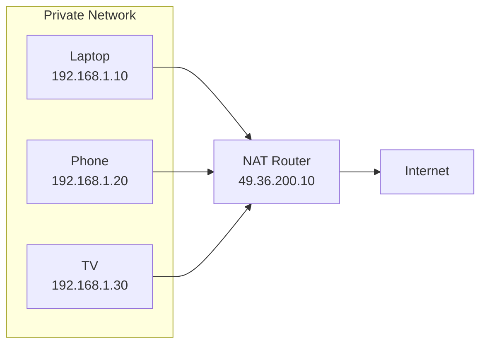

Internet sees:

```text
49.36.200.10
```

It does NOT see:

```text
192.168.1.10

192.168.1.20

192.168.1.30
```

---

# Why NAT Exists

IPv4 shortage.

IPv4 supports:

```text
4,294,967,296 addresses
```

Seems huge.

But not enough for:

```text
8+ billion humans

Phones

Servers

Containers

Cloud VMs

IoT devices
```

NAT became essential.

---

# Public vs Private IP

## Public IP

Globally reachable.

Example:

```text
8.8.8.8

1.1.1.1
```

---

## Private IP

Used internally.

Ranges:

```text
10.0.0.0/8

172.16.0.0/12

192.168.0.0/16
```

---

# Visual: Private vs Public

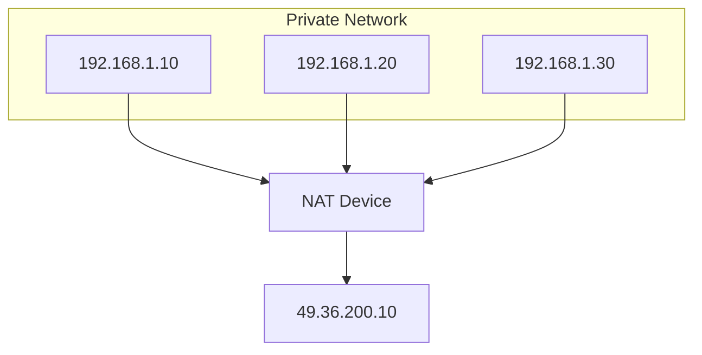

---

# What NAT Actually Does

It rewrites packets.

Original:

```text
Source

192.168.1.10
```

After NAT:

```text
Source

49.36.200.10
```

Destination remains same.

---

# Packet Transformation

Before NAT:

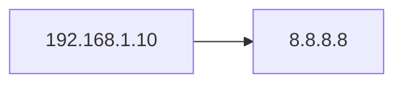

After NAT:

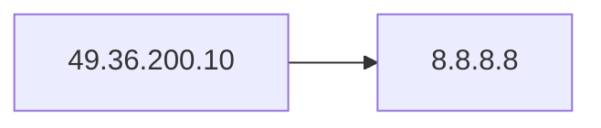

---

# The Hidden Magic

Question:

```text
How does response return
to the correct device?
```

NAT stores state.

---

# NAT Translation Table

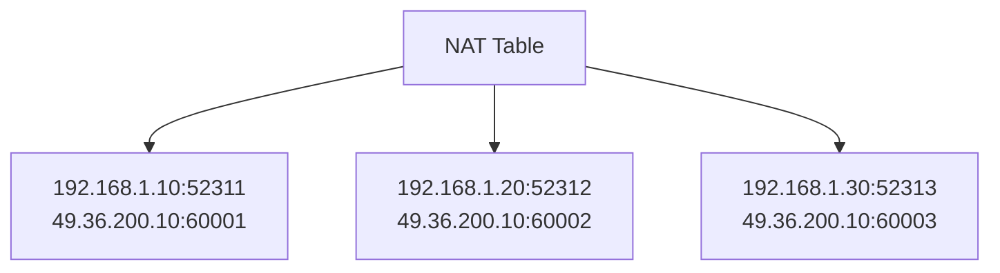

This table is extremely important.

---

# Visualizing State Tracking

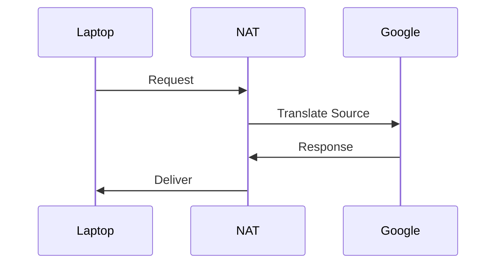

---

# Types Of NAT

There are four major types.

```mermaid
mindmap

root((NAT))

Static NAT

Dynamic NAT

PAT

SNAT

DNAT
```

---

# Static NAT

One-to-one mapping.

```text
192.168.1.10

↓

49.36.200.10
```

Always same.

---

# Static NAT Visual

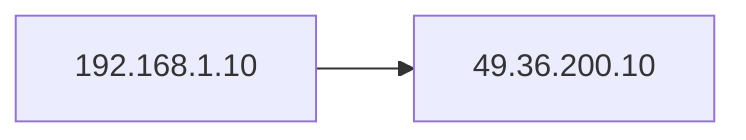

---

# Dynamic NAT

Maps from a pool.

```text
Pool

49.36.200.10

49.36.200.11

49.36.200.12
```

---

# PAT (Port Address Translation)

Most common.

Also called:

```text
NAT Overload
```

Many devices.

One public IP.

Different ports.

---

# PAT Visual

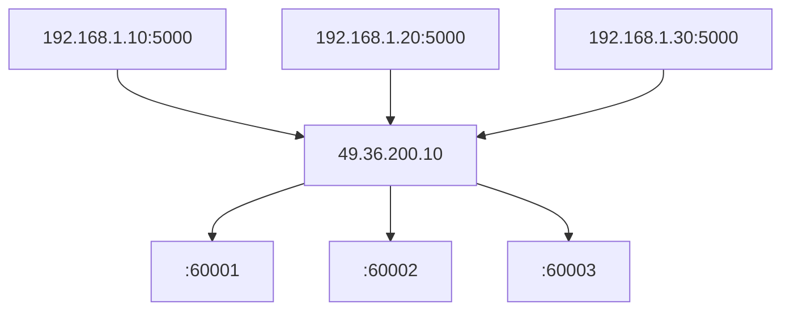

---

# SNAT

Source NAT.

Changes:

```text
Source IP
```

---

# SNAT Visual

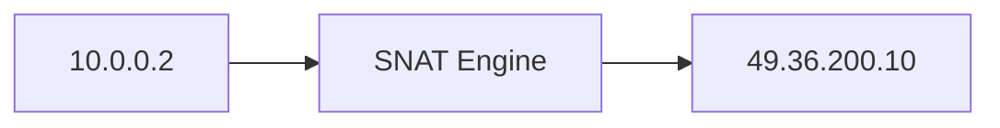

---

# DNAT

Destination NAT.

Changes:

```text
Destination IP
```

---

# DNAT Example

Internet user accessing website.

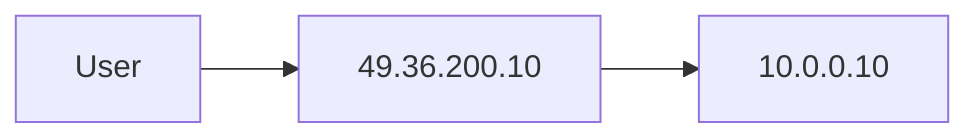

---

# Port Forwarding

Port forwarding is DNAT.

Example:

```text
49.36.200.10:80

↓

10.0.0.10:80
```

---

# Port Forwarding Visual

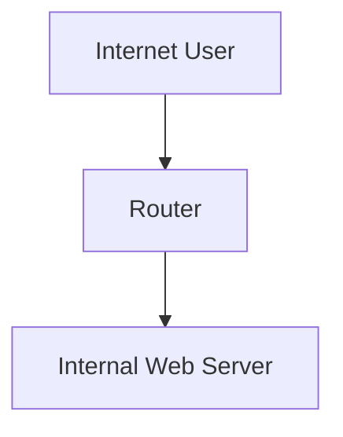

---

# Linux NAT Internals

Linux NAT lives inside:

```text
Netfilter
```

Hooks:

```text
PREROUTING

INPUT

FORWARD

OUTPUT

POSTROUTING
```

---

# Netfilter Flow

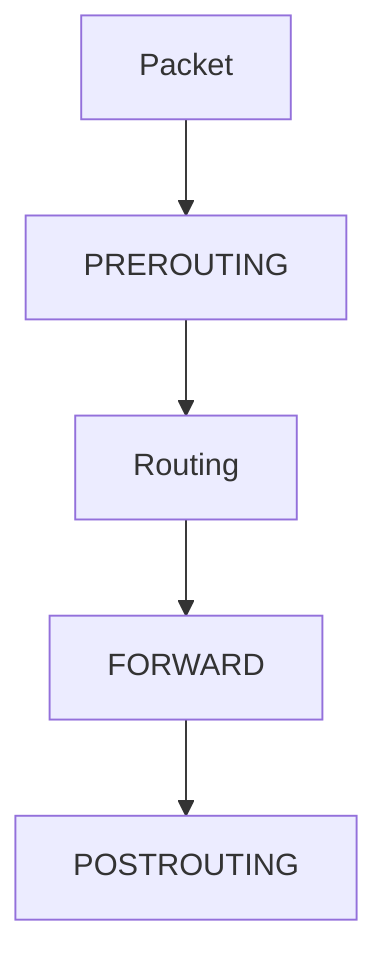

---

# Where NAT Happens

DNAT:

```text
PREROUTING
```

SNAT:

```text
POSTROUTING
```

---

# Visual


---

# Linux Conntrack

NAT depends heavily on:

```text
Connection Tracking
```

Kernel remembers:

```text
Who requested what
```

---

# Conntrack Visual

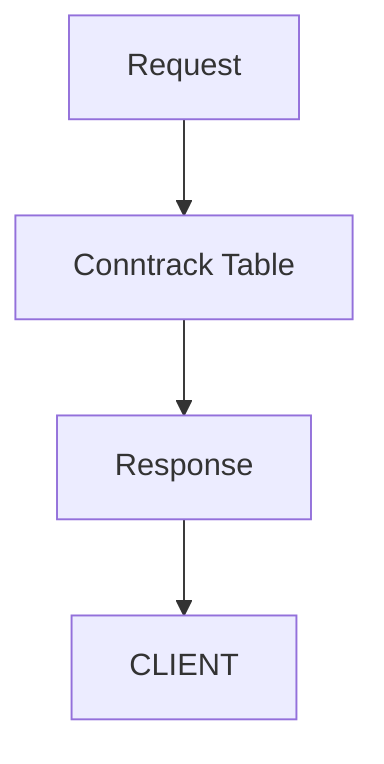

---

# Docker Uses NAT

Container:

```text
172.17.0.2
```

Cannot access internet directly.

Docker performs SNAT.

---

# Docker Architecture

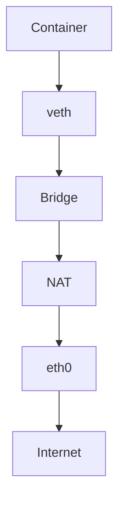

---

# Kubernetes Uses NAT

Pod:

```text
10.244.0.2
```

Cluster uses NAT.

---

# Kubernetes Architecture

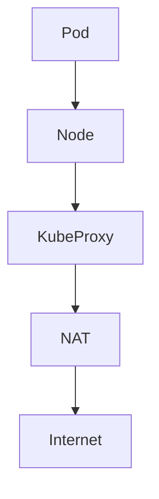

---

# Cloud NAT

Cloud providers also use NAT.

Examples:

```text
AWS NAT Gateway

Azure NAT Gateway

Cloud NAT
```

---

# AWS Architecture

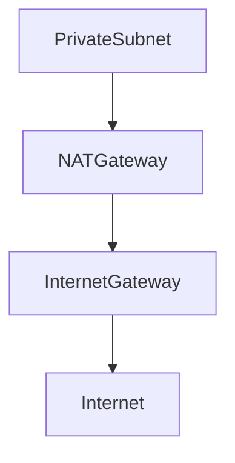

---

# Production Data Center Architecture

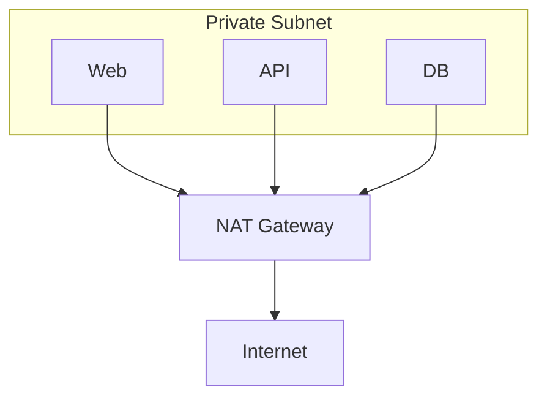

---

# Packet Journey

Laptop → Google.

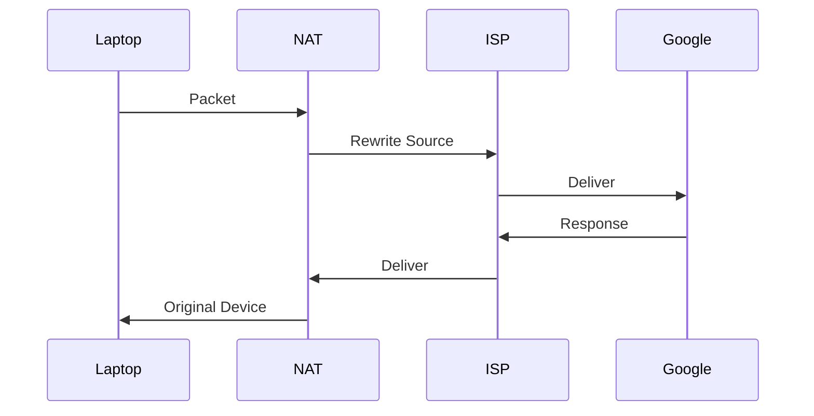

---

# Security Considerations

NAT is NOT a firewall.

Many engineers confuse these.

Wrong:

```text
NAT = Security
```

Correct:

```text
NAT = Translation

Firewall = Filtering
```

---

# NAT vs Firewall

```mermaid
graph TD

NAT[NAT]

FW[Firewall]

NAT --> T[Translate]

FW --> F[Filter]
```

Different jobs.

---

# Common Problems

## Problem 1

Internet doesn't work.

Check:

```bash
ip route
```

---

## Problem 2

NAT missing.

Check:

```bash
sudo nft list ruleset
```

---

## Problem 3

Docker no internet.

Check:

```bash
sudo iptables -t nat -L
```

---

## Problem 4

Conntrack full.

Check:

```bash
sudo conntrack -L
```

---

# Troubleshooting Tree

```mermaid
flowchart TD

START[Internet Not Working]

START --> ROUTE[Route Exists?]

ROUTE -->|No| FIX1[Fix Route]

ROUTE -->|Yes| NAT[NAT Exists?]

NAT -->|No| FIX2[Configure NAT]

NAT -->|Yes| FIREWALL[Firewall Blocking?]

FIREWALL -->|Yes| FIX3[Fix Rules]

FIREWALL -->|No| CONNTRACK[Conntrack Full?]

CONNTRACK --> SUCCESS[Working]
```

---

# Important Commands

Show routes

```bash
ip route
```

Show NAT rules

```bash
sudo nft list ruleset
```

iptables NAT

```bash
sudo iptables -t nat -L
```

Show conntrack

```bash
sudo conntrack -L
```

Capture packets

```bash
sudo tcpdump -i eth0
```

---

# Common Misconceptions

### Misconception 1

> NAT is security

Wrong.

---

### Misconception 2

> NAT only exists in routers

Wrong.

Linux, Docker, Kubernetes, and Cloud use NAT.

---

### Misconception 3

> Docker networking is Docker code

Wrong.

Docker heavily relies on Linux NAT.

---

# Engineer Mental Model

Never think:

```text
Laptop

↓

Internet
```

Think:

```mermaid
flowchart TD

DEVICE[Device]

NAT[NAT]

ISP[ISP]

INTERNET[Internet]

DEVICE --> NAT

NAT --> ISP

ISP --> INTERNET
```

---

# Capability Checklist

After this file you should understand:

✅ Why NAT exists

✅ IPv4 exhaustion

✅ SNAT

✅ DNAT

✅ PAT

✅ Port forwarding

✅ Conntrack

✅ Linux NAT internals

✅ Docker NAT

✅ Kubernetes NAT

✅ Cloud NAT

✅ Production troubleshooting


Those files together would elevate this repository to a true Linux networking engineering handbook.
