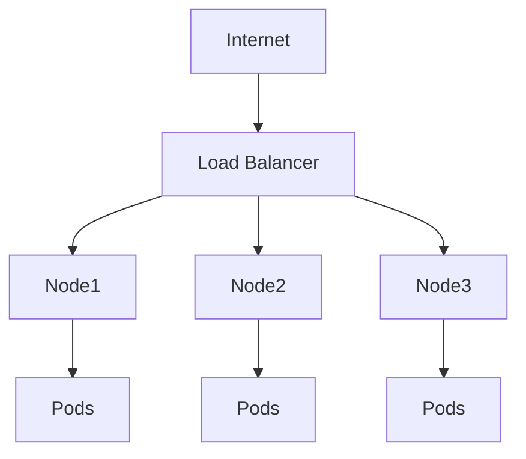
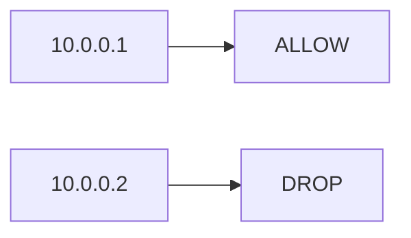
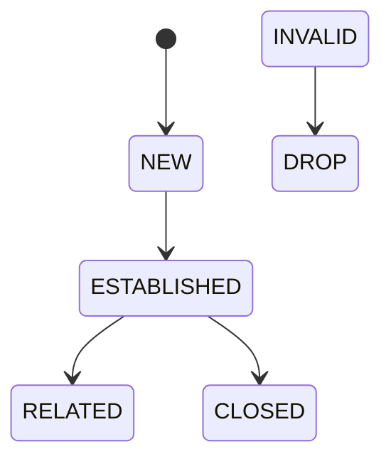
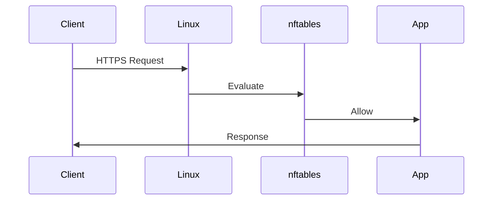
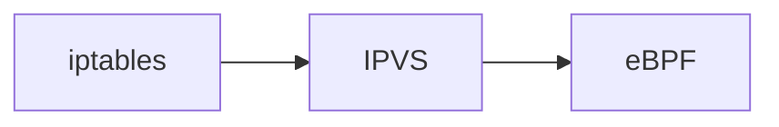

# Linux nftables

# The Future of Linux Packet Processing

---

# Why This File Exists

Most engineers eventually ask:

> If `iptables` exists, why was `nftables` created?

The answer:

> Modern infrastructure became too large.

Old infrastructure:

```text
1 Server

↓

10 Rules
```

Modern infrastructure:

```text
500 Servers

↓

500 Pods

↓

1000 Containers

↓

10000 Services

↓

100000+ Rules
```

iptables started showing limitations.

Linux needed something better.

That became nftables.

---

# Learning Goals

After this file, you should understand:

* Why nftables exists
* Why iptables struggled
* nftables architecture
* Packet flow
* Sets and maps
* Stateful firewalls
* NAT in nftables
* Docker relationship
* Kubernetes relationship
* eBPF relationship
* Modern production systems

---

# The Big Picture

Think of Linux networking evolution.

```mermaid
flowchart LR

iptables

-->

nftables

-->

eBPF

-->

Modern Cloud Networking
```

Important:

> nftables does NOT replace Linux Netfilter.

It replaces:

```text
iptables

ip6tables

arptables

ebtables
```

with one unified system.

---

# Mental Model

Think of iptables as a giant checklist.

```text
Rule 1

↓

Rule 2

↓

Rule 3

↓

Rule 4

↓

Rule 5000
```

Think of nftables as a database lookup engine.

```text
Packet

↓

Lookup

↓

Decision
```

Much faster.

---

# Old World Problem

Imagine this infrastructure.



Thousands of services create thousands of rules.

---

# iptables Problem

Packet evaluation:

```mermaid
flowchart TD

Packet

↓

Rule1

↓

Rule2

↓

Rule3

↓

Rule4

↓

Rule5000

↓

Decision
```

Sequential scanning.

Problem:

```text
More rules

↓

More latency

↓

More CPU
```

---

# nftables Solution

```mermaid
flowchart TD

Packet

↓

Fast Lookup Engine

↓

Decision
```

---

# Linux Networking Architecture

```mermaid
flowchart TD

Application

↓

Socket

↓

TCP

↓

IP

↓

Netfilter

↓

nftables

↓

Routing

↓

NIC

↓

Internet
```

Nothing changes.

Only the rule engine changes.

---

# Very Important Architecture

```mermaid
flowchart TD

Userspace

↓

nft command

↓

Netlink

↓

Kernel

↓

Netfilter

↓

Packet Processing
```

---

# Components

There are 5 major concepts.

```mermaid
mindmap

root((nftables))

Tables

Chains

Rules

Sets

Maps
```

---

# Table

A container for rules.

Think:

```text
Database
```

Example:

```text
inet filter
```

---

# Chain

A processing stage.

Think:

```text
Department
```

Examples:

```text
input

forward

output
```

---

# Rule

Individual logic.

Think:

```text
if statement
```

Example:

```text
if source IP = x

allow
```

---

# Set

This is one of nftables' biggest advantages.

Think:

```text
HashSet
```

Instead of:

```text
1000 rules
```

we can have:

```text
1 rule

↓

1000 values
```

---

# Visualizing Sets

iptables:

```mermaid
flowchart TD

Packet

↓

Rule1

↓

Rule2

↓

Rule3

↓

Rule4

↓

Rule5000
```

nftables:

```mermaid
flowchart TD

Packet

↓

Set Lookup

↓

Decision
```

---

# Maps

Maps are even more powerful.

Think:

```text
Dictionary

Key

↓

Value
```

Example:

```text
IP

↓

Action
```

---

# Visual



---

# Packet Journey

This visual is extremely important.

```mermaid
flowchart TD

Incoming Packet

↓

PREROUTING

↓

Routing

↓

INPUT

↓

Application

↓

OUTPUT

↓

POSTROUTING

↓

Internet
```

nftables still uses Netfilter hooks.

---

# Netfilter Hooks

```mermaid
mindmap

root((Hooks))

PREROUTING

INPUT

FORWARD

OUTPUT

POSTROUTING
```

Same hooks.

Different rule engine.

---

# nftables Packet Pipeline

```mermaid
flowchart TD

Packet

↓

Netfilter

↓

Table

↓

Chain

↓

Rule

↓

Action
```

---

# Actions

```mermaid
mindmap

root((Actions))

accept

drop

reject

jump

goto

dnat

snat

log

counter
```

---

# Stateful Firewall

nftables heavily uses conntrack.

```mermaid
flowchart TD

Packet

↓

Conntrack

↓

State

↓

nftables

↓

Decision
```

---

# Connection States



---

# Example Production Flow



---

# NAT In nftables

NAT still exists.

Flow:

```mermaid
flowchart TD

Packet

↓

Conntrack

↓

SNAT

↓

Routing

↓

Internet
```

---

# Docker Relationship

This is where many engineers become confused.

Reality:

```text
Docker CLI

↓

Docker Engine

↓

iptables compatibility layer

↓

nftables backend

↓

Linux kernel
```

On many modern distributions.

---

# Docker Architecture

```mermaid
flowchart TD

Container

↓

veth

↓

docker0

↓

NAT

↓

nftables

↓

eth0

↓

Internet
```

---

# Kubernetes Relationship

Historically:

```text
Pods

↓

iptables
```

Modern direction:

```text
Pods

↓

nftables

↓

IPVS

↓

eBPF
```

depending on environment.

---

# Kubernetes Evolution



nftables is becoming more important.

---

# Modern Linux Networking Evolution

```mermaid
timeline

title Linux Networking Evolution

2001 : iptables

2014 : nftables

2017 : Kubernetes Explosion

2019 : eBPF Growth

2022 : Cloud Native Expansion

2025 : Hybrid nftables + eBPF World

2030 : More Kernel Programmability
```

---

# eBPF Relationship

Very important.

Many people think:

```text
nftables

↓

obsolete because eBPF
```

Wrong.

Relationship:

```mermaid
flowchart TD

Netfilter

↓

nftables

↓

eBPF

↓

Coexist
```

They complement each other.

---

# Production Data Center

```mermaid
graph TD

Internet

LB[Load Balancer]

Firewall[nftables]

Node1[Node1]

Node2[Node2]

Pods[Pods]

Internet --> LB

LB --> Firewall

Firewall --> Node1

Firewall --> Node2

Node1 --> Pods

Node2 --> Pods
```

---

# Production Advantages

```mermaid
mindmap

root((Advantages))

Fast

Scalable

Atomic Updates

Sets

Maps

Unified API

Cleaner Syntax

Less Memory
```

---

# Atomic Updates

Huge production advantage.

iptables:

```text
Delete rule

↓

Insert rule
```

Temporary inconsistencies possible.

nftables:

```text
Build entire configuration

↓

Apply atomically
```

Safer.

---

# Visual

```mermaid
flowchart TD

Build Config

↓

Validate

↓

Apply Once

↓

Success
```

---

# Performance Comparison

| Feature           | iptables   | nftables  |
| ----------------- | ---------- | --------- |
| Rule Traversal    | Sequential | Optimized |
| Sets              | Limited    | Excellent |
| Maps              | No         | Yes       |
| Atomic Updates    | No         | Yes       |
| Unified IPv4/IPv6 | No         | Yes       |
| Scalability       | Moderate   | Excellent |

---

# Production Troubleshooting

---

## Problem 1

Rules not applied.

Check:

```bash
sudo nft list ruleset
```

---

## Problem 2

Docker networking broken.

Check:

```bash
sudo nft list ruleset
```

and

```bash
docker network inspect bridge
```

---

## Problem 3

Pods unreachable.

Check:

```bash
sudo nft list ruleset
```

---

# Troubleshooting Decision Tree

```mermaid
flowchart TD

START[Service Unreachable]

START --> PORT[Port Listening?]

PORT --> ROUTE[Route Exists?]

ROUTE --> NFT[nftables Rule Exists?]

NFT --> CONNTRACK[Conntrack Healthy?]

CONNTRACK --> NAT[NAT Working?]

NAT --> SUCCESS[Healthy]
```

---

# Important Commands

Show everything

```bash
sudo nft list ruleset
```

List tables

```bash
sudo nft list tables
```

List chains

```bash
sudo nft list chains
```

Monitor changes

```bash
sudo nft monitor
```

Validate config

```bash
sudo nft -c -f rules.nft
```

---

# Common Misconceptions

### ❌ nftables replaces Netfilter

Wrong.

nftables uses Netfilter.

---

### ❌ eBPF replaces nftables

Wrong.

They coexist.

---

### ❌ iptables is obsolete

Wrong.

Millions of systems still use it.

---

### ❌ Docker no longer uses iptables

Wrong.

Many Docker setups still heavily depend on iptables compatibility layers.

---

# Engineer Mental Model

Never think:

```text
Application

↓

Internet
```

Always think:

```mermaid
flowchart TD

Application

↓

Socket

↓

TCP

↓

IP

↓

Netfilter

↓

Conntrack

↓

nftables

↓

Routing

↓

NIC

↓

Internet
```

---

# Capability Checklist

After this file you should understand:

✅ Why nftables exists

✅ iptables limitations

✅ Tables

✅ Chains

✅ Rules

✅ Sets

✅ Maps

✅ Atomic updates

✅ Docker relationship

✅ Kubernetes relationship

✅ eBPF relationship

✅ Modern Linux networking evolution

