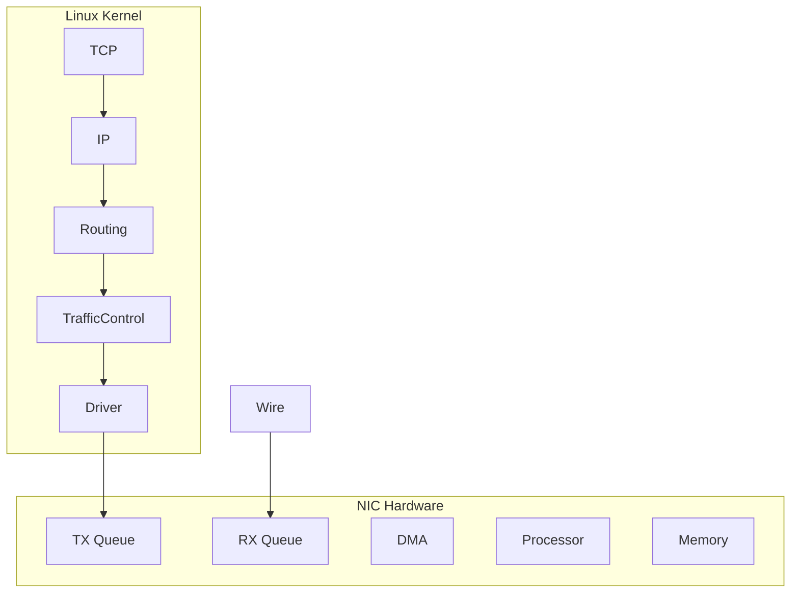
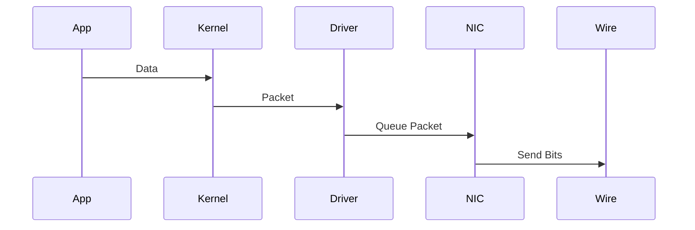
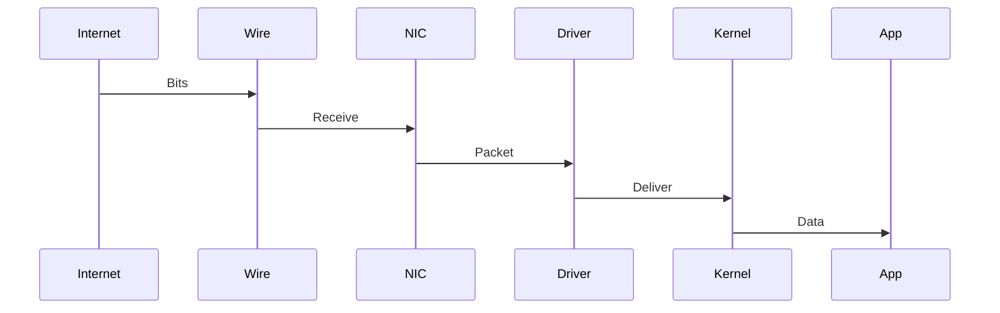
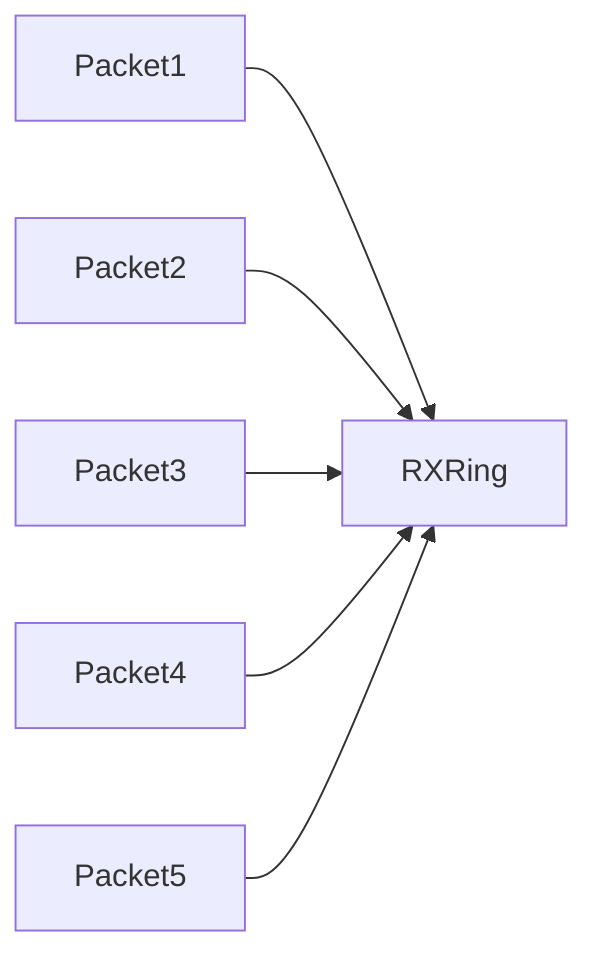
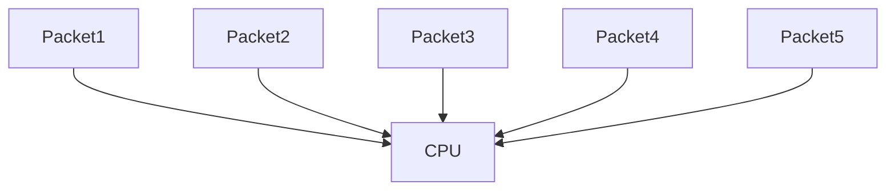

# Linux NIC Internals

# Understanding The Hardware Engine Behind Linux Networking

---

# Why This File Exists

Most engineers think:

```text
Application

↓

Internet
```

Reality:

```text
Application

↓

Socket

↓

TCP

↓

IP

↓

Routing

↓

Traffic Control

↓

Driver

↓

NIC

↓

Physical Wire
```

The NIC is the final component before packets leave your machine.

Without NICs:

```text
Docker doesn't work

Kubernetes doesn't work

Cloud doesn't work

The internet doesn't work
```

---

# Learning Goals

After this file you should understand:

* What a NIC actually is
* NIC architecture
* Packet transmission
* Packet reception
* Drivers
* DMA
* Interrupts
* NAPI
* Ring buffers
* Offloading
* RSS
* Multi-queue NICs
* Cloud networking
* High-performance networking

---

# What Is A NIC?

NIC = Network Interface Card

Think:

> A specialized computer dedicated to networking.

Modern NICs are extremely intelligent devices.

---

# Mental Model

Never think:

```text
NIC = Ethernet Port
```

Think:

```text
NIC = Tiny Networking Computer
```

---

# Big Picture

```mermaid
flowchart TD

Application

↓

Socket

↓

TCP

↓

IP

↓

Routing

↓

Traffic Control

↓

Driver

↓

NIC

↓

Wire
```

---

# NIC Architecture

This is one of the most important visuals.



---

# Modern NIC Is A Computer

NICs contain:

```mermaid
mindmap

root((NIC))

Processor

Memory

DMA Engine

RX Queues

TX Queues

Offload Engine

Interrupt Engine
```

---

# Why NICs Became Smart

Old world:

```text
CPU did everything
```

Modern world:

```text
NIC offloads work

↓

CPU becomes faster
```

---

# Physical Packet Journey

Imagine:

```text
Browser

↓

google.com
```

Packet journey:

```mermaid
flowchart TD

Browser

↓

Socket

↓

TCP

↓

IP

↓

Routing

↓

TrafficControl

↓

Driver

↓

NIC

↓

Router

↓

Internet
```

---

# TX Journey (Send Packet)

This is extremely important.



---

# RX Journey (Receive Packet)



---

# The Driver Relationship

Driver is the translator.

---

# Visual


---

# What Is DMA?

DMA = Direct Memory Access.

This is one of the biggest Linux networking optimizations.

Without DMA:

```text
NIC

↓

CPU

↓

RAM
```

Too expensive.

With DMA:

```text
NIC

↓

RAM
```

CPU stays free.

---

# DMA Architecture

```mermaid
flowchart TD

NIC

↓

DMA Engine

↓

RAM

↓

CPU
```

---

# DMA Is Everywhere

Modern infrastructure depends on DMA.

Examples:

```text
Docker

Kubernetes

Cloud

Databases

Storage
```

---

# Ring Buffers

Extremely important concept.

Think:

> Waiting room for packets.

---

# Visual



---

# Ring Buffer Architecture

```mermaid
flowchart TD

NIC

↓

RX Ring Buffer

↓

Driver

↓

Kernel
```

---

# TX Ring Buffer

Outgoing packets also use queues.

```mermaid
flowchart TD

Kernel

↓

Driver

↓

TX Ring

↓

NIC

↓

Internet
```

---

# Why Queues Exist

CPU and NIC operate at different speeds.

```text
CPU = Extremely fast

NIC = Physical limitations
```

Queues absorb bursts.

---

# Interrupts

Old NIC behavior.

```mermaid
flowchart TD

Packet

↓

NIC

↓

Interrupt CPU

↓

CPU Wakeup
```

Problem:

```text
Millions packets

↓

Millions interrupts
```

CPU overload.

---

# Interrupt Storm Problem



Terrible.

---

# Linux Solution: NAPI

NAPI = New API.

Hybrid model.

```text
Interrupt

↓

Polling

↓

Efficiency
```

---

# NAPI Architecture

```mermaid
flowchart TD

Packet

↓

Interrupt Once

↓

Polling Mode

↓

Process Many Packets
```

---

# Why NAPI Is Amazing

Instead of:

```text
1 Packet

↓

1 Interrupt
```

Linux does:

```text
100 Packets

↓

1 Interrupt
```

Huge improvement.

---

# RX Processing

```mermaid
flowchart TD

Wire

↓

NIC

↓

RX Queue

↓

NAPI

↓

Driver

↓

Kernel

↓

Application
```

---

# Multi Queue NICs

Modern NICs have many queues.

Example:

```text
8 CPU cores

↓

8 RX queues

↓

8 TX queues
```

---

# Visual

```mermaid
flowchart TD

NIC

↓

RX0

RX1

RX2

RX3

↓

CPU0

CPU1

CPU2

CPU3
```

---

# RSS

RSS = Receive Side Scaling.

It distributes traffic.

---

# Visual

```mermaid
flowchart TD

Packets

↓

Hash

↓

RX Queues

↓

CPUs
```

---

# Why RSS Exists

Without RSS:

```text
100000 packets

↓

CPU0
```

Bad.

With RSS:

```text
100000 packets

↓

CPU0

CPU1

CPU2

CPU3
```

Balanced.

---

# NIC Offloading

Modern NICs do a lot.

---

# Offload Architecture

```mermaid
mindmap

root((NIC Offloading))

Checksum

TSO

GSO

GRO

LRO

VLAN

RSS
```

---

# Checksum Offload

NIC calculates:

```text
IP checksum

TCP checksum

UDP checksum
```

instead of CPU.

---

# TSO

TCP Segmentation Offload.

Without TSO:

```text
64KB

↓

44 packets
```

CPU does work.

With TSO:

```text
64KB

↓

NIC splits packets
```

---

# GRO

Generic Receive Offload.

NIC combines packets.

---

# Visual

```mermaid
flowchart LR

Packet1

Packet2

Packet3

↓

GRO

↓

Large Packet
```

---

# Complete NIC Pipeline

This is one of the most important visuals.

```mermaid
flowchart TD

Application

↓

Socket

↓

TCP

↓

IP

↓

Netfilter

↓

Routing

↓

TrafficControl

↓

Driver

↓

TX Ring

↓

NIC

↓

Wire

↓

Router

↓

Internet
```

---

# Cloud Relationship

Cloud VMs have virtual NICs.

---

# Visual

```mermaid
flowchart TD

VM

↓

vNIC

↓

Hypervisor

↓

Physical NIC

↓

Internet
```

---

# AWS Architecture

```mermaid
flowchart TD

EC2

↓

ENA Driver

↓

Nitro Hypervisor

↓

Physical NIC

↓

AWS Fabric
```

---

# Kubernetes Relationship

Pods don't directly use NICs.

Architecture:

```mermaid
flowchart TD

Pod

↓

veth

↓

Host NIC

↓

Internet
```

---

# Docker Relationship

```mermaid
flowchart TD

Container

↓

veth

↓

docker0

↓

NAT

↓

Host NIC

↓

Internet
```

---

# High Performance Networking

Modern technologies:

```mermaid
mindmap

root((Performance))

RSS

NAPI

XDP

eBPF

DPDK

SR-IOV

SmartNIC
```

---

# SR-IOV

Very important in cloud.

Allows:

```text
VM

↓

Direct NIC Access
```

---

# Visual

```mermaid
flowchart TD

PhysicalNIC

↓

VirtualFunction1

VirtualFunction2

↓

VM1

VM2
```

---

# SmartNIC

Future direction.

NIC runs code itself.

---

# SmartNIC Architecture

```mermaid
flowchart TD

CPU

↓

SmartNIC

↓

Firewall

↓

LoadBalancer

↓

Encryption

↓

Internet
```

---

# Modern Evolution

```mermaid
timeline

title NIC Evolution

1990 : Basic Ethernet

2005 : DMA

2010 : RSS

2015 : SmartNIC

2020 : eBPF

2025 : DPUs
```

---

# Production Bottlenecks

Problem 1

RX queue overflow.

Symptoms:

```text
Packet drops
```

---

# Problem 2

Interrupt storm.

Symptoms:

```text
High CPU
```

---

# Problem 3

RSS disabled.

Symptoms:

```text
CPU0 overloaded
```

---

# Problem 4

Offloading disabled.

Symptoms:

```text
High CPU utilization
```

---

# Troubleshooting Flow

```mermaid
flowchart TD

START[Network Slow]

START --> SPEED[NIC Speed Correct?]

SPEED --> QUEUES[Queues Healthy?]

QUEUES --> RSS[RSS Enabled?]

RSS --> NAPI[NAPI Working?]

NAPI --> OFFLOAD[Offloading Enabled?]

OFFLOAD --> SUCCESS[Healthy]
```

---

# Essential Commands

Show NICs:

```bash
ip link
```

Driver info:

```bash
ethtool eth0
```

Statistics:

```bash
ethtool -S eth0
```

Queue info:

```bash
ethtool -l eth0
```

RSS info:

```bash
ethtool -x eth0
```

Show interrupts:

```bash
cat /proc/interrupts
```

Show softirqs:

```bash
cat /proc/softirqs
```

---

# Common Misconceptions

### ❌ NIC is an Ethernet port

Wrong.

It's a networking computer.

---

### ❌ CPU sends packets directly

Wrong.

NIC hardware sends packets.

---

### ❌ Interrupt per packet

Wrong.

NAPI optimizes this.

---

### ❌ Cloud networking is different

Wrong.

Cloud scales NIC concepts.

---

# Engineer Mental Model

Never think:

```text
Application

↓

Internet
```

Always think:

```mermaid
flowchart TD

Application

↓

Socket

↓

TCP

↓

IP

↓

Routing

↓

TrafficControl

↓

Driver

↓

NIC

↓

Wire

↓

Router

↓

Internet
```

---

# Capability Checklist

After this file you should understand:

✅ NIC internals

✅ DMA

✅ Ring buffers

✅ RX/TX queues

✅ NAPI

✅ RSS

✅ Offloading

✅ Cloud networking

✅ Kubernetes relationship

✅ SmartNICs

✅ High-performance networking


Because **NIC → NAPI → XDP → eBPF → SmartNIC → DPU** is an extremely powerful modern infrastructure learning path.
