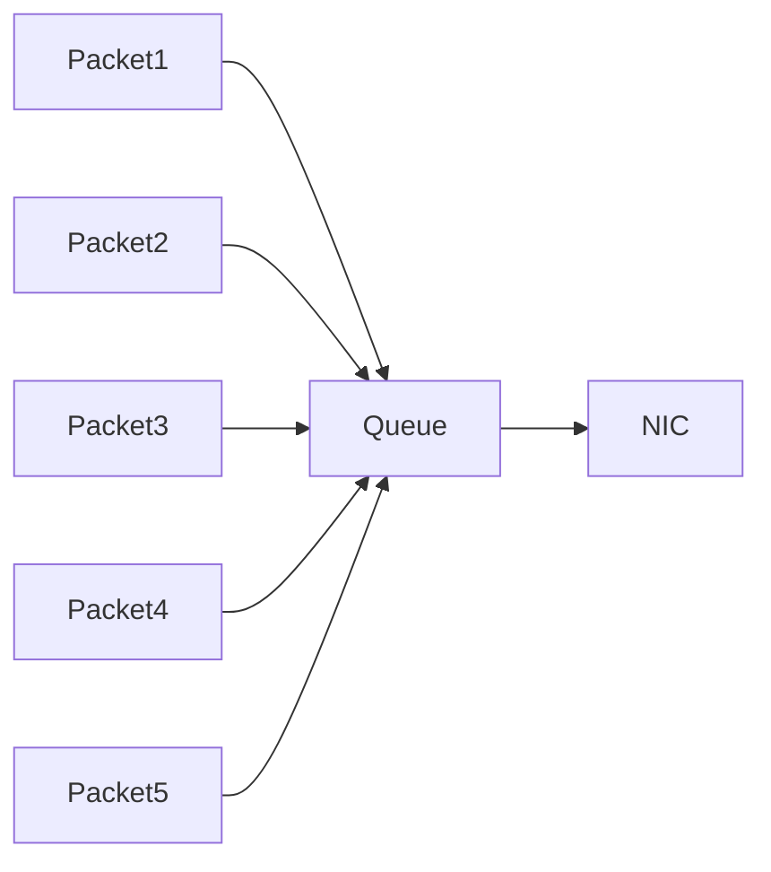

# Linux Traffic Control (tc) Internals

# Understanding Linux Network Traffic Operating System

---

# Why This File Exists

Imagine this server.

```text
32 CPU

128GB RAM

10Gbps NIC
```

Running:

```text
Video Streaming

API Gateway

Redis

Machine Learning

Database Replication

Monitoring
```

Question:

> Who decides which network traffic should be prioritized?

The answer:

```text
Linux Traffic Control (tc)
```

tc is the traffic management engine of Linux.

Think:

> CPU scheduler for networks.

---

# Learning Goals

After this file you should understand:

* What tc is
* Why tc exists
* How Linux schedules packets
* Queueing disciplines
* Classes
* Filters
* Traffic shaping
* Traffic policing
* QoS
* eBPF relationship
* Kubernetes relationship
* Production systems

---

# Mental Model

Think of a highway.

Without traffic control:

```text
1000 Cars

↓

One Lane

↓

Chaos
```

With traffic control:

```text
Emergency

↓

Business

↓

Regular Traffic

↓

Guests
```

Everything becomes organized.

---

# The Big Picture

```mermaid
flowchart TD

Application

↓

Socket

↓

TCP

↓

IP

↓

Routing

↓

Traffic Control

↓

NIC

↓

Internet
```

---

# Where tc Lives

Very important.

```mermaid
flowchart TD

Application

↓

Socket

↓

TCP

↓

IP

↓

Netfilter

↓

Routing

↓

Traffic Control

↓

Driver

↓

NIC
```

tc operates near the network device.

---

# Linux Network Pipeline

This is one of the most important visuals.

```mermaid
flowchart TD

Application

↓

Socket

↓

TCP

↓

IP

↓

Routing

↓

Traffic Control

↓

Driver

↓

NIC

↓

Wire
```

---

# Why tc Exists

Linux solves many problems.

```mermaid
mindmap

root((Traffic Control))

Bandwidth Limiting

QoS

Rate Limiting

Traffic Prioritization

Latency Control

Packet Scheduling

Network Isolation

Congestion Control
```

---

# Core Components

There are four major components.

```mermaid
mindmap

root((tc))

Qdisc

Classes

Filters

Actions
```

---

# Mental Model

```text
Qdisc

↓

Classes

↓

Filters

↓

Actions
```

Everything revolves around this hierarchy.

---

# Visual Architecture

```mermaid
flowchart TD

Packet

↓

Qdisc

↓

Class

↓

Filter

↓

Action

↓

NIC
```

---

# Qdisc

Queueing Discipline.

The heart of tc.

Think:

> Traffic manager.

---

# Visual

```mermaid
flowchart TD

Packets

↓

Queue

↓

Scheduler

↓

NIC
```

---

# Why Queue Exists

NIC is slower than CPU.

Example:

```text
CPU

↓

Millions packets/sec

↓

NIC

↓

Finite speed
```

Need buffering.

---

# Queue Visualization



---

# Types Of Qdisc

Linux has many.

```mermaid
mindmap

root((Qdisc))

pfifo_fast

fq_codel

htb

cake

tbf

fq

clsact
```

---

# pfifo_fast

Old default.

Simple queue.

```text
First In

↓

First Out
```

---

# fq_codel

Modern default.

Used widely.

Goal:

```text
Low latency

+

Fairness
```

---

# HTB

Hierarchical Token Bucket.

Extremely common.

Purpose:

```text
Bandwidth allocation
```

---

# HTB Architecture

```mermaid
flowchart TD

10Gbps

↓

HTB

↓

Class1

Class2

Class3
```

---

# Example

```text
10Gbps NIC
```

Allocate:

```text
API

4Gbps

Streaming

5Gbps

Monitoring

1Gbps
```

---

# Visual

```mermaid
flowchart TD

NIC

↓

10Gbps

↓

HTB

↓

API

Streaming

Monitoring
```

---

# Classes

Classes divide resources.

Think:

> Subdepartments.

---

# Visual

```mermaid
flowchart TD

Root

↓

ClassA

ClassB

ClassC
```

---

# Filters

Filters decide:

```text
Who goes where?
```

---

# Visual

```mermaid
flowchart TD

Packet

↓

Filter

↓

API Class

OR

Monitoring Class
```

---

# Actions

What should happen?

```mermaid
mindmap

root((Actions))

Pass

Drop

Mirror

Redirect

Police

Mark
```

---

# Complete Packet Journey

```mermaid
flowchart TD

Packet

↓

Filter

↓

Class

↓

Queue

↓

Scheduler

↓

NIC
```

---

# Traffic Shaping

Very important.

Traffic shaping delays packets.

---

# Visual

```mermaid
flowchart LR

1000Mbps

↓

Shaper

↓

100Mbps
```

Excess traffic waits.

---

# Traffic Policing

Different concept.

Traffic policing drops excess packets.

---

# Visual

```mermaid
flowchart LR

1000Mbps

↓

Policer

↓

100Mbps

↓

DROP
```

---

# Shaping vs Policing

| Feature         | Shaping | Policing |
| --------------- | ------- | -------- |
| Delay packets   | Yes     | No       |
| Drop packets    | Rarely  | Yes      |
| Queue required  | Yes     | No       |
| User experience | Better  | Harsher  |

---

# Token Bucket

One of the most important algorithms.

Think:

```text
Bucket

↓

Tokens

↓

Packets consume tokens
```

---

# Visual

```mermaid
flowchart TD

Bucket

↓

Tokens

↓

Packet

↓

NIC
```

---

# Token Generation

```mermaid
flowchart TD

Timer

↓

Generate Tokens

↓

Store In Bucket

↓

Packet Uses Token
```

---

# Example

```text
100 Mbps
```

means:

```text
100 Mbps worth of tokens/sec
```

---

# Hierarchical Traffic Management

```mermaid
flowchart TD

10Gbps

↓

Root

↓

Critical

Business

Best Effort

↓

Applications
```

---

# Modern Linux Defaults

Modern Linux uses:

```text
fq_codel
```

Check:

```bash
tc qdisc show
```

---

# fq_codel Why?

It solves:

```text
Bufferbloat
```

---

# Bufferbloat Problem

Too much buffering.

Symptoms:

```text
High latency

Lag

Slow applications
```

---

# Visual

```mermaid
flowchart TD

Packets

↓

Huge Queue

↓

Delay

↓

Poor UX
```

---

# fq_codel Solution

```mermaid
flowchart TD

Packets

↓

Smart Queue

↓

Controlled Delay

↓

Low Latency
```

---

# eBPF Relationship

Modern tc heavily integrates with eBPF.

Architecture:

```mermaid
flowchart TD

Packet

↓

tc Hook

↓

eBPF Program

↓

Decision

↓

NIC
```

---

# Why eBPF Uses tc

eBPF attaches here.

```text
Ingress

Egress
```

before packets reach applications.

---

# Visual

```mermaid
flowchart TD

Packet

↓

Ingress Hook

↓

eBPF

↓

Egress Hook

↓

NIC
```

---

# Kubernetes Relationship

CNI plugins heavily use tc.

Examples:

```text
Cilium

Calico

Canal
```

---

# Kubernetes Architecture

```mermaid
flowchart TD

Pod

↓

veth

↓

tc

↓

eBPF

↓

NIC

↓

Internet
```

---

# Docker Relationship

Docker itself uses tc less.

But engineers use it for:

```text
Bandwidth limiting

Latency injection

Testing
```

---

# Cloud Relationship

Cloud providers implement similar ideas.

Examples:

```text
AWS

Azure

GCP
```

They all enforce:

```text
Bandwidth

QoS

Prioritization
```

---

# Production Example

Microservices.

```mermaid
graph TD

API

Redis

Database

Monitoring

NIC

API --> NIC

Redis --> NIC

Database --> NIC

Monitoring --> NIC
```

Without tc:

```text
Monitoring could flood the network.
```

---

# With tc

```mermaid
graph TD

API

Database

Monitoring

HTB

NIC

API --> HTB

Database --> HTB

Monitoring --> HTB

HTB --> NIC
```

API gets priority.

---

# Production Use Cases

## Use Case 1

Bandwidth limiting.

```text
Tenant A

500 Mbps

Tenant B

100 Mbps
```

---

## Use Case 2

Latency injection.

Testing failures.

```text
Add 200ms latency
```

---

## Use Case 3

Rate limiting.

Protect infrastructure.

---

# Traffic Control Hierarchy

```mermaid
flowchart TD

Traffic

↓

Root Qdisc

↓

Classes

↓

Filters

↓

Actions

↓

NIC
```

---

# Modern Evolution

```mermaid
timeline

title Linux Traffic Evolution

1998 : pfifo_fast

2008 : HTB Growth

2012 : fq_codel

2016 : eBPF

2020 : Cilium

2025 : eBPF Expansion
```

---

# Production Bottlenecks

Problem 1

Queue explosion.

Symptoms:

```text
Latency spikes
```

---

# Problem 2

Bufferbloat.

Symptoms:

```text
Slow websites

Gaming lag

Video jitter
```

---

# Problem 3

Wrong HTB configuration.

Symptoms:

```text
Bandwidth starvation
```

---

# Troubleshooting Flow

```mermaid
flowchart TD

START[Slow Network]

START --> NIC[NIC Saturated?]

NIC --> QDISC[Qdisc Healthy?]

QDISC --> FILTER[Filters Correct?]

FILTER --> LATENCY[Latency High?]

LATENCY --> BUFFER[Bufferbloat?]

BUFFER --> SUCCESS[Healthy]
```

---

# Essential Commands

View qdisc:

```bash
tc qdisc show
```

View classes:

```bash
tc class show
```

View filters:

```bash
tc filter show
```

Show statistics:

```bash
tc -s qdisc show
```

---

# Common Misconceptions

### ❌ tc is a firewall

Wrong.

---

### ❌ tc is only bandwidth limiting

Wrong.

---

### ❌ tc is obsolete because eBPF

Wrong.

eBPF heavily uses tc hooks.

---

### ❌ tc is only for routers

Wrong.

Containers, Kubernetes, and cloud infrastructure use it.

---

# Engineer Mental Model

Never think:

```text
Packet

↓

NIC
```

Always think:

```mermaid
flowchart TD

Packet

↓

Filter

↓

Class

↓

Queue

↓

Scheduler

↓

NIC
```

---

# Capability Checklist

After this file you should understand:

✅ Traffic Control

✅ Qdisc

✅ Classes

✅ Filters

✅ Actions

✅ Traffic shaping

✅ Traffic policing

✅ Token Bucket

✅ Bufferbloat

✅ fq_codel

✅ eBPF relationship

✅ Kubernetes relationship

Cilium** is one of the most important modern Linux networking learning paths.
