# Linux VLAN

# Building Multiple Networks On One Physical Infrastructure

---

# Why This File Exists

Imagine a company.

```text
Engineering Team

HR Team

Finance Team

Security Team
```

Question:

> Should every department have its own physical switch and cables?

That would be expensive.

Instead, we create multiple logical networks.

That's exactly what VLAN does.

---

# Learning Goals

After this file, you should understand:

* Why VLAN exists
* How VLAN works
* VLAN tagging
* VLAN IDs
* Access ports
* Trunk ports
* Native VLAN
* Inter-VLAN routing
* Linux VLAN interfaces
* Docker/Kubernetes usage
* Production architecture

---

# Big Picture

VLAN = Virtual LAN

> One physical network → Multiple isolated logical networks

---

# Mental Model

Think of a building.

Without VLAN:

```text
Everyone shares one giant room.
```

With VLAN:

```text
The same building

↓

Separate departments

↓

Separate access
```

---

# Problem Without VLAN

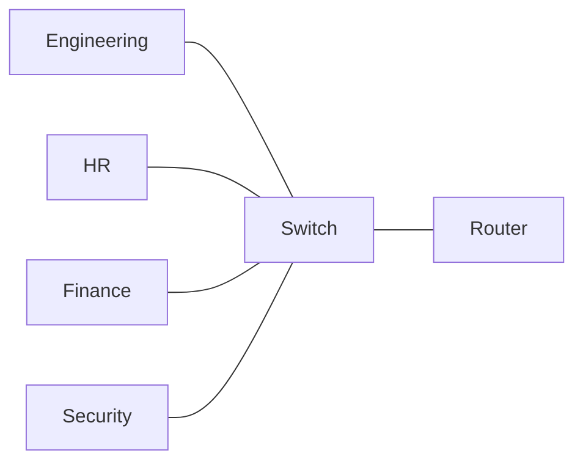

Everyone belongs to one broadcast domain.

Problems:

* Too much broadcast traffic
* Poor security
* Difficult management

---

# Solution: VLAN

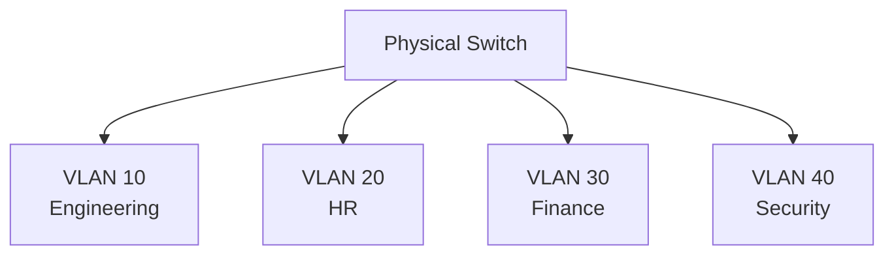

One switch.

Four independent networks.

---

# VLAN Architecture

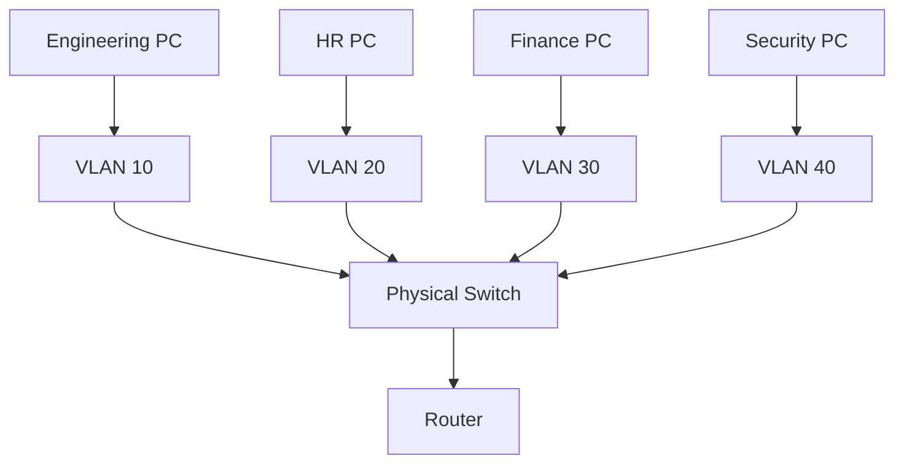

---

# Broadcast Domains

Without VLAN

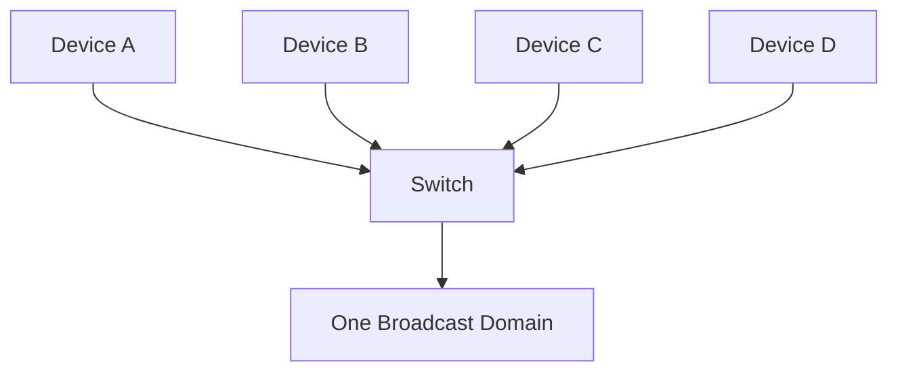

Everyone hears broadcasts.

---

# With VLAN

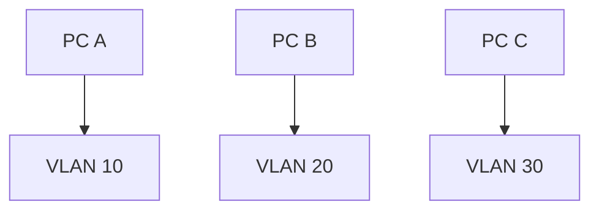

Broadcasts stay inside VLAN.

---

# What Is A VLAN Tag?

Linux and switches insert metadata.

Standard:

```text
IEEE 802.1Q
```

---

# Ethernet Frame

Normal:

```text
Destination MAC

Source MAC

Payload
```

VLAN:

```text
Destination MAC

Source MAC

VLAN Tag

Payload
```

---

# VLAN Tag Structure


---

# 802.1Q Internals

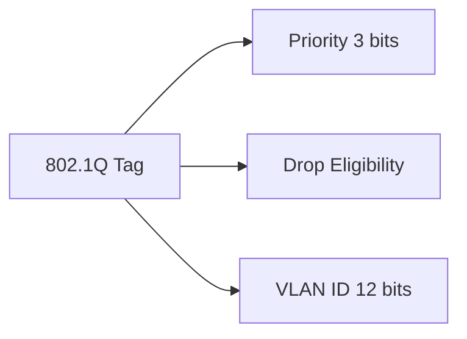

---

# VLAN ID Range

```text
0 - Reserved

1 - Default VLAN

2 - 4094 Available

4095 Reserved
```

---

# Access Port

Access ports belong to one VLAN.

Example:

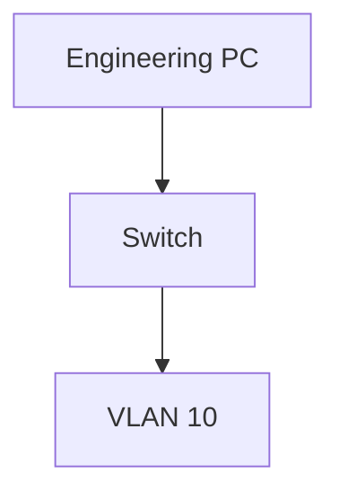

---

# Trunk Port

Trunk ports carry multiple VLANs.

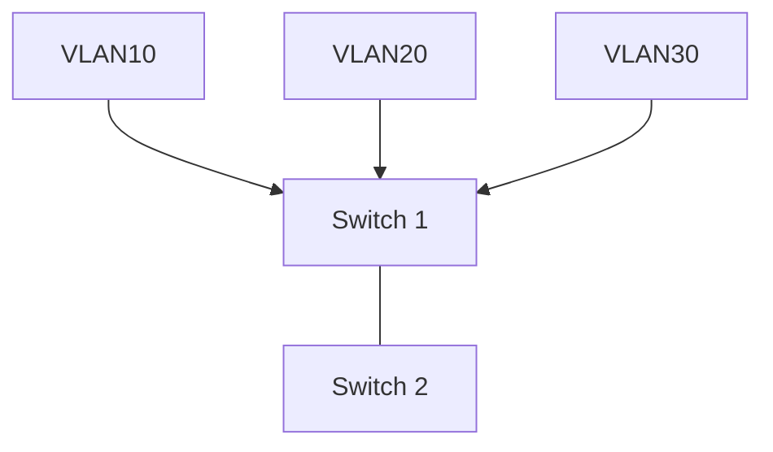

---

# Visualizing Trunking

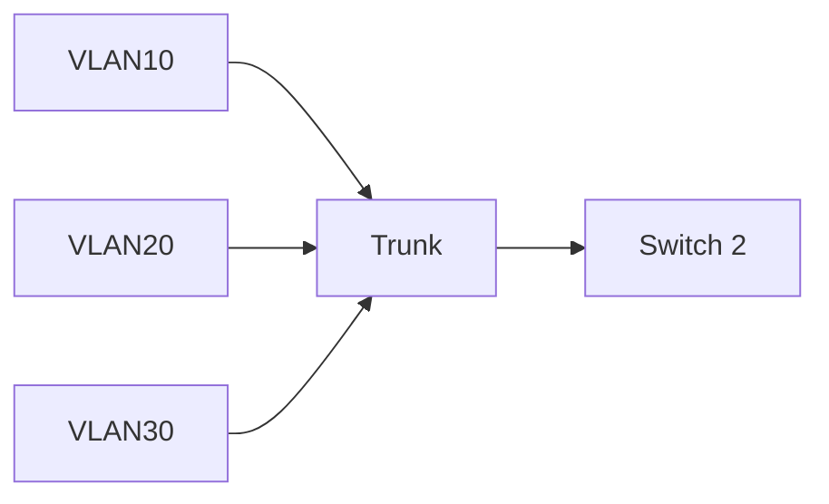

One cable.

Multiple networks.

---

# Native VLAN

Special VLAN.

Untagged traffic enters here.

Usually:

```text
VLAN 1
```

Production advice:

```text
Never use VLAN 1 for production workloads.
```

---

# Inter-VLAN Communication Problem

Suppose:

```text
VLAN10 = 10.0.10.0/24

VLAN20 = 10.0.20.0/24
```

Question:

Can they communicate?

No.

Need a router.

---

# Inter-VLAN Routing

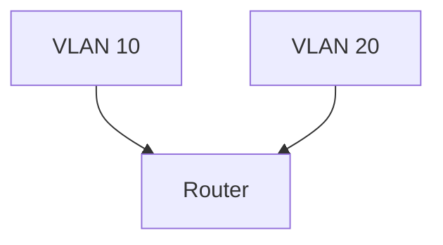

---

# Packet Journey

Engineering → Finance

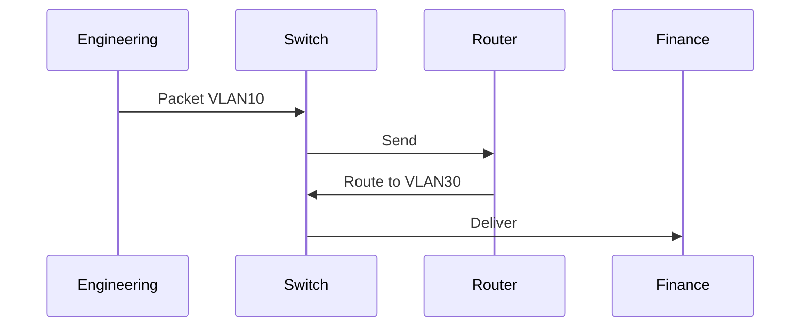

---

# Linux VLAN Internals

Linux creates virtual interfaces.

Example:

```bash
sudo ip link add link eth0 name eth0.10 type vlan id 10
```

This means:

```text
Physical NIC = eth0

Virtual VLAN Interface = eth0.10
```

---

# Linux Architecture

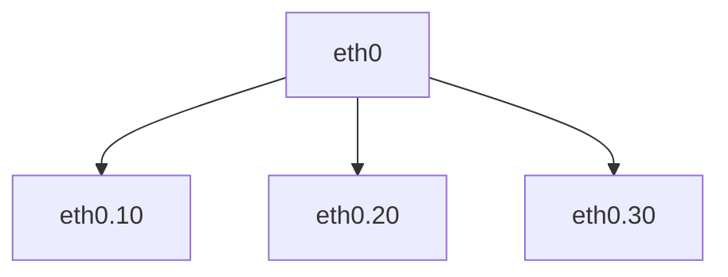

One NIC.

Multiple virtual networks.

---

# Configure VLAN

Create:

```bash
sudo ip link add link eth0 name eth0.10 type vlan id 10
```

Assign IP:

```bash
sudo ip addr add 10.0.10.1/24 dev eth0.10
```

Bring up:

```bash
sudo ip link set eth0.10 up
```

Verify:

```bash
ip -d link
```

---

# Production Data Center

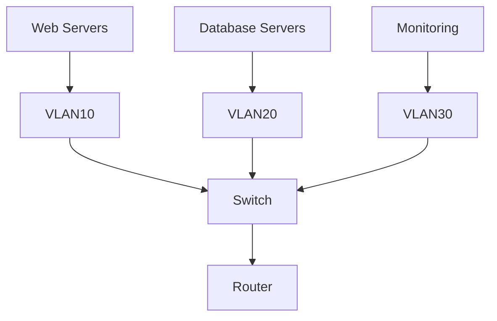

---

# Kubernetes Relationship

Important:

Kubernetes does **not** create VLANs by default.

But many infrastructures use them.

Example:

```text
Node Management VLAN

Storage VLAN

Pod VLAN

Monitoring VLAN
```

---

# Cloud Relationship

Cloud providers abstract this.

Underneath:

```text
AWS

Azure

GCP
```

still use segmentation concepts.

---

# Security Benefits

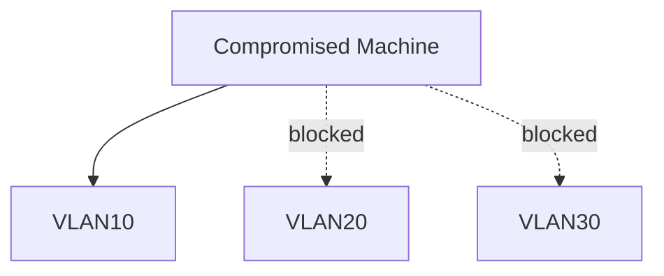

Segmentation limits blast radius.

---

# Production Troubleshooting Flow

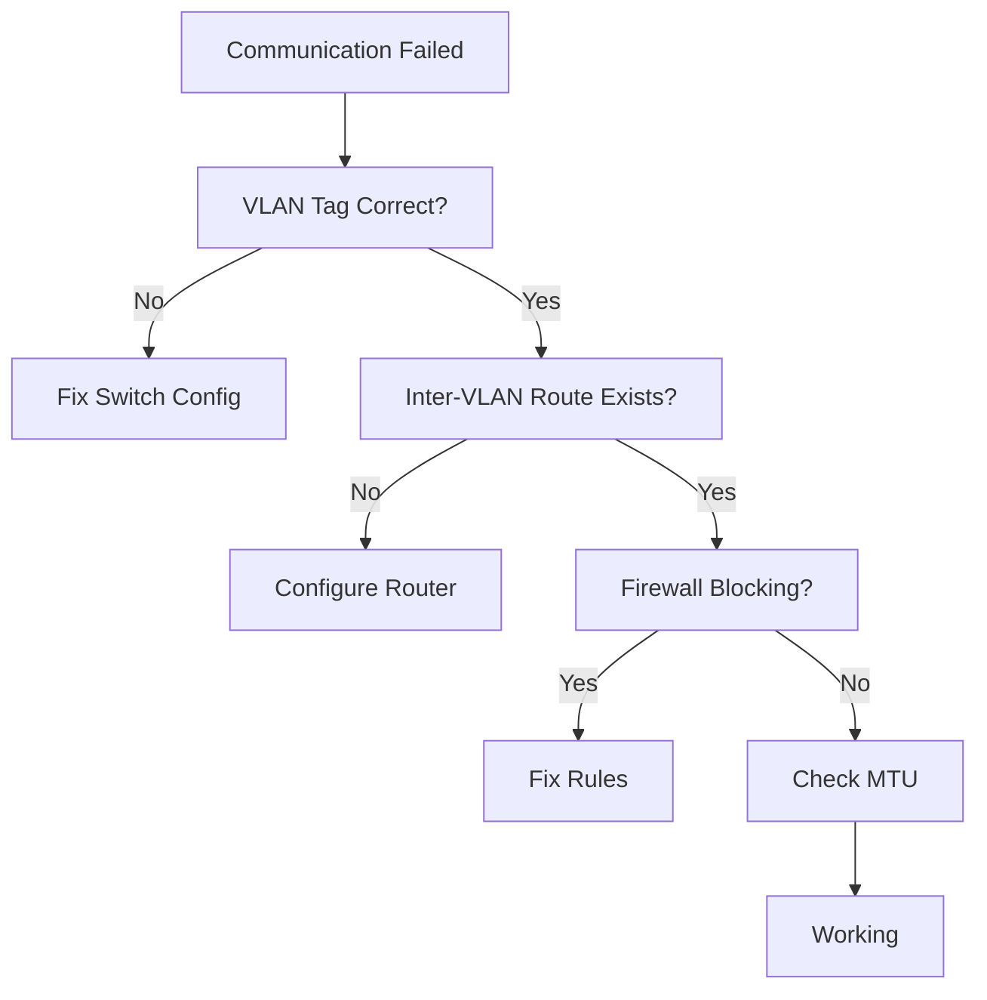

---

# Essential Commands

Create VLAN

```bash
ip link add link eth0 name eth0.10 type vlan id 10
```

Show VLANs

```bash
ip -d link
```

Delete VLAN

```bash
ip link delete eth0.10
```

Bring interface up

```bash
ip link set eth0.10 up
```

Show addresses

```bash
ip addr
```

---

# Common Misconceptions

### Misconception 1

> VLAN is a Linux feature

Wrong.

VLAN is an Ethernet standard.

---

### Misconception 2

> VLAN provides security

Partially true.

It's segmentation.

Not complete security.

---

### Misconception 3

> VLANs are obsolete because cloud exists

Wrong.

Cloud infrastructure heavily relies on segmentation concepts.

---

# Engineer Mental Model

Never think:

```text
One cable = One network
```

Think:

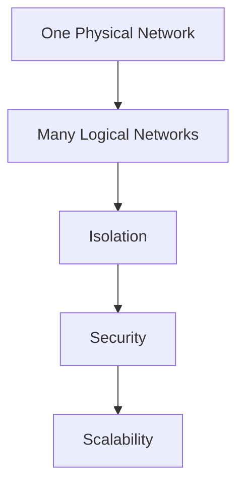

---

# Capability Checklist

After this file you should understand:

✅ VLAN

✅ 802.1Q

✅ VLAN IDs

✅ Access ports

✅ Trunk ports

✅ Native VLAN

✅ Inter-VLAN routing

✅ Linux VLAN interfaces

✅ Production segmentation

be one of the most important files of the entire repository because VXLAN is the foundation of modern Kubernetes, cloud networking, and multi-host container networking.**
