# Linux VXLAN

# Building Networks That Span Multiple Servers

---

# Why This File Exists

Up until now we have learned:

```text
Network Namespace

↓

veth

↓

Linux Bridge

↓

VLAN
```

All of these work very well.

But there is a huge problem.

---

# The Modern Infrastructure Problem

Suppose we have two servers.

```text
Server A

192.168.1.10

Server B

192.168.1.20
```

Server A hosts:

```text
Container A

Container B
```

Server B hosts:

```text
Container C

Container D
```

Question:

> How can Container A communicate with Container C as if they are on the same network?

This problem led to VXLAN.

---

# What Is VXLAN?

VXLAN = Virtual eXtensible LAN

It creates:

> Layer 2 networks over Layer 3 infrastructure.

Simply:

```text
Ethernet Network

↓

Encapsulated

↓

IP Network

↓

Delivered Anywhere
```

Think:

> Build a virtual switch that spans multiple physical machines.

---

# Mental Model

Imagine cities.

Without VXLAN:

```text
City A

Roads

Cannot directly connect

City B
```

With VXLAN:

```text
City A

↓

Underground Tunnel

↓

City B
```

VXLAN is the tunnel.

---

# Learning Goals

After this file you should understand:

* Why VXLAN exists
* VXLAN architecture
* Overlay networks
* Underlay networks
* VTEPs
* VNI
* Encapsulation
* Packet journeys
* Kubernetes networking
* Cloud networking
* Production troubleshooting

---

# Evolution Of Networking

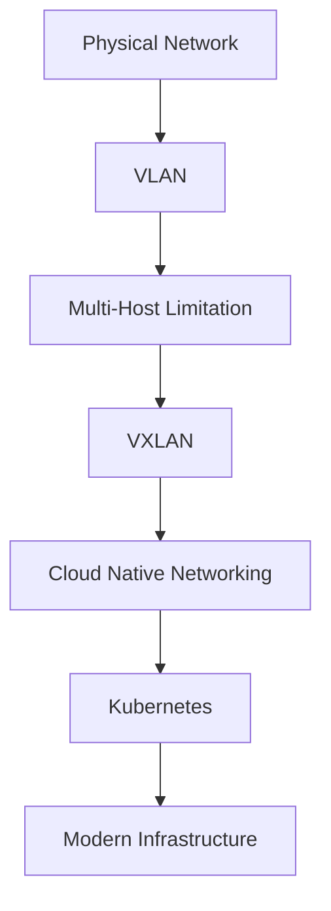

---

# The Core Problem

Bridge works inside one machine.

VLAN works inside one physical network.

Neither easily solves:

```text
Multi Host Container Networking
```

---

# Visual: Traditional Architecture

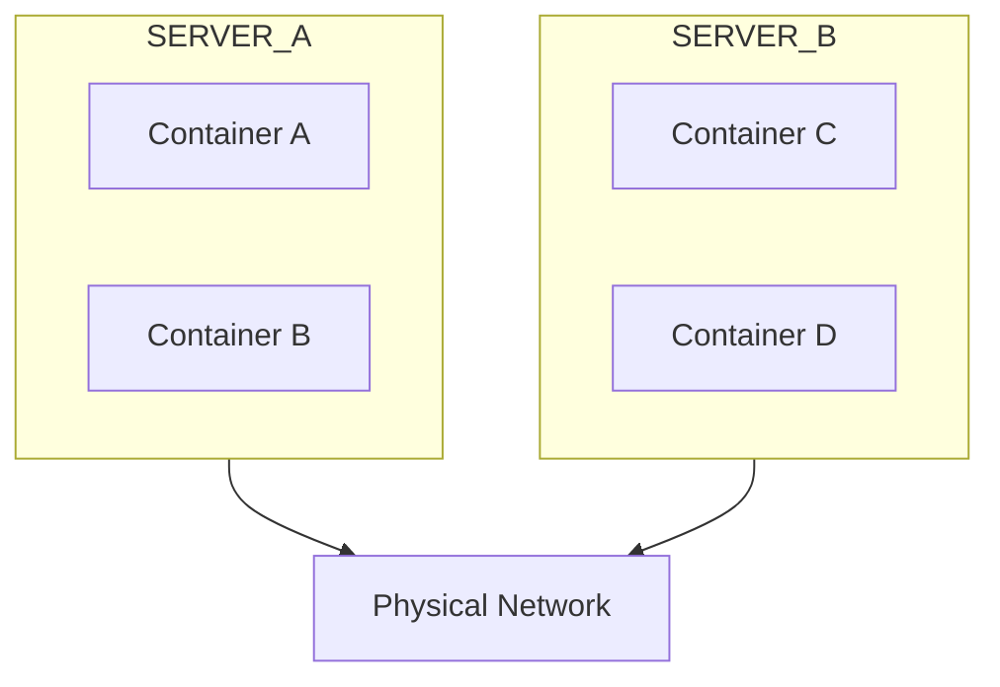

Containers are isolated per host.

---

# Enter Overlay Networking

VXLAN introduces overlay networking.

---

# Underlay vs Overlay

## Underlay

The real physical network.

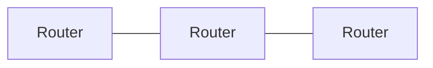

---

## Overlay

The virtual network.


Applications only see overlay.

---

# Visual Architecture

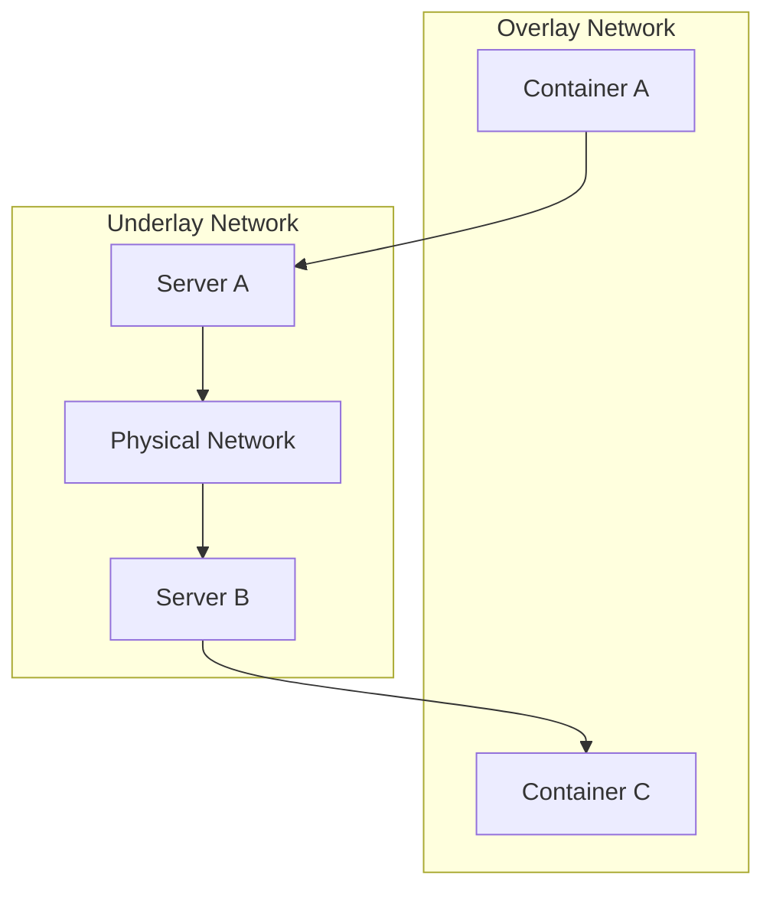

---

# Core VXLAN Components

There are 4 major components.

```mermaid
mindmap

root((VXLAN))

VTEP

VNI

Overlay

Encapsulation
```

---

# Component 1: VTEP

VTEP = VXLAN Tunnel Endpoint.

Think:

> Tunnel entrance and exit.

Every host participating in VXLAN becomes a VTEP.

---

# VTEP Architecture

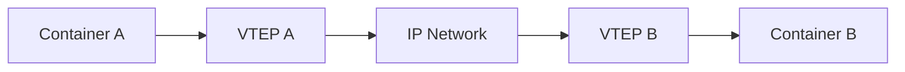

---

# Component 2: VNI

VNI = VXLAN Network Identifier.

Think:

```text
VLAN → Apartment Number

VNI → Entire Building Number
```

---

# VLAN vs VXLAN Scale

| Technology | Networks Supported |
| ---------- | ------------------ |
| VLAN       | 4094               |
| VXLAN      | 16 million         |

---

# Why VXLAN Needed Expansion

4094 VLANs are not enough for:

* AWS
* Azure
* GCP
* Kubernetes
* Multi-tenant platforms

VXLAN solved this.

---

# VNI Visual

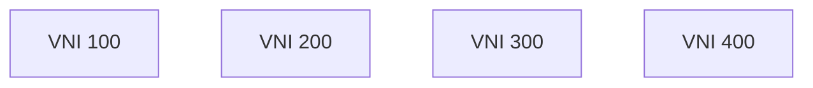

Each VNI is an independent network.

---

# Encapsulation

This is the most important concept.

Original packet:

```text
Ethernet

IP

TCP

Data
```

VXLAN wraps it.

---

# VXLAN Packet Structure

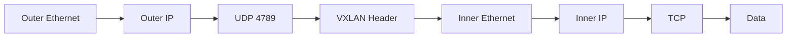

---

# Why UDP?

Because routers understand IP and UDP.

The physical network simply forwards packets.

It doesn't know about containers.

---

# End-to-End Packet Journey

Container A:

```text
10.10.1.2
```

Container C:

```text
10.10.1.3
```

Journey:

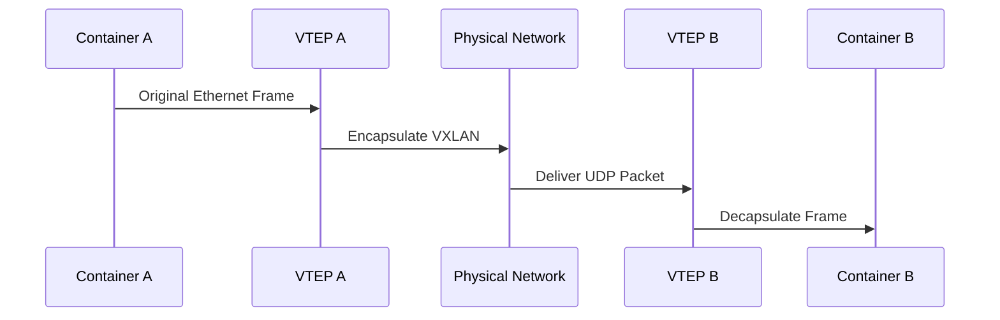

---

# Visual: Full Architecture

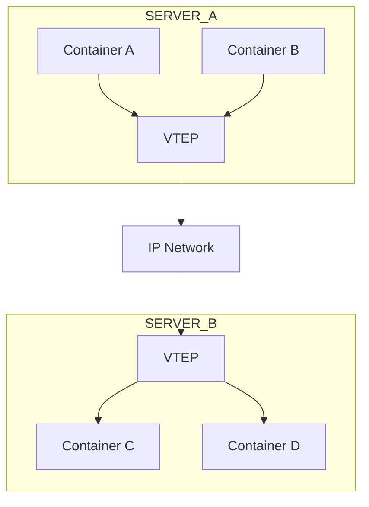

---

# Linux VXLAN Interface

Linux supports VXLAN natively.

Create interface:

```bash
sudo ip link add vxlan100 type vxlan \
id 100 \
dev eth0 \
remote 192.168.1.20 \
dstport 4789
```

Bring up:

```bash
sudo ip link set vxlan100 up
```

Verify:

```bash
ip link
```

---

# Docker Overlay Networking

Docker Swarm uses VXLAN.

Architecture:

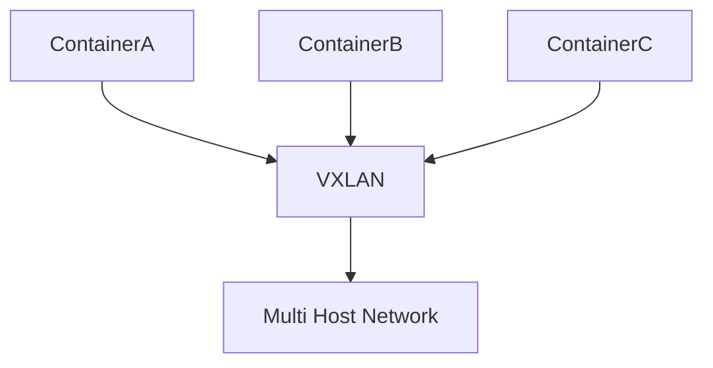

---

# Kubernetes Uses VXLAN

Many CNI plugins use VXLAN.

Examples:

```text
Flannel

Calico (optional)

Canal

OpenShift SDN
```

---

# Kubernetes Architecture

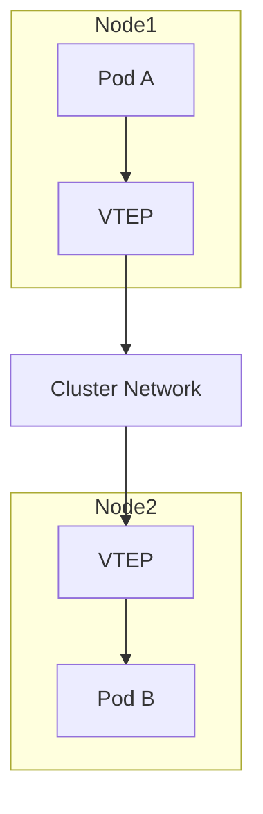

---

# Cloud Networking Relationship

Cloud providers abstract this away.

Internally:

```text
Tenant Isolation

↓

Overlay Networks

↓

Encapsulation

↓

Distributed Fabrics
```

The ideas are similar.

---

# Production Multi-Tenant Architecture

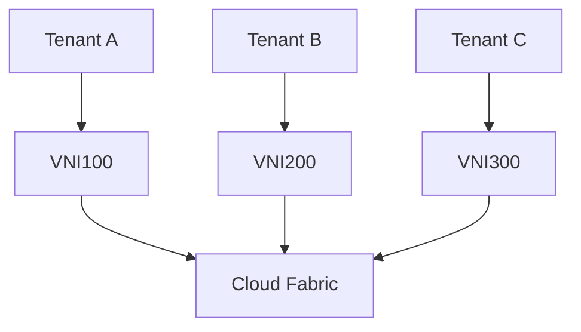

---

# Performance Tradeoff

VXLAN adds overhead.

Extra headers mean:

```text
Original Packet

+

Outer Ethernet

+

Outer IP

+

UDP

+

VXLAN Header
```

More bytes.

---

# MTU Problem

One of the most common production issues.

Example:

```text
Physical MTU = 1500

VXLAN Overhead ≈ 50 bytes
```

Recommended:

```text
1450
```

or

```text
9000 Jumbo Frames
```

depending on infrastructure.

---

# Troubleshooting Decision Tree

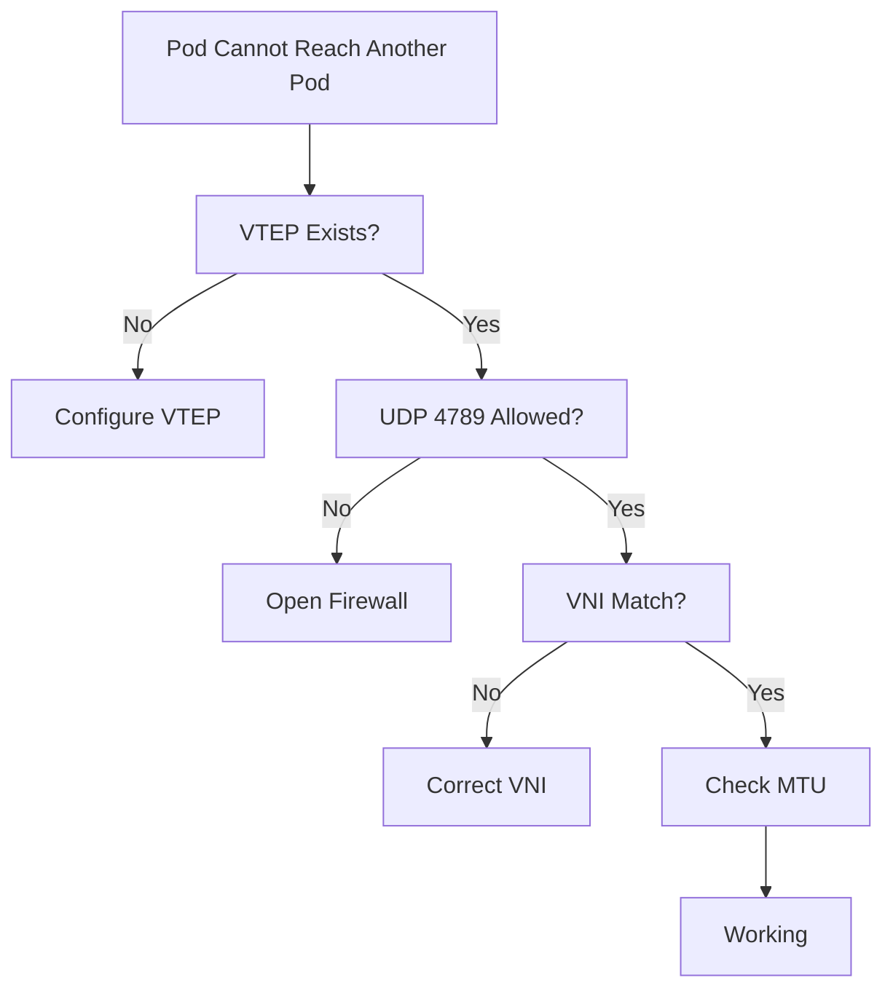

---

# Production Problems

## Problem 1

Pods communicate on same node.

Fail across nodes.

Possible causes:

```text
UDP 4789 blocked
```

---

## Problem 2

Intermittent packet loss.

Possible causes:

```text
MTU mismatch
```

---

## Problem 3

Cluster instability.

Possible causes:

```text
Wrong VNI
```

---

## Problem 4

High latency.

Possible causes:

```text
Excessive encapsulation

CPU overhead
```

---

# Essential Commands

Show interfaces:

```bash
ip link
```

Show routes:

```bash
ip route
```

Show VXLAN:

```bash
bridge fdb show
```

Show sockets:

```bash
ss -lunp
```

Capture packets:

```bash
sudo tcpdump -i eth0 udp port 4789
```

Show neighbor table:

```bash
ip neigh
```

---

# Common Misconceptions

### Misconception 1

> VXLAN replaces VLAN.

Wrong.

VXLAN extends VLAN concepts.

---

### Misconception 2

> VXLAN is Kubernetes.

Wrong.

Kubernetes can use VXLAN.

---

### Misconception 3

> Overlay networking replaces physical networking.

Wrong.

Overlay depends on underlay.

---

# Engineer Mental Model

Never think:

```text
Pod A

↓

Pod B
```

Always think:

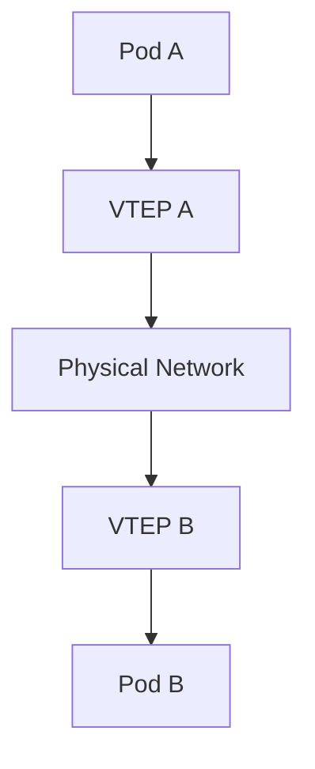

---

# Capability Checklist

After this file you should understand:

✅ Overlay networking

✅ Underlay networking

✅ VTEP

✅ VNI

✅ Encapsulation

✅ Multi-host networking

✅ Kubernetes networking foundations

✅ Production troubleshooting

