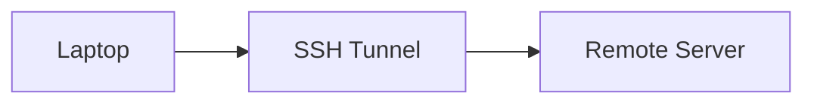
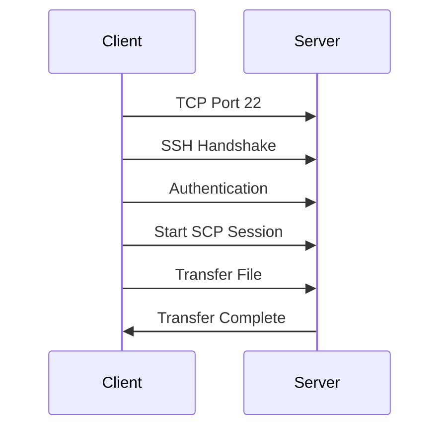
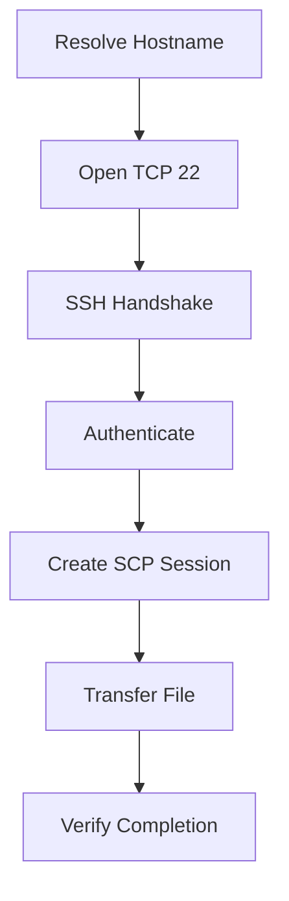
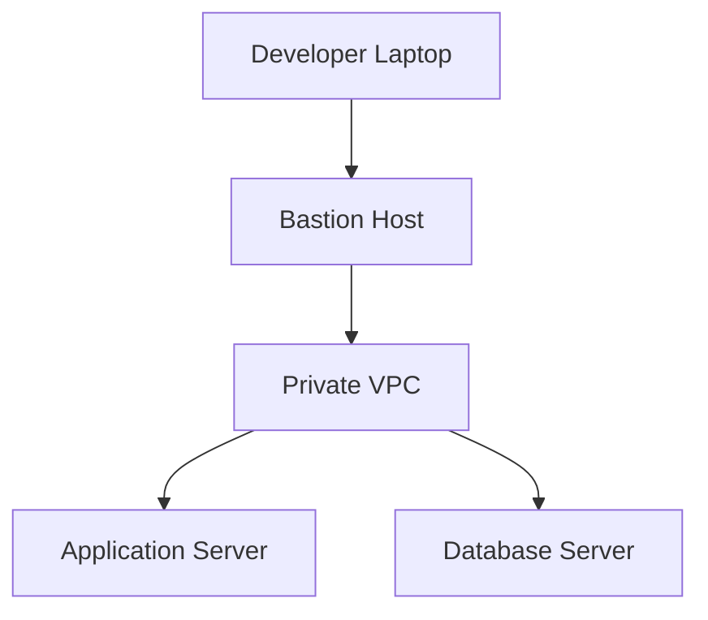
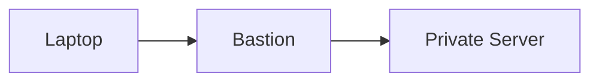
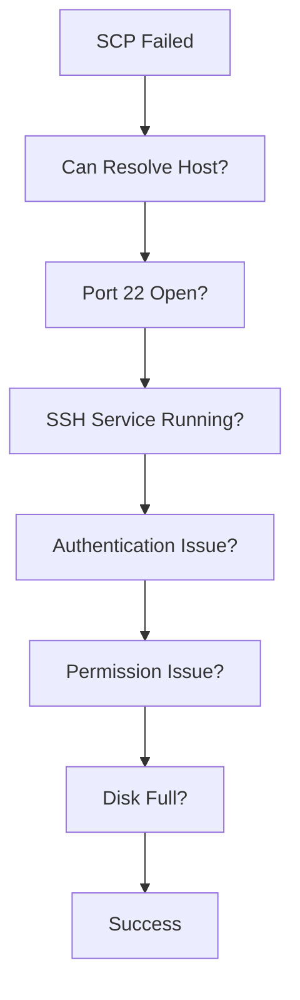

# SCP (Secure Copy Protocol)

# 1. What is SCP?

SCP (Secure Copy Protocol) is a protocol used to **securely transfer files between computers over SSH**.

Think of it as:

> **cp command + SSH encryption + remote machines**

Local copy:

```bash
cp image.jpg backup/
```

Remote copy:

```bash
scp image.jpg ubuntu@server:/backup/
```

---

# 2. Why SCP Exists

Before SCP, file transfers commonly used:

```text
FTP
TFTP
RCP
```

Problems:

```text
❌ Plaintext communication
❌ Weak authentication
❌ No encryption
❌ Vulnerable to interception
```

SCP solved this by using SSH.

Benefits:

```text
✓ Encryption

✓ Authentication

✓ Integrity

✓ Secure transport
```

---

# 3. Mental Model

SCP is **not a separate secure protocol stack**.

It rides on SSH.

```text
Application Layer
        │
       SCP
        │
       SSH
        │
       TCP
        │
        IP
```

---

# 4. Real World Usage

SCP is extremely common.

### Developers

```text
Laptop → Server
```

Upload build files.

---

### DevOps

```text
CI/CD → Production
```

Deploy artifacts.

---

### SRE

```text
Server → Laptop
```

Download logs.

---

### Security Engineers

```text
Forensic Evidence
```

Securely retrieve files.

---

### Founders

```text
Upload website assets
```

without opening insecure FTP servers.

---

# 5. Basic Architecture



---

# 6. How SCP Actually Works

Suppose:

```bash
scp app.tar.gz ubuntu@server:/opt/apps/
```

Behind the scenes:



---

# 7. Basic Syntax

General format:

```bash
scp [options] source destination
```

Pattern:

```bash
scp file user@host:/path
```

or

```bash
scp user@host:/path file
```

---

# 8. Copy Local → Remote

Example:

```bash
scp app.zip ubuntu@192.168.1.10:/home/ubuntu/
```

Visualization:

```text
Laptop
 app.zip

    │

    ▼

SSH Tunnel

    │

    ▼

Remote Server

/home/ubuntu/
```

---

# 9. Copy Remote → Local

Example:

```bash
scp ubuntu@192.168.1.10:/var/log/syslog .
```

Visualization:

```text
Remote Server

/var/log/syslog

       │

       ▼

SSH Tunnel

       │

       ▼

Laptop
```

---

# 10. Copy Remote → Remote

Possible without manually downloading.

```bash
scp server1:/file server2:/backup/
```

Visualization:


Depending on implementation and options, the transfer may pass through your local machine.

---

# 11. Copy Multiple Files

```bash
scp image.jpg video.mp4 config.yaml ubuntu@server:/uploads/
```

---

# 12. Copy Entire Directories

Use:

```bash
-r
```

Example:

```bash
scp -r project ubuntu@server:/opt/
```

Visualization:

```text
project/

├── src

├── docs

├── package.json

└── README.md

        │

        ▼

Remote Server
```

---

# 13. SCP Command Anatomy

```bash
scp -i prod.pem -P 2222 app.tar.gz ubuntu@server:/opt/
```

Breakdown:

```text
scp

-i = Identity File

-P = Port

app.tar.gz = Source

ubuntu = User

server = Host

/opt = Destination
```

---

# 14. Common Options

| Option | Meaning             |
| ------ | ------------------- |
| -r     | Recursive copy      |
| -P     | SSH port            |
| -i     | Private key         |
| -p     | Preserve timestamps |
| -C     | Compression         |
| -v     | Verbose             |
| -q     | Quiet               |

---

# 15. Use Custom SSH Port

Default:

```text
22
```

Custom:

```bash
scp -P 2222 file.txt ubuntu@server:/tmp/
```

---

# 16. Use Private Keys

Example:

```bash
scp -i ~/.ssh/prod.pem app.tar.gz ubuntu@server:/opt/
```

---

# 17. Preserve Metadata

Without:

```text
Timestamp changes
```

With:

```bash
scp -p file.txt ubuntu@server:/tmp/
```

Preserves:

```text
Timestamp

Permissions

Modification Time
```

---

# 18. Compression

Enable compression.

```bash
scp -C bigfile.tar ubuntu@server:/tmp/
```

Good for:

```text
Logs

Text files

JSON

CSV
```

Not very useful for:

```text
JPEG

PNG

ZIP

MP4
```

since they're already compressed.

---

# 19. Verbose Mode

Troubleshooting:

```bash
scp -v file.txt ubuntu@server:/tmp/
```

More debugging:

```bash
scp -vvv file.txt ubuntu@server:/tmp/
```

Shows:

```text
DNS

SSH handshake

Algorithms

Authentication

Transfer progress
```

---

# 20. Internal Workflow



---

# 21. SCP Uses SSH Authentication

Supported methods:

### Password

```text
Username

Password
```

### SSH Keys

```text
Public Key

Private Key
```

### Certificates

```text
CA Signed Certificates
```

### Hardware Tokens

```text
YubiKey

FIDO2
```

---

# 22. SSH Files Used By SCP

Client side:

```text
~/.ssh/

├── config

├── known_hosts

├── id_ed25519

└── id_ed25519.pub
```

Server side:

```text
/etc/ssh/

├── sshd_config

├── host keys
```

---

# 23. SCP + SSH Config

Instead of:

```bash
scp -i ~/.ssh/prod.pem app.tar.gz ubuntu@54.20.30.10:/opt/
```

Use:

`~/.ssh/config`

```text
Host production

HostName 54.20.30.10

User ubuntu

IdentityFile ~/.ssh/prod.pem

Port 22
```

Now:

```bash
scp app.tar.gz production:/opt/
```

Cleaner and reusable.

---

# 24. Production Architecture Example



Never expose all machines directly.

---

# 25. Bastion Copy Pattern

Instead of:

```text
Laptop

↓

Private Server
```

Use:

```text
Laptop

↓

Bastion

↓

Private Server
```

Example:

```bash
scp file.txt bastion:/tmp/
```

Then:

```bash
scp bastion:/tmp/file.txt private:/tmp/
```

---

# 26. Jump Hosts (Modern Way)

Use:

```bash
scp -o ProxyJump=bastion app.tar.gz private:/opt/
```

Visualization:



---

# 27. Bandwidth Limiting

Avoid saturating networks.

Example:

```bash
scp -l 5000 bigfile.tar server:/backup/
```

Limits bandwidth.

Useful in production.

---

# 28. Large File Transfers

Examples:

```text
Database backups

Machine learning models

Log archives

Container images
```

Be careful.

SCP is simple but may not always be optimal.

---

# 29. When NOT To Use SCP

Avoid SCP for:

```text
100,000 small files

Large synchronizations

Continuous replication

Incremental backups
```

Better alternatives:

```text
rsync

SFTP

Object Storage

Replication Systems
```

---

# 30. SCP vs CP

| Feature        | cp | scp |
| -------------- | -- | --- |
| Local Copy     | ✓  | ✓   |
| Remote Copy    | ❌  | ✓   |
| Encryption     | ❌  | ✓   |
| Authentication | ❌  | ✓   |
| Internet Safe  | ❌  | ✓   |

---

# 31. SCP vs FTP

| Feature           | FTP    | SCP    |
| ----------------- | ------ | ------ |
| Encryption        | ❌      | ✓      |
| Authentication    | Weak   | Strong |
| Firewall Friendly | Medium | Good   |
| Security          | Low    | High   |

---

# 32. SCP vs SFTP

| Feature         | SCP       | SFTP      |
| --------------- | --------- | --------- |
| Speed           | Fast      | Fast      |
| Interactive     | ❌         | ✓         |
| File Management | Limited   | Rich      |
| Resume Support  | Limited   | Better    |
| Modern Usage    | Declining | Preferred |

---

# 33. Important Modern Note

Many modern OpenSSH implementations have changed SCP behavior.

Historically:

```text
Legacy SCP Protocol
```

Modern versions often use:

```text
SFTP internally
```

for security improvements.

This is important for engineers to know.

---

# 34. Security Risks

Avoid:

### Password Authentication

```text
Weak
```

---

### Root Login

Avoid:

```text
root@server
```

---

### Open Internet Exposure

Bad:

```text
0.0.0.0:22
```

Prefer:

```text
VPN

Bastion

Zero Trust
```

---

# 35. Production Security Checklist

### Disable root

```text
PermitRootLogin no
```

---

### Disable passwords

```text
PasswordAuthentication no
```

---

### Use ED25519 keys

```bash
ssh-keygen -t ed25519
```

---

### Restrict users

```text
AllowUsers

devops

deployer

sre
```

---

### Rotate keys

Never use the same key forever.

---

# 36. CI/CD Example


Example:

```bash
scp build.tar.gz deploy@server:/opt/releases/
```

---

# 37. Modern Alternatives

Engineers increasingly use:

```text
rsync

SFTP

AWS S3

GCS

Artifact Registry

Container Registry
```

SCP remains valuable because:

```text
Simple

Available everywhere

Easy to learn

Reliable
```

---

# 38. Troubleshooting Flow



---

# 39. Useful Troubleshooting Commands

Check SSH:

```bash
ssh server
```

Check port:

```bash
nc -zv server 22
```

Check disk:

```bash
df -h
```

Check permissions:

```bash
ls -la
```

Debug:

```bash
scp -vvv file.txt server:/tmp/
```

---

# 40. Interview Questions

## Beginner

* What is SCP?
* Why does SCP use SSH?
* Difference between SCP and CP?

---

## Intermediate

* Difference between SCP and SFTP?
* Explain SCP architecture.
* Explain ProxyJump.

---

## Advanced

* Why is SCP slowly being replaced by SFTP?
* How would you securely deploy artifacts to private servers?
* How would you transfer files into a private VPC?
* How would you secure production file transfers?

---

# 41. Key Takeaways

```text
SCP = Secure Copy Protocol

SCP = File Transfer over SSH

Port = TCP 22

Best Authentication = ED25519 Keys

Production Concepts:

SSH Config

Bastion Hosts

ProxyJump

Compression

Bandwidth Limits

CI/CD Integration

Security Hardening
```
