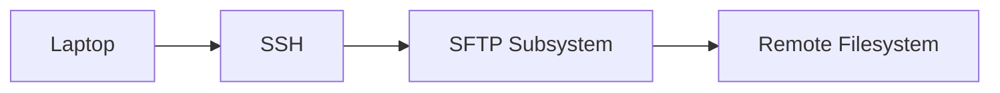
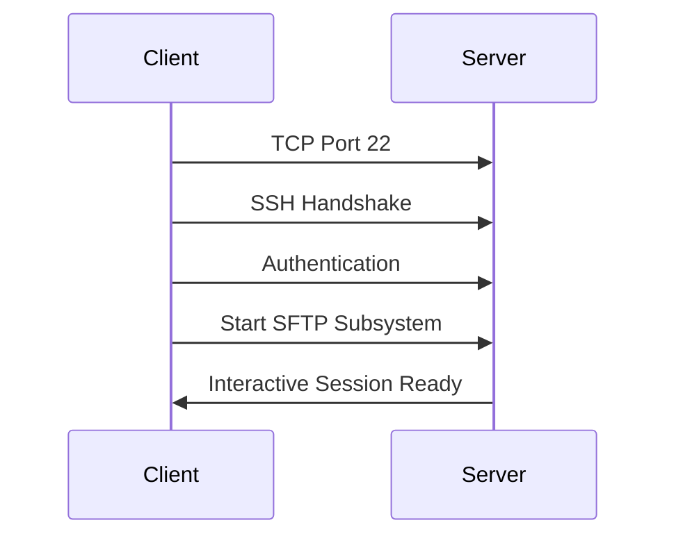
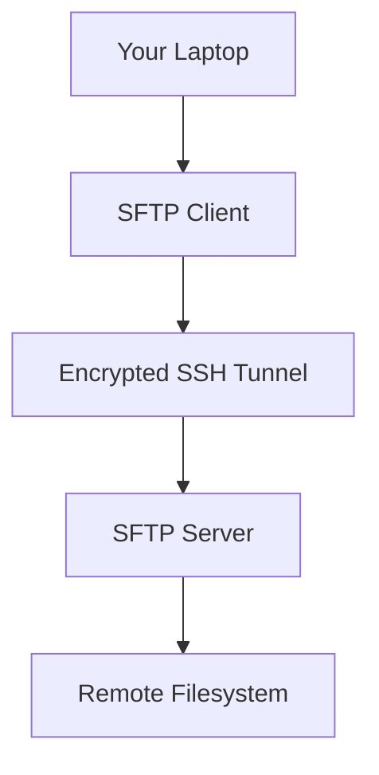
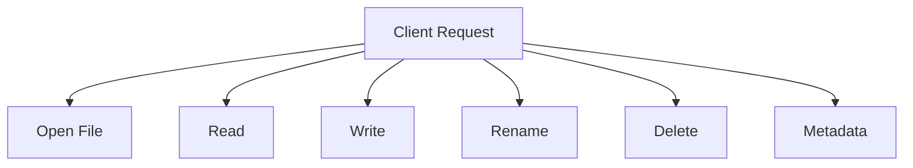
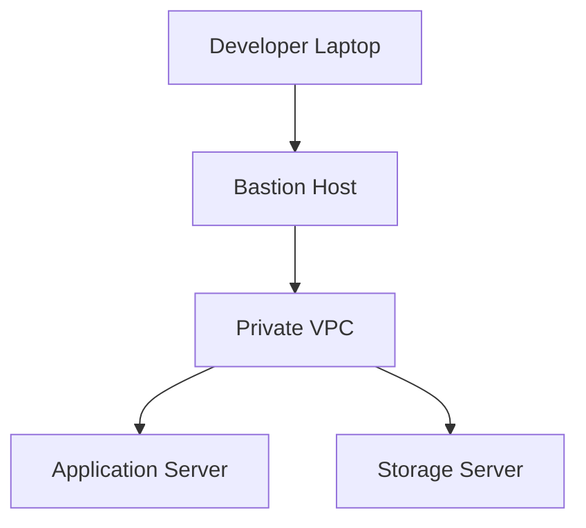
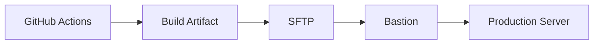
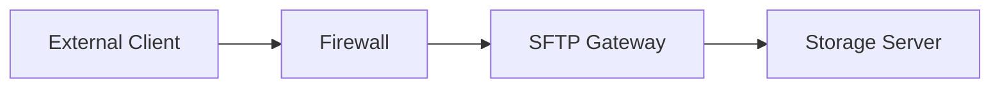
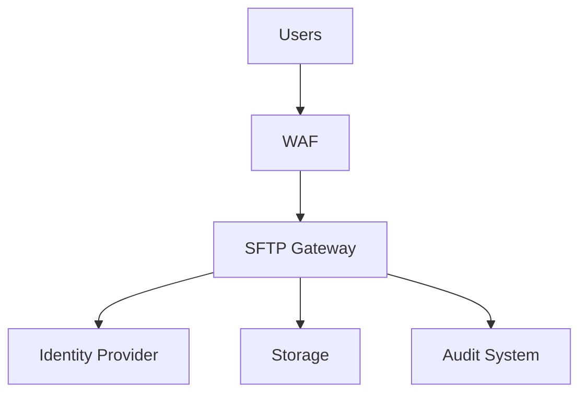
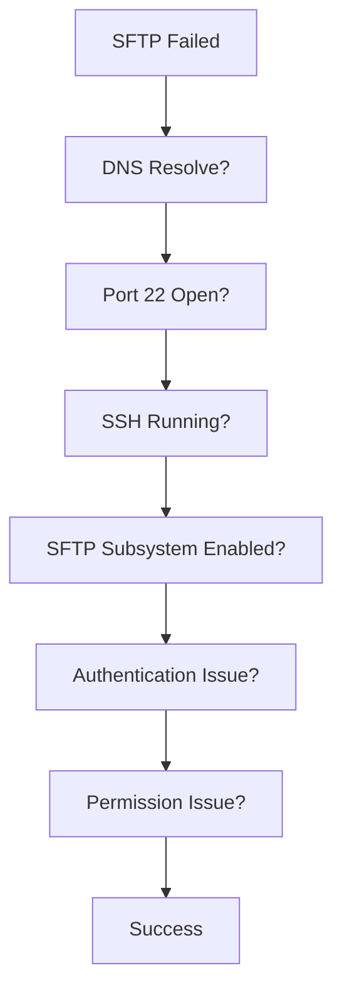

# SFTP (SSH File Transfer Protocol)

# 1. What is SFTP?

SFTP (SSH File Transfer Protocol) is a protocol used to **securely transfer, browse, manage, and manipulate files on a remote machine over SSH**.

Think of it as:

> **An encrypted remote file manager running inside SSH.**

SCP mindset:

```text
Copy files
```

SFTP mindset:

```text
Browse
Create
Delete
Rename
Move
Download
Upload
Manage files remotely
```

---

# 2. Very Important: SFTP ≠ FTP

Many beginners misunderstand this.

SFTP is NOT:

```text
Secure FTP
```

It is:

```text
SSH File Transfer Protocol
```

FTP and SFTP are completely different protocols.

```text
FTP
 ↓
Separate protocol family

SFTP
 ↓
SSH subsystem
```

---

# 3. Mental Model

Think of SFTP as opening a remote file explorer.

```text
Your Computer

    │

Encrypted SSH Tunnel

    │

Remote File System
```

---

# 4. Why SFTP Exists

SCP has limitations.

SCP is good for:

```text
Simple file copies
```

But engineers needed:

```text
✓ Browse directories

✓ Rename files

✓ Delete files

✓ Resume transfers

✓ Query metadata

✓ Better automation

✓ Interactive file management
```

Thus SFTP was created.

---

# 5. Real World Usage

### Developers

Upload application files.

```text
Laptop

↓

Server
```

---

### Backend Engineers

Manage deployments.

```text
Artifacts

↓

Application Servers
```

---

### DevOps

Transfer configs.

```text
CI/CD

↓

Infrastructure
```

---

### SRE

Collect logs.

```text
Servers

↓

Laptop
```

---

### Security Teams

Retrieve forensic data.

---

### Founders

Manage website assets.

---

# 6. Architecture



---

# 7. Protocol Stack

```text
Application Layer

SFTP

SSH

TCP

IP
```

---

# 8. How SFTP Works

Suppose:

```bash
sftp ubuntu@server
```

Behind the scenes:



---

# 9. SSH Subsystem Concept

This is one of the most important concepts.

SSH can launch subsystems.

Examples:

```text
SSH

├── Interactive Shell

├── SCP

├── SFTP

├── Port Forwarding

└── Tunneling
```

SFTP is one subsystem.

Server config:

```text
/etc/ssh/sshd_config
```

Example:

```text
Subsystem sftp /usr/lib/openssh/sftp-server
```

or

```text
Subsystem sftp internal-sftp
```

---

# 10. Basic SFTP Command

```bash
sftp ubuntu@server
```

Output:

```text
Connected to server.

sftp>
```

Now you're inside an interactive session.

---

# 11. Basic Interactive Commands

```text
pwd

lpwd

ls

lls

cd

lcd

put

get

mkdir

rmdir

rename

rm

exit
```

---

# 12. Remote vs Local Commands

Remote:

```text
pwd

ls

cd
```

Local:

```text
lpwd

lls

lcd
```

Think:

```text
l = local
```

---

# 13. Interactive Session Visual



---

# 14. Upload Files

```bash
put app.tar.gz
```

Specific location:

```bash
put app.tar.gz /opt/releases/
```

Visualization:

```text
Laptop

app.tar.gz

     │

     ▼

Remote Server

/opt/releases
```

---

# 15. Download Files

```bash
get server.log
```

Specific destination:

```bash
get server.log ./logs/
```

Visualization:

```text
Remote Server

server.log

     │

     ▼

Laptop

./logs
```

---

# 16. Multiple File Transfers

Upload:

```bash
put *.log
```

Download:

```bash
get *.csv
```

---

# 17. Recursive Transfers

Upload folders:

```bash
put -r project/
```

Download folders:

```bash
get -r backups/
```

---

# 18. File Operations

Create directory:

```bash
mkdir releases
```

Delete file:

```bash
rm app.tar.gz
```

Delete directory:

```bash
rmdir releases
```

Rename:

```bash
rename app.tar.gz app-v2.tar.gz
```

---

# 19. Internal Request Architecture

Unlike SCP, SFTP is request-based.



---

# 20. SFTP is Stateful

SCP:

```text
Copy → Disconnect
```

SFTP:

```text
Connect

↓

Interactive Session

↓

Multiple Operations

↓

Disconnect
```

This is a huge difference.

---

# 21. Modern Authentication

SFTP inherits SSH authentication.

Supported:

```text
Password

SSH Keys

Certificates

YubiKey

FIDO2
```

---

# 22. SSH Key Example

Generate:

```bash
ssh-keygen -t ed25519
```

Connect:

```bash
sftp ubuntu@server
```

Or:

```bash
sftp -i ~/.ssh/prod.pem ubuntu@server
```

---

# 23. Use SSH Config

Instead of:

```bash
sftp -i ~/.ssh/prod.pem ubuntu@54.20.30.10
```

Create:

```text
~/.ssh/config
```

```text
Host production

HostName 54.20.30.10

User ubuntu

IdentityFile ~/.ssh/prod.pem
```

Now:

```bash
sftp production
```

Much cleaner.

---

# 24. Production Architecture



---

# 25. Bastion Access

Modern infrastructure often looks like:

```text
Laptop

↓

Bastion

↓

Private Servers
```

Example:

```bash
sftp -o ProxyJump=bastion private-server
```

---

# 26. CI/CD Example



---

# 27. Why Many Enterprises Prefer SFTP

Because it supports:

```text
✓ Better automation

✓ Fine-grained access

✓ Resume capability

✓ Interactive operations

✓ Rich metadata

✓ Auditing
```

---

# 28. Chroot Jail

Very common in production.

Users are restricted.

Visualization:

```mermaid
flowchart TD

A[User]

B[/sftp]

C[/uploads]

D[/reports]

A --> B

B --> C

B --> D
```

Cannot escape.

Server config:

```text
ChrootDirectory /sftp/%u
```

---

# 29. Restrict User to SFTP Only

Example:

```text
Match User sftpuser

ForceCommand internal-sftp

PasswordAuthentication no

PermitTTY no

AllowTcpForwarding no
```

This is extremely common.

---

# 30. Secure File Sharing Architecture



Very common in enterprises.

---

# 31. Performance Factors

Transfer speed depends on:

```text
Network latency

Bandwidth

Disk speed

CPU encryption overhead

Compression

File count
```

---

# 32. Small Files Problem

100,000 files:

```text
❌ Slow
```

Because every file creates operations.

Better:

```bash
tar -czf backup.tar.gz project/

put backup.tar.gz
```

---

# 33. Compression Strategy

Compress first.

```bash
tar -czf release.tar.gz release/
```

Transfer:

```bash
put release.tar.gz
```

Extract remotely.

---

# 34. SFTP vs SCP

| Feature             | SCP       | SFTP      |
| ------------------- | --------- | --------- |
| Simple Copy         | ✓         | ✓         |
| Interactive Session | ❌         | ✓         |
| File Management     | ❌         | ✓         |
| Resume Support      | Limited   | Better    |
| Metadata            | Limited   | Rich      |
| Modern Usage        | Declining | Preferred |

---

# 35. SFTP vs FTP

| Feature           | FTP  | SFTP   |
| ----------------- | ---- | ------ |
| Encryption        | ❌    | ✓      |
| Authentication    | Weak | Strong |
| Port Complexity   | High | Low    |
| Firewall Friendly | Poor | Good   |
| Security          | Low  | High   |

---

# 36. SFTP vs SMB

| Feature           | SFTP      | SMB       |
| ----------------- | --------- | --------- |
| Internet Friendly | ✓         | ❌         |
| Encryption        | ✓         | Depends   |
| Remote Access     | Excellent | Limited   |
| Enterprise LAN    | Good      | Excellent |

---

# 37. Security Best Practices

Disable root login.

```text
PermitRootLogin no
```

Disable passwords.

```text
PasswordAuthentication no
```

Use keys.

```text
ED25519
```

Restrict users.

```text
AllowUsers deployer

sftpuser

devops
```

Enable auditing.

Use bastion hosts.

---

# 38. Enterprise SFTP Architecture



---

# 39. Troubleshooting Flow



---

# 40. Useful Troubleshooting Commands

Check SSH:

```bash
ssh server
```

Check port:

```bash
nc -zv server 22
```

Check subsystem:

```bash
grep Subsystem /etc/ssh/sshd_config
```

Check logs:

Ubuntu:

```bash
sudo journalctl -u ssh
```

RHEL:

```bash
sudo journalctl -u sshd
```

Debug:

```bash
sftp -vvv server
```

---

# 41. Real World Examples

### Upload release

```bash
sftp production

put app.tar.gz
```

---

### Download logs

```bash
get nginx.log
```

---

### Upload backups

```bash
put db-backup.tar.gz
```

---

### Retrieve forensic evidence

```bash
get suspicious.log
```

---

# 42. Interview Questions

## Beginner

* What is SFTP?
* Is SFTP the same as FTP?
* Why does SFTP use SSH?

---

## Intermediate

* Difference between SCP and SFTP?
* Explain the SFTP subsystem.
* Why is SFTP stateful?

---

## Advanced

* How would you secure enterprise file sharing?
* Explain Chroot Jail.
* How would you build an SFTP gateway architecture?
* Why are enterprises replacing SCP with SFTP?

---

# 43. Key Takeaways

```text
SFTP = SSH File Transfer Protocol

SFTP ≠ FTP

SFTP runs inside SSH

Port = TCP 22

SFTP = Interactive Remote File Manager

Production Concepts:

SSH Config

Bastion Hosts

ProxyJump

Chroot Jail

Auditing

Identity Integration

Gateway Architectures
```
