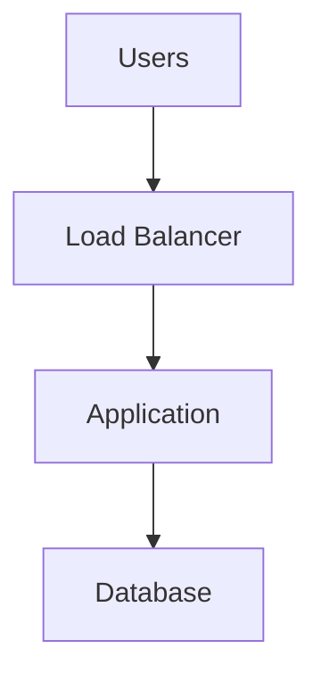
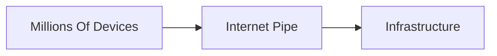
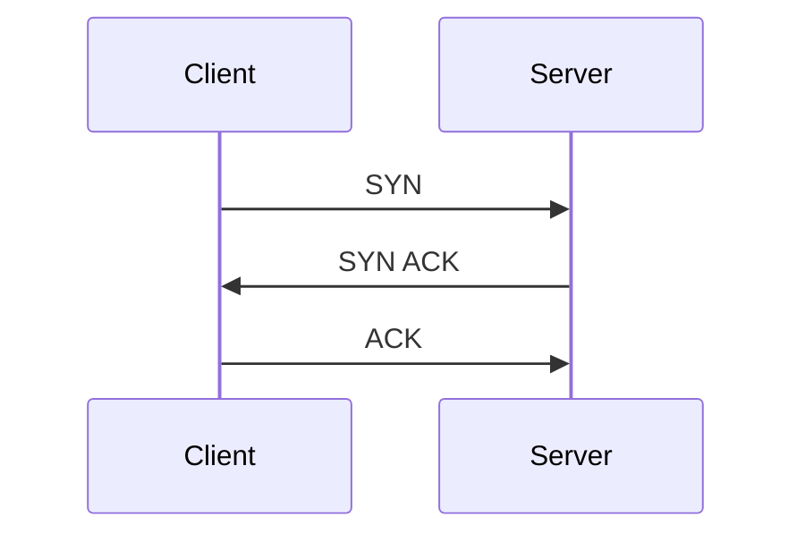
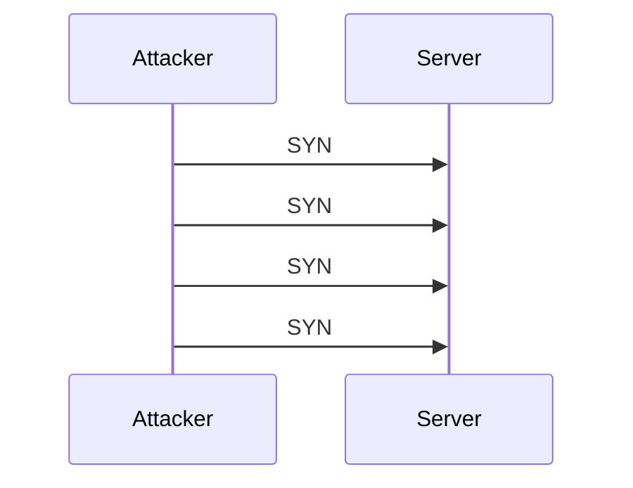
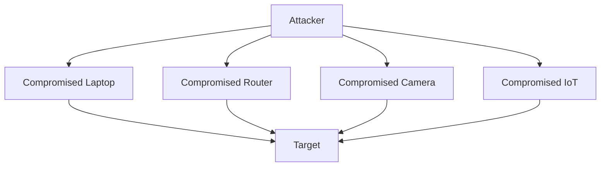
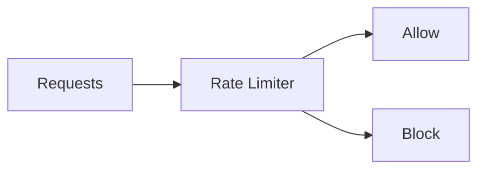
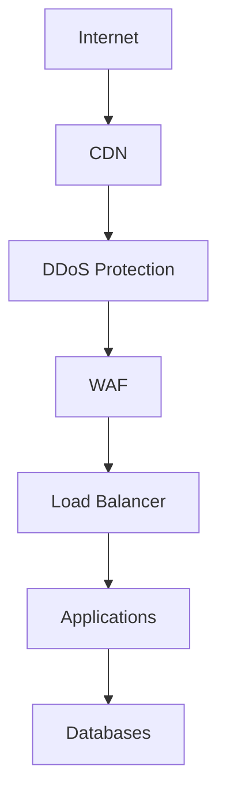
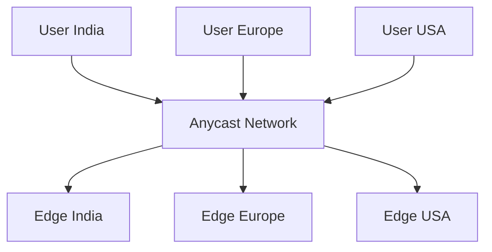
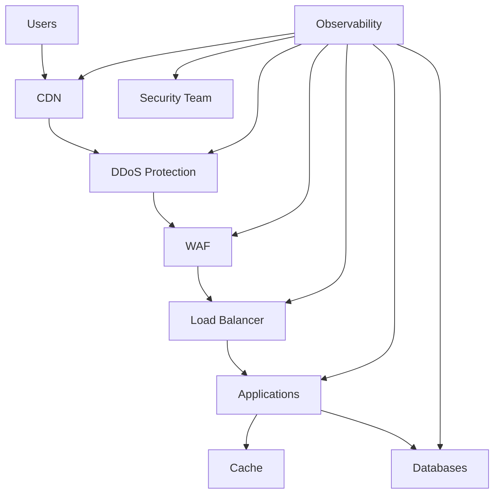

# DDoS Internals

# 1. Why This File Is Extremely Important

Imagine tomorrow your startup becomes successful.

Your application receives:

```text
10 users

↓

100 users

↓

1000 users

↓

100000 users
```

Amazing.

Then suddenly this happens.

```text
50 million requests

↓

30 seconds
```

Your application crashes.

Question:

> Did your application become famous?

Maybe.

Question:

> Or are you under attack?

This is the world of DDoS.

---

# 2. First Principle: The Internet Is An Open System

The internet was built for communication.

Not security.

Anybody can send requests.

This is both powerful and dangerous.

Question:

> How do we know whether traffic is legitimate?

This is one of the hardest problems on the internet.

---

# 3. What Is DDoS?

DDoS stands for:

> Distributed Denial of Service

Break it down.

Distributed:

```text
Many machines
```

Denial:

```text
Deny access
```

Service:

```text
Target application
```

Combined:

> Many machines overwhelming a service until legitimate users cannot use it.

---

# 4. Why Is It Called Distributed?

Suppose one laptop attacks you.

```text
Laptop

↓

Website
```

Easy to block.

Now imagine:

```text
100000 devices

↓

Website
```

Much harder.

Distributed systems create distributed attacks.

---

# 5. Mental Model: Restaurant Analogy

Imagine a restaurant.

Capacity:

```text
50 seats
```

Normal customers:

```text
45 customers

↓

Works fine
```

Attackers:

```text
10000 fake customers

↓

No seats left
```

Real customers cannot enter.

Nothing broke technically.

Resources were exhausted.

---

# 6. The Core Idea Behind DDoS

Attackers rarely hack systems.

Often they simply exhaust resources.

Question:

> What resources?

Many.

---

# 7. Every System Has Limits

Resources include:

```text
CPU

Memory

Bandwidth

Connections

Threads

Processes

Disk

Database Connections
```

DDoS attacks target limits.

---

# 8. Attackers Love Bottlenecks

Imagine this infrastructure.



Question:

> What is weakest?

Attackers search for bottlenecks.

---

# 9. The Internet Is A Giant Queueing System

Everything is a queue.

Examples:

```text
CPU Queue

Connection Queue

Request Queue

Database Queue

Thread Queue
```

DDoS overwhelms queues.

---

# 10. Understanding Capacity

Suppose:

Application capacity:

```text
1000 requests/sec
```

Normal:

```text
500 requests/sec
```

Good.

Attack:

```text
500000 requests/sec
```

Problem.

---

# 11. Why Applications Crash

People think:

```text
DDoS

↓

Server exploded
```

Wrong.

Usually:

Resources become unavailable.

Examples:

```text
CPU exhausted

Memory exhausted

Sockets exhausted

Bandwidth exhausted
```

---

# 12. The Four Major DDoS Categories

This is extremely important.

```text
Volumetric Attacks

Protocol Attacks

Application Attacks

Resource Exhaustion Attacks
```

Memorize these.

---

# 13. Volumetric Attacks

Goal:

> Consume bandwidth.

Imagine:

```text
100 Gbps

↓

1000 Gbps attack
```

Internet pipe fills up.

Nothing else matters.

---

# 14. Volumetric Visualization



The pipe becomes saturated.

---

# 15. Protocol Attacks

Target networking protocols.

Examples:

```text
TCP

UDP

DNS

ICMP
```

Goal:

> Exhaust networking infrastructure.

---

# 16. Application Layer Attacks

Target business logic.

Examples:

```text
Login

Search

Checkout

AI Endpoints

Export Systems
```

These attacks are sneaky.

---

# 17. Resource Exhaustion Attacks

Goal:

> Exhaust expensive resources.

Examples:

```text
Threads

Database Pools

Memory

Workers
```

---

# 18. Understanding TCP Handshake Again

Remember:



Normal communication.

---

# 19. SYN Flood Attack

Attackers exploit this.



No final ACK.

Server waits.

Resources fill.

---

# 20. Why SYN Flood Is Dangerous

Servers allocate resources.

Example:

```text
Memory

Connection Tracking

Queues
```

Thousands of half-open connections become expensive.

---

# 21. UDP Flood

UDP is connectionless.

Attackers exploit simplicity.

```text
Millions of packets

↓

Server overwhelmed
```

---

# 22. HTTP Flood Attack

This is extremely common.

Attack:

```text
GET /

GET /products

GET /login

GET /search
```

Millions of times.

Infrastructure struggles.

---

# 23. Why Search Endpoints Are Dangerous

Search is expensive.

Example:

```text
User

↓

Application

↓

Database

↓

Ranking

↓

Response
```

Attackers target expensive endpoints.

---

# 24. AI Systems Create New Risks

Imagine AI.

```text
Prompt

↓

LLM

↓

Vector Database

↓

Response
```

AI is expensive.

Attackers know this.

---

# 25. The Botnet Problem

Question:

> Where do attackers get millions of devices?

Answer:

Botnets.

Botnet means:

> Compromised devices controlled remotely.

---

# 26. Botnet Visualization



Millions of devices may participate.

---

# 27. Why IoT Devices Are Dangerous

Many devices have poor security.

Examples:

```text
Cameras

Routers

Smart TVs

Sensors
```

Attackers exploit weak devices.

---

# 28. Why Cloud Changed Everything

Cloud scales.

Attackers scale too.

Question:

> Can auto-scaling save us?

Sometimes.

But attackers can scale faster.

---

# 29. The Auto Scaling Trap

Attack:

```text
Traffic Increases

↓

Cloud Creates More Servers

↓

Attack Continues

↓

Huge Bill
```

This is dangerous.

---

# 30. This Is Called Economic DDoS

Goal:

> Make infrastructure expensive.

Not just unavailable.

Very important modern concept.

---

# 31. Why DDoS Is Difficult

Question:

> Can we simply block attackers?

Problem:

Attackers look like users.

Example:

```text
Real Browser

Real IP

Real Device
```

Detection becomes difficult.

---

# 32. Human Traffic vs Bot Traffic

This is one of the hardest problems.

Human:

```text
Read

Think

Click
```

Bot:

```text
Instant

Repeated

Automated
```

Systems look for patterns.

---

# 33. Rate Limiting Is Extremely Important

Question:

> How many requests are acceptable?

Examples:

```text
5/sec

50/minute

1000/hour
```

Limits protect infrastructure.

---

# 34. Rate Limiting Visualization



This is one of the strongest protections.

---

# 35. Layered DDoS Defense

Never use one system.

Use many.



Layers matter.

---

# 36. Why CDNs Are Amazing

CDNs distribute traffic.

Instead of:

```text
1 server
```

You get:

```text
100s of edge servers
```

Attack becomes harder.

---

# 37. Anycast Networking (Very Important)

Multiple servers share one IP.

Traffic goes to nearest server.

Visualization:



Large providers use this heavily.

---

# 38. Observability During DDoS

Monitor:

```text
Traffic

Bandwidth

CPU

Latency

Error Rate

Connection Count
```

Everything matters.

---

# 39. Attack Detection Signals

Look for:

```text
Traffic spikes

Geographic anomalies

Request repetition

Connection spikes

Error spikes
```

Patterns matter.

---

# 40. Linux Under DDoS

Linux struggles with:

```text
Sockets

conntrack

Memory

CPU

Interrupts
```

Networking internals become important.

---

# 41. Engineering Thinking Framework

Ask these questions.

```text
What resource can attackers exhaust?

What is my bottleneck?

What is expensive?

Can I cache it?

Can I rate limit it?

Can I distribute it?
```

These six questions are incredibly powerful.

---

# 42. Modern Production Architecture

Study this multiple times.



---

# 43. Common Beginner Mistakes

### Mistake 1

DDoS = Hacking

Wrong.

---

### Mistake 2

More servers solve DDoS.

Wrong.

---

### Mistake 3

Auto scaling solves everything.

Wrong.

---

### Mistake 4

Only big companies get attacked.

Wrong.

---

### Mistake 5

Ignore rate limiting.

Very wrong.

---

# 44. Interview Questions

## Beginner

* What is DDoS?
* Why is it dangerous?

## Intermediate

* Explain SYN flood.
* Explain HTTP flood.
* Explain botnets.

## Advanced

* Design DDoS-resistant architecture.
* Explain Anycast.
* Explain economic DDoS.

---

# 45. Master Takeaways

```text
DDoS = Resource Exhaustion

Protect:

Bandwidth

CPU

Memory

Connections

Databases

AI Systems

Use Layers:

CDN

DDoS Protection

WAF

Load Balancer

Caching

Rate Limiting

Observability

Remember:

Everything Has Limits
```
