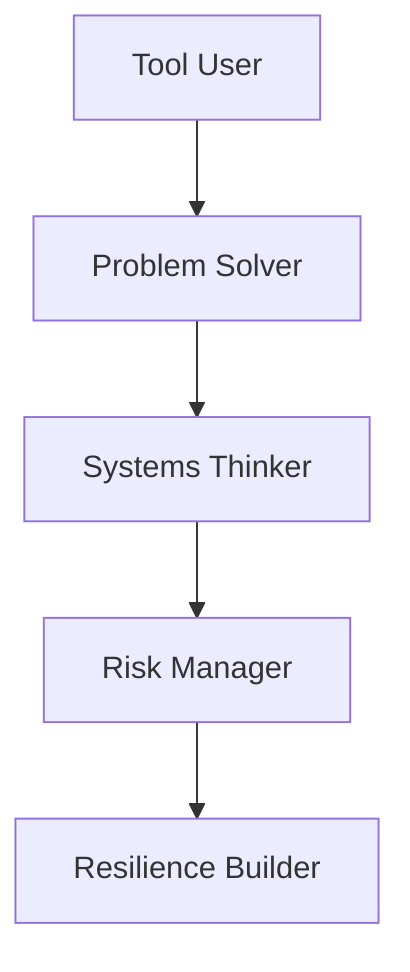
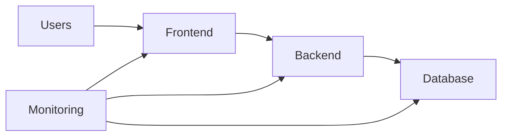
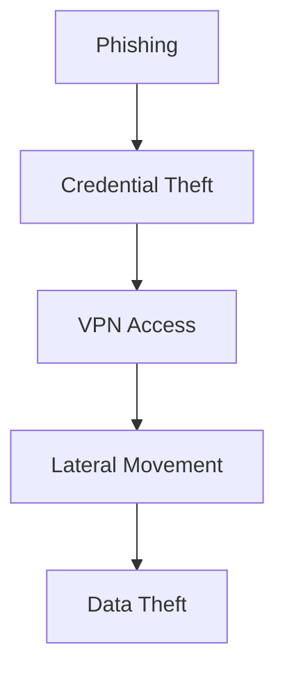
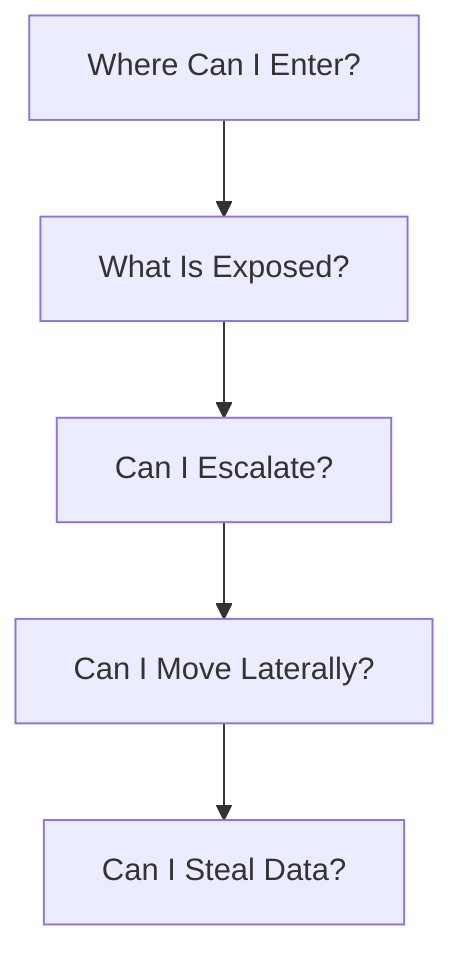
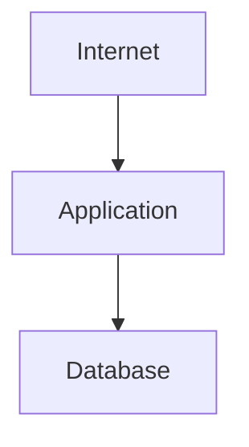
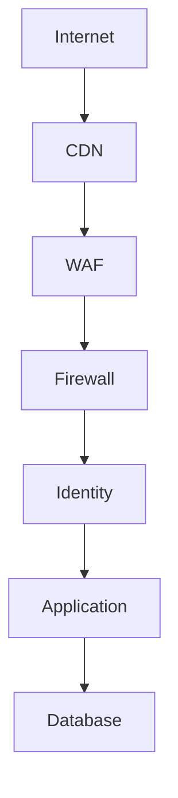
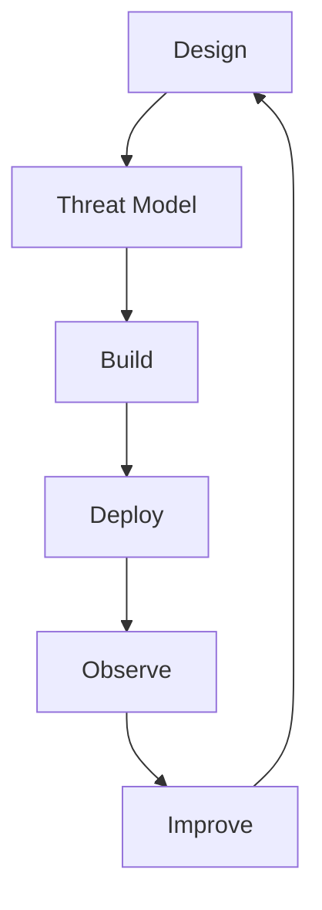
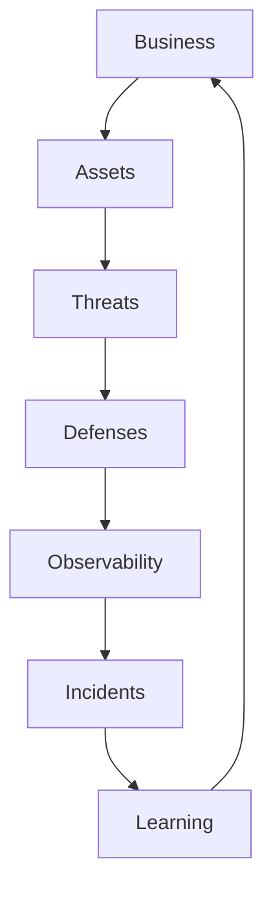
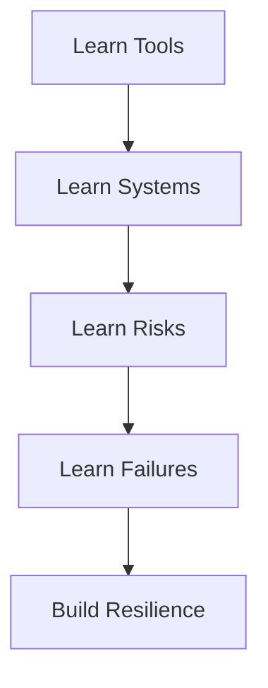

# Engineering Security Mindset

# 1. Why This File Is Extremely Important

Most beginners think engineering looks like this.

```text
Learn Linux

↓

Learn Networking

↓

Learn Docker

↓

Learn Kubernetes

↓

Learn Security
```

Professional engineers think differently.

They think:

```text
Understand Systems

↓

Understand Risks

↓

Understand Failures

↓

Understand Humans

↓

Build Resilient Systems
```

Security is not a department.

Security is a way of thinking.

---

# 2. The Biggest Lie Beginners Learn

Beginners often learn:

> Build features first. Add security later.

This creates fragile systems.

Professional engineers do this instead.

```text
Think

↓

Design

↓

Threat Model

↓

Build

↓

Deploy

↓

Observe

↓

Improve
```

Security starts before code exists.

---

# 3. The Engineer Maturity Pyramid

Study this carefully.



This is one of the most important diagrams in the repository.

---

# 4. Security Is Mostly About Asking Better Questions

Junior engineers ask:

> Which firewall should we use?

Senior engineers ask:

> Why do we need a firewall?

Architects ask:

> What problem are we trying to solve?

Always ask better questions.

---

# 5. Security Is Risk Management

This sentence changes everything.

Security is not:

```text
Eliminate Risk
```

Impossible.

Security is:

```text
Understand Risk

↓

Reduce Risk

↓

Detect Risk

↓

Contain Risk

↓

Recover From Risk
```

---

# 6. Think Like A Doctor

Doctors don't say:

```text
Humans never get sick.
```

Doctors assume:

```text
Humans will eventually get sick.
```

Then they prepare.

Security works exactly the same way.

Assume problems will happen.

---

# 7. Security Is A Probability Game

Stop thinking:

```text
Secure

Insecure
```

Instead think:

```text
Low Risk

Medium Risk

High Risk
```

Security is probabilities.

Not absolutes.

---

# 8. The Security Equation

Memorize this.

```text
Risk

=

Probability

×

Impact
```

Questions:

```text
How likely?

How damaging?
```

Both matter.

---

# 9. Think In Systems, Not Components

Beginners think:

```text
Database

API

Server
```

Professionals think:



Systems matter.

Not isolated components.

---

# 10. Everything Is Connected

This is one of the biggest engineering truths.

Suppose:

```text
Database Slow
```

Consequences:

```text
↓

Application Slow

↓

Users Retry

↓

Traffic Increases

↓

Servers Overload

↓

Outage
```

Small failures create large failures.

---

# 11. Learn To See Chains

Bad engineers see events.

Great engineers see chains.

Example:



Security is breaking chains.

---

# 12. Always Ask "Then What?"

This is a superpower.

Example:

```text
Database Exposed
```

Then what?

```text
↓

Data Leak
```

Then what?

```text
↓

Customers Impacted
```

Then what?

```text
↓

Trust Lost
```

Then what?

```text
↓

Business Impacted
```

Always ask:

> Then what?

---

# 13. Security Is A Business Function

Companies are not protecting servers.

Companies are protecting:

```text
Customers

Money

Trust

Data

Reputation

Operations
```

Technology exists to support business.

---

# 14. Think Like Attackers

Question:

> If I were an attacker, where would I go first?

Usually not databases.

Usually:

```text
Humans

Credentials

Misconfigurations
```

Attackers prefer easy targets.

---

# 15. Attackers Are Economists

Attackers optimize:

```text
Effort

Time

Money

Risk
```

They seek the easiest path.

You are trying to make attacks expensive.

---

# 16. The Security Funnel

Every attacker asks:



Think like this.

---

# 17. Build For Failure

This is one of the most important engineering lessons.

Question:

> What if this fails?

Always ask it.

Examples:

```text
What if database fails?

What if DNS fails?

What if cloud fails?

What if credentials leak?
```

Failure thinking is elite engineering.

---

# 18. Build For Humans

Humans make mistakes.

Always.

Question:

> How can I make mistakes less dangerous?

This is huge.

---

# 19. Assume Human Error

Humans will:

```text
Leak credentials

Misconfigure systems

Deploy bugs

Click phishing links

Forget renewals
```

This is normal.

Don't build systems expecting perfection.

---

# 20. Great Systems Tolerate Mistakes

Bad systems:

```text
One mistake

↓

Catastrophe
```

Good systems:

```text
One mistake

↓

Contained Damage
```

---

# 21. Blast Radius Is Everything

Question:

> If something breaks, how much breaks?

Bad:

```text
Entire company
```

Good:

```text
One isolated service
```

Reduce blast radius everywhere.

---

# 22. Learn To See Trust Boundaries

Question:

> Where does trust change?

Example:



Boundaries:

```text
Internet → Application

Application → Database
```

Verification increases at boundaries.

---

# 23. Never Trust Internal Networks

This is old thinking.

```text
Internal

↓

Trusted
```

Modern thinking:

```text
Internal

↓

Verify Anyway
```

Zero trust exists because of this.

---

# 24. Learn To Think In Layers

Never build:

```text
One Security Tool
```

Build:

```text
Multiple Security Layers
```

---

# 25. Defense In Depth Visual



Every layer buys time.

---

# 26. Security Is A Time Game

This is one of the biggest lessons.

Engineers optimize time.

Three goals:

```text
Detect Faster

Respond Faster

Recover Faster
```

Time matters.

---

# 27. Observe Everything

Question:

> Can we protect systems we cannot see?

No.

Observe:

```text
Users

Networks

Applications

Servers

Databases
```

Visibility is mandatory.

---

# 28. Logs Are Stories

Don't memorize logs.

Think:

```text
Logs

↓

Stories
```

Stories answer:

```text
Who?

What?

When?

Where?

Why?
```

---

# 29. Great Engineers Think In Tradeoffs

Every decision has costs.

Example:

More security.

Benefits:

```text
Safer
```

Costs:

```text
Complexity

Performance

Developer Experience
```

Tradeoffs exist everywhere.

---

# 30. Simplicity Is A Security Feature

This is a huge lesson.

Complexity creates:

```text
Confusion

Misconfigurations

Blind Spots

Incidents
```

Simple systems are often safer.

---

# 31. Complexity Is An Attack Surface

This sentence is extremely important.

More systems:

```text
↓

More Configurations

↓

More Risks
```

Complexity itself becomes dangerous.

---

# 32. Great Engineers Think In Lifecycles

Everything follows a lifecycle.



The loop never ends.

---

# 33. Learn To Think In Feedback Loops

Question:

> How do we continuously improve?

Example:

```text
Incident

↓

Learn

↓

Improve

↓

Prevent

↓

Observe
```

Great systems learn.

---

# 34. Security Is Everybody's Responsibility

Not:

```text
Security Team Problem
```

Everyone participates.

```text
Frontend Engineers

Backend Engineers

DevOps

SRE

Founders

Security Engineers

Platform Engineers
```

---

# 35. The Six Golden Questions

Memorize these forever.

Whenever building anything ask:

```text
What am I protecting?

Who needs access?

Who should never access?

What can go wrong?

How do I detect it?

How do I recover?
```

This framework is extremely powerful.

---

# 36. The Senior Engineer Framework

Senior engineers repeatedly ask:

```text
What is the bottleneck?

What is the blast radius?

What is the weakest link?

What happens if this fails?

How do we observe it?

How do we recover?
```

These six questions are a superpower.

---

# 37. The Architect Framework

Architects repeatedly ask:

```text
Can we simplify this?

Can we isolate this?

Can we automate this?

Can we monitor this?

Can we recover this?

Can we scale this?
```

Different mindset.

---

# 38. The Founder Framework

Founders should repeatedly ask:

```text
What hurts customers?

What hurts trust?

What hurts revenue?

What hurts operations?

What is expensive to recover?
```

Business always matters.

---

# 39. Master Security Thinking Diagram

Study this multiple times.



This cycle never stops.

---

# 40. Engineering Growth Journey



This is how elite engineers evolve.

---

# 41. Common Beginner Mistakes

### Mistake 1

Memorizing tools.

Wrong.

---

### Mistake 2

Ignoring systems thinking.

Wrong.

---

### Mistake 3

Ignoring business impact.

Wrong.

---

### Mistake 4

Building first.

Securing later.

Wrong.

---

### Mistake 5

Trusting everything.

Wrong.

---

# 42. Interview Questions

## Beginner

* What is security mindset?
* Why is security everybody's responsibility?

## Intermediate

* Explain blast radius.
* Explain trust boundaries.
* Explain defense in depth.

## Advanced

* Explain engineering tradeoffs.
* Explain resilience engineering.
* Explain how senior engineers think differently.

---

# 43. Master Takeaways

```text
Great Engineers:

Think In Systems

Think In Risks

Think In Chains

Think In Failures

Think In Tradeoffs

Think In Recovery

Think In Feedback Loops

Remember:

Security Is Not A Tool

Security Is A Way Of Thinking
```
