# firewall-basics.md

> Repository: Networking Complete Fundamentals
>
> Section: Security
>
> Audience: Beginners → Backend Engineers → DevOps → SRE → Security Engineers → Platform Engineers → Founders
>
> Goal: Build a deep understanding of firewalls from first principles to production systems.

---

# Firewall Basics

# 1. What is a Firewall?

A firewall is a **traffic filtering system**.

It decides:

> **Who can enter, who can leave, and who gets blocked.**

Think of a firewall as a security guard.

```text
Internet

 ↓

Security Guard

 ↓

Your Systems
```

It examines traffic and applies rules.

---

# 2. Why Firewalls Exist

Without firewalls:

```text
Internet

↓

Everything can reach everything
```

Attackers could:

```text
Scan ports

Exploit vulnerabilities

Brute force passwords

Spread malware

Move laterally
```

Firewalls reduce attack surface.

---

# 3. Real World Analogy

Imagine an office building.

```text
Building

↓

Reception Desk

↓

Employees
```

The receptionist decides:

```text
Allow employees

Allow visitors

Reject strangers
```

Firewalls do the same.

---

# 4. Mental Model

Every network packet arrives at a gate.

Firewall asks:

```text
Who are you?

Where are you coming from?

Where are you going?

What protocol?

What port?

Is this allowed?
```

Decision:

```text
ALLOW

DENY

DROP

REJECT
```

---

# 5. High Level Architecture

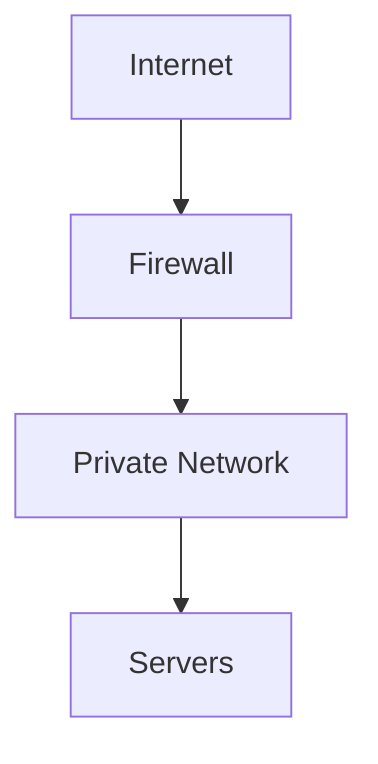

---

# 6. Firewalls Are Everywhere

Most people think:

```text
Firewall = One Device
```

Wrong.

Firewalls exist everywhere.

```text
Laptop

OS

Router

Cloud

Kubernetes

Datacenter

API Gateway
```

---

# 7. Firewall Layers

```text
Physical Layer

↓

Network Firewall

↓

Host Firewall

↓

Application Firewall

↓

API Security
```

Each protects different things.

---

# 8. Types of Firewalls

```text
Packet Filtering

Stateful Firewall

Proxy Firewall

Next Generation Firewall (NGFW)

Web Application Firewall (WAF)

Cloud Firewall
```

---

# 9. Packet Filtering Firewall

The simplest firewall.

Looks at:

```text
Source IP

Destination IP

Protocol

Port
```

Then decides.

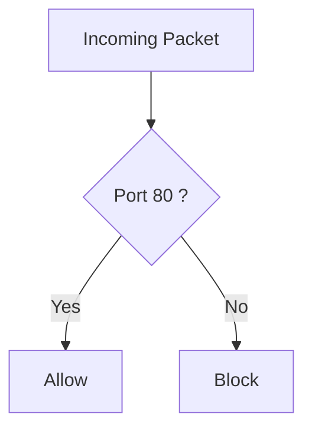

---

# 10. Stateful Firewall

Modern systems use stateful firewalls.

They remember connections.

Example:

```text
Laptop

↓

Website

↓

Response
```

The response is allowed because the firewall remembers the original request.

---

# 11. Stateful Inspection Visual

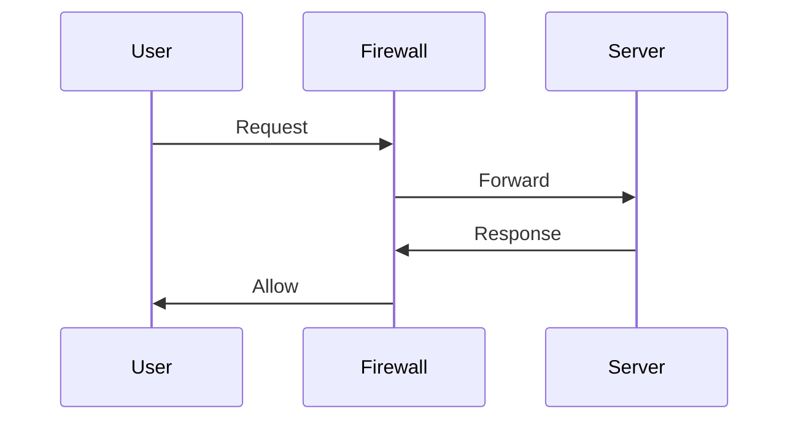

The firewall tracks connection state.

---

# 12. Stateless vs Stateful

| Feature         | Stateless | Stateful    |
| --------------- | --------- | ----------- |
| Memory          | No        | Yes         |
| Tracks Sessions | No        | Yes         |
| Performance     | Very Fast | Fast        |
| Security        | Lower     | Higher      |
| Common Today    | Rare      | Very Common |

---

# 13. Firewall Decision Process

Every packet is evaluated.

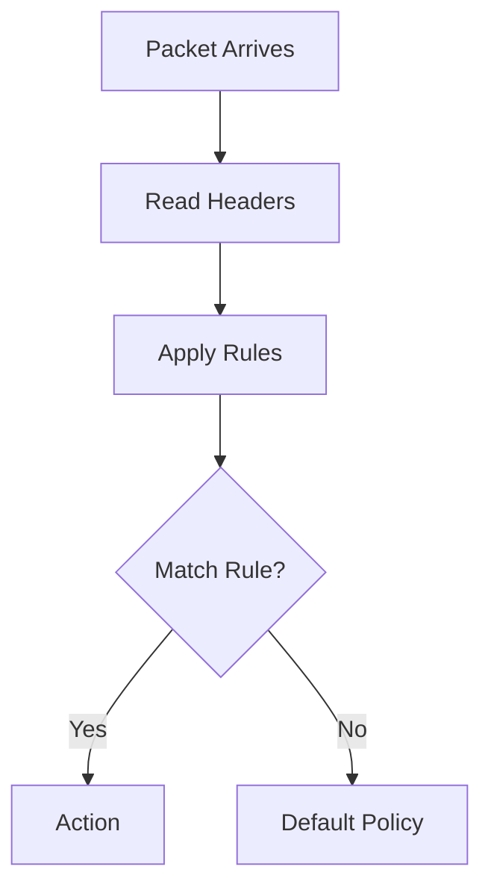

---

# 14. Firewall Rules

Rules usually contain:

```text
Source IP

Destination IP

Source Port

Destination Port

Protocol

State

Action
```

Example:

```text
ALLOW TCP 443

ALLOW TCP 80

ALLOW TCP 22

DROP EVERYTHING ELSE
```

---

# 15. Understanding Actions

## ALLOW

Permit traffic.

```text
Client

↓

Server
```

---

## DROP

Silently discard.

```text
Client

↓

Nothing
```

Attacker waits.

---

## REJECT

Reject and notify.

```text
Connection refused
```

---

# 16. Drop vs Reject

DROP:

```text
Looks invisible
```

REJECT:

```text
Explicitly says no
```

Production systems often prefer DROP.

---

# 17. Important Concepts

## Inbound Traffic

Entering system.

```text
Internet

↓

Your Server
```

---

## Outbound Traffic

Leaving system.

```text
Server

↓

Internet
```

---

# 18. Visualizing Traffic Directions

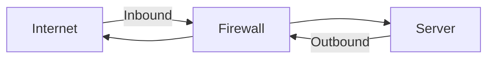

---

# 19. Ports Matter

Common ports:

| Port | Service    |
| ---- | ---------- |
| 22   | SSH        |
| 53   | DNS        |
| 80   | HTTP       |
| 443  | HTTPS      |
| 3306 | MySQL      |
| 5432 | PostgreSQL |
| 6379 | Redis      |

Never expose unnecessary ports.

---

# 20. Principle of Least Privilege

Very important.

Bad:

```text
Allow Everything
```

Good:

```text
Allow Only Required Services
```

---

# 21. Bad Configuration

```text
0.0.0.0/0

↓

Allow All
```

Extremely dangerous.

---

# 22. Good Configuration

```text
443 → Public

80 → Public

22 → Internal VPN Only
```

---

# 23. Typical Web Server

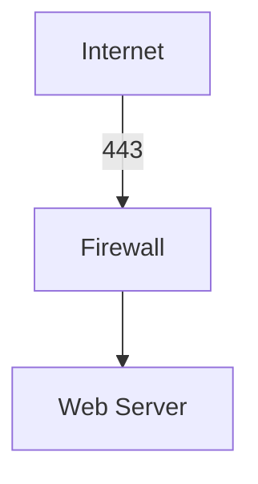

Blocked:

```text
3306

6379

5432
```

---

# 24. Typical Production Architecture

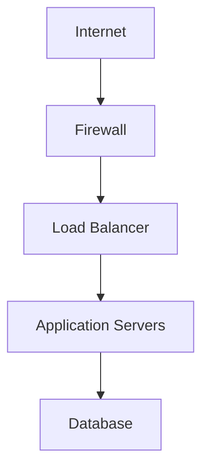

---

# 25. Multi-Layer Firewall Architecture

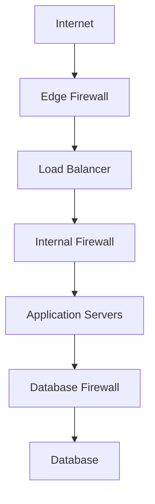

This is called **Defense in Depth**.

---

# 26. Host Firewalls

Run directly on servers.

Examples:

```text
iptables

nftables

ufw

firewalld
```

---

# 27. Cloud Firewalls

Examples:

```text
AWS Security Groups

AWS NACL

Azure NSG

Google Cloud Firewall
```

---

# 28. Web Application Firewalls (WAF)

Protect applications.

Examples:

```text
SQL Injection

XSS

Bot Attacks

Malicious Payloads
```

Visual:

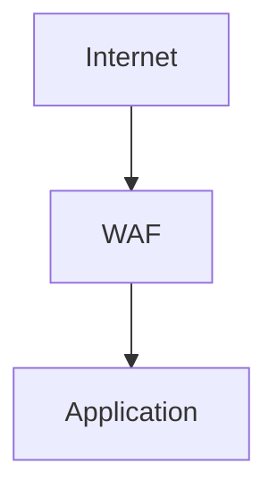

---

# 29. Network Zones

Production systems use zones.

```text
Internet

↓

DMZ

↓

Application Tier

↓

Database Tier
```

---

# 30. DMZ Architecture

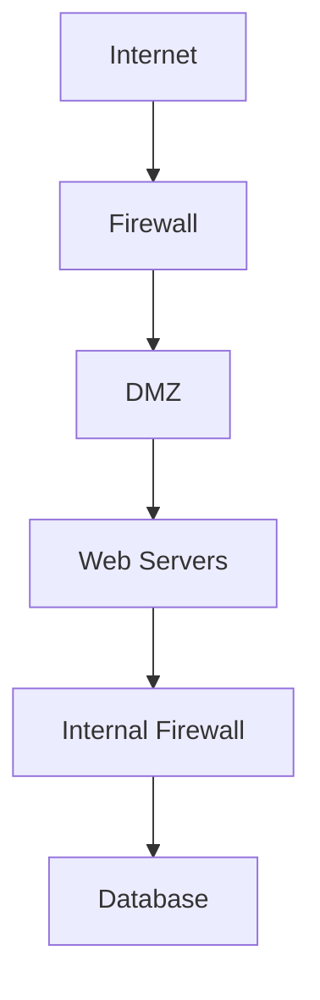

---

# 31. Common Beginner Mistakes

### Exposing databases publicly

Bad:

```text
0.0.0.0:3306
```

---

### Opening all ports

Bad:

```text
ALLOW ALL
```

---

### Public Redis

Bad:

```text
6379 exposed
```

---

### Public Kubernetes Dashboard

Bad.

---

# 32. Modern Production Security Stack

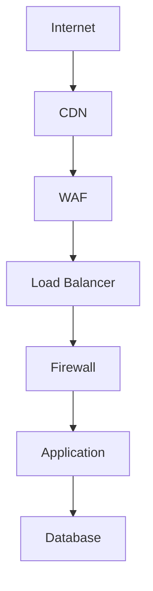

---

# 33. Linux Firewall Ecosystem

Very important.

```text
Linux Kernel

↓

Netfilter

↓

iptables

↓

nftables

↓

ufw

↓

firewalld
```

This explains upcoming files.

---

# 34. Firewall Performance Challenges

Firewalls process:

```text
Millions of packets

Thousands of rules

Millions of connections
```

Optimization matters.

---

# 35. Logging

Firewalls should log suspicious events.

Examples:

```text
Port Scans

Repeated Login Attempts

Blocked Connections

Anomalies
```

---

# 36. Security Principles

Always remember:

```text
Default Deny

Least Privilege

Defense In Depth

Zero Trust

Segmentation
```

---

# 37. Zero Trust Model

Old mindset:

```text
Inside network = Trusted
```

Modern mindset:

```text
Trust Nothing

Verify Everything
```

---

# 38. Troubleshooting Flow

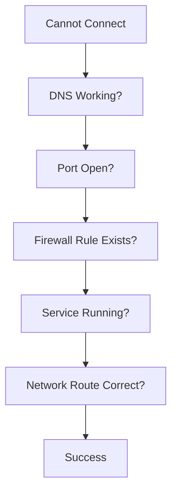

---

# 39. Useful Linux Commands

View listening ports:

```bash
ss -tulnp
```

Check routes:

```bash
ip route
```

Check firewall rules:

```bash
iptables -L

nft list ruleset
```

Check connections:

```bash
netstat -tun
```

---

# 40. Interview Questions

### Beginner

* What is a firewall?
* Difference between DROP and REJECT?
* Why are firewalls important?

### Intermediate

* Difference between stateless and stateful firewalls?
* Explain Defense in Depth.
* Explain network segmentation.

### Advanced

* How would you secure a production VPC?
* How would you design firewall rules for a microservices system?
* Explain firewall performance optimization.

---
