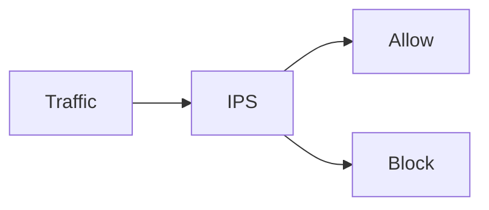
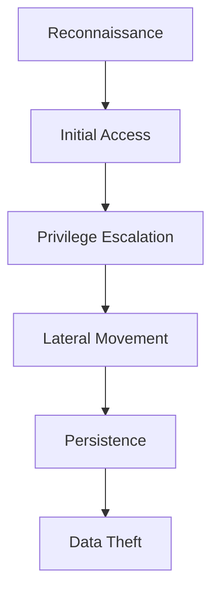
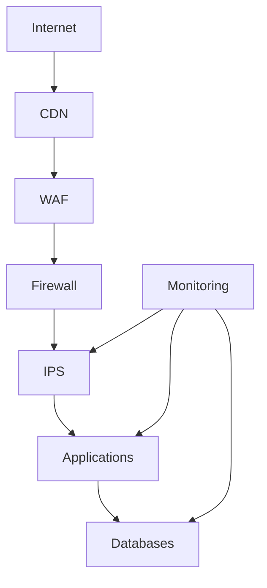
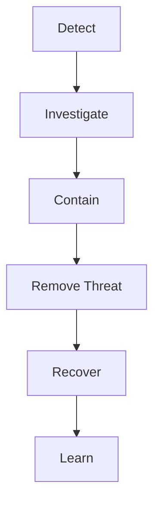
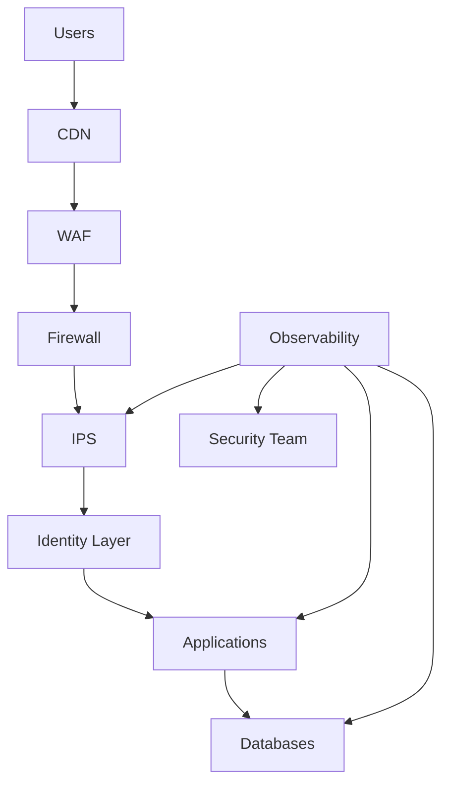

# IDS vs IPS

# 1. Why This File Is Extremely Important

Imagine you built a secure company.

You deployed:

```text
Firewalls

VPN

WAF

Zero Trust

Segmentation
```

Everything looks secure.

But one day an attacker enters anyway.

Question:

> How do we know?

This is where IDS and IPS enter the story.

Modern security is no longer:

> Build walls and hope for the best.

Modern security is:

> Build walls, monitor activity, detect threats, and automatically respond.

This file teaches that mindset.

---

# 2. First Principle: Security Is A Living System

Many beginners think security is static.

```text
Configure firewall

↓

Done forever
```

Wrong.

Infrastructure is alive.

Every second:

```text
Users connect

Services communicate

Bots scan

Attackers probe

Applications change
```

Security must continuously observe this movement.

---

# 3. Real World Analogy: Shopping Mall Security

Imagine a shopping mall.

We have multiple security layers.

```text
Building Door

↓

Cameras

↓

Security Guards

↓

Emergency Response Team
```

Each solves a different problem.

Firewalls are doors.

IDS are cameras.

IPS are active security guards.

---

# 4. What Problem Are IDS And IPS Solving?

Question:

> What if attackers already got inside?

This is the entire reason these systems exist.

Because professional engineers assume:

> Attackers will eventually enter.

Then the question becomes:

> Can we detect and stop them quickly?

---

# 5. What Is IDS?

IDS stands for:

> Intrusion Detection System

Focus on one word.

```text
Detection
```

IDS watches.

It does not stop traffic.

Think:

> Digital security camera.

---

# 6. What Is IPS?

IPS stands for:

> Intrusion Prevention System

Focus on:

```text
Prevention
```

IPS actively intervenes.

Think:

> Digital security guard.

---

# 7. Mental Model

Imagine a bank.

IDS:

```text
See suspicious person

↓

Raise alarm
```

IPS:

```text
See suspicious person

↓

Lock doors

↓

Call security

↓

Block movement
```

---

# 8. The Difference In One Diagram


IDS only observes.

---

IPS:



IPS can stop traffic.

---

# 9. The Biggest Misconception

Many beginners think:

```text
Firewall

↓

IDS

↓

Same thing
```

Wrong.

They solve different problems.

Firewall asks:

> Should this connection exist?

IDS asks:

> Is something suspicious happening?

IPS asks:

> Should we stop it right now?

---

# 10. Think Like An Attacker

Suppose an attacker enters infrastructure.

Goals:

```text
Find servers

Find databases

Steal credentials

Move laterally

Steal data
```

Attackers leave footprints.

IDS searches for those footprints.

---

# 11. Attackers Rarely Attack In One Step

Real attacks look like this.



IDS and IPS help interrupt this chain.

---

# 12. How IDS Thinks

Imagine security cameras.

IDS continuously asks:

```text
What is happening?

Is this normal?

Is this suspicious?

Does this match known attacks?
```

Its entire job is pattern recognition.

---

# 13. The Three Things IDS Looks For

Most systems analyze:

```text
Signatures

Behavior

Anomalies
```

Memorize these.

You'll see them everywhere.

---

# 14. Signature Detection

Question:

> Have we seen this attack before?

Example:

```text
Known Malware

Known Payload

Known Attack Pattern
```

This is signature-based detection.

---

# 15. Real World Analogy

Airport security.

If someone carries a known dangerous object:

```text
Recognize

↓

Alert
```

Easy.

This is signature detection.

---

# 16. Signature Detection Strengths

Very effective against:

```text
Known attacks

Known malware

Known exploit patterns
```

Benefits:

```text
Fast

Reliable

Low CPU usage
```

---

# 17. Signature Detection Weaknesses

Question:

> What if attackers invent something new?

Problem.

Unknown attacks may pass through.

---

# 18. Behavioral Detection

Question:

> Is this activity unusual?

Example:

Normal user:

```text
5 requests/minute
```

Suddenly:

```text
10000 requests/minute
```

That's suspicious.

---

# 19. Behavioral Detection Example

Suppose a database server suddenly does this.

```text
3 AM

↓

Downloads 200 GB

↓

Unknown destination
```

Engineers investigate.

---

# 20. Anomaly Detection

Question:

> What is normal?

Then:

> Detect deviations.

This is extremely important.

---

# 21. Building Baselines

Every system has normal behavior.

Example:

Normal:

```text
200 users/day

2 deployments/day

1000 requests/minute
```

Abnormal:

```text
20000 users/day

100 deployments/day

500000 requests/minute
```

Something changed.

---

# 22. Where Does IDS Sit?

Classic architecture:


IDS receives copies of traffic.

It does not block.

---

# 23. Where Does IPS Sit?

Different architecture.


Traffic flows through IPS.

IPS can stop traffic.

---

# 24. Network-Based IDS (NIDS)

Question:

> Can we monitor entire networks?

Yes.

NIDS watches network traffic.

Examples:

```text
Office Networks

Datacenters

Cloud Infrastructure
```

---

# 25. Host-Based IDS (HIDS)

Instead of watching networks:

Watch machines.

Examples:

```text
File Changes

User Activity

Processes

Logins
```

---

# 26. NIDS vs HIDS

| Feature          | NIDS     | HIDS     |
| ---------------- | -------- | -------- |
| Monitors         | Networks | Machines |
| Visibility       | Broad    | Deep     |
| File Monitoring  | ❌        | ✅        |
| Traffic Analysis | ✅        | ❌        |

Both are useful.

---

# 27. What Data Do These Systems Observe?

Huge amounts.

Examples:

```text
Packets

Connections

Logs

Processes

File Changes

Authentication Events
```

Security is heavily data-driven.

---

# 28. Real World Example

Suppose this happens.

```text
500 failed SSH logins

↓

1 minute

↓

20 countries
```

Suspicious.

---

# 29. Another Example

Employee laptop:

```text
India

↓

30 seconds later

↓

Germany
```

Impossible.

Investigate.

---

# 30. The Biggest Engineering Problem: False Positives

Normal user:

```text
↓

Blocked
```

Bad.

Example:

Developer running tests.

System thinks:

```text
Attack
```

Wrong.

---

# 31. False Negatives

Opposite problem.

Attacker:

```text
↓

Allowed
```

Even worse.

---

# 32. Why Security Is Difficult

Humans are noisy.

Infrastructure is noisy.

Applications are noisy.

Engineers constantly balance:

```text
Security

Performance

User Experience
```

This balancing act never ends.

---

# 33. Modern Security Stack

Large companies use multiple layers.



Notice:

IDS/IPS is one layer.

Not everything.

---

# 34. Cloud Changes Everything

Cloud environments are dynamic.

Infrastructure changes constantly.

Traditional security struggled.

Modern systems monitor:

```text
Users

Services

Containers

Cloud Accounts

APIs
```

Everything becomes observable.

---

# 35. Kubernetes Makes Detection Harder

Containers appear and disappear constantly.

Monitor:

```text
Pods

Nodes

Containers

Secrets

API Server
```

Static thinking no longer works.

---

# 36. AI Is Entering Security

Modern systems increasingly use AI.

AI helps detect:

```text
Patterns

Anomalies

Behavior Changes
```

AI assists humans.

It does not replace engineers.

---

# 37. Engineering Thinking Framework

Whenever building infrastructure ask:

```text
What is normal?

What is suspicious?

How will I detect attacks?

Who gets notified?

Can we automate responses?
```

These questions are extremely powerful.

---

# 38. Security Incident Lifecycle

Every company eventually follows this.



This cycle never ends.

---

# 39. Common Beginner Mistakes

### Mistake 1

IDS = Firewall

Wrong.

---

### Mistake 2

IPS = Firewall

Wrong.

---

### Mistake 3

Detection = Security

Wrong.

Detection is one layer.

---

### Mistake 4

No monitoring required.

Very wrong.

---

### Mistake 5

Ignore internal traffic.

Wrong.

East-west traffic matters.

---

# 40. Master Architecture Diagram

Study this multiple times.



This resembles many modern infrastructures.

---

# 41. Interview Questions

## Beginner

* What is IDS?
* What is IPS?
* IDS vs IPS?

## Intermediate

* Explain signatures.
* Explain anomaly detection.
* NIDS vs HIDS?

## Advanced

* Design IDS for cloud infrastructure.
* Design IPS for Kubernetes.
* How would you detect lateral movement?

---

# 42. Master Takeaways

```text
IDS = Detect

IPS = Prevent

Modern Detection Uses:

Signatures

Behavior

Anomalies

Security Is:

Observe

Detect

Respond

Recover

Remember:

Prevention Alone Is Not Enough
```
