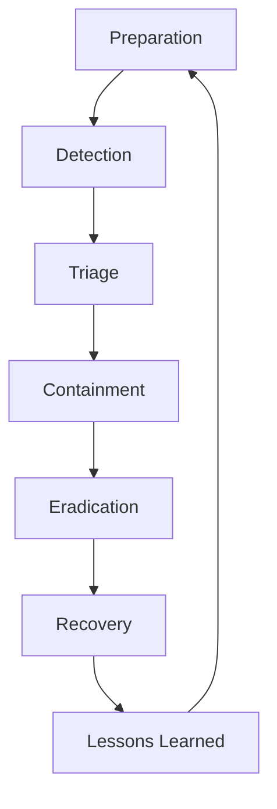
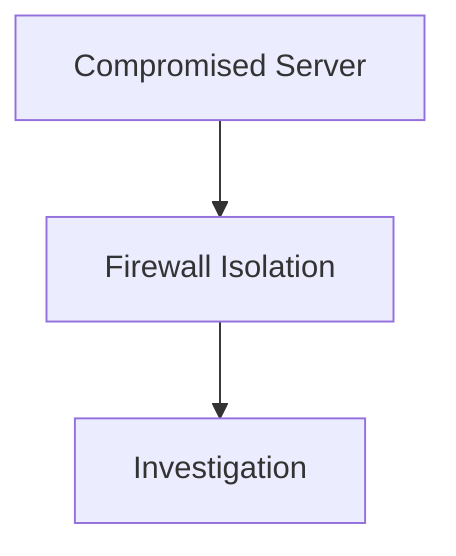
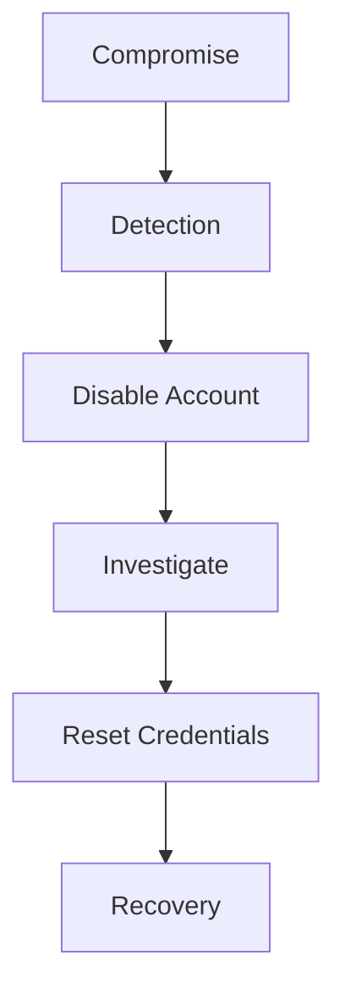
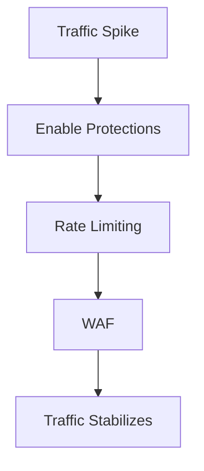
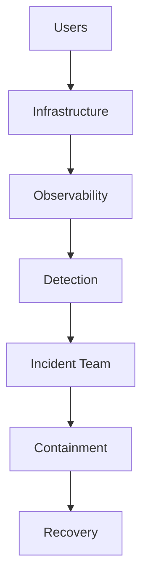

# Incident Response

# 1. Why This File Is Extremely Important

Most beginners think engineering looks like this.

```text
Build software

↓

Deploy software

↓

Users happy
```

Reality looks more like this.

```text
Build

↓

Deploy

↓

Unexpected behavior

↓

Outage

↓

Investigation

↓

Recovery

↓

Learning

↓

Improvement
```

Incidents are normal.

The goal is not:

> Prevent every incident.

The goal is:

> Detect fast, respond fast, recover fast, and learn fast.

---

# 2. First Principle: Incidents Are Inevitable

This mindset changes everything.

Good engineers don't say:

> We will never fail.

Good engineers say:

> We will eventually fail, so let's prepare.

This principle alone improves engineering maturity dramatically.

---

# 3. What Is An Incident?

An incident is:

> Any event that negatively impacts security, availability, reliability, performance, or business operations.

Examples:

```text
Website unavailable

Database down

Data leak

Credential theft

DDoS attack

Slow applications

Cloud outage

Broken deployments

Expired certificates
```

Not every incident is a security incident.

But security incidents are a subset of incidents.

---

# 4. Why Companies Lose Millions During Incidents

Technology itself is often not the biggest problem.

Panic is.

Bad response:

```text
Nobody knows what's happening

↓

Everyone changes things

↓

Situation worsens
```

Good response:

```text
Observe

↓

Coordinate

↓

Contain

↓

Recover

↓

Learn
```

---

# 5. The Golden Rule Of Incident Response

Never panic.

Panic creates more incidents.

Professional engineers become calmer when systems become more chaotic.

---

# 6. The Incident Lifecycle

This lifecycle is extremely important.

Memorize it.



This cycle never ends.

---

# 7. Phase 1: Preparation

Preparation is the most important phase.

Question:

> Can we respond to incidents before they happen?

Examples:

```text
Runbooks

Monitoring

Backups

Communication Channels

Access Controls

Escalation Policies
```

Preparation reduces chaos.

---

# 8. Why Preparation Matters

Imagine a fire station.

Do firefighters wait for fires?

No.

They prepare first.

Similarly:

Engineers prepare before incidents happen.

---

# 9. Build Runbooks

A runbook is:

> A documented response procedure.

Example:

```text
Database Down

↓

Step 1 Check Monitoring

↓

Step 2 Check Replication

↓

Step 3 Check Storage

↓

Step 4 Escalate
```

Runbooks reduce stress.

---

# 10. Phase 2: Detection

Question:

> How do we know something is wrong?

Sources:

```text
Logs

Metrics

Traces

Alerts

Users

Engineers
```

Observability is critical.

---

# 11. Incident Detection Signals

Examples:

```text
CPU spike

Traffic spike

Error spike

Login failures

Latency increase

Database saturation
```

Patterns matter.

---

# 12. Users Often Detect Problems First

Many incidents begin like this.

```text
Customer:

"The website isn't working."
```

This is normal.

Never ignore user reports.

---

# 13. Phase 3: Triage

Triage means:

> Determine severity and impact.

Questions:

```text
What is broken?

Who is affected?

How many users?

Which systems?

What changed recently?
```

These questions are powerful.

---

# 14. Severity Levels

Many companies use severity systems.

Example:

```text
SEV-1 Critical

Entire business impacted

---------------

SEV-2 High

Major features impacted

---------------

SEV-3 Medium

Limited impact

---------------

SEV-4 Low

Minor issue
```

---

# 15. The Most Powerful Incident Question

Ask:

> What changed?

Many incidents are change-related.

Examples:

```text
Deployment

Configuration

Certificate

Infrastructure

Secrets

Database Changes
```

This question solves many incidents.

---

# 16. The Incident Commander Role

This is extremely important.

Question:

> Who coordinates everything?

Answer:

Incident Commander.

Responsibilities:

```text
Coordinate

Delegate

Communicate

Prioritize
```

Not:

```text
Fix everything alone
```

---

# 17. Why Too Many Engineers Can Be Dangerous

Imagine:

```text
15 engineers

↓

All changing production
```

Chaos.

Instead:

```text
One leader

↓

Small teams

↓

Coordinated actions
```

Structure matters.

---

# 18. Typical Incident Team

```text
Incident Commander

↓

Communications Lead

↓

Investigation Team

↓

Infrastructure Team

↓

Application Team
```

Roles reduce confusion.

---

# 19. Investigation Mindset

Don't assume.

Collect evidence.

Question:

> What facts do we know?

Bad:

```text
I think database failed.
```

Good:

```text
CPU normal

Memory normal

Disk full

Replication broken
```

Facts matter.

---

# 20. Investigation Framework

Always ask:

```text
What happened?

When?

Who noticed?

What changed?

What systems are affected?

What evidence exists?
```

Memorize this framework.

---

# 21. Timeline Building

Timelines are extremely useful.

Example:

```text
09:00 Deployment

09:05 CPU Spike

09:10 Errors Increase

09:12 Users Report Issues

09:20 Rollback

09:30 Recovery
```

Timelines reveal patterns.

---

# 22. Phase 4: Containment

Question:

> How do we stop the damage from spreading?

Examples:

```text
Block IPs

Disable Accounts

Isolate Servers

Stop Deployments

Revoke Credentials
```

Goal:

> Stop growth.

---

# 23. Containment Visual



Isolation buys time.

---

# 24. Blast Radius Thinking

Question:

> How much damage can happen?

Bad:

```text
Entire company affected
```

Good:

```text
One service isolated
```

Segmentation is powerful.

---

# 25. Phase 5: Eradication

Containment stops spread.

Eradication removes root causes.

Examples:

```text
Patch vulnerabilities

Remove malware

Reset credentials

Fix misconfigurations
```

---

# 26. Never Skip Root Cause Analysis

Bad:

```text
Restart server

↓

Done
```

Problem may return tomorrow.

Ask:

> Why did this happen?

---

# 27. The Five Whys Technique

Ask why repeatedly.

Example:

```text
Website Down

↓

Why?

Database Failed

↓

Why?

Disk Full

↓

Why?

Logs Filled Storage

↓

Why?

Retention Policy Missing

↓

Why?

Nobody Configured It
```

Root cause discovered.

---

# 28. Phase 6: Recovery

Question:

> How do we safely restore services?

Examples:

```text
Restore backups

Re-enable systems

Re-enable accounts

Validate functionality
```

Slow and controlled.

---

# 29. Recovery Is Dangerous

Many secondary incidents happen here.

Why?

People rush.

Avoid rushing.

Validate carefully.

---

# 30. Phase 7: Lessons Learned

The incident is not over.

This phase is often skipped.

Huge mistake.

Question:

> How do we prevent this in the future?

---

# 31. Postmortems

Postmortem means:

> Analyze incidents after they finish.

Good postmortems answer:

```text
What happened?

Why?

What worked?

What failed?

What improves?
```

---

# 32. Blameless Culture (Very Important)

Bad culture:

```text
Who broke production?
```

Good culture:

```text
Why did the system allow this?
```

Focus on systems.

Not people.

---

# 33. Humans Make Mistakes

Professional companies assume:

```text
Humans will make mistakes.
```

Build systems that tolerate mistakes.

---

# 34. Security Incident Example

Scenario:

```text
Employee Account Compromised
```

Flow:



---

# 35. DDoS Incident Example



---

# 36. Cloud Incident Example

Questions:

```text
Who changed IAM?

Who changed Security Groups?

What deployments occurred?

Were secrets leaked?
```

Cloud systems require audit trails.

---

# 37. Kubernetes Incident Example

Questions:

```text
Which pod failed?

Which node failed?

Are secrets exposed?

Did service accounts change?
```

---

# 38. The Four Time Metrics Engineers Love

These are very important.

MTTD:

```text
Mean Time To Detect
```

MTTA:

```text
Mean Time To Acknowledge
```

MTTR:

```text
Mean Time To Respond
```

MTTC:

```text
Mean Time To Contain
```

Smaller is better.

---

# 39. Incident Response Architecture



---

# 40. Communication Is Critical

Communicate:

```text
What happened

Who is affected

Current status

Next update time
```

Silence creates confusion.

---

# 41. Engineering Thinking Framework

Whenever incidents happen ask:

```text
What happened?

What changed?

Who is affected?

How do we contain it?

How do we recover?

How do we improve?
```

Memorize this.

---

# 42. Common Beginner Mistakes

### Mistake 1

Panic.

Wrong.

---

### Mistake 2

Everyone changes production.

Wrong.

---

### Mistake 3

Skip postmortems.

Wrong.

---

### Mistake 4

Blame engineers.

Wrong.

---

### Mistake 5

Ignore communication.

Wrong.

---

# 43. Interview Questions

## Beginner

* What is incident response?
* Why do incidents happen?

## Intermediate

* Explain containment.
* Explain severity levels.
* Explain postmortems.

## Advanced

* Design incident response for cloud systems.
* Explain blameless culture.
* How would you handle credential theft?

---

# 44. Master Takeaways

```text
Incidents Are Normal

Do Not Panic

Lifecycle:

Prepare

Detect

Triage

Contain

Eradicate

Recover

Learn

Core Principles:

Evidence Over Assumptions

Blameless Culture

Reduce Blast Radius

Improve Continuously
```
