# iptables

# 1. What is iptables?

`iptables` is a Linux userspace utility used to configure the Linux kernel's packet filtering framework called **Netfilter**.

Very important:

> **iptables itself is NOT the firewall.**

This is one of the biggest misconceptions.

The actual firewall is:

```text
Linux Kernel

↓

Netfilter

↓

iptables (configuration tool)
```

Think of it as:

> iptables = Remote control

> Netfilter = Security engine

---

# 2. Why iptables Exists

Every Linux machine receives packets.

Without filtering:

```text
Internet

↓

Linux Server

↓

Everything enters
```

We need a mechanism to decide:

```text
Who enters?

Who leaves?

Who gets blocked?

Who can communicate?
```

iptables solves this.

---

# 3. Mental Model

Imagine an airport.

```text
Passenger

↓

Security Checkpoint

↓

Decision

↓

Allow or Block
```

Packets are passengers.

iptables rules are security policies.

---

# 4. Big Picture Architecture

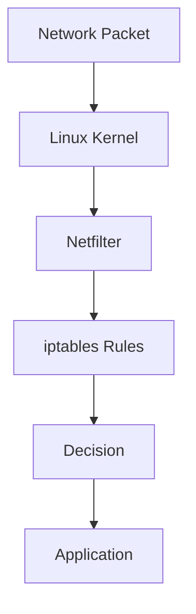

---

# 5. Where iptables Lives

```text
Userspace

iptables command

↓

Kernel Space

Netfilter

↓

Network Stack
```

---

# 6. Packet Journey Inside Linux

This picture is extremely important.

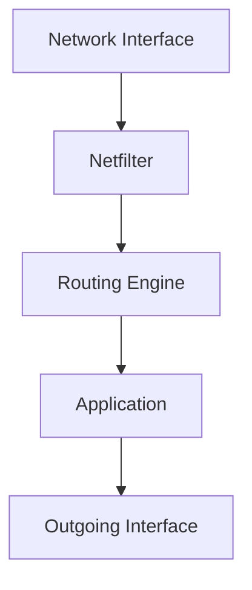

Every packet passes through several decision points.

---

# 7. The Five Hooks (Most Important Concept)

Netfilter inserts hooks inside the Linux networking stack.

```text
1. PREROUTING

2. INPUT

3. FORWARD

4. OUTPUT

5. POSTROUTING
```

Think of them as security checkpoints.

---

# 8. Visualizing The Hooks

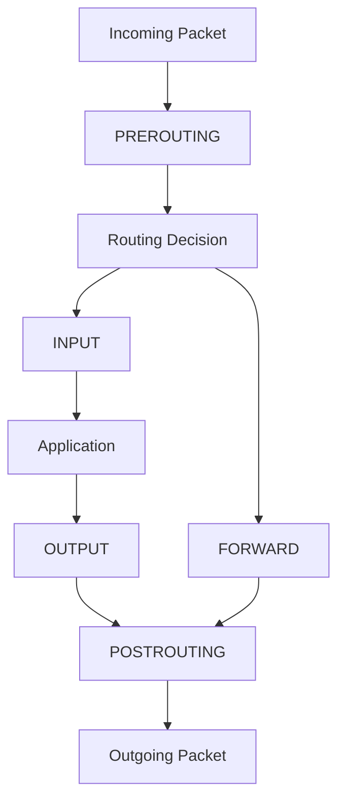

Memorize this.

It explains most Linux networking.

---

# 9. Understanding Each Hook

## PREROUTING

Runs before routing.

Question:

```text
Where should packet go?
```

---

## INPUT

Packet destined for local machine.

Example:

```text
SSH

HTTPS

DNS
```

---

## FORWARD

Packet passing through machine.

Example:

```text
Router

Gateway

Kubernetes Node
```

---

## OUTPUT

Packet generated locally.

Example:

```text
curl

wget

apt update
```

---

## POSTROUTING

Final step before leaving.

---

# 10. Tables

Rules are organized into tables.

```text
iptables

├── filter
├── nat
├── mangle
├── raw
└── security
```

Most engineers primarily use:

```text
filter

nat
```

---

# 11. Filter Table

Default firewall table.

Purpose:

```text
Allow

Block

Drop
```

Chains:

```text
INPUT

FORWARD

OUTPUT
```

---

# 12. NAT Table

Purpose:

```text
Address Translation
```

Chains:

```text
PREROUTING

POSTROUTING

OUTPUT
```

---

# 13. Mangle Table

Purpose:

```text
Modify packets
```

Examples:

```text
QoS

Packet marking

Traffic shaping
```

---

# 14. The Relationship

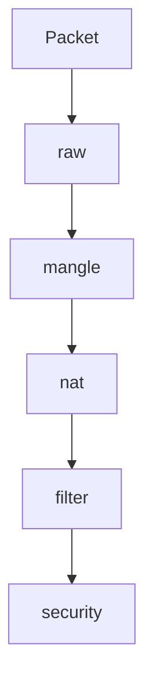

---

# 15. Chains

A chain is simply:

> A list of rules.

Example:

```text
INPUT

Rule 1

Rule 2

Rule 3
```

Packets are evaluated top to bottom.

---

# 16. Packet Evaluation Process

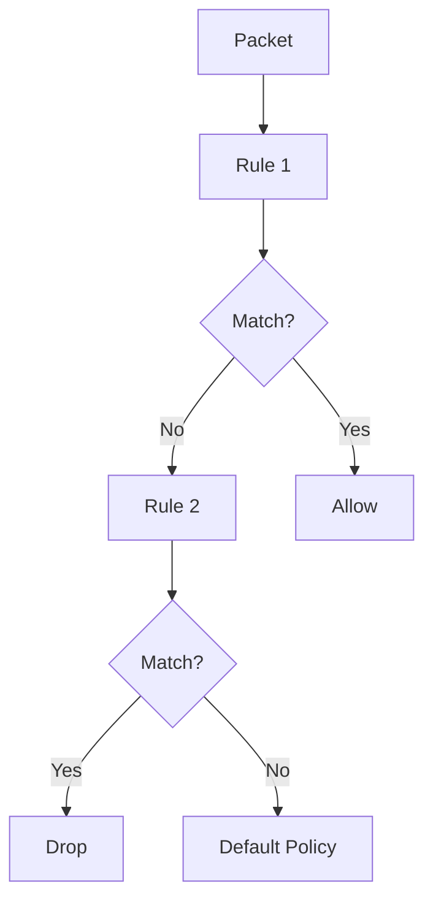

---

# 17. Rule Anatomy

Example:

```bash
iptables -A INPUT -p tcp --dport 22 -j ACCEPT
```

Break it down.

```text
-A INPUT

Append rule

-p tcp

TCP protocol

--dport 22

Destination port

-j ACCEPT

Action
```

---

# 18. Important Actions

```text
ACCEPT

DROP

REJECT

LOG
```

---

# 19. ACCEPT

Allow traffic.

```text
Packet

↓

Application
```

---

# 20. DROP

Silently discard.

```text
Packet

↓

Nothing
```

---

# 21. REJECT

Explicit refusal.

```text
Connection refused
```

---

# 22. LOG

Generate logs.

```text
Packet

↓

Kernel Log
```

---

# 23. Default Policies

Every chain has a policy.

Check:

```bash
iptables -L
```

Example:

```text
INPUT DROP

FORWARD DROP

OUTPUT ACCEPT
```

This is common.

---

# 24. View Rules

List rules.

```bash
iptables -L
```

Verbose:

```bash
iptables -L -v
```

Numeric:

```bash
iptables -L -n
```

Combined:

```bash
iptables -L -vn
```

---

# 25. Allow SSH

```bash
iptables -A INPUT -p tcp --dport 22 -j ACCEPT
```

Visual:

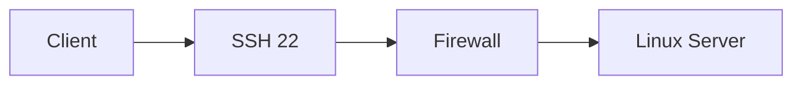

---

# 26. Allow HTTPS

```bash
iptables -A INPUT -p tcp --dport 443 -j ACCEPT
```

---

# 27. Allow HTTP

```bash
iptables -A INPUT -p tcp --dport 80 -j ACCEPT
```

---

# 28. Block Everything Else

```bash
iptables -P INPUT DROP
```

This is called:

```text
Default Deny
```

Best practice.

---

# 29. Stateful Firewalls (Very Important)

Modern systems use connection tracking.

Without this:

```text
Request enters

Response blocked
```

Connection tracking solves this.

---

# 30. Connection States

```text
NEW

ESTABLISHED

RELATED

INVALID
```

---

# 31. Allow Existing Connections

```bash
iptables -A INPUT \
-m conntrack \
--ctstate ESTABLISHED,RELATED \
-j ACCEPT
```

---

# 32. Visualizing Stateful Connections

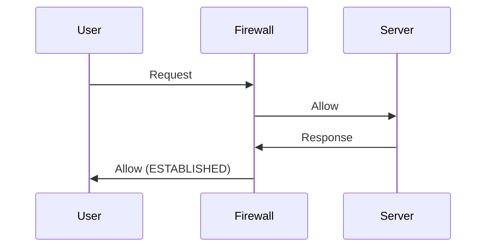

---

# 33. Example Production Rules

```bash
iptables -P INPUT DROP

iptables -P FORWARD DROP

iptables -P OUTPUT ACCEPT

iptables -A INPUT -i lo -j ACCEPT

iptables -A INPUT \
-m conntrack \
--ctstate ESTABLISHED,RELATED \
-j ACCEPT

iptables -A INPUT -p tcp --dport 22 -j ACCEPT

iptables -A INPUT -p tcp --dport 443 -j ACCEPT
```

---

# 34. Loopback Interface

Never block.

Allow:

```bash
iptables -A INPUT -i lo -j ACCEPT
```

Loopback:

```text
127.0.0.1
```

---

# 35. Rule Ordering Matters

Bad:

```text
DROP ALL

ALLOW SSH
```

SSH never works.

Good:

```text
ALLOW SSH

DROP ALL
```

Top-down evaluation.

---

# 36. Network Address Translation (NAT)

NAT changes addresses.

Example:

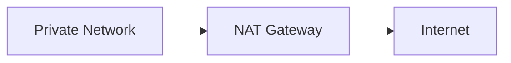

---

# 37. MASQUERADE

Very common.

```bash
iptables \
-t nat \
-A POSTROUTING \
-o eth0 \
-j MASQUERADE
```

Purpose:

```text
Many Private IPs

↓

One Public IP
```

---

# 38. Port Forwarding

Example:

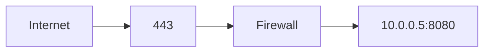

Command:

```bash
iptables \
-t nat \
-A PREROUTING \
-p tcp \
--dport 443 \
-j DNAT \
--to-destination 10.0.0.5:8080
```

---

# 39. Docker Uses iptables

Docker automatically creates rules.

```text
Docker

↓

Bridge Network

↓

iptables Rules

↓

Container Connectivity
```

Check:

```bash
iptables -L
```

You'll see Docker chains.

---

# 40. Kubernetes Uses iptables

kube-proxy creates rules.

```text
Service IP

↓

iptables

↓

Pod IP
```

---

# 41. Production Architecture

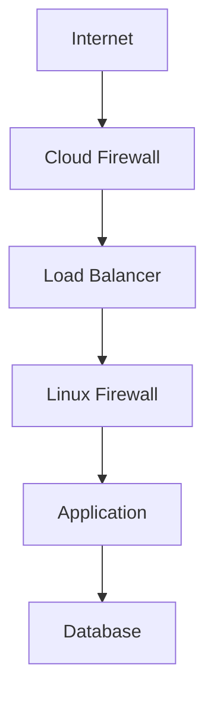

---

# 42. Common Mistakes

## Mistake 1

Locking yourself out.

```text
DROP EVERYTHING

↓

SSH blocked
```

---

## Mistake 2

Exposing databases.

Bad:

```text
3306

5432

6379
```

---

## Mistake 3

Allowing all.

```text
0.0.0.0/0
```

---

# 43. Persist Rules

Rules disappear after reboot.

Ubuntu:

```bash
sudo apt install iptables-persistent
```

Save:

```bash
sudo netfilter-persistent save
```

RHEL:

```bash
service iptables save
```

---

# 44. Performance Challenges

Servers process:

```text
Millions of packets

Thousands of rules
```

Too many rules:

```text
↓

CPU overhead
```

Optimize ordering.

---

# 45. Why nftables Exists

iptables has limitations.

Problems:

```text
IPv4 + IPv6 duplication

Complex syntax

Performance

Multiple tools
```

nftables solves these.

---

# 46. Troubleshooting Flow

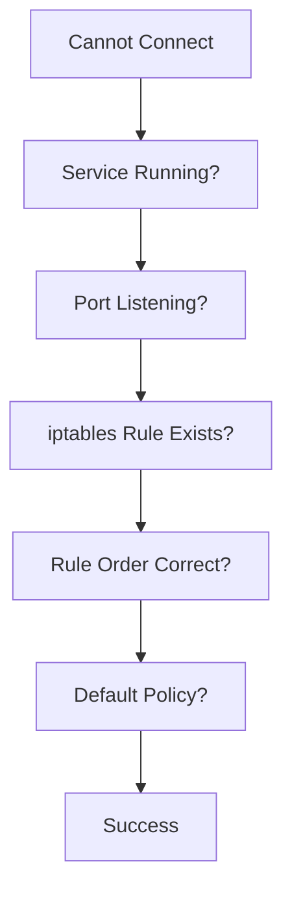

---

# 47. Useful Commands

View listening ports:

```bash
ss -tulnp
```

List rules:

```bash
iptables -L -vn
```

List NAT:

```bash
iptables -t nat -L -vn
```

Save rules:

```bash
iptables-save
```

Restore:

```bash
iptables-restore
```

---

# 48. Interview Questions

### Beginner

* What is iptables?
* Is iptables the firewall?
* What are chains?

### Intermediate

* Explain Netfilter hooks.
* Explain stateful firewalls.
* Explain NAT.

### Advanced

* How does Docker use iptables?
* How does Kubernetes use iptables?
* How would you secure a Linux production server?

---

# 49. Key Takeaways

```text
iptables ≠ Firewall

Netfilter = Firewall Engine

iptables = Configuration Tool

Five Hooks:

PREROUTING

INPUT

FORWARD

OUTPUT

POSTROUTING

Most Used Tables:

filter

nat

Most Used Concepts:

Connection Tracking

Default Deny

NAT

Rule Ordering
```
