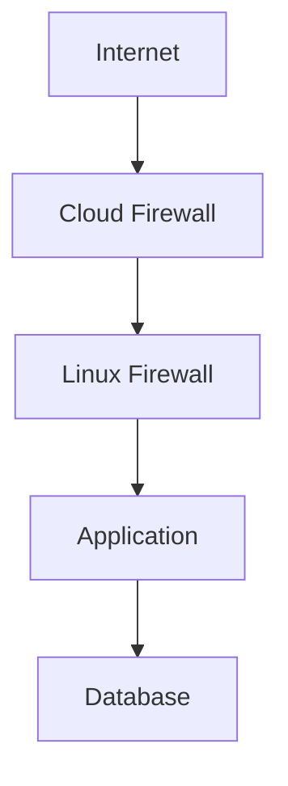
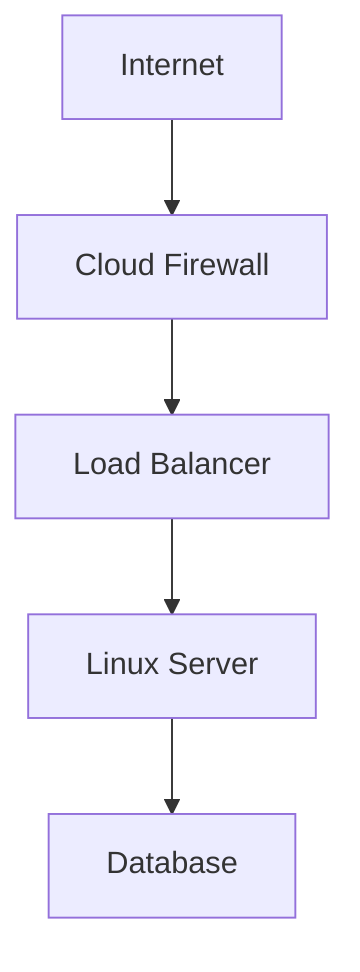
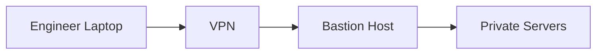
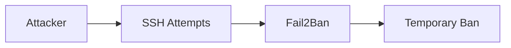
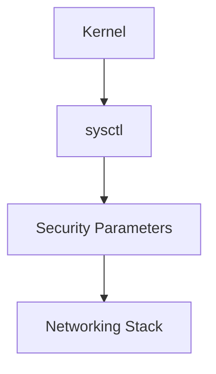
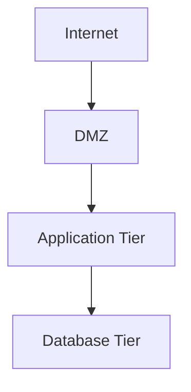
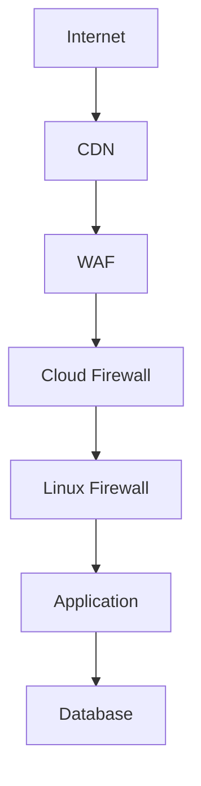
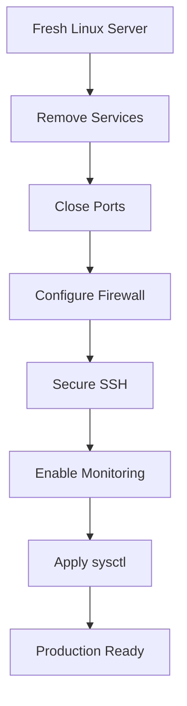
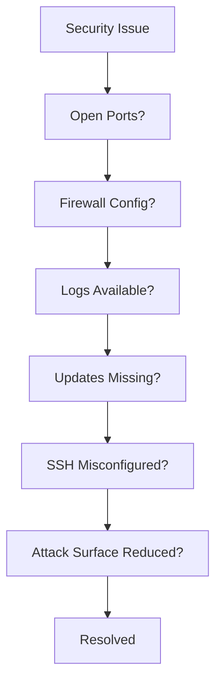

# Linux Network Hardening

# 1. What is Network Hardening?

Network hardening is the process of:

> **Reducing the attack surface of a system by exposing only what is necessary and securing everything else.**

Think:

```text
Default Linux

↓

Reduce Risk

↓

Hardened Linux
```

---

# 2. Why Network Hardening Matters

Most attacks don't begin with sophisticated hacking.

They begin with:

```text
Open Ports

Weak Passwords

Exposed Services

Misconfigurations

Public Databases

Old Software
```

Attackers automate these scans.

Your server is continuously being probed.

---

# 3. Mental Model

Think in layers.

```text
Internet

↓

Edge Protection

↓

Firewall

↓

OS Hardening

↓

Application Security

↓

Database Security
```

---

# 4. Defense In Depth

Never rely on one security mechanism.



Every layer slows attackers down.

---

# 5. Security Goals

Every hardened server should achieve:

```text
Confidentiality

Integrity

Availability
```

This is the CIA Triad.

---

# 6. Principle of Least Privilege

The most important rule.

> Allow only what is necessary.

Bad:

```text
Everything allowed
```

Good:

```text
Only required services allowed
```

---

# 7. Reduce Attack Surface

Ask yourself:

> Does this service need to exist?

Disable unnecessary services.

Bad:

```text
FTP

Telnet

Unused APIs

Unused Daemons
```

---

# 8. Inventory Your Server

First know what is running.

Commands:

```bash
ss -tulnp

systemctl list-unit-files --type=service

ps aux
```

Questions:

```text
What is listening?

Why is it listening?

Who uses it?
```

---

# 9. Port Exposure Strategy

Bad:

```text
22

80

443

3306

5432

6379

27017

Public
```

Good:

```text
443 → Public

22 → VPN Only

Everything Else → Private
```

---

# 10. Typical Hardened Architecture



Database remains private.

---

# 11. Secure SSH

One of the highest priority tasks.

Bad:

```text
root login

password login

internet exposure
```

Good:

```text
SSH Keys

VPN Access

Bastion Hosts

Limited Users
```

---

# 12. SSH Hardening Settings

File:

```bash
/etc/ssh/sshd_config
```

Recommended:

```text
PermitRootLogin no

PasswordAuthentication no

PermitEmptyPasswords no

PubkeyAuthentication yes

AllowUsers devops sre deployer
```

---

# 13. Change Default SSH Port? (Reality Check)

Many beginners ask this.

Example:

```text
22

↓

2222
```

Does this secure servers?

No.

It only reduces noise.

Still do:

```text
Firewall

VPN

Keys

Fail2Ban
```

---

# 14. Bastion Host Architecture

Very common in production.



Private servers never touch the internet.

---

# 15. Harden Firewalls

Use default deny.

Good:

```text
Allow 443

Allow VPN

Block everything else
```

Example mindset:

```text
Allow

↓

Explicit Services

↓

Drop Everything Else
```

---

# 16. Public Database = Disaster

Never expose:

```text
3306

5432

6379

27017
```

Common breaches happen here.

---

# 17. Secure DNS

Use trusted resolvers.

Examples:

```text
Cloudflare

1.1.1.1

Google

8.8.8.8
```

Or internal DNS.

---

# 18. Secure NTP

Keep time synchronized.

Protocols depend on time.

Examples:

```text
TLS

JWT

Kerberos
```

Use:

```bash
timedatectl status
```

---

# 19. Keep Software Updated

Very important.

Update:

```bash
sudo apt update

sudo apt upgrade
```

or

```bash
sudo dnf update
```

Security patches matter.

---

# 20. Minimize Installed Packages

Every package increases risk.

Bad:

```text
100 unnecessary packages
```

Good:

```text
Minimal OS
```

---

# 21. Disable Unused Services

Check:

```bash
systemctl list-unit-files
```

Disable:

```bash
sudo systemctl disable service

sudo systemctl stop service
```

---

# 22. Fail2Ban

Protect against brute force attacks.

Architecture:



---

# 23. Install Fail2Ban

Ubuntu:

```bash
sudo apt install fail2ban
```

Check:

```bash
sudo systemctl status fail2ban
```

---

# 24. Enable Logging

Security without logs is blind.

Monitor:

```text
SSH

Firewall

Authentication

Errors
```

---

# 25. Useful Logs

Ubuntu:

```bash
sudo journalctl

sudo journalctl -u ssh

sudo journalctl -xe
```

---

# 26. Monitor Failed Logins

Useful:

```bash
sudo last

sudo lastb
```

---

# 27. Secure Kernel Parameters

File:

```bash
/etc/sysctl.conf
```

or

```bash
/etc/sysctl.d/
```

---

# 28. Disable IP Forwarding

If server is NOT a router.

```text
net.ipv4.ip_forward=0
```

---

# 29. Ignore ICMP Redirects

```text
net.ipv4.conf.all.accept_redirects=0

net.ipv6.conf.all.accept_redirects=0
```

---

# 30. Disable Source Routing

```text
net.ipv4.conf.all.accept_source_route=0

net.ipv6.conf.all.accept_source_route=0
```

---

# 31. Enable SYN Cookies

Protect against SYN floods.

```text
net.ipv4.tcp_syncookies=1
```

---

# 32. Disable Bogus Error Responses

```text
net.ipv4.icmp_ignore_bogus_error_responses=1
```

---

# 33. Enable Reverse Path Filtering

Helps prevent spoofing.

```text
net.ipv4.conf.all.rp_filter=1
```

---

# 34. sysctl Security Visual



---

# 35. TLS Everywhere

Avoid plaintext protocols.

Avoid:

```text
FTP

Telnet

HTTP
```

Prefer:

```text
SFTP

SSH

HTTPS
```

---

# 36. Network Segmentation

Never put everything together.

Bad:

```text
Internet

↓

Everything
```

Good:



---

# 37. Container Security

Containers share kernels.

Do not expose:

```text
Docker API

Container Registries

Admin Dashboards
```

---

# 38. Kubernetes Security

Never expose:

```text
etcd

Dashboard

Control Plane
```

Publicly.

---

# 39. Cloud Hardening

Use multiple layers.



---

# 40. Modern Zero Trust Mindset

Old:

```text
Inside Network = Trusted
```

Modern:

```text
Trust Nothing

Verify Everything
```

---

# 41. Security Checklist

```text
✓ Default Deny

✓ Minimal Ports

✓ SSH Keys

✓ Bastion Hosts

✓ VPN

✓ Logging

✓ Updates

✓ Fail2Ban

✓ Segmentation

✓ TLS Everywhere
```

---

# 42. Attack Surface Reduction Workflow



---

# 43. Troubleshooting Flow



---

# 44. Useful Commands

Listening ports:

```bash
ss -tulnp
```

Check firewall:

```bash
sudo nft list ruleset
```

Check routes:

```bash
ip route
```

Check services:

```bash
systemctl list-units
```

Check logs:

```bash
journalctl -xe
```

---

# 45. Interview Questions

### Beginner

* What is network hardening?
* Why reduce attack surface?

### Intermediate

* Explain defense in depth.
* Explain Fail2Ban.
* Explain bastion hosts.

### Advanced

* How would you secure a production Linux server?
* How would you secure a Kubernetes node?
* Explain a zero-trust architecture.

---

# 46. Key Takeaways

```text
Network Hardening = Attack Surface Reduction

Principles:

Least Privilege

Default Deny

Defense In Depth

Segmentation

Zero Trust

Critical Areas:

Firewall

SSH

sysctl

Logging

Monitoring

Updates

VPN

Bastion Hosts
```

These files will elevate the repository from **Linux networking knowledge** to **production infrastructure and security engineering knowledge**, which is valuable for beginners, professionals, founders, DevOps, SRE, and backend engineers.
