# Netfilter Internals

# 1. Why This File Is Extremely Important

Many engineers memorize commands.

```bash
iptables ...

nft ...

ufw ...

firewalld ...
```

But they don't understand:

> **How does Linux actually process a packet?**

This file answers that question.

Once you understand Netfilter, these systems become easier:

```text
Docker

Kubernetes

VPN

Cloud Networking

Load Balancers

NAT

Service Mesh

Security Groups

iptables

nftables
```

---

# 2. What is Netfilter?

Netfilter is a **Linux kernel framework that intercepts and processes network packets at various points inside the networking stack**.

Think:

> Netfilter = Security + Routing checkpoints inside Linux

It is built into the kernel.

---

# 3. Biggest Misconception

Many people think:

```text
iptables = firewall
```

Wrong.

Reality:

```text
Linux Kernel

↓

Netfilter

↓

iptables

nftables

firewalld

ufw
```

These are just tools.

---

# 4. Mental Model

Imagine an airport.

Every packet is a passenger.

```text
Packet

↓

Security Checkpoint

↓

Routing Checkpoint

↓

Exit Checkpoint

↓

Destination
```

Linux inserted multiple checkpoints.

These checkpoints are Netfilter hooks.

---

# 5. High Level Architecture

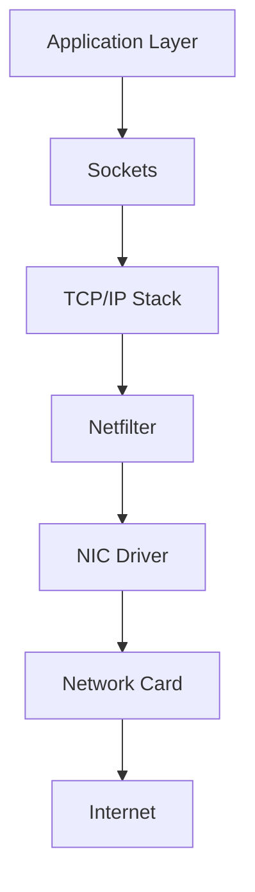

---

# 6. Where Netfilter Lives

```text
Userspace

iptables

nftables

↓

Kernel Space

Netfilter

↓

Network Drivers

↓

Hardware
```

---

# 7. Linux Networking Journey

A packet travels through many layers.

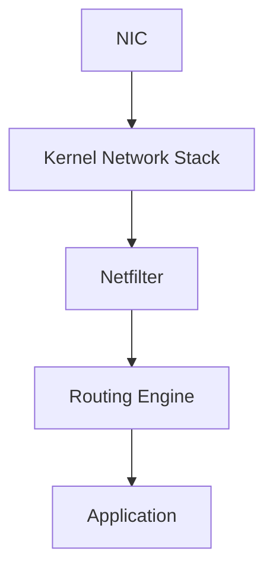

---

# 8. The Five Hooks (Most Important Concept)

Netfilter inserts five checkpoints.

```text
PREROUTING

INPUT

FORWARD

OUTPUT

POSTROUTING
```

Memorize these.

Everything else builds on them.

---

# 9. The Master Diagram

This diagram is the heart of Linux networking.

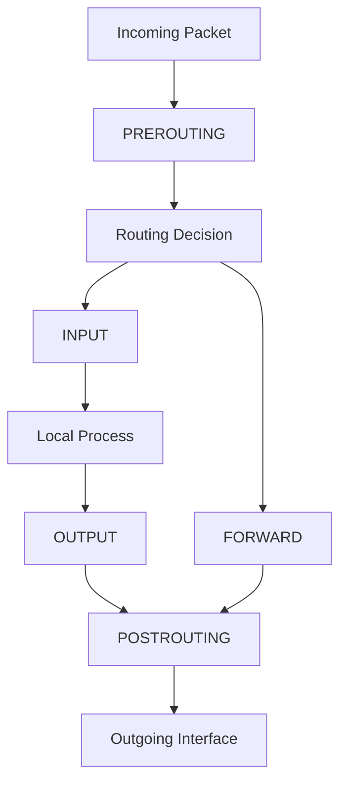

This diagram explains almost everything.

---

# 10. Three Possible Packet Destinations

Every packet has only three possibilities.

---

## Destination 1

Local machine.

```text
SSH

HTTPS

DNS
```

Path:

```text
Packet

↓

INPUT

↓

Application
```

---

## Destination 2

Forward to another machine.

Example:

```text
Router

VPN Gateway

Kubernetes Node
```

Path:

```text
Packet

↓

FORWARD

↓

Another Machine
```

---

## Destination 3

Generated locally.

Example:

```text
curl

wget

apt update
```

Path:

```text
OUTPUT

↓

Internet
```

---

# 11. PREROUTING

First checkpoint.

Question:

> "Packet arrived. Where should it go?"

Examples:

```text
DNAT

Packet marking

QoS
```

---

# 12. INPUT

Packets intended for this machine.

Examples:

```text
SSH

HTTPS

DNS

Prometheus
```

Visual:

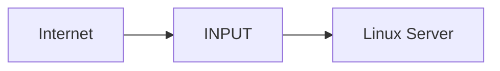

---

# 13. FORWARD

Packet passes through Linux.

Linux acts like a router.

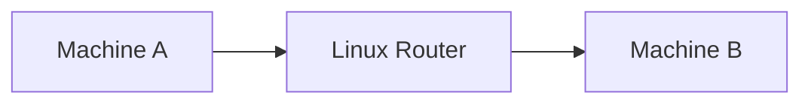

---

# 14. OUTPUT

Packets generated by Linux itself.

Examples:

```text
curl

ping

docker pull

apt update
```

Visual:

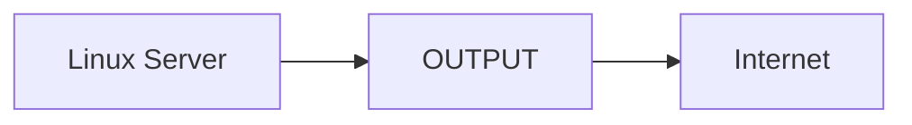

---

# 15. POSTROUTING

Final checkpoint.

Runs before packets leave.

Examples:

```text
SNAT

MASQUERADE

Traffic shaping
```

---

# 16. Complete Example: SSH Request

Suppose:

```text
Laptop

↓

Server
```

SSH:

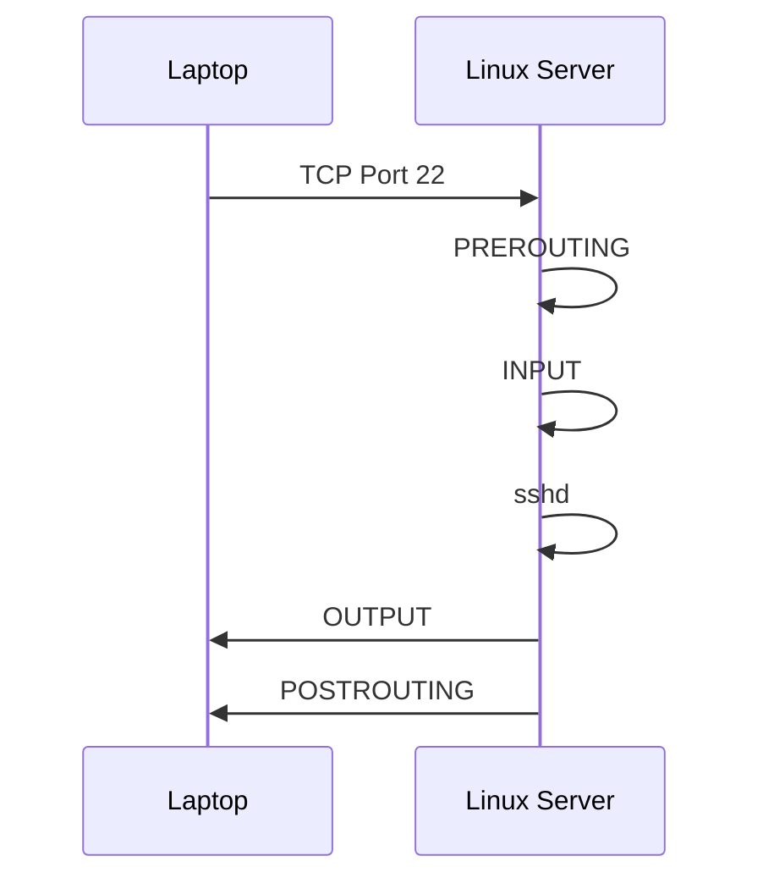

---

# 17. Connection Tracking (Extremely Important)

Netfilter remembers connections.

Subsystem:

```text
conntrack
```

Purpose:

```text
Who initiated?

Who responded?

Is this valid?
```

---

# 18. Connection States

```text
NEW

ESTABLISHED

RELATED

INVALID
```

Memorize these.

---

# 19. NEW

A brand new connection.

Example:

```text
Browser

↓

Website
```

---

# 20. ESTABLISHED

Connection already exists.

```text
Request

↓

Response
```

---

# 21. RELATED

Connected to an existing connection.

Example:

```text
FTP Data Channel

ICMP Errors
```

---

# 22. INVALID

Malformed packets.

Examples:

```text
Corrupted

Unexpected

Tampered
```

Often dropped.

---

# 23. Connection Tracking Visual

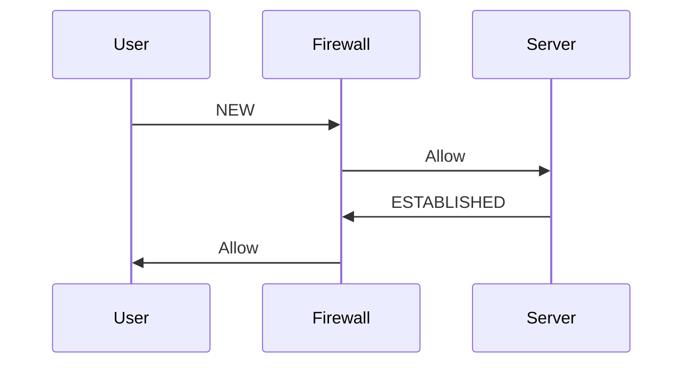

---

# 24. Why Stateful Firewalls Work

Without conntrack:

```text
Request enters

↓

Response blocked
```

With conntrack:

```text
Request enters

↓

Remember connection

↓

Allow response
```

---

# 25. NAT (Network Address Translation)

Another huge feature.

Purpose:

```text
Modify addresses
```

Types:

```text
SNAT

DNAT

MASQUERADE
```

---

# 26. DNAT

Destination NAT.

Change destination.

Example:

```text
Internet:443

↓

10.0.0.5:8080
```

---

# 27. SNAT

Source NAT.

Change source address.

Example:

```text
10.0.0.5

↓

Public IP
```

---

# 28. NAT Visualization

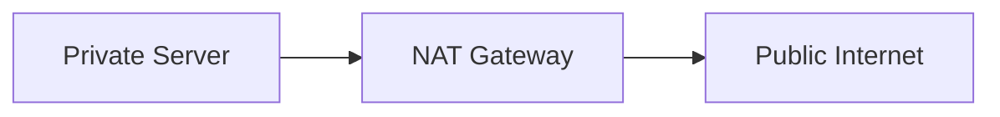

---

# 29. MASQUERADE

Dynamic SNAT.

Very common.

```text
Many Private Machines

↓

One Public IP
```

Used everywhere.

---

# 30. Linux Router Architecture

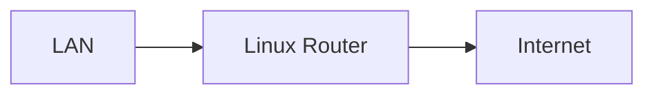

Linux can become a router.

---

# 31. Docker Depends on Netfilter

Docker automatically creates rules.

```text
Container

↓

Bridge Network

↓

Netfilter

↓

Host Network
```

---

# 32. Docker Architecture

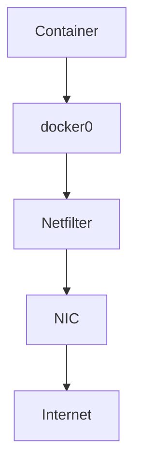

---

# 33. Kubernetes Depends On Netfilter

kube-proxy uses Netfilter.

Example:

```text
Service IP

↓

Pod IP
```

Translation happens through rules.

---

# 34. Kubernetes Visual

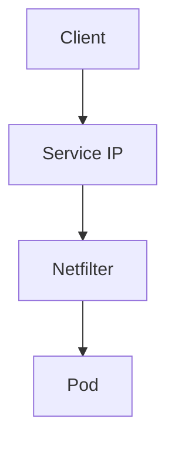

---

# 35. VPN Depends On Netfilter

VPN:

```text
Tunnel

↓

Encryption

↓

Routing

↓

Netfilter
```

Examples:

```text
WireGuard

OpenVPN
```

---

# 36. Cloud Security Uses Similar Concepts

Cloud systems are inspired by these ideas.

Examples:

```text
AWS Security Groups

AWS NACL

Azure NSG

GCP Firewall
```

---

# 37. Packet Flow in Production

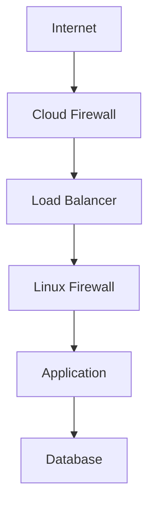

---

# 38. Linux Firewall Ecosystem

```text
Linux Kernel

↓

Netfilter

↓

nftables

↓

iptables

↓

firewalld

↓

ufw
```

---

# 39. Why nftables Replaced iptables

Problems:

```text
Complex syntax

IPv4 duplication

IPv6 duplication

Performance issues
```

nftables fixes these.

---

# 40. Performance Challenges

Modern servers process:

```text
Millions of packets

Millions of connections

Thousands of rules
```

Optimization matters.

---

# 41. Common Beginner Mistakes

## Mistake 1

Thinking iptables is the firewall.

Wrong.

---

## Mistake 2

Ignoring connection tracking.

---

## Mistake 3

Not understanding packet flow.

---

## Mistake 4

Public databases.

Never expose:

```text
3306

5432

6379
```

---

# 42. Troubleshooting Flow

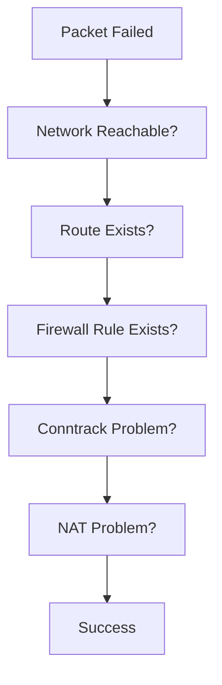

---

# 43. Useful Commands

View connections:

```bash
ss -tulnp
```

View routes:

```bash
ip route
```

View conntrack:

```bash
sudo conntrack -L
```

View nftables:

```bash
sudo nft list ruleset
```

View iptables:

```bash
sudo iptables -L -vn
```

---

# 44. Interview Questions

### Beginner

* What is Netfilter?
* Is iptables the firewall?
* What are hooks?

### Intermediate

* Explain packet flow.
* Explain connection tracking.
* Explain NAT.

### Advanced

* How does Docker use Netfilter?
* How does Kubernetes use Netfilter?
* How would you debug a production networking issue?

---

# 45. Key Takeaways

```text
Netfilter = Linux Packet Processing Engine

Five Hooks:

PREROUTING

INPUT

FORWARD

OUTPUT

POSTROUTING

Core Concepts:

Connection Tracking

NAT

Statefulness

Packet Filtering

Foundation For:

Docker

Kubernetes

VPN

Cloud Networking

iptables

nftables
```


These additions will elevate the repository from **Linux networking learning** to **production infrastructure engineering**.
