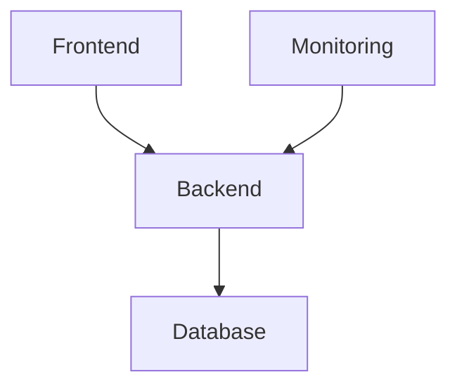
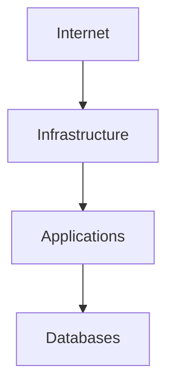
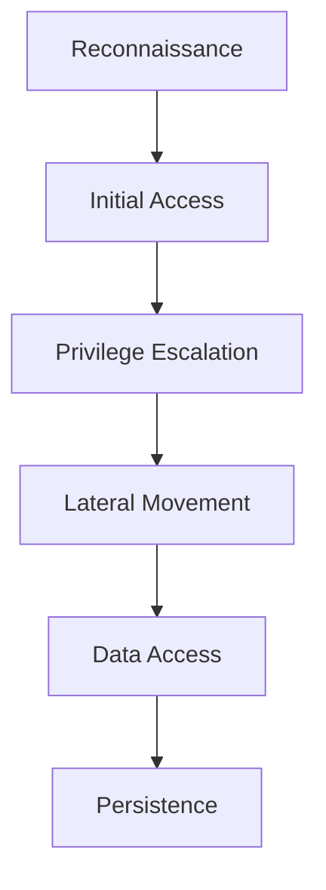
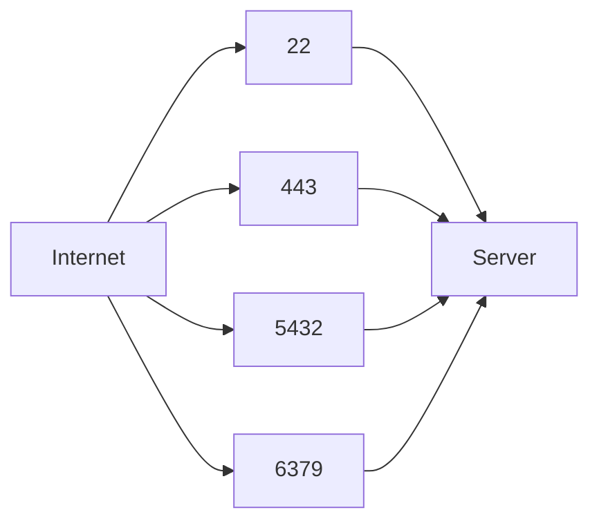
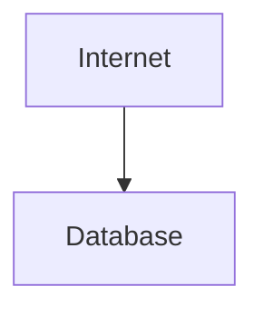
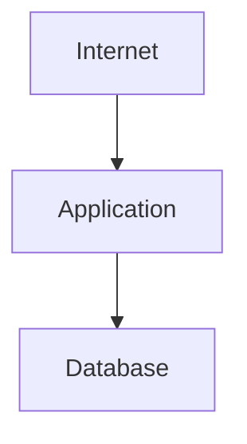
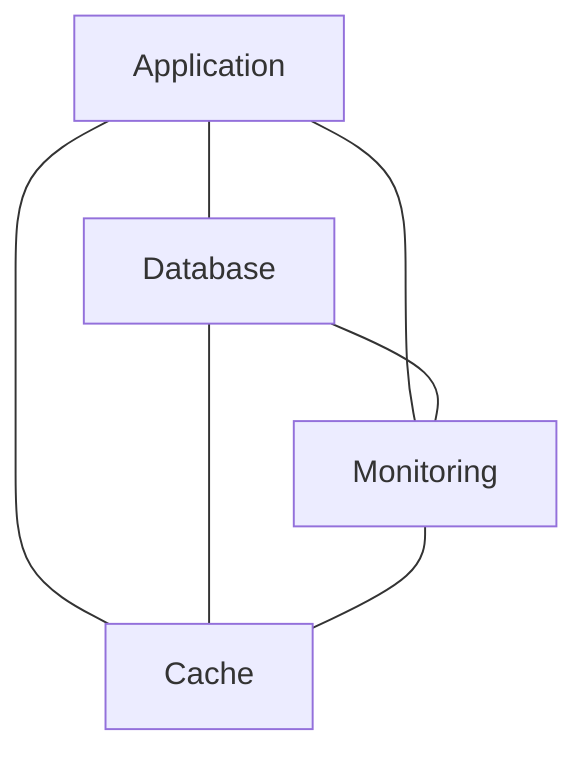
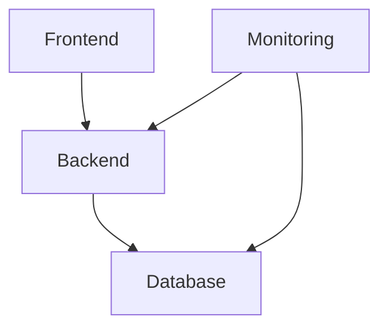
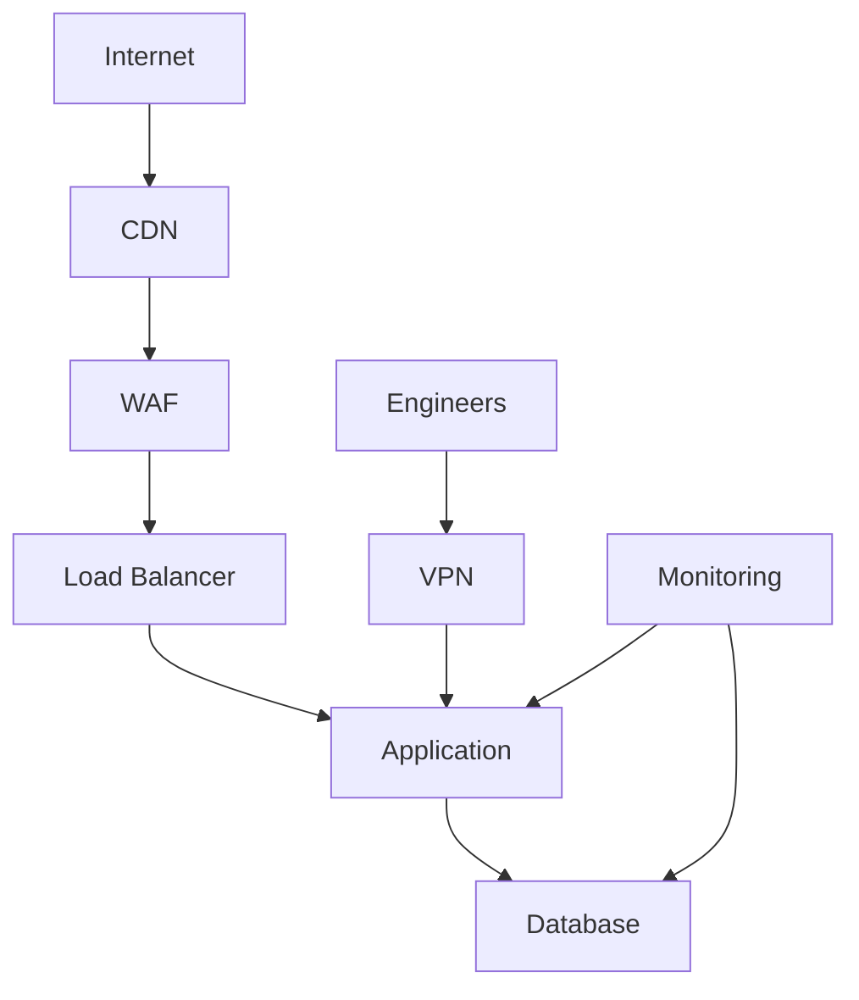

# Network Attack Surface

# 1. Why This File Is Extremely Important

Most beginners think security is:

```text
Protecting servers.
```

This is wrong.

Professional engineers think:

> **We are reducing opportunities for attackers.**

Security is a game.

Attackers are constantly asking:

> Where can I enter?

Your job is to make that answer extremely difficult.

---

# 2. First Principle: Attackers Think Differently

Suppose you built this infrastructure.



You see:

```text
Application

Database

Monitoring
```

Attackers see:

```text
Entry Points

Weaknesses

Credentials

Misconfigurations

Forgotten Services
```

The perspective is completely different.

---

# 3. What Is An Attack Surface?

Attack surface means:

> Every possible place an attacker could interact with your system.

Think of a house.

The house itself is not vulnerable.

Its openings are.

```text
Doors

Windows

Garage

Roof Access

Basement
```

Networks work the same way.

---

# 4. Infrastructure Is A Giant House



Every connection is a potential doorway.

---

# 5. The Golden Rule

More systems:

```text
↓

More complexity
```

More complexity:

```text
↓

More attack surface
```

This is one of the most important engineering truths.

---

# 6. Modern Infrastructure Is Huge

Today's infrastructure includes:

```text
Employee Laptops

Web Applications

APIs

Databases

Containers

Kubernetes

CI/CD

Cloud Accounts

Third-Party SaaS

AI Systems
```

Every item is an attack surface.

---

# 7. Why Companies Get Hacked

Usually not because attackers are magical.

Usually because of:

```text
Misconfigurations

Forgotten Services

Weak Passwords

Overly Permissive Access

Exposed Databases
```

Most incidents begin with simple mistakes.

---

# 8. Attack Surface Categories

Think in categories.

```text
Human Attack Surface

Device Attack Surface

Network Attack Surface

Infrastructure Attack Surface

Application Attack Surface

Data Attack Surface
```

This framework is extremely useful.

---

# 9. Human Attack Surface

Humans are often the weakest link.

Examples:

```text
Phishing

Social Engineering

Weak Passwords

Credential Sharing
```

Question:

> Can attackers trick people?

---

# 10. Device Attack Surface

Devices are entry points.

Examples:

```text
Employee Laptops

Phones

Tablets

Servers
```

Questions:

```text
Updated?

Encrypted?

Managed?
```

---

# 11. Network Attack Surface

Anything exposed to the network.

Examples:

```text
SSH

VPN

DNS

HTTP

HTTPS

Open Ports
```

---

# 12. Application Attack Surface

Applications expose functionality.

Examples:

```text
Login Forms

APIs

Admin Dashboards

Uploads

Search Features
```

Every feature is a potential risk.

---

# 13. Data Attack Surface

Attackers often want:

```text
Passwords

PII

Financial Data

Secrets

API Keys

AI Models
```

Data is usually the final target.

---

# 14. The Attacker Journey

Attacks rarely happen in one step.

Typical flow:



Memorize this.

---

# 15. Reconnaissance Explained

Attackers gather information first.

Questions:

```text
What domains exist?

Which ports are open?

Which technologies are used?

Which employees exist?
```

This is digital spying.

---

# 16. Public Information Is Powerful

Attackers gather information from:

```text
GitHub

LinkedIn

DNS Records

Public Repositories

Job Posts
```

Even job descriptions leak architecture information.

Example:

```text
Hiring Kubernetes Engineer

↓

Company uses Kubernetes
```

---

# 17. Open Ports Are Doors

Imagine this server.

```text
22

80

443

5432

6379
```

Question:

> Which ones truly need to be public?

Most don't.

---

# 18. Port Exposure Visualization



Every open port is an invitation.

---

# 19. The Principle Of Minimal Exposure

Bad:

```text
Expose Everything
```

Good:

```text
Expose Only Necessities
```

This principle alone prevents many incidents.

---

# 20. Attack Surface Reduction Mindset

For every service ask:

> Does this need to exist?

If:

```text
No
```

Remove it.

---

# 21. Questions Every Engineer Should Ask

Before deployment ask:

```text
Can this stay private?

Can this be internal?

Can this be removed?

Can this be restricted?
```

These questions are powerful.

---

# 22. Example: Database Exposure

Bad architecture:



Good architecture:



Database remains private.

---

# 23. Example: SSH Exposure

Bad:

```text
0.0.0.0/0
```

Good:

```text
VPN Only

Bastion Only
```

---

# 24. Why Segmentation Exists

Without segmentation:



Everything talks to everything.

Very dangerous.

---

# 25. With Segmentation



Communication becomes intentional.

---

# 26. Blast Radius

Imagine one server gets compromised.

Question:

> How much damage can happen?

Bad:

```text
Entire company
```

Good:

```text
One isolated service
```

---

# 27. Infrastructure Complexity Is Dangerous

More systems:

```text
↓

More Configurations

↓

More Mistakes

↓

More Risks
```

Complexity itself becomes an attack surface.

---

# 28. Cloud Attack Surfaces

Cloud introduces new risks.

Examples:

```text
Public S3 Buckets

Overly Permissive IAM

Exposed Secrets

Open Security Groups
```

---

# 29. Kubernetes Attack Surfaces

Examples:

```text
Exposed Dashboards

Open etcd

Secrets

Container Escapes
```

---

# 30. CI/CD Attack Surface

Many beginners ignore this.

Examples:

```text
GitHub Actions

Jenkins

Secrets

Deployment Keys
```

These are high-value targets.

---

# 31. Third Party Attack Surface

Modern companies depend on:

```text
Stripe

GitHub

Slack

OpenAI

Cloud Providers
```

Your dependencies become part of your attack surface.

---

# 32. The Attack Surface Reduction Framework

Ask six questions.

```text
Can I remove it?

Can I disable it?

Can I hide it?

Can I segment it?

Can I monitor it?

Can I automate protection?
```

Memorize this framework.

---

# 33. Production Example

Modern architecture:



Notice:

Not everything is public.

---

# 34. Security Is About Reducing Probability

We cannot eliminate attacks.

We can reduce:

```text
Attack Opportunities

Attack Success

Attack Impact
```

---

# 35. Common Beginner Mistakes

### Mistake 1

Public databases.

Wrong.

---

### Mistake 2

Exposing SSH globally.

Wrong.

---

### Mistake 3

Keeping unused services running.

Wrong.

---

### Mistake 4

Trusting internal networks.

Wrong.

---

# 36. Attack Surface Reduction Checklist

```text
✓ Close unused ports

✓ Disable unused services

✓ Use VPN

✓ Segment networks

✓ Apply least privilege

✓ Harden Linux

✓ Monitor systems

✓ Use MFA

✓ Reduce public exposure
```

---

# 37. Troubleshooting Mindset

Whenever you deploy something ask:

```text
What did I expose?

Who can access it?

Why do they need access?

What happens if compromised?
```

This mindset scales everywhere.

---

# 38. Interview Questions

### Beginner

* What is an attack surface?
* Why reduce attack surface?

### Intermediate

* Explain blast radius.
* Explain attack vectors.
* Explain lateral movement.

### Advanced

* Design low attack surface infrastructure.
* Explain cloud attack surfaces.
* How would you secure a Kubernetes cluster?

---

# 39. Key Takeaways

```text
Attack Surface = Opportunities For Attackers

Reduce:

Public Exposure

Permissions

Complexity

Trust

Increase:

Visibility

Isolation

Segmentation

Monitoring
```
