# Network Segmentation

# 1. Why Should You Care?

Imagine your entire company network looks like this.

```text
Employees

Servers

Databases

Kubernetes

CI/CD

Monitoring

Everything
```

Question:

> Should every system communicate with every other system?

Absolutely not.

Without segmentation:

```text
One compromised system

↓

Entire infrastructure compromised
```

This is one of the biggest reasons large security incidents spread so quickly.

---

# 2. What Problem Are We Solving?

Suppose an attacker compromises:

```text
Developer Laptop
```

If your network looks like this:

```text
Laptop

↓

Everything Accessible
```

The attacker can move everywhere.

This is called:

> **Lateral Movement**

Segmentation prevents this.

---

# 3. What is Network Segmentation?

Network segmentation means:

> **Dividing a large network into smaller isolated networks and controlling communication between them.**

Instead of:

```text
One giant network
```

We build:

```text
Multiple smaller networks
```

---

# 4. Real World Analogy

Think of a hotel.

Without segmentation:

```text
One giant room

Everyone inside
```

Very chaotic.

Instead:

```text
Reception

Guest Rooms

Kitchen

Storage

Admin Office
```

Each area has access rules.

Networks work similarly.

---

# 5. Mental Model

Think of a company building.

```text
Building

↓

Floors

↓

Rooms

↓

Access Badges
```

Network segmentation applies the same idea to infrastructure.

---

# 6. The Biggest Security Benefit

Segmentation limits blast radius.

What is blast radius?

> The amount of damage a compromised system can cause.

Bad:

```text
Compromise One Server

↓

Compromise Everything
```

Good:

```text
Compromise One Server

↓

Contained Damage
```

---

# 7. Traditional Flat Network (Very Dangerous)

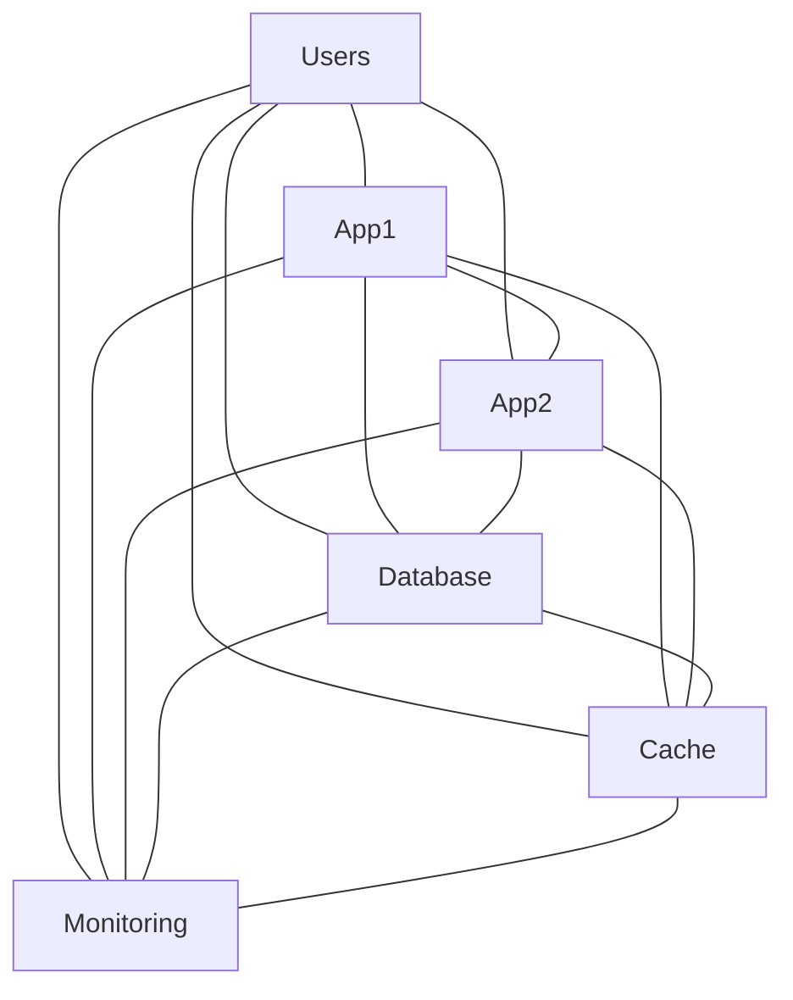

This is called:

> Flat Network

Everything trusts everything.

---

# 8. Problems With Flat Networks

Problems:

```text
No isolation

Easy lateral movement

Large blast radius

Hard security management

Difficult auditing
```

Avoid this.

---

# 9. Segmented Network

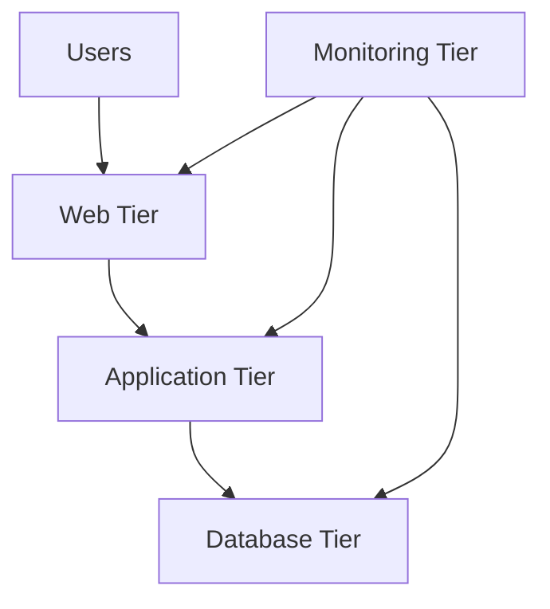

Notice:

Not everyone can talk to everyone.

---

# 10. Segmentation Principles

Ask this question repeatedly:

> Does this system really need to communicate with that system?

If answer:

```text
No

↓

Block it
```

---

# 11. Security Zones

Large infrastructures are divided into zones.

Examples:

```text
Public Zone

DMZ

Application Zone

Database Zone

Management Zone
```

---

# 12. DMZ Explained

DMZ:

> Demilitarized Zone

This is an isolated network exposed to the internet.

Examples:

```text
Web Servers

Load Balancers

API Gateways
```

---

# 13. DMZ Architecture

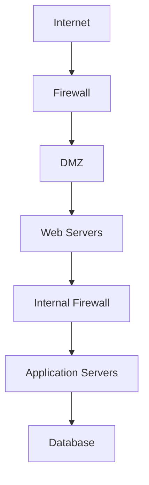

This is extremely common.

---

# 14. Security Layers

Notice multiple walls.

```text
Internet

↓

Firewall

↓

DMZ

↓

Firewall

↓

Application

↓

Firewall

↓

Database
```

This is called:

> Defense In Depth

---

# 15. North-South Traffic

Traffic entering infrastructure.

```text
Users

↓

Application
```

Visual:

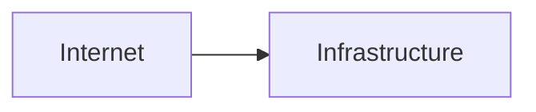

---

# 16. East-West Traffic

Traffic inside infrastructure.

```text
Application

↓

Database

↓

Cache

↓

Internal APIs
```

Visual:

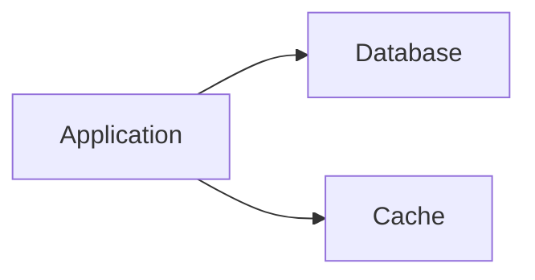

Modern attacks love east-west traffic.

---

# 17. Why East-West Security Is Important

Attackers rarely stop after one machine.

Typical attack:

```text
Compromised Laptop

↓

Application Server

↓

Database

↓

Secrets

↓

Entire Infrastructure
```

Segmentation blocks this.

---

# 18. Production Example

Bad:

```text
Application Server

↓

Database

↓

SSH Open To Everyone
```

Good:

```text
Application

↓

Database

↓

Only PostgreSQL 5432
```

SSH denied.

---

# 19. Example Rule Thinking

Application server:

Allowed:

```text
Database:5432

Redis:6379

Monitoring:9100
```

Blocked:

```text
SSH

Admin Panels

Random Servers
```

---

# 20. VLANs (Virtual LAN)

One common segmentation technique.

VLAN means:

> Divide one physical network into multiple logical networks.

Example:

```text
Physical Switch

↓

VLAN 10

VLAN 20

VLAN 30
```

---

# 21. VLAN Visualization

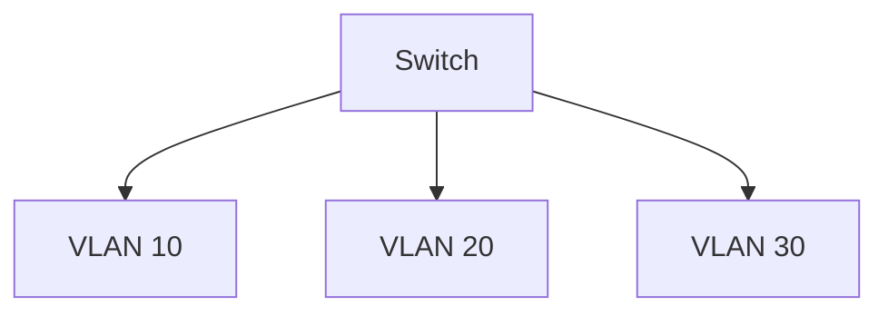

Each acts independently.

---

# 22. Cloud Segmentation

Cloud providers heavily use segmentation.

Examples:

```text
AWS VPC

Azure VNet

Google VPC
```

---

# 23. AWS Example

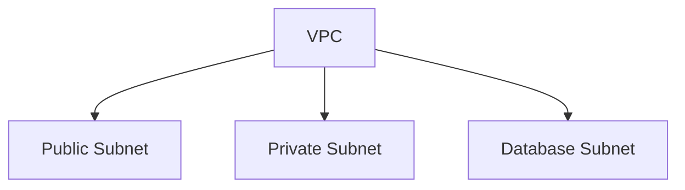

---

# 24. Kubernetes Segmentation

Pods should not trust each other.

Use:

```text
Network Policies
```

Bad:

```text
Every Pod Talks To Every Pod
```

Good:

```text
Only Required Communication
```

---

# 25. Kubernetes Visualization

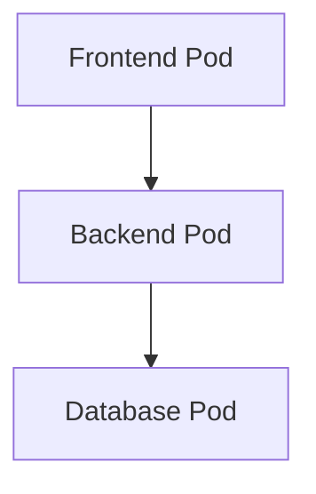

Everything else blocked.

---

# 26. Microsegmentation

This is the future.

Instead of segmenting networks:

We segment workloads.

Example:

```text
User Service

Payment Service

Notification Service

Auth Service
```

Each gets its own rules.

---

# 27. Microsegmentation Visual

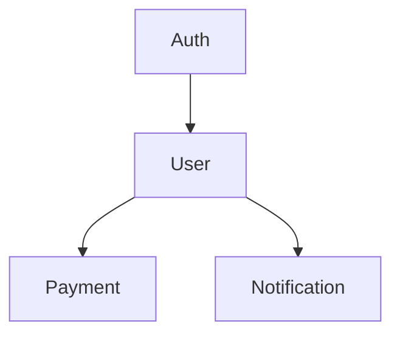

No unnecessary communication.

---

# 28. Technologies Used

Common tools:

```text
Firewalls

VLANs

Security Groups

NACLs

Service Mesh

Kubernetes Network Policies

Zero Trust Platforms
```

---

# 29. Segmentation + Zero Trust

These work together.

```text
Zero Trust

↓

Identity

↓

Segmentation

↓

Least Privilege
```

---

# 30. Production Architecture

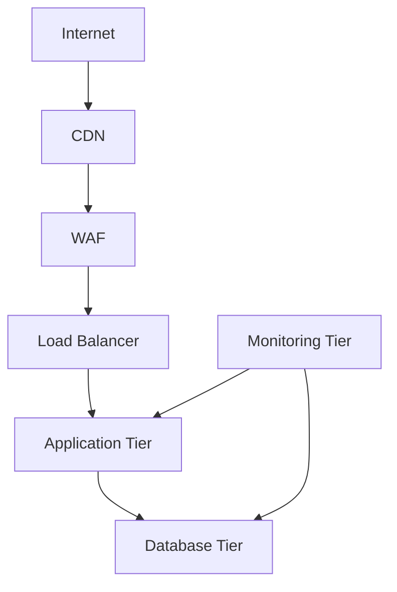

---

# 31. Segmentation Decision Framework

Ask these questions.

```text
Who needs access?

Why?

How often?

For how long?

What protocol?

What port?
```

If unnecessary:

```text
Deny
```

---

# 32. Common Beginner Mistakes

### Mistake 1

Everything inside VPC is trusted.

Wrong.

---

### Mistake 2

Public databases.

Wrong.

---

### Mistake 3

Every Kubernetes pod talks to every pod.

Wrong.

---

### Mistake 4

Monitoring servers get admin access everywhere.

Wrong.

---

# 33. Troubleshooting Flow

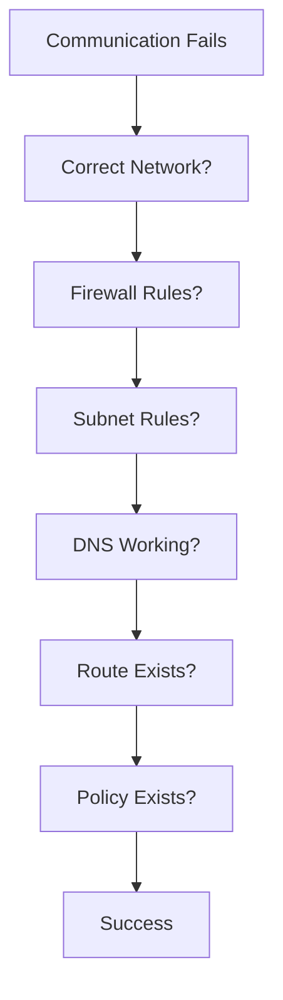

---

# 34. Interview Questions

### Beginner

* What is network segmentation?
* Why is it important?

### Intermediate

* Explain east-west traffic.
* Explain DMZ.
* Explain blast radius.

### Advanced

* How would you segment a Kubernetes cluster?
* How would you segment AWS infrastructure?
* How does segmentation support Zero Trust?

---

# 35. Key Takeaways

```text
Network Segmentation = Divide Infrastructure

Goals:

Reduce Blast Radius

Prevent Lateral Movement

Improve Security

Improve Visibility

Support Zero Trust

Concepts:

DMZ

VLAN

East-West Traffic

North-South Traffic

Microsegmentation
```
ity-layers.md` will connect **all the previous files into one complete security mental model**.
