# nftables

# 1. What is nftables?

`nftables` is the **modern Linux firewall framework** that replaces iptables.

Very important:

> **nftables is NOT a new firewall engine.**

The actual firewall engine is still:

```text
Linux Kernel

↓

Netfilter

↓

nftables
```

nftables is simply a better way to configure Netfilter.

Think:

```text
Old World

iptables

↓

Modern World

nftables
```

---

# 2. Why nftables Was Created

iptables had problems.

As Linux systems became larger:

```text
Containers

Cloud

Microservices

Kubernetes

Multi-cloud

Large Datacenters
```

iptables became harder to manage.

Problems:

```text
Complex syntax

IPv4 duplication

IPv6 duplication

Performance issues

Multiple tools

Rule management complexity
```

nftables solves these.

---

# 3. Evolution of Linux Firewalls

```text
ipfwadm

↓

ipchains

↓

iptables

↓

nftables
```

---

# 4. Mental Model

Think of nftables as:

> **A programmable firewall language for Linux.**

Instead of many separate tools:

```text
iptables

ip6tables

arptables

ebtables
```

nftables unifies everything.

---

# 5. High Level Architecture

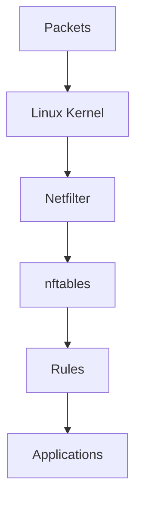

---

# 6. Linux Networking Stack

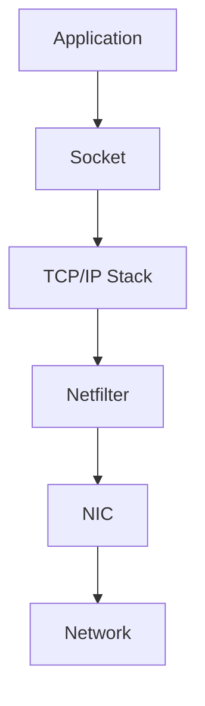

nftables configures Netfilter.

---

# 7. Major Design Improvements

nftables introduces:

```text
Unified architecture

Simpler syntax

Faster lookups

Sets

Maps

Atomic updates

Less duplication
```

---

# 8. Biggest Difference

iptables:

```text
iptables

ip6tables

arptables

ebtables
```

nftables:

```text
nft
```

One tool for everything.

---

# 9. Core Building Blocks

```text
Tables

↓

Chains

↓

Rules

↓

Sets

↓

Maps
```

Memorize this hierarchy.

---

# 10. Architecture Visualization

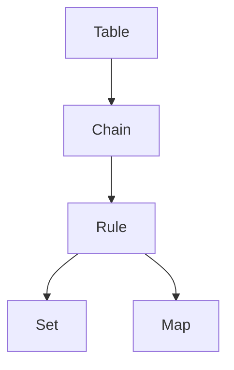

---

# 11. Tables

Tables are containers.

Example:

```text
inet filter
```

Example command:

```bash
nft add table inet filter
```

---

# 12. Why `inet` Matters

This is one of the best improvements.

iptables:

```text
IPv4 rules

IPv6 rules
```

nftables:

```text
One rule

↓

Both IPv4 + IPv6
```

Example:

```text
inet
```

Family:

```text
ip

ip6

inet

arp

bridge

netdev
```

---

# 13. Chains

Chains contain rules.

Create one:

```bash
nft add chain inet filter input
```

---

# 14. Rules

Rules define behavior.

Example:

```bash
nft add rule inet filter input tcp dport 22 accept
```

Meaning:

```text
Protocol = TCP

Port = 22

Action = ACCEPT
```

---

# 15. Packet Journey

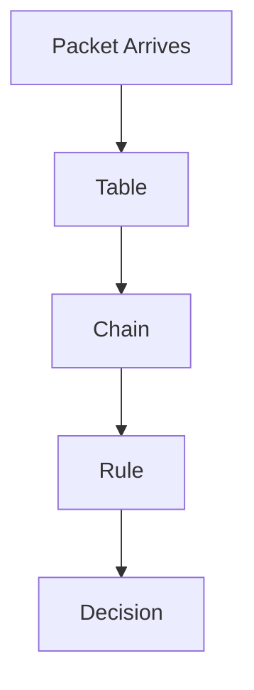

---

# 16. Netfilter Hooks Still Exist

nftables uses the same hooks.

```text
PREROUTING

INPUT

FORWARD

OUTPUT

POSTROUTING
```

Nothing changes here.

---

# 17. Hook Visualization

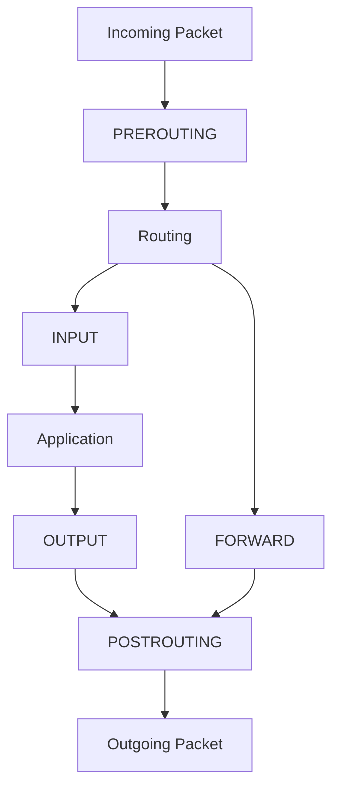

This is still Netfilter.

---

# 18. Base Chains

A chain needs:

```text
Hook

Priority

Policy
```

Example:

```bash
nft add chain inet filter input \
'{ type filter hook input priority 0; policy drop; }'
```

---

# 19. Default Deny Strategy

Very important.

Policy:

```text
drop
```

Meaning:

```text
Everything blocked

↓

Explicitly allow what is needed
```

---

# 20. Example Production Rules

Allow loopback:

```bash
nft add rule inet filter input iif lo accept
```

Allow established connections:

```bash
nft add rule inet filter input \
ct state established,related accept
```

Allow SSH:

```bash
nft add rule inet filter input tcp dport 22 accept
```

Allow HTTPS:

```bash
nft add rule inet filter input tcp dport 443 accept
```

---

# 21. Connection Tracking

Same concept as iptables.

States:

```text
new

established

related

invalid
```

---

# 22. Stateful Firewall Visual

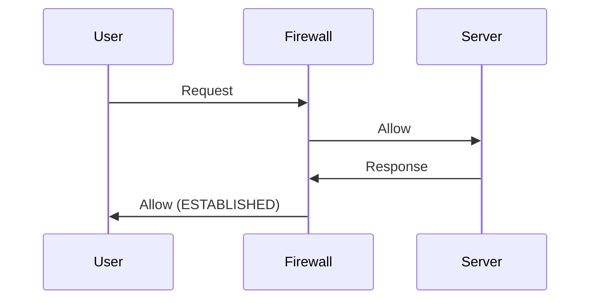

---

# 23. Sets (Huge Improvement)

iptables:

```text
Many repetitive rules
```

nftables:

```text
One rule

↓

Many values
```

---

# 24. Example Set

Create:

```bash
nft add set inet filter allowed_ports \
'{ type inet_service; }'
```

Add:

```bash
nft add element inet filter allowed_ports \
'{22,80,443}'
```

Use:

```bash
nft add rule inet filter input \
tcp dport @allowed_ports accept
```

---

# 25. Set Visualization

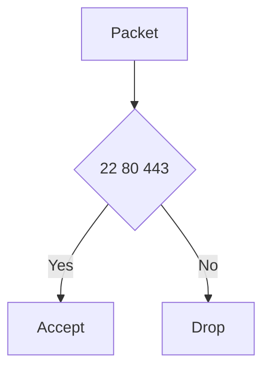

---

# 26. Maps

Maps are key-value lookups.

Example:

```text
443 → accept

22 → accept

3306 → drop
```

Very efficient.

---

# 27. Why Sets Are Powerful

Imagine:

```text
1000 IP addresses
```

iptables:

```text
1000 rules
```

nftables:

```text
1 rule

+

1 set
```

Huge improvement.

---

# 28. Atomic Updates

Another major feature.

iptables problem:

```text
Delete old rules

↓

Add new rules

↓

Temporary risk
```

nftables:

```text
Build configuration

↓

Apply all at once
```

Much safer.

---

# 29. Batch Updates

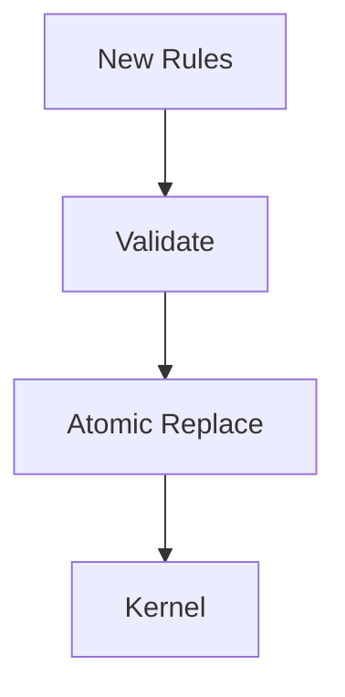

No partial states.

---

# 30. Config File

Location:

```bash
/etc/nftables.conf
```

---

# 31. Example Config

```text
table inet filter {

 chain input {

  type filter hook input priority 0;

  policy drop;

  iif lo accept

  ct state established,related accept

  tcp dport 22 accept

  tcp dport 443 accept

 }

}
```

---

# 32. Load Configuration

Apply:

```bash
sudo nft -f /etc/nftables.conf
```

---

# 33. View Entire Ruleset

```bash
sudo nft list ruleset
```

Very important command.

---

# 34. Production Architecture

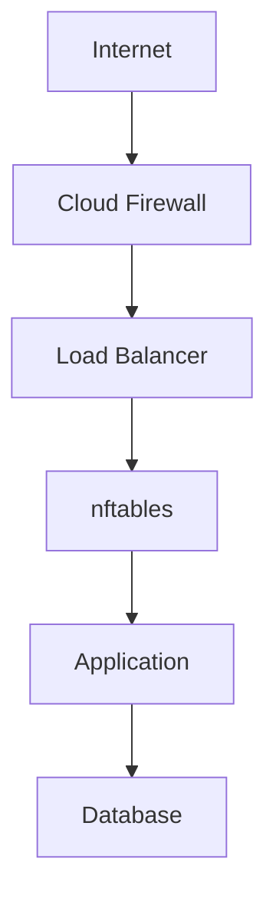

---

# 35. Container Ecosystem

Many systems use nftables now.

Examples:

```text
Docker

Podman

Kubernetes

firewalld
```

Depending on distribution.

---

# 36. firewalld Relationship

Very important.

```text
firewalld

↓

nftables

↓

Netfilter
```

firewalld is a higher abstraction layer.

---

# 37. Modern Linux Stack

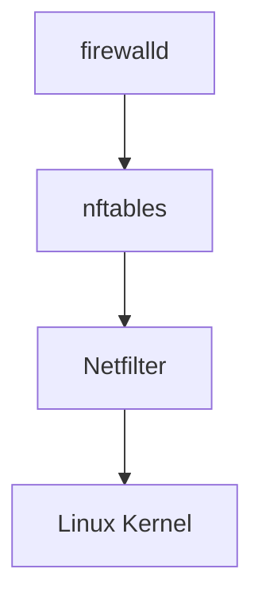

---

# 38. iptables Compatibility Layer

Modern Linux often does:

```text
iptables command

↓

iptables-nft

↓

nftables

↓

Netfilter
```

Many people don't realize this.

---

# 39. Check Which Backend Is Used

Ubuntu:

```bash
iptables --version
```

May output:

```text
iptables v1.8.x (nf_tables)
```

Meaning:

```text
iptables

↓

nftables backend
```

---

# 40. Performance Advantages

nftables is better because:

```text
Less memory

Fewer rules

Faster lookups

Atomic updates

Cleaner architecture
```

---

# 41. Enterprise Security Architecture

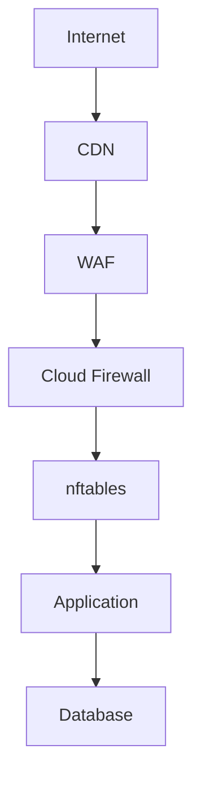

---

# 42. Common Mistakes

### Mistake 1

Allow all traffic.

Bad:

```text
policy accept
```

---

### Mistake 2

Forget loopback.

```text
127.0.0.1 breaks
```

---

### Mistake 3

Forget established rules.

Responses stop working.

---

### Mistake 4

Expose databases publicly.

Never expose:

```text
3306

5432

6379
```

---

# 43. Troubleshooting Flow

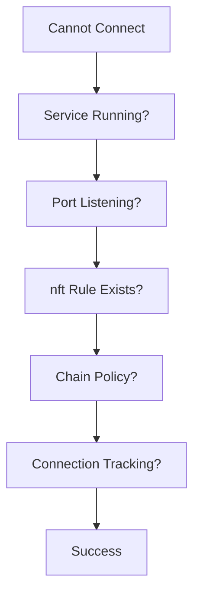

---

# 44. Useful Commands

List rules:

```bash
nft list ruleset
```

List tables:

```bash
nft list tables
```

List chains:

```bash
nft list chains
```

Check listening ports:

```bash
ss -tulnp
```

---

# 45. iptables vs nftables

| Feature           | iptables | nftables  |
| ----------------- | -------- | --------- |
| Modern            | ❌        | ✅         |
| Unified IPv4/IPv6 | ❌        | ✅         |
| Sets              | Limited  | ✅         |
| Maps              | ❌        | ✅         |
| Atomic Updates    | ❌        | ✅         |
| Syntax            | Complex  | Cleaner   |
| Future            | Legacy   | Preferred |

---

# 46. Interview Questions

### Beginner

* What is nftables?
* Why was nftables created?

### Intermediate

* Explain tables, chains, and rules.
* Explain sets.
* Explain atomic updates.

### Advanced

* Explain iptables-nft compatibility.
* Why is nftables better for cloud infrastructure?
* How would you design firewall rules for Kubernetes?

---

# 47. Key Takeaways

```text
nftables ≠ Firewall

Netfilter = Firewall Engine

nftables = Modern Configuration Tool

Big Improvements:

Unified IPv4/IPv6

Sets

Maps

Atomic Updates

Cleaner Syntax

Future of Linux Firewalls
```
