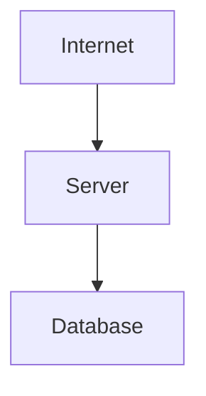
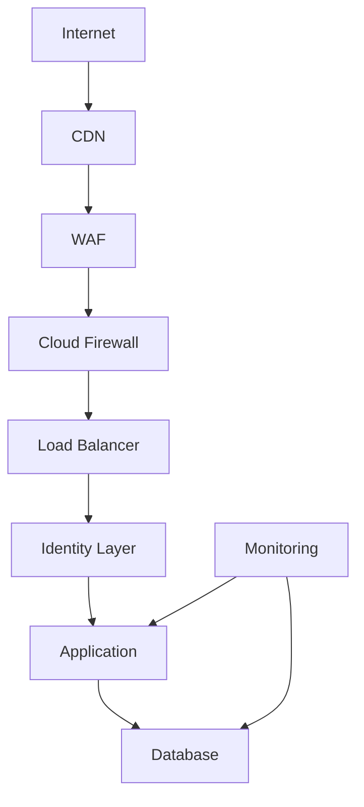
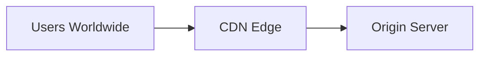
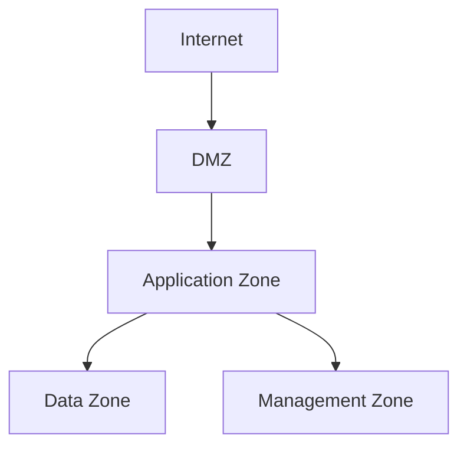
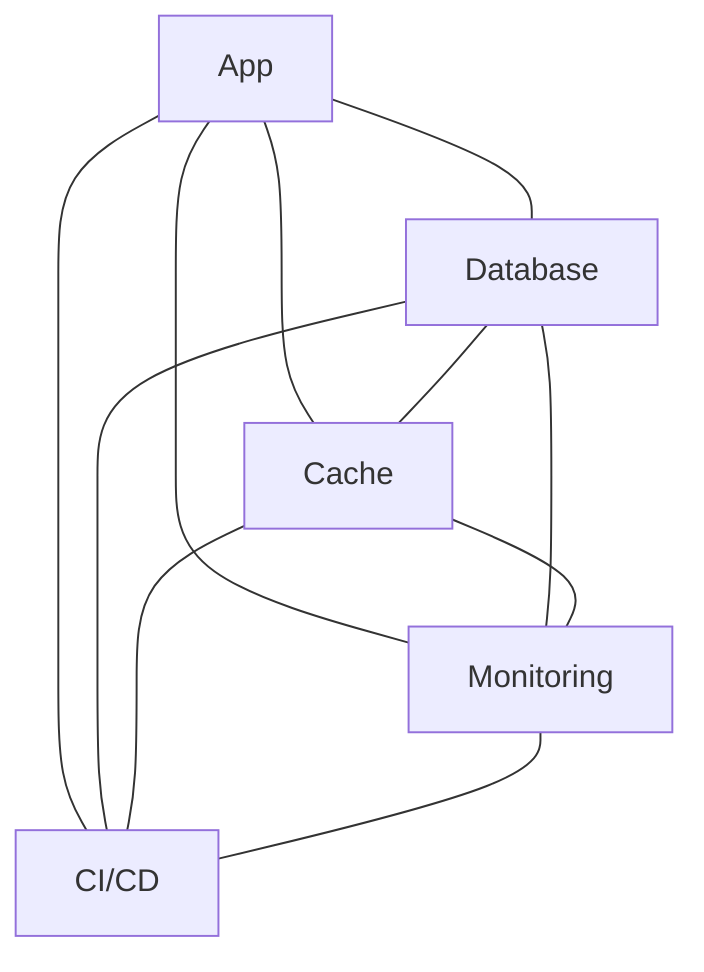
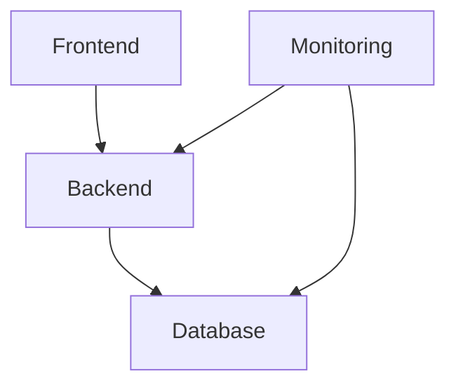
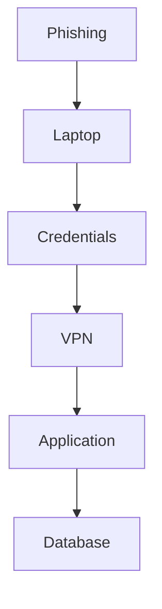
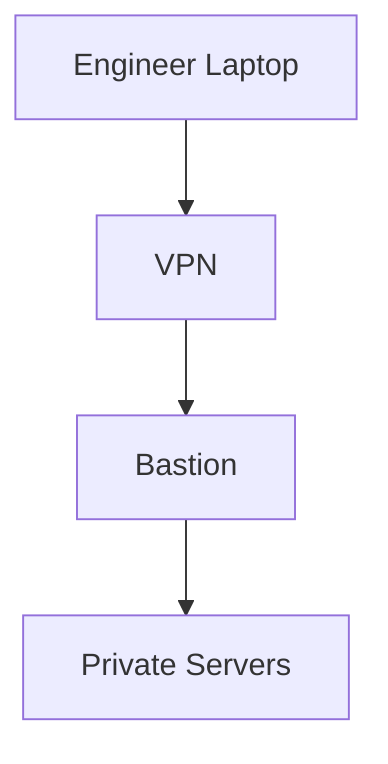
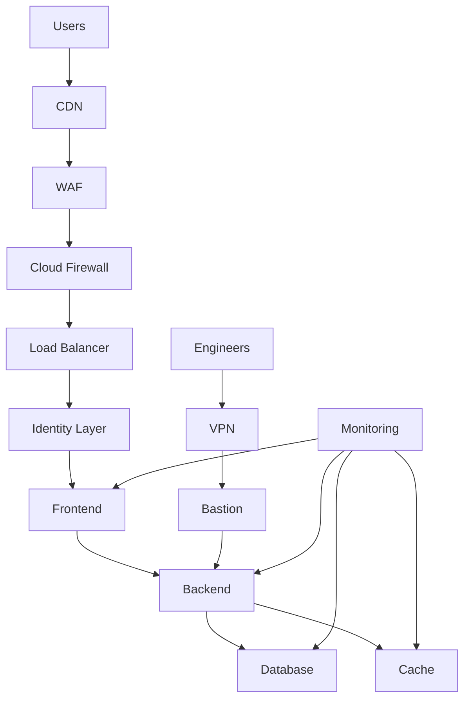

# Production Security Architecture

# 1. Why This File Is Extremely Important

This file is different from all previous files.

Until now we learned individual technologies.

```text
Firewall

VPN

SSH

WireGuard

Segmentation

Zero Trust

Hardening

Observability
```

But real engineers don't build systems using isolated technologies.

They build systems.

This file teaches:

> **How professional engineers think when designing secure infrastructure.**

This is one of the biggest mindset shifts in engineering.

---

# 2. Beginners Usually Think Like This

Most beginners visualize infrastructure like this.



This is how many tutorial projects look.

Unfortunately:

> Real production systems do not look like this.

---

# 3. Professional Engineers Think Differently

Professional engineers ask these questions first.

```text
What are we protecting?

Who needs access?

What should never be public?

What happens if one system is compromised?

How do we detect attacks?

How do we recover?
```

Security is mostly asking good questions.

---

# 4. Modern Infrastructure Is Distributed

A company today may have:

```text
Employees

Contractors

Cloud Infrastructure

AI Services

Microservices

Databases

CI/CD

Kubernetes

Monitoring Systems

Third Party SaaS
```

All of these require protection.

---

# 5. The Five Truths Of Modern Security

Memorize these.

### Truth 1

Attackers will attack.

### Truth 2

Attackers may eventually enter.

### Truth 3

Some layers will fail.

### Truth 4

Visibility is mandatory.

### Truth 5

Recovery is as important as prevention.

---

# 6. The Security Journey Of A Request

Imagine a user opening an application.

Question:

> How many security systems should this request pass through?

Answer:

Many.

---

# 7. Modern Architecture Overview



Every block exists for a reason.

---

# 8. Layer 1: Internet (Untrusted World)

Everything outside your infrastructure is untrusted.

Never assume:

```text
Public Traffic = Safe
```

Always assume:

```text
Public Traffic = Potentially Malicious
```

This mindset is extremely important.

---

# 9. Layer 2: CDN (Content Delivery Network)

Problem:

Without a CDN:

```text
Millions of users

↓

Application Server
```

Bad.

CDNs help by:

```text
Caching

Performance

Basic Protection

Global Distribution
```

Examples you may encounter later:

```text
Cloudflare

Fastly

Akamai
```

---

# 10. CDN Visual



The CDN becomes a protective buffer.

---

# 11. Layer 3: WAF (Web Application Firewall)

WAF focuses on applications.

Question:

> Is this HTTP request dangerous?

Examples:

```text
SQL Injection

XSS

Path Traversal
```

WAF sits in front of applications.

---

# 12. Layer 4: Cloud Firewall

Question:

> Should this traffic even reach our infrastructure?

Examples:

```text
Allow HTTPS

Block everything else
```

This reduces attack opportunities.

---

# 13. Layer 5: Load Balancer

Load balancers are not security tools.

But they help security.

Benefits:

```text
Traffic Distribution

High Availability

TLS Termination

Isolation
```

---

# 14. Layer 6: Identity Layer

Modern systems trust identities.

Questions:

```text
Who are you?

What role do you have?

Which device are you using?
```

This is where:

```text
MFA

SSO

IAM

OIDC
```

operate.

---

# 15. Layer 7: Application Layer

Applications become huge attack targets.

Applications must validate:

```text
Input

Authentication

Authorization

Business Logic
```

Never trust users.

---

# 16. Layer 8: Database Layer

Databases are rarely public.

Bad:

```text
Internet

↓

Database
```

Good:

```text
Internet

↓

Application

↓

Database
```

Databases remain private.

---

# 17. The Golden Rule

The deeper a system is inside infrastructure:

> The less accessible it should become.

---

# 18. Public vs Private Thinking

Public:

```text
CDN

WAF

Load Balancer
```

Semi-private:

```text
Applications
```

Private:

```text
Databases

Caches

Monitoring
```

Very private:

```text
Secrets
```

---

# 19. Security Zones

Professional systems divide infrastructure into zones.



Each zone has rules.

---

# 20. DMZ Explained Properly

DMZ means:

> Controlled exposure.

Examples:

```text
API Gateway

Load Balancer

Reverse Proxy
```

DMZ does NOT mean:

```text
Everything Public
```

---

# 21. Why Segmentation Exists

Without segmentation:



Chaos.

---

# 22. With Segmentation



Communication becomes intentional.

---

# 23. Principle Of Least Privilege

Question:

> What is the minimum access required?

Always choose minimum.

Bad:

```text
Admin Everywhere
```

Good:

```text
Specific Access Only
```

---

# 24. Blast Radius Thinking

Question:

> If one server is compromised, what is the damage?

Bad:

```text
Entire Company
```

Good:

```text
One Isolated Service
```

---

# 25. Attack Chains

Attackers rarely jump directly to databases.

Typical attack:



Security breaks this chain.

---

# 26. East-West Security

Very important.

North-South:

```text
Users

↓

Applications
```

East-West:

```text
Service

↓

Service

↓

Database
```

Modern attackers love east-west movement.

---

# 27. Bastion Architecture

Never expose everything.

Instead:



This is very common.

---

# 28. Zero Trust Architecture

Old:

```text
Inside = Trusted
```

Modern:

```text
Nobody = Trusted
```

Every request is verified.

---

# 29. Security Is Also About Time

Engineers optimize time.

Three metrics matter.

```text
Time To Detect

Time To Respond

Time To Recover
```

Smaller is better.

---

# 30. Security Observability

Observe everything.

Examples:

```text
Users

Devices

Servers

Applications

Databases

Networks
```

Without visibility:

You are blind.

---

# 31. Logs, Metrics And Traces

Logs:

```text
What happened?
```

Metrics:

```text
How much?
```

Traces:

```text
Where did it travel?
```

All three work together.

---

# 32. Secrets Architecture

Never do this.

```javascript
const password = "admin123";
```

Never store secrets inside code.

Use dedicated systems.

Examples:

```text
Secret Managers

Vault Systems

Cloud Secret Stores
```

---

# 33. Human Security Layer

Humans remain a huge attack surface.

Risks:

```text
Phishing

Weak Passwords

Social Engineering
```

Technology alone cannot solve these.

---

# 34. Shared Responsibility Model

Cloud providers secure:

```text
Datacenters

Hardware

Infrastructure
```

You secure:

```text
Applications

Users

Data

Configurations
```

---

# 35. Kubernetes Security Thinking

Protect:

```text
Pods

Nodes

Secrets

Network Policies

Service Accounts
```

Everything requires rules.

---

# 36. CI/CD Security

Protect:

```text
GitHub Actions

Jenkins

Deployment Tokens

Secrets
```

CI/CD is extremely powerful.

Attackers love CI/CD systems.

---

# 37. AI Era Security

Protect:

```text
AI APIs

Model Keys

Prompt Data

Vector Databases

Embeddings
```

AI systems become new attack surfaces.

---

# 38. Production Security Mindset

Before deploying anything ask:

```text
Can this stay private?

Can this be internal?

Can I reduce access?

Can I monitor this?

Can I isolate this?

Can I recover from compromise?
```

These six questions are incredibly powerful.

---

# 39. Master Architecture Diagram

This is one of the most important diagrams in the repository.



Study this diagram multiple times.

It connects dozens of concepts together.

---

# 40. Engineering Security Framework (Memorize This)

Whenever building anything ask:

```text
What am I protecting?

Who needs access?

Who should never access this?

How do I verify identity?

How do I monitor it?

How do I recover?
```

This framework scales everywhere.

---

# 41. Interview Questions

## Beginner

* What is production security architecture?
* Why do we use multiple layers?

## Intermediate

* Explain security zones.
* Explain blast radius.
* Explain east-west traffic.

## Advanced

* Design a secure cloud architecture.
* Design secure Kubernetes infrastructure.
* Design a secure startup architecture.

---

# 42. Master Takeaways

```text
Security ≠ Firewall

Security ≠ VPN

Security = Systems Thinking

Core Principles:

Defense In Depth

Least Privilege

Zero Trust

Segmentation

Observability

Attack Surface Reduction

Blast Radius Reduction

Identity As Perimeter
```
