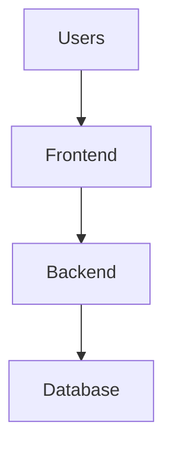
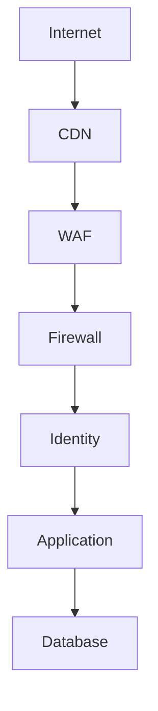
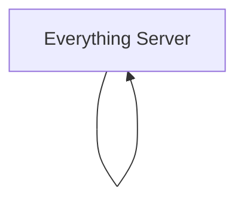
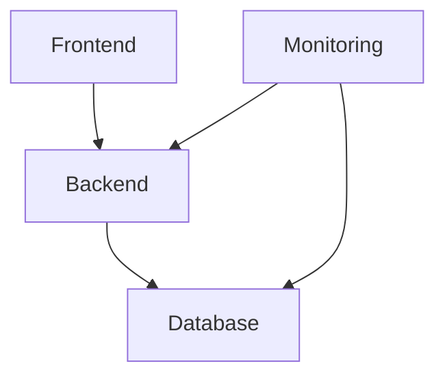
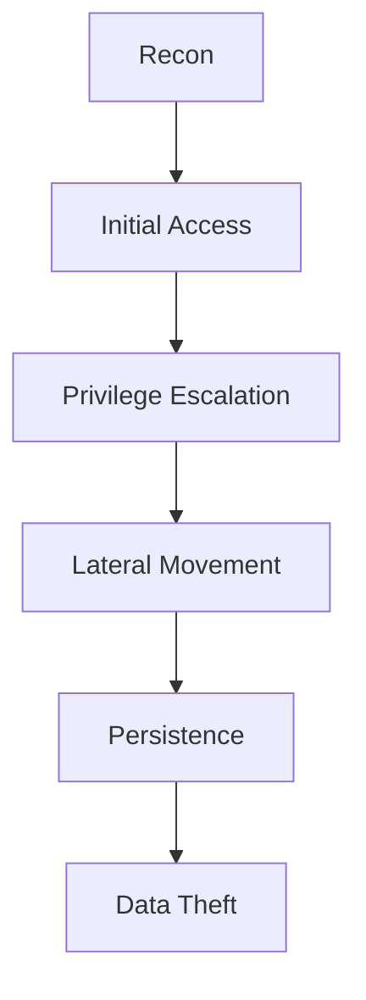
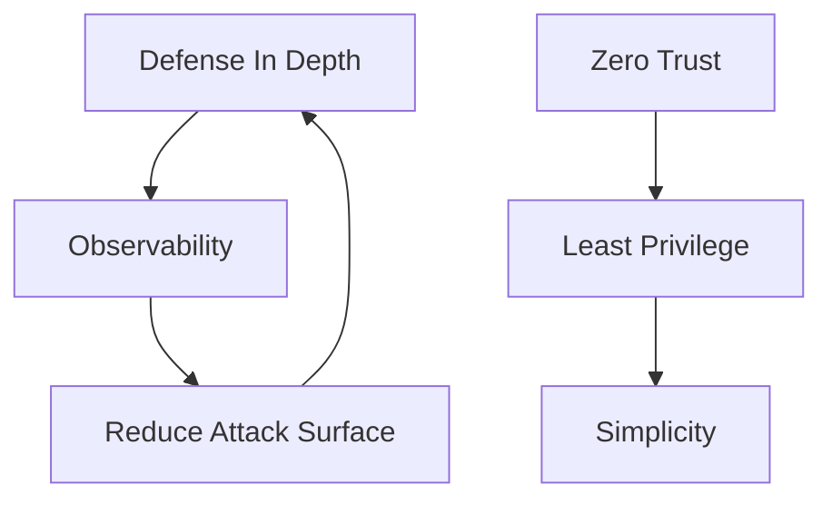
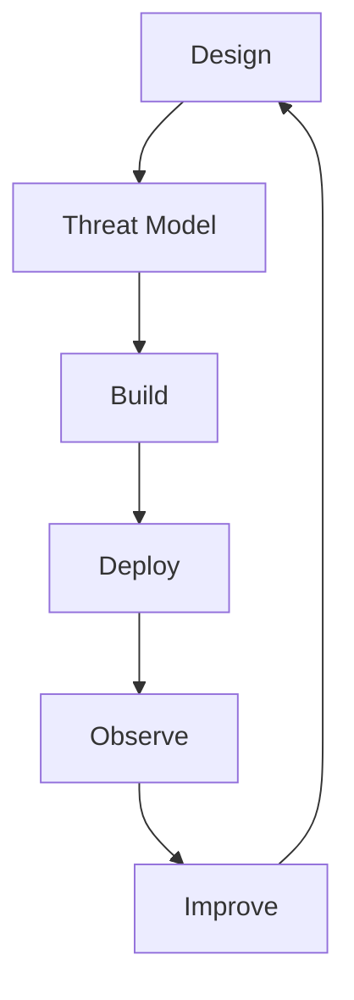

# Security Design Principles

# 1. Why This File Is More Important Than Learning Tools

Let's do a small experiment.

Imagine 10 years from now.

Many tools will disappear.

```text
Today's Tool

↓

Deprecated

↓

Replaced

↓

New Tool
```

This happens constantly.

But principles remain.

For example:

20 years ago.

```text
Firewall

↓

Still exists
```

VPN:

```text
↓

Still exists
```

Identity security:

```text
↓

Still exists
```

Principles survive.

Tools change.

---

# 2. First Principle: Security Is About Reducing Risk

This sentence alone can change how people learn security.

Security is NOT:

```text
Removing all risk
```

Impossible.

Security is:

```text
Reducing risk

Reducing impact

Reducing probability

Reducing damage
```

This mindset is extremely important.

---

# 3. There Is No Such Thing As A Secure System

This surprises beginners.

Question:

> Can we build a 100% secure system?

No.

Such a thing does not exist.

Instead engineers build:

```text
Difficult To Attack

Difficult To Exploit

Easy To Detect

Easy To Recover
```

Modern security is resilience.

---

# 4. The Master Equation Of Security

This equation is powerful.

```text
Risk

=

Probability

×

Impact
```

Engineers continuously reduce both.

Question:

> Can attackers succeed?

Question:

> If attackers succeed, what is the damage?

Both matter.

---

# 5. Security Is A Business Problem

This is extremely important for founders.

Companies are not protecting servers.

Companies are protecting:

```text
Customers

Money

Trust

Data

Reputation

Operations
```

Technology is only a tool.

---

# 6. The 10 Timeless Security Principles

Memorize these.

```text
1. Least Privilege

2. Defense In Depth

3. Fail Securely

4. Zero Trust

5. Reduce Attack Surface

6. Separation Of Concerns

7. Secure By Default

8. Assume Breach

9. Observability Everywhere

10. Simplicity
```

These appear everywhere.

---

---

# Principle 1: Least Privilege

# 7. What Is Least Privilege?

Question:

> What is the minimum access required?

Nothing more.

Example.

Bad:

```text
Application

↓

Database Admin Access
```

Good:

```text
Application

↓

Read/Write Only
```

Access should be precise.

---

# 8. Why Over-Permission Is Dangerous

Imagine giving everyone master keys.

```text
Office

↓

Everyone accesses everything
```

One compromise:

```text
↓

Entire company compromised
```

Bad design.

---

# 9. Least Privilege Visual



Access narrows as we move inward.

---

---

# Principle 2: Defense In Depth

# 10. Never Trust One Security Layer

Bad:

```text
Firewall

↓

Done
```

Good:

```text
Firewall

↓

Identity

↓

WAF

↓

Monitoring

↓

Segmentation
```

Security layers support each other.

---

# 11. Defense In Depth Visual



Attackers encounter multiple walls.

---

---

# Principle 3: Fail Securely

# 12. What Happens When Systems Fail?

This is a powerful question.

Bad:

```text
Authentication Service Fails

↓

Everyone Gets Access
```

Very dangerous.

Good:

```text
Authentication Service Fails

↓

Access Denied
```

Failure should become restrictive.

---

# 13. Everyday Example

Door lock.

Power outage.

Question:

Should door unlock?

Usually:

```text
No
```

The system fails securely.

---

---

# Principle 4: Zero Trust

# 14. Never Trust Automatically

Old thinking:

```text
Inside Network

↓

Trusted
```

Modern thinking:

```text
Nobody Trusted
```

Everything is verified.

---

# 15. Trust Is Dynamic

Questions:

```text
Who are you?

What device?

What location?

What time?

What resource?
```

Trust is continuously evaluated.

---

---

# Principle 5: Reduce Attack Surface

# 16. Attack Surface Explained Again

Question:

> What can attackers interact with?

Examples:

```text
Ports

APIs

Databases

SSH

Admin Panels
```

Reduce unnecessary exposure.

---

# 17. Golden Engineering Question

Before deploying anything ask:

> Does this need to exist?

If:

```text
No

↓

Remove it
```

This principle alone prevents countless incidents.

---

---

# Principle 6: Separation Of Concerns

# 18. Don't Mix Everything Together

Bad architecture:



Good architecture:



Responsibilities become isolated.

---

# 19. Why Isolation Matters

Benefits:

```text
Smaller Blast Radius

Better Visibility

Independent Scaling

Easier Troubleshooting
```

---

---

# Principle 7: Secure By Default

# 20. Secure Should Be The Default State

Bad:

```text
Everything Public
```

Good:

```text
Everything Private

↓

Explicitly Allow Access
```

This principle is extremely powerful.

---

# 21. Permission Thinking

Bad:

```text
Allow Everything

↓

Block Some Things
```

Good:

```text
Block Everything

↓

Allow Necessities
```

Default deny.

---

---

# Principle 8: Assume Breach

# 22. This Changes Everything

Question:

> What if attackers are already inside?

Now architecture changes.

You add:

```text
Segmentation

Monitoring

Identity Verification

Observability
```

Assume attackers exist.

---

# 23. The Attacker Journey



Security interrupts this chain.

---

---

# Principle 9: Observability Everywhere

# 24. Invisible Systems Cannot Be Protected

Question:

> Can we secure systems we cannot see?

No.

Observe:

```text
Users

Servers

Applications

Networks

Databases
```

Visibility is mandatory.

---

# 25. The Three Observability Pillars

```text
Logs

Metrics

Traces
```

Memorize these forever.

---

---

# Principle 10: Simplicity

# 26. Complexity Is An Attack Surface

This is one of the most important engineering truths.

More complexity:

```text
↓

More Configurations

↓

More Mistakes

↓

More Risks
```

Complexity itself becomes dangerous.

---

# 27. Why Simple Systems Are Safer

Benefits:

```text
Understandable

Auditable

Maintainable

Predictable
```

Simple systems are powerful systems.

---

# 28. These Principles Work Together

Notice how everything connects.



Nothing exists independently.

---

# 29. Apply This To A Startup

Imagine:

```text
10 employees
```

Question:

Do you need enterprise infrastructure?

No.

Apply principles.

Example.

```text
MFA

VPN

Least Privilege

Backups

Monitoring
```

Simple but effective.

---

# 30. Apply This To Kubernetes

Questions:

```text
Can pods access everything?

Can secrets be isolated?

Can service accounts be limited?

Can namespaces be segmented?
```

The principles stay the same.

Only tools change.

---

# 31. Apply This To AI Systems

Questions:

```text
Can prompts leak data?

Can APIs be abused?

Can models be stolen?

Can vector databases be protected?
```

Principles remain unchanged.

---

# 32. The Security Engineering Lifecycle

Professional engineers continuously cycle through this.



Security never ends.

---

# 33. Security Questions Every Engineer Should Memorize

Whenever building anything ask:

```text
What am I protecting?

Who needs access?

Who should never access?

What can go wrong?

How do I detect it?

How do I recover?
```

These six questions are incredibly powerful.

---

# 34. Common Beginner Mistakes

### Mistake 1

Memorizing tools.

Wrong.

Learn principles.

---

### Mistake 2

Thinking security is binary.

Wrong.

Security is probability.

---

### Mistake 3

Building first, securing later.

Wrong.

Security starts in design.

---

### Mistake 4

Trusting internal systems.

Wrong.

---

### Mistake 5

Ignoring observability.

Wrong.

---

# 35. Interview Questions

## Beginner

* What is least privilege?
* What is defense in depth?
* Why reduce attack surface?

## Intermediate

* Explain fail securely.
* Explain secure by default.
* Explain assume breach.

## Advanced

* Design infrastructure using these principles.
* Apply these principles to Kubernetes.
* Apply these principles to AI systems.

---

# 36. Master Takeaways

```text
Tools Change

Principles Stay

10 Core Principles:

Least Privilege

Defense In Depth

Fail Securely

Zero Trust

Reduce Attack Surface

Separation Of Concerns

Secure By Default

Assume Breach

Observability Everywhere

Simplicity

Remember:

Great Engineers Memorize Principles
Not Tools
```
