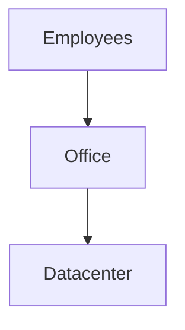
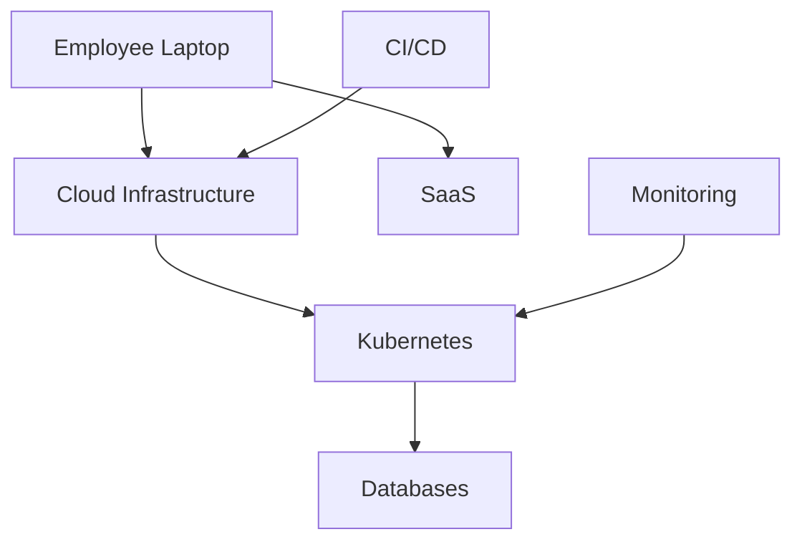
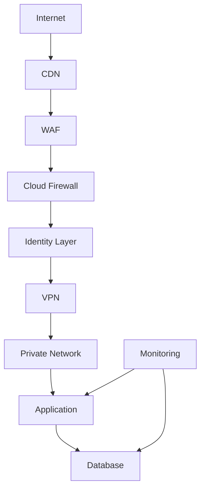
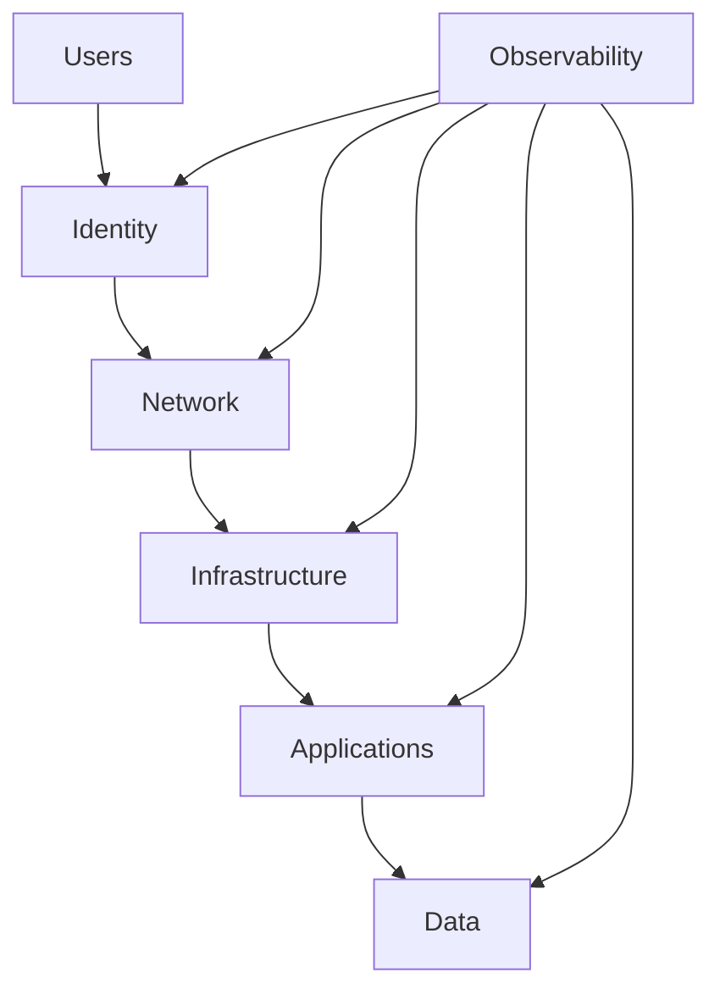

# Security Layers

# 1. Stop Thinking About Security As Tools

Most beginners learn security incorrectly.

They think:

```text
Firewall

↓

Secure
```

or

```text
VPN

↓

Secure
```

or

```text
Strong Password

↓

Secure
```

or

```text
Zero Trust

↓

Secure
```

This is not how engineers think.

Professional engineers ask:

> If this security layer fails, what protects us next?

This single question changes everything.

---

# 2. Security Is Risk Management, Not Risk Elimination

Very important.

You can never build a system like this:

```text
100% Secure System
```

It does not exist.

Engineers build systems like this:

```text
Attackers

↓

Make attacks difficult

↓

Reduce damage

↓

Detect attacks

↓

Recover quickly
```

This is modern security.

---

# 3. The Ultimate Security Formula

Every modern company is trying to solve this equation.

```text
Probability of attack

×

Probability of success

×

Blast radius

×

Recovery time
```

Engineers continuously reduce all four.

---

# 4. Security Is A Journey

Imagine building a house.

Do you only install a door?

No.

You build:

```text
Walls

Doors

Windows

Locks

Cameras

Alarms

Lighting

Security Guards
```

Networks work exactly the same way.

---

# 5. The Three Fundamental Questions Of Security

Everything engineers build answers these.

Question 1:

> Who can enter?

Question 2:

> What can they access?

Question 3:

> What happens if they are compromised?

Every technology exists to answer these questions.

---

# 6. Why Old Security Broke

Twenty years ago infrastructure looked like this.



Simple.

One office.

One datacenter.

One network.

Security model:

```text
Big Firewall

↓

Everything Inside Trusted
```

This was called:

> Castle And Moat Security

---

# 7. Why Castle And Moat Failed

Today we have:

```text
Remote Work

Cloud

Multi-cloud

Contractors

Mobile Devices

AI Systems

Microservices

Kubernetes

SaaS Applications
```

Infrastructure exploded.

Today your company exists everywhere.

---

# 8. Modern Infrastructure Is Extremely Distributed

Imagine a company today.



Attack surface became enormous.

---

# 9. Attack Surface Explained

Attack surface means:

> Every possible place an attacker could attack.

Think of a castle.

More doors:

```text
↓

More attack surface
```

More windows:

```text
↓

More attack surface
```

More systems:

```text
↓

More attack surface
```

---

# 10. Modern Attack Surfaces

Attackers target:

```text
Employees

Browsers

Emails

Laptops

VPNs

Servers

Databases

APIs

Containers

Kubernetes

CI/CD

Secrets

Cloud Accounts
```

Everything is a target.

---

# 11. The Security Mindset Engineers Learn

Engineers stop asking:

> How do I stop attackers?

And start asking:

> How do I make attacks expensive?

This is a huge mindset shift.

---

# 12. The Six Pillars Of Modern Security

Everything can be grouped into six pillars.

```text
Identity

Network

Infrastructure

Applications

Data

Observability
```

Memorize these.

Almost every technology belongs somewhere here.

---

# 13. Pillar 1: Identity Security

Identity is becoming the new perimeter.

Old world:

```text
Trust Network
```

Modern world:

```text
Trust Identity
```

Questions:

```text
Who are you?

What device?

What role?

What permissions?
```

Examples:

```text
MFA

SSO

IAM

OAuth

OIDC
```

---

# 14. Pillar 2: Network Security

Question:

> Who can talk to whom?

This is where networking security lives.

Examples:

```text
Firewalls

VPN

WireGuard

Zero Trust

Segmentation

WAF
```

---

# 15. Pillar 3: Infrastructure Security

Protect the machines.

Examples:

```text
Linux Hardening

SSH Hardening

OS Updates

Kernel Security

Minimal Packages
```

Question:

> Is the machine itself secure?

---

# 16. Pillar 4: Application Security

Applications are huge attack targets.

Examples:

```text
SQL Injection

XSS

CSRF

SSRF

Broken Authentication
```

Question:

> Can attackers exploit the code?

---

# 17. Pillar 5: Data Security

Data is usually the final target.

Nobody attacks systems because they love servers.

They want:

```text
Customer Data

Passwords

Financial Data

AI Models

Secrets
```

Protect the data.

---

# 18. Pillar 6: Observability Security

If you cannot see attacks:

> You cannot stop attacks.

Observe:

```text
Logs

Metrics

Traces

Alerts
```

Observability is a security layer.

---

# 19. How Modern Companies Build Security

Look at this architecture.



Every layer exists for a reason.

---

# 20. Understanding The Attacker Journey

Attackers rarely do this:

```text
Internet

↓

Database
```

Reality:

```text
Phishing

↓

Laptop

↓

Credentials

↓

VPN

↓

Application

↓

Database
```

Security exists to break this chain.

---

# 21. Lateral Movement

One of the most important concepts.

Attackers love moving sideways.

Example:


This is called:

> Lateral Movement

Segmentation exists to stop this.

---

# 22. Blast Radius

Blast radius means:

> Maximum possible damage.

Bad infrastructure:

```text
One compromise

↓

Everything compromised
```

Good infrastructure:

```text
One compromise

↓

Contained damage
```

---

# 23. Defense In Depth

Never trust one security layer.

Think:

```text
Layer 1

↓

Layer 2

↓

Layer 3

↓

Layer 4
```

Eventually attackers hit walls.

---

# 24. Security Is About Time

Engineers buy time.

Security layers do this.

```text
Detect Faster

Respond Faster

Recover Faster
```

Time is everything.

---

# 25. Security Is Also A Business Problem

Founders should understand this.

Question:

> Is security worth infinite spending?

No.

Everything is tradeoffs.

Balance:

```text
Security

Cost

Complexity

Developer Experience
```

---

# 26. The Security Maturity Journey

### Stage 1

Startup

```text
Firewall

Passwords
```

---

### Stage 2

Growing Company

```text
VPN

MFA

Logging
```

---

### Stage 3

Scale Up

```text
Zero Trust

Segmentation

IAM

Observability
```

---

### Stage 4

Enterprise

```text
Continuous Verification

Policy Engines

Identity-Based Access

Automated Security
```

---

# 27. Security Thinking Framework

Whenever you build anything ask:

```text
What am I protecting?

Who can access it?

How do they authenticate?

How do they communicate?

How do I monitor it?

What happens if compromised?
```

This framework is extremely powerful.

---

# 28. Security Is Everybody's Job

Security is not:

```text
Security Team Problem
```

It belongs to:

```text
Backend Engineers

DevOps

SRE

Founders

Platform Engineers

Frontend Engineers

Security Engineers
```

Everyone participates.

---

# 29. The Ultimate Security Mental Model

Always visualize infrastructure like this.



This diagram is incredibly important.

---

# 30. Master Security Principles To Memorize

```text
Assume Breach

Least Privilege

Defense In Depth

Zero Trust

Reduce Attack Surface

Limit Blast Radius

Continuous Verification

Observability Everywhere
```

---

# 31. Key Takeaways

```text
Security ≠ Tools

Security = Layers

Security = Risk Reduction

Security = Limiting Damage

Security = Detecting Fast

Security = Recovering Fast

Modern Security Pillars:

Identity

Network

Infrastructure

Applications

Data

Observability
```
s the style I should follow going forward for your repository.** More teaching, more engineering thinking, more attacker mindset, fewer bullet lists.
