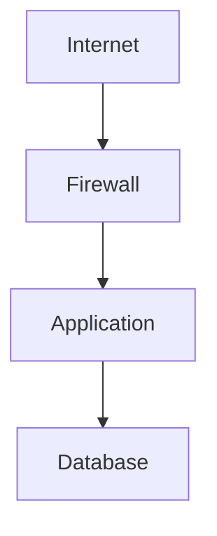
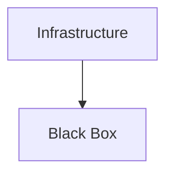
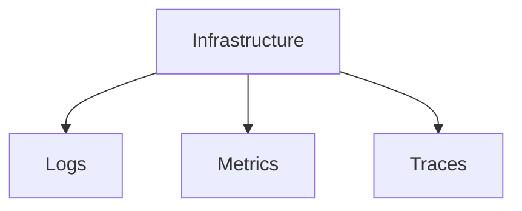
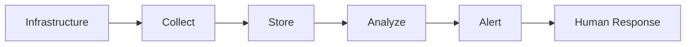
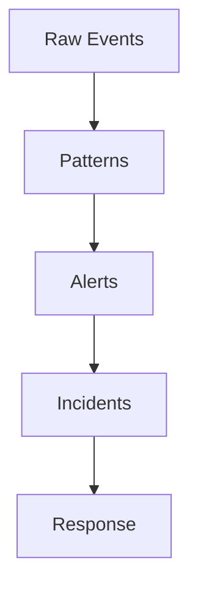
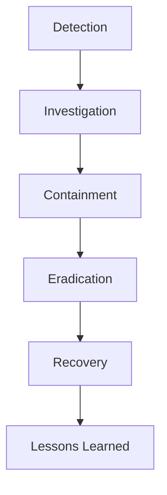
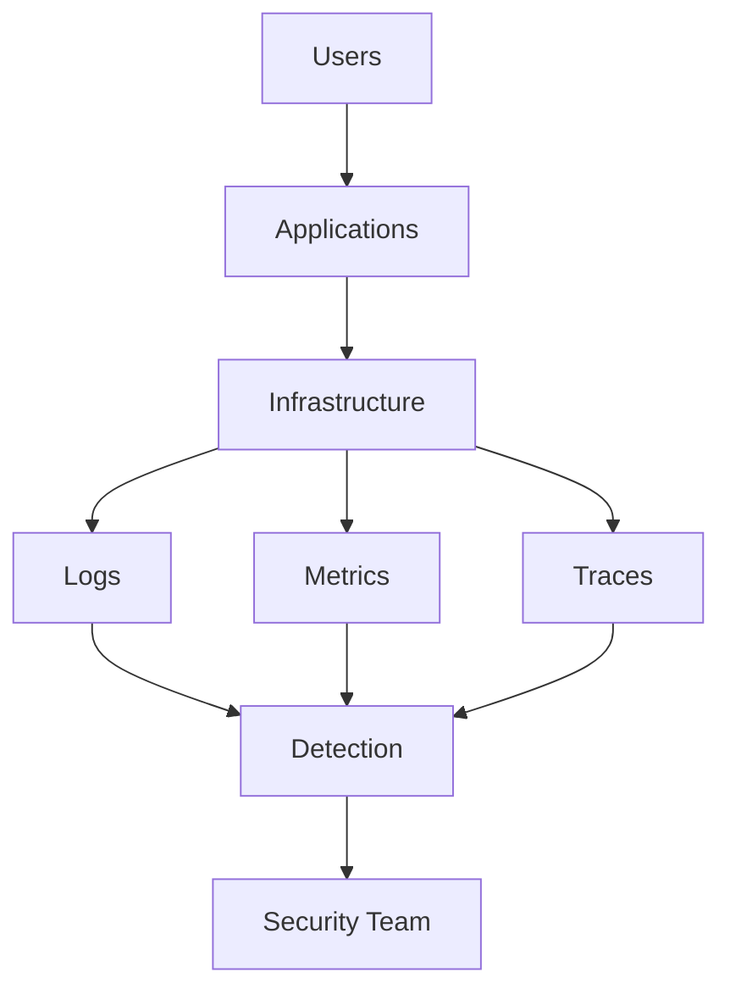

# Security Observability

# 1. Why This File Is Extremely Important

Most beginners learn security incorrectly.

They think:

```text
Firewall

↓

Problem solved
```

Unfortunately, this is not reality.

Professional engineers assume:

> Attackers will eventually get inside.

This changes everything.

The question becomes:

> How quickly can we detect them?

---

# 2. Modern Security Is Four Stages

Every mature company follows this cycle.

```text
Prevent

↓

Detect

↓

Respond

↓

Recover
```

Memorize this.

---

# 3. Prevention Alone Is Not Enough

Imagine this infrastructure.



Question:

> What if attackers bypass the firewall?

What happens next?

Without observability:

```text
Nobody knows.
```

That's dangerous.

---

# 4. The Biggest Security Misconception

Many people think:

> Secure systems never get attacked.

Wrong.

Reality:

```text
All systems are constantly attacked.
```

Professional teams build systems expecting attacks.

---

# 5. Security Observability Defined

Security observability means:

> **Collecting, analyzing, and correlating information to understand security events.**

Observe these words carefully.

```text
Collect

Analyze

Correlate

Investigate

Respond
```

All five matter.

---

# 6. What Does "Observe" Actually Mean?

Suppose someone logs into your server.

Questions:

```text
Who logged in?

When?

From where?

What did they do?

What happened afterward?
```

Observability answers these questions.

---

# 7. The Three Pillars Of Observability

You will see this everywhere.

```text
Logs

Metrics

Traces
```

Memorize these.

---

# 8. Mental Model: Airplane Cockpit

Imagine flying a plane.

Would you fly using only one indicator?

No.

Pilots monitor:

```text
Altitude

Speed

Fuel

Engine

Weather
```

Engineers do the same.

---

# 9. Infrastructure Without Observability



Nobody knows what's happening.

This is scary.

---

# 10. Infrastructure With Observability



Visibility increases dramatically.

---

# 11. Understanding Logs

Logs answer:

> What happened?

Example:

```text
User logged in

Connection denied

Firewall blocked packet

Database query executed
```

Logs are historical records.

---

# 12. Log Analogy

Think of logs as:

> CCTV recordings for software systems.

You can rewind time.

---

# 13. Understanding Metrics

Metrics answer:

> How much?

Examples:

```text
CPU usage

Memory usage

Failed logins

Request count

Bandwidth
```

Metrics are numbers over time.

---

# 14. Understanding Traces

Traces answer:

> Where did something travel?

Example:

```text
User

↓

API Gateway

↓

Auth Service

↓

User Service

↓

Database
```

Traces connect events together.

---

# 15. Why Correlation Is Important

Single events are often meaningless.

Example:

One failed login.

Probably fine.

Now imagine:

```text
1000 failed logins

↓

5 countries

↓

10 minutes
```

That's suspicious.

Patterns matter.

---

# 16. Security Detection Is Pattern Recognition

Professional security is:

> Detecting unusual behavior.

Question:

> What is normal?

Then:

> Detect abnormal.

---

# 17. Security Baselines

Every system has a baseline.

Example:

Normal:

```text
100 requests/minute

20 engineers login/day

2 deployments/day
```

Abnormal:

```text
100000 requests/minute

500 login failures

Midnight deployment
```

Something changed.

---

# 18. The Four Golden Signals

SRE engineers use these often.

```text
Latency

Traffic

Errors

Saturation
```

Security teams use them too.

---

# 19. Attackers Leave Footprints

Attackers generate signals.

Examples:

```text
Repeated logins

Port scans

Large downloads

Privilege changes

Credential misuse
```

Observability finds footprints.

---

# 20. Common Security Signals

Examples:

```text
Failed SSH logins

Failed MFA

Privilege escalation

New devices

Suspicious downloads
```

---

# 21. The Security Event Pipeline

Modern systems work like this.



This pipeline exists almost everywhere.

---

# 22. Where Do Events Come From?

Sources include:

```text
Servers

Firewalls

Applications

Databases

VPNs

Kubernetes

Cloud Accounts
```

Everything produces signals.

---

# 23. Linux Security Signals

Examples:

```text
SSH Login

sudo Usage

Failed Authentication

Firewall Drops

File Changes
```

Very important.

---

# 24. Example Linux Logs

Ubuntu:

```bash
journalctl

journalctl -u ssh

journalctl -xe
```

Authentication:

```bash
sudo cat /var/log/auth.log
```

RHEL:

```bash
sudo cat /var/log/secure
```

---

# 25. Firewall Observability

Suppose firewall blocks packets.

Logs tell us:

```text
Source IP

Destination IP

Port

Timestamp

Action Taken
```

Without logs:

Nobody knows.

---

# 26. VPN Observability

Monitor:

```text
Who connected?

When?

For how long?

Which device?
```

This is extremely valuable.

---

# 27. Cloud Observability

Cloud providers produce enormous amounts of telemetry.

Examples:

```text
Cloud Logs

Cloud Metrics

Audit Logs

Identity Events
```

---

# 28. Kubernetes Observability

Kubernetes generates huge amounts of signals.

Monitor:

```text
Pods

Containers

Nodes

API Server

Secrets Access
```

---

# 29. Observability Is Also Security

Question:

> Can attackers disable your visibility?

Protect observability systems themselves.

---

# 30. The Detection Pyramid



Raw data becomes actionable intelligence.

---

# 31. Alert Fatigue

One of the biggest engineering problems.

Bad:

```text
10000 alerts/day
```

Humans stop paying attention.

Dangerous.

---

# 32. Good Alerts

Good alerts are:

```text
Actionable

Meaningful

Prioritized

Contextual
```

Quality matters more than quantity.

---

# 33. Security Incident Lifecycle

Every incident follows this flow.



Memorize this.

---

# 34. Mean Time Metrics

Engineers love these.

MTTD:

```text
Mean Time To Detect
```

MTTR:

```text
Mean Time To Respond
```

Smaller is better.

---

# 35. Example Scenario

Attacker steals credentials.

Questions:

```text
Did MFA trigger?

Was location unusual?

Was device new?

Was download volume abnormal?
```

Observability helps answer these.

---

# 36. Security Teams Are Data Teams

This surprises beginners.

Much of security is:

```text
Collect Data

Analyze Data

Find Patterns
```

Security is heavily data-driven.

---

# 37. Modern Tool Categories

Do not memorize tools yet.

Memorize categories.

```text
Log Systems

Metric Systems

Tracing Systems

Alert Systems

SIEM Systems
```

Tools will change over time.

Concepts remain.

---

# 38. Production Architecture



---

# 39. Common Beginner Mistakes

### Mistake 1

Security = prevention.

Wrong.

---

### Mistake 2

Logs are optional.

Wrong.

---

### Mistake 3

Only monitor servers.

Wrong.

Monitor everything.

---

### Mistake 4

Store data forever without strategy.

Wrong.

Observability is expensive.

---

# 40. Troubleshooting Mindset

Always ask:

```text
What happened?

When?

Who?

Where?

Why?

What changed?
```

These six questions solve many incidents.

---

# 41. Interview Questions

### Beginner

* What is observability?
* What are logs, metrics, and traces?

### Intermediate

* Why is prevention insufficient?
* Explain baselines.
* Explain MTTD.

### Advanced

* Design observability for production infrastructure.
* How would you detect compromised accounts?
* How would you secure observability systems?

---

# 42. Master Takeaways

```text
Security = Prevent + Detect + Respond + Recover

Three Pillars:

Logs

Metrics

Traces

Core Ideas:

Baselines

Patterns

Correlation

Detection

Response

Goal:

Reduce Detection Time

Reduce Response Time
```
roduction-security-architecture.md` should come next because it will connect every Security file into one complete modern infrastructure architecture.**
