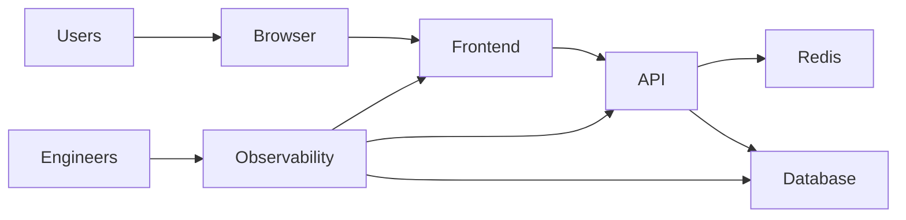
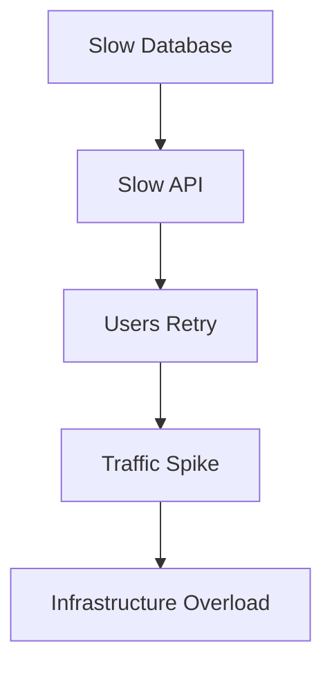
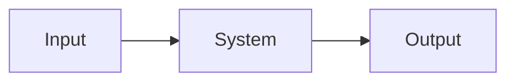
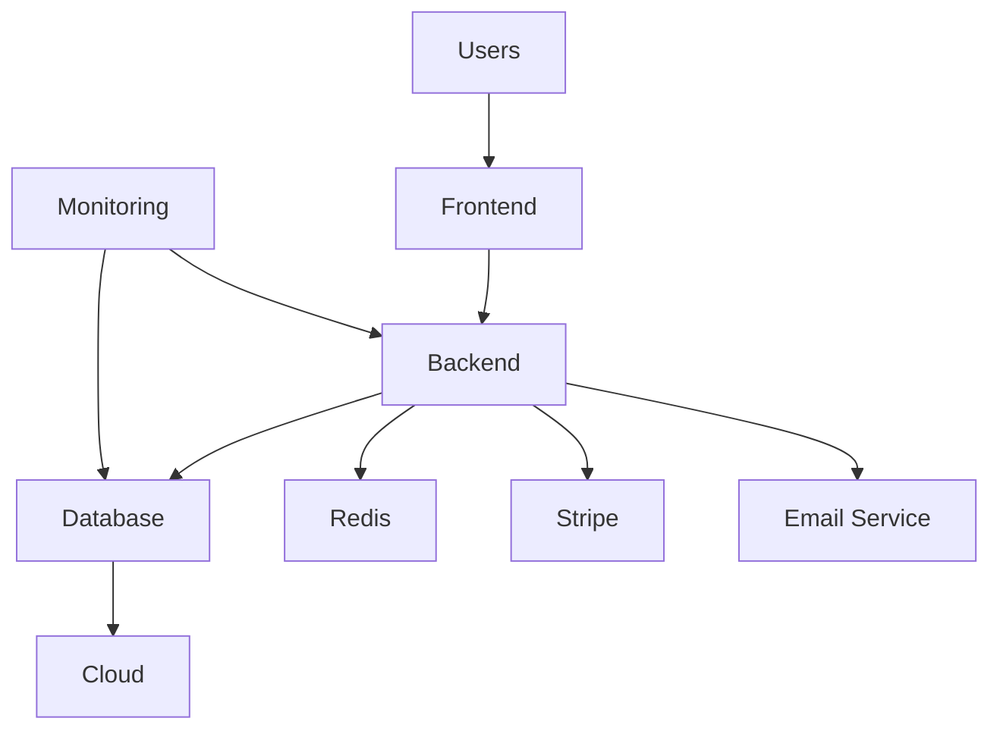
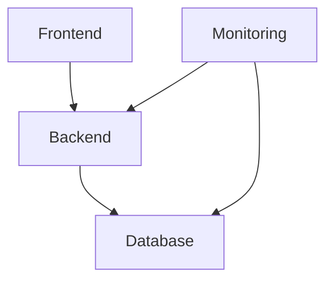
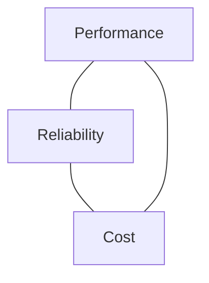
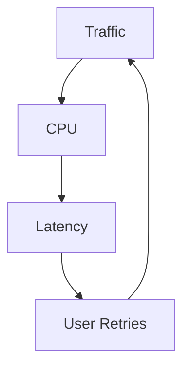
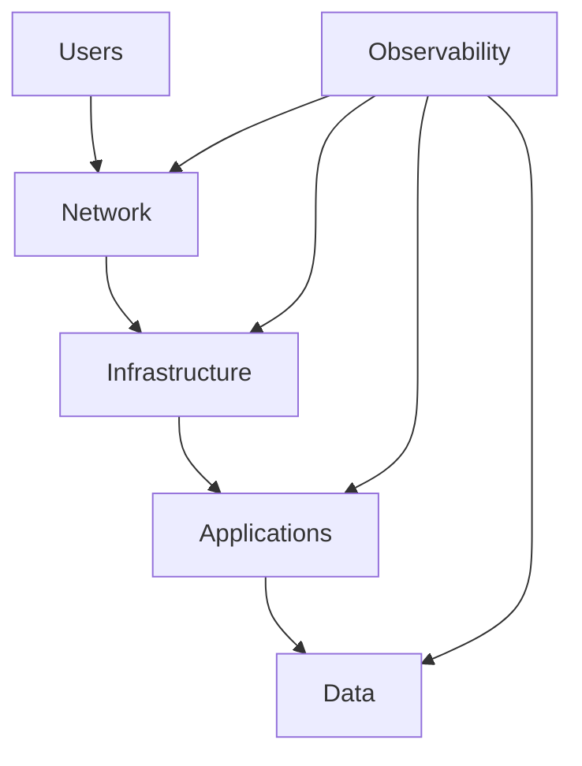
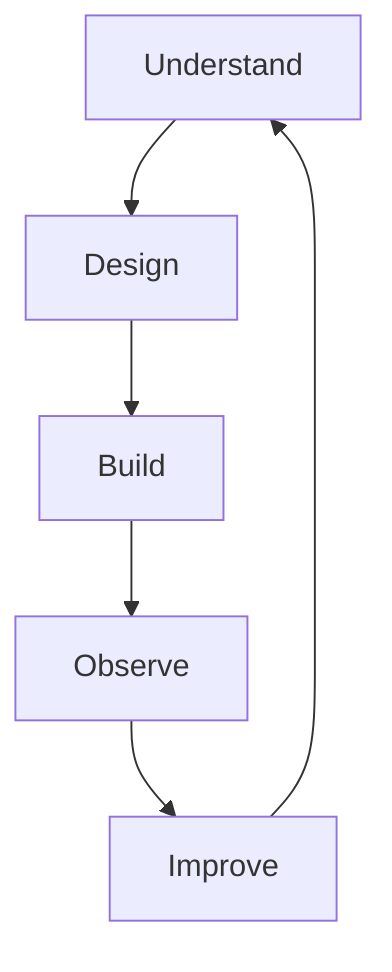
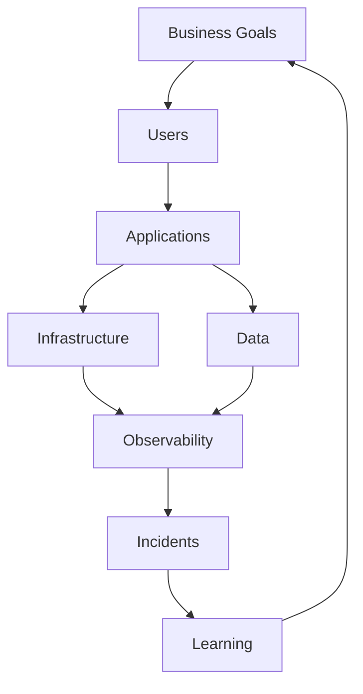

# Systems Thinking For Engineers

# 1. Why This File Is Extremely Important

This file may be more important than learning Kubernetes.

More important than learning Docker.

More important than learning cloud.

Because tools change.

Thinking scales forever.

Most beginners learn technology like this.

```text
Linux

Networking

Docker

Kubernetes

Cloud

Security

CI/CD
```

As isolated subjects.

This is wrong.

Professional engineers eventually realize:

> There are no isolated technologies.

Everything is connected.

That realization changes your career.

---

# 2. The Biggest Shift Every Engineer Must Make

Beginners see components.

Professional engineers see systems.

Imagine this.

Beginner view:

```text
React

Node.js

PostgreSQL
```

Professional view:



This is a system.

This mindset changes everything.

---

# 3. What Is A System?

A system is:

> Multiple components working together toward a goal.

Examples:

Your body.

A city.

An airport.

A company.

A startup.

The internet.

Everything is a system.

---

# 4. Engineering Is Not Building Software

This surprises many people.

You are not building software.

You are building systems.

Software is only one component.

Example.

Food delivery company.

People think:

```text
Mobile App
```

Reality:

```text
Customers

Restaurants

Drivers

Maps

Payments

Notifications

Databases

Monitoring

Support Teams
```

This is a system.

---

# 5. The Five Laws Of Systems Thinking

Memorize these forever.

```text
Everything Is Connected

Every System Has Limits

Every System Fails

Every Improvement Has Tradeoffs

Complexity Always Grows
```

These five laws appear everywhere.

---

# 6. Law 1: Everything Is Connected

This is the biggest lesson engineers eventually learn.

Suppose:

```text
Database Slows Down
```

Consequences:

```text
↓

API Slows

↓

Users Retry

↓

Traffic Increases

↓

CPU Spikes

↓

Servers Crash
```

One small problem creates a chain reaction.

---

# 7. Always Learn To See Chains

Bad engineers see events.

Good engineers see chains.

Example:



Learn to see chains.

---

# 8. Systems Are More Than Technology

Every production system contains five things.

```text
Humans

Technology

Processes

Data

Infrastructure
```

Removing any one breaks the system.

---

# 9. The Human Layer Is Always Present

Most beginners ignore humans.

Huge mistake.

Humans:

```text
Deploy

Configure

Operate

Maintain

Debug
```

Humans are part of the system.

---

# 10. Every System Has Inputs And Outputs

Simple model:



Examples.

Input:

```text
User Request
```

System:

```text
Application
```

Output:

```text
Response
```

Simple.

Yet incredibly powerful.

---

# 11. Learn To Think In Flows

Every system is a flow.

Example.


Question:

> Where can this fail?

Always ask this.

---

# 12. Every Arrow Is Important

This may be one of the biggest lessons.

Engineers often focus on boxes.

Elite engineers focus on arrows.

Because arrows represent:

```text
Communication

Dependencies

Data Movement

Trust Boundaries
```

Problems happen between systems.

Not inside systems.

---

# 13. Dependencies Rule Everything

Nothing exists independently.

Your application depends on:

```text
DNS

CDN

Identity

Databases

Caches

Cloud

Third Party APIs
```

Dependencies create risks.

---

# 14. The Dependency Explosion Problem

Modern systems look like this.



Many things can fail.

---

# 15. Law 2: Every System Has Limits

Nothing scales forever.

Examples:

```text
CPU

Memory

Bandwidth

Sockets

Connections

Disk

Database Pools

Money

Humans
```

Everything has limits.

---

# 16. Bottlenecks Are Everywhere

Question:

> What is the weakest point?

Every system has one.

Examples:

```text
Database

Network

Disk

Humans

Budgets
```

Finding bottlenecks is a superpower.

---

# 17. Great Engineers Ask One Question Repeatedly

Question:

> What is the bottleneck?

Always ask this.

It solves many problems.

---

# 18. Law 3: Every System Eventually Fails

This is a huge mindset shift.

Beginners think:

```text
Prevent Failure
```

Professionals think:

```text
Prepare For Failure
```

Failure is inevitable.

---

# 19. Failure Is Normal

Examples:

```text
Disk Failure

Network Failure

Cloud Failure

Human Failure

Power Failure

DNS Failure
```

Nothing is perfect.

---

# 20. Build For Failure

Always ask:

```text
What if this breaks?
```

Examples:

```text
What if database fails?

What if DNS fails?

What if cloud fails?

What if credentials leak?
```

This question is elite engineering.

---

# 21. Failure Domains (Very Important)

A failure domain is:

> A boundary inside which failures remain contained.

Bad architecture:

```text
One failure

↓

Everything fails
```

Good architecture:

```text
One failure

↓

One service affected
```

---

# 22. Failure Domain Visualization



Components are isolated.

This reduces damage.

---

# 23. Law 4: Every Improvement Has Tradeoffs

This is one of the biggest engineering lessons.

Question:

> Can we make systems infinitely secure?

No.

Everything has costs.

---

# 24. Tradeoffs Exist Everywhere

More security.

Benefits:

```text
Safer
```

Costs:

```text
Complexity

Performance

Developer Experience
```

---

# 25. The Engineering Triangle

You constantly balance:



Sometimes security becomes the fourth corner.

Tradeoffs never disappear.

---

# 26. Law 5: Complexity Always Grows

This is guaranteed.

Startup:

```text
1 Server
```

Then:

```text
5 Services
```

Then:

```text
20 Services
```

Then:

```text
100 Services
```

Complexity naturally grows.

---

# 27. Complexity Is Dangerous

More complexity means:

```text
More Configurations

More Dependencies

More Risks

More Failures
```

Complexity itself becomes a risk.

---

# 28. Simplicity Is A Feature

Great engineers ask:

> Can we make this simpler?

Simple systems are powerful systems.

---

# 29. Learn Feedback Loops

Everything is a loop.

Example.



This is called a positive feedback loop.

They can become dangerous.

---

# 30. Learn Negative Feedback Loops

Negative loops stabilize systems.

Examples:

```text
Auto Scaling

Rate Limiting

Caching

Circuit Breakers
```

These help systems recover.

---

# 31. Learn To Think In Layers

Systems are layers.

Example.



Layers make systems understandable.

---

# 32. The Seven Questions Elite Engineers Repeatedly Ask

Memorize these forever.

Question 1:

> What is the system?

Question 2:

> What are the dependencies?

Question 3:

> What is the bottleneck?

Question 4:

> What can fail?

Question 5:

> What is the blast radius?

Question 6:

> How do we observe it?

Question 7:

> How do we recover?

This framework is a superpower.

---

# 33. Systems Thinking Across Technologies

Linux:

```text
Processes

Memory

CPU

Files
```

Networking:

```text
Packets

Flows

Connections
```

Distributed Systems:

```text
Services

Queues

Databases
```

Security:

```text
Threats

Defenses

Observability
```

Cloud:

```text
Infrastructure

Regions

Availability Zones
```

Everything connects.

---

# 34. The Engineering Lifecycle

Professional engineers continuously cycle.



The loop never stops.

---

# 35. The 10 Mental Models Every Engineer Should Memorize

```text
1. Everything Is Connected

2. Everything Has Limits

3. Everything Eventually Fails

4. Every Decision Has Tradeoffs

5. Complexity Is Dangerous

6. Bottlenecks Exist Everywhere

7. Feedback Loops Matter

8. Dependencies Create Risks

9. Visibility Is Mandatory

10. Recovery Is As Important As Prevention
```

---

# 36. Junior vs Senior vs Principal Engineer Thinking

### Junior

```text
How do I build this?
```

### Mid-Level

```text
How do I scale this?
```

### Senior

```text
How can this fail?
```

### Staff

```text
How do systems interact?
```

### Principal

```text
How do we simplify complexity?
```

Different levels ask different questions.

---

# 37. The Master Systems Thinking Diagram

Study this often.



This diagram connects almost every engineering discipline.

---

# 38. Common Beginner Mistakes

### Mistake 1

Learning tools instead of systems.

Wrong.

---

### Mistake 2

Ignoring dependencies.

Wrong.

---

### Mistake 3

Ignoring bottlenecks.

Wrong.

---

### Mistake 4

Building for success only.

Wrong.

Build for failure too.

---

### Mistake 5

Overcomplicating systems.

Wrong.

---

# 39. Engineering Thinking Framework (Memorize Forever)

Whenever building anything ask:

```text
What is the system?

What are its dependencies?

What is the bottleneck?

What can fail?

What is the blast radius?

How do we observe it?

How do we recover?
```

This framework is incredibly powerful.

---

# 40. Master Takeaways

```text
Stop Learning Technologies

Start Learning Systems

Elite Engineers:

See Connections

See Dependencies

See Failures

See Tradeoffs

See Bottlenecks

See Feedback Loops

Remember:

Technology Changes

Systems Thinking Scales Forever
```
