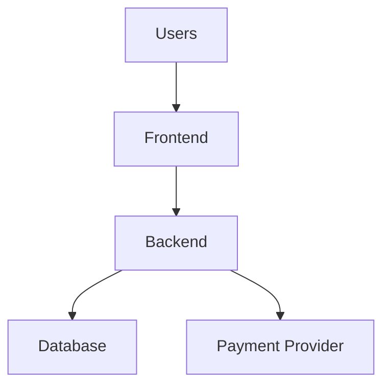
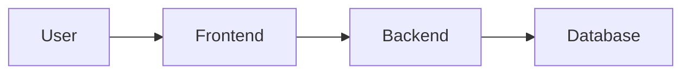
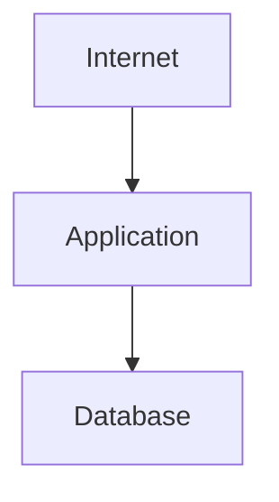
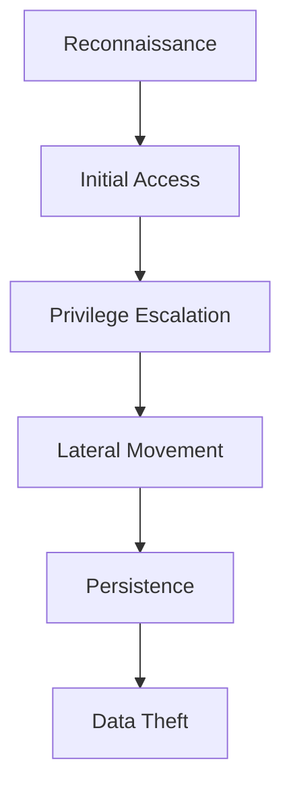
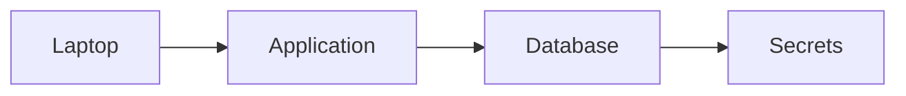
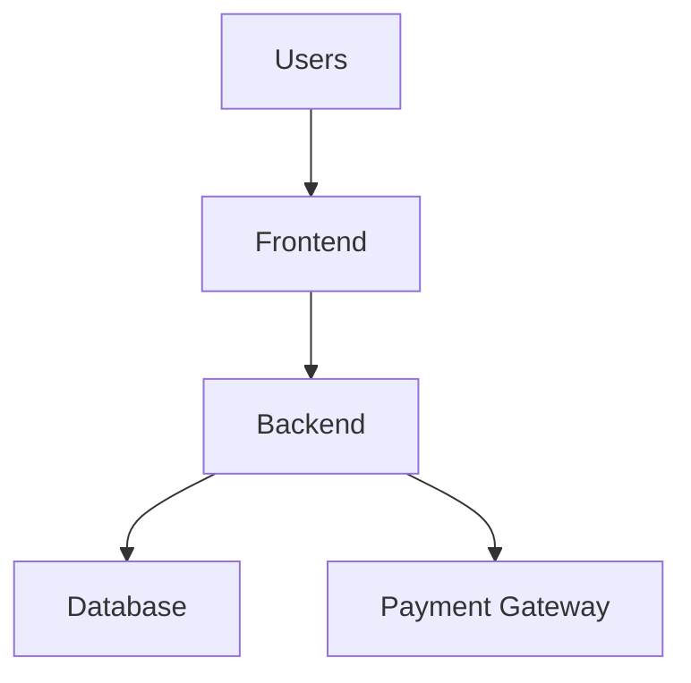
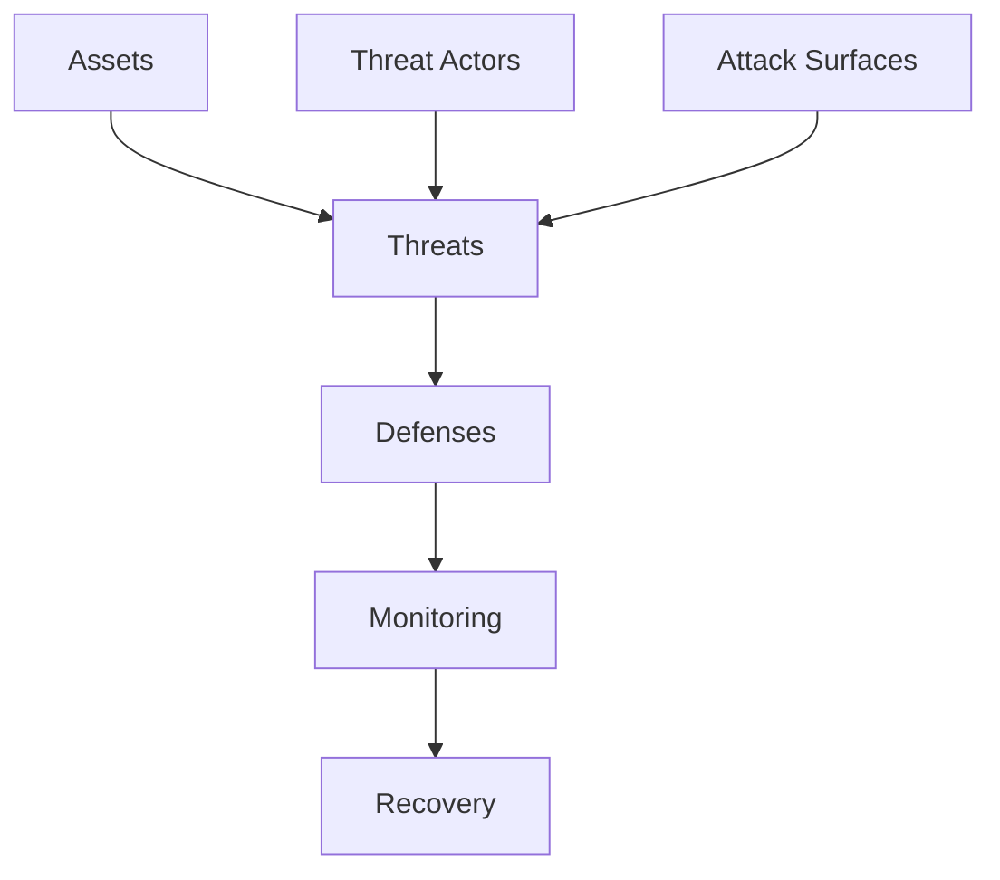

# Threat Modeling

# 1. Why This File Is Extremely Important

Imagine two engineers.

Engineer A:

```text
Install firewall

Install WAF

Install VPN

Install IDS
```

Engineer B:

```text
What are we protecting?

Who might attack us?

How could they attack us?

What would happen if they succeeded?

How do we reduce damage?
```

Question:

> Which engineer builds safer systems?

Engineer B.

This file teaches Engineer B thinking.

---

# 2. First Principle: Security Is Asking Good Questions

Most beginners think security is:

```text
Tools
```

Wrong.

Security is mostly:

```text
Thinking
```

Tools simply implement decisions.

---

# 3. The Biggest Security Mistake

Many companies build systems first.

Then they think about security later.

Like this.

```text
Build Application

↓

Deploy

↓

Oops

↓

Add Security
```

This is backwards.

Instead:

```text
Think

↓

Design

↓

Build

↓

Deploy
```

Security starts before code exists.

---

# 4. What Is Threat Modeling?

Threat modeling means:

> Systematically identifying threats before attackers do.

Think:

> Predict problems before they happen.

---

# 5. The Mental Model: Chess

Good chess players don't think:

```text
My next move
```

They think:

```text
My move

Opponent response

My response

Opponent response
```

Threat modeling works exactly like this.

---

# 6. Threat Modeling Is A Conversation

Every system should answer these questions.

```text
What are we building?

What are we protecting?

Who can attack us?

How could they attack us?

What would happen if successful?

How do we reduce risk?
```

Memorize these.

These six questions are incredibly powerful.

---

# 7. Step 1: Understand The System

Never secure something you don't understand.

Question:

> What are we building?

Example.

```text
Ecommerce Website
```

Components:

```text
Users

Frontend

Backend

Database

Payment Gateway
```

---

# 8. Visualizing Systems

Always draw systems.



This simple diagram is powerful.

Because:

> You cannot secure invisible systems.

---

# 9. Step 2: Identify Assets

Question:

> What are we protecting?

Assets are valuable things.

Examples:

```text
Customer Data

Passwords

Money

AI Models

API Keys

Secrets

Source Code

Infrastructure
```

---

# 10. Think Like A Bank

Banks don't protect buildings.

They protect:

```text
Money

Transactions

Identity

Trust
```

Similarly:

Your company protects assets.

---

# 11. Step 3: Identify Actors

Question:

> Who interacts with this system?

Examples:

```text
Customers

Employees

Admins

Developers

Third Parties

Applications
```

Everyone matters.

---

# 12. Step 4: Identify Threat Actors

Question:

> Who might attack us?

Examples:

```text
Random Bots

Cybercriminals

Competitors

Hacktivists

Insiders

Nation States
```

Not every threat actor is equal.

---

# 13. Threat Actors Have Different Motivations

Examples:

Cybercriminals:

```text
Money
```

Hacktivists:

```text
Ideology
```

Insiders:

```text
Access Abuse
```

Nation states:

```text
Long Term Espionage
```

Understanding motivation is important.

---

# 14. Step 5: Draw Data Flow

Question:

> Where does data travel?

Data movement creates risks.

Example.



Every arrow is a potential attack path.

---

# 15. The Golden Rule

Every connection creates risk.

No exceptions.

---

# 16. Trust Boundaries (Extremely Important)

One of the most important concepts.

Question:

> Where does trust change?

Example:



Trust boundaries:

```text
Internet → Application

Application → Database
```

Security increases at boundaries.

---

# 17. Why Trust Boundaries Matter

The internet is untrusted.

Applications are semi-trusted.

Databases are highly trusted.

As we go deeper:

```text
Trust decreases

Verification increases
```

---

# 18. Step 6: Identify Entry Points

Question:

> Where can attackers interact?

Examples:

```text
Login

Search

Uploads

APIs

SSH

Admin Panels
```

These are attack surfaces.

---

# 19. Step 7: Think Like Attackers

Question:

> If I were evil, what would I do?

This question is incredibly valuable.

Examples:

```text
Guess passwords

Steal credentials

Abuse APIs

Overload servers

Move laterally
```

---

# 20. Attacker Journey

Most attacks follow patterns.



Memorize this.

---

# 21. Reconnaissance Explained

Attackers first gather information.

Questions:

```text
What technologies exist?

Which ports are open?

Who are employees?

What APIs exist?
```

---

# 22. Privilege Escalation Explained

Question:

> Can attackers become more powerful?

Example:

```text
User

↓

Admin
```

Dangerous.

---

# 23. Lateral Movement Explained

Question:

> Can attackers move sideways?

Example:



Segmentation exists to stop this.

---

# 24. Blast Radius

Question:

> If attackers succeed, how much damage occurs?

Bad:

```text
Entire company
```

Good:

```text
One isolated service
```

Always reduce blast radius.

---

# 25. Risk Is Not Binary

Engineers do not think:

```text
Safe

Unsafe
```

Instead:

```text
Low Risk

Medium Risk

High Risk
```

Security is probability.

---

# 26. Simple Risk Formula

```text
Risk = Likelihood × Impact
```

Example:

Weak admin password:

Likelihood:

```text
High
```

Impact:

```text
High
```

Priority:

```text
Very High
```

---

# 27. Example Threat Modeling Exercise

Suppose we build a startup.

Architecture:



Question:

> What can go wrong?

---

# 28. Threat Brainstorming

Possible threats.

Frontend:

```text
XSS

Token Theft
```

Backend:

```text
SQL Injection

Broken Auth
```

Database:

```text
Data Theft
```

Payment:

```text
Fraud
```

---

# 29. The Threat Prioritization Matrix

Engineers cannot fix everything.

Prioritize.

| Likelihood | Impact | Priority |
| ---------- | ------ | -------- |
| Low        | Low    | Low      |
| High       | Low    | Medium   |
| Low        | High   | Medium   |
| High       | High   | Critical |

---

# 30. Security Is Economics

Time is limited.

Budget is limited.

People are limited.

Protect the most valuable assets first.

---

# 31. Modern Threat Categories

Protect against:

```text
Credential Theft

Data Theft

DDoS

API Abuse

Ransomware

Supply Chain Attacks

Insider Threats
```

---

# 32. Cloud Introduces New Threats

Examples:

```text
Public Storage

Open Security Groups

Overly Permissive IAM

Leaked Secrets
```

---

# 33. Kubernetes Introduces New Threats

Examples:

```text
Open Dashboard

Secrets Exposure

Container Escape

Service Account Abuse
```

---

# 34. AI Introduces New Threats

Examples:

```text
Prompt Injection

Data Leakage

Model Theft

API Abuse
```

---

# 35. Threat Modeling Framework For Engineers

Ask these questions every time.

```text
What are we building?

What are we protecting?

Who can attack us?

How would they attack us?

What happens if they succeed?

How do we reduce damage?
```

This framework scales forever.

---

# 36. The Defense Mapping Exercise

For every threat ask:

Threat:

```text
Credential Theft
```

Defense:

```text
MFA

Password Policies

Monitoring
```

Threat:

```text
DDoS
```

Defense:

```text
CDN

Rate Limiting

WAF
```

Threat:

```text
Lateral Movement
```

Defense:

```text
Segmentation

Zero Trust
```

---

# 37. Security Is Continuous

Threat modeling never ends.

Infrastructure changes.

Attackers evolve.

Threat models evolve too.

---

# 38. Common Beginner Mistakes

### Mistake 1

Threat modeling = security team task.

Wrong.

Everyone participates.

---

### Mistake 2

Threat modeling = one-time exercise.

Wrong.

It is continuous.

---

### Mistake 3

Protect everything equally.

Wrong.

Prioritize.

---

### Mistake 4

Ignore business impact.

Wrong.

Security is business protection.

---

# 39. The Master Threat Modeling Diagram

Study this often.



This is the security lifecycle.

---

# 40. Engineering Thinking Framework (Memorize This)

Whenever building anything ask:

```text
What am I protecting?

Who needs access?

Who should never access?

What can go wrong?

How do I detect it?

How do I recover?
```

This framework alone can improve engineering decisions dramatically.

---

# 41. Interview Questions

## Beginner

* What is threat modeling?
* Why is it important?

## Intermediate

* Explain trust boundaries.
* Explain blast radius.
* Explain attack surfaces.

## Advanced

* Threat model an ecommerce system.
* Threat model Kubernetes infrastructure.
* Threat model AI systems.

---

# 42. Master Takeaways

```text
Security Starts Before Code

Threat Modeling = Thinking Like Attackers

Core Concepts:

Assets

Actors

Attack Surfaces

Threats

Trust Boundaries

Blast Radius

Prioritization

Remember:

Security Is Mostly Asking Good Questions
```
