# VPN Basics

# 1. Why This File Is Important

Most people think:

> VPN = Hide my IP address.

That is a very incomplete understanding.

For engineers:

> **A VPN is a secure private network built on top of a public network.**

VPNs are everywhere.

```text
Companies

Cloud Infrastructure

Remote Work

Datacenters

Multi-cloud

Kubernetes

Site-to-Site Networks
```

Without VPNs, modern infrastructure would be extremely difficult to secure.

---

# 2. What is a VPN?

VPN stands for:

> **Virtual Private Network**

Break it down.

### Virtual

Software-defined.

### Private

Encrypted and access-controlled.

### Network

Allows systems to communicate.

---

# 3. Mental Model

Imagine extending your office network to anywhere in the world.

```text
Home

↓

Internet

↓

Office Network
```

VPN creates a secure tunnel.

---

# 4. Without VPN

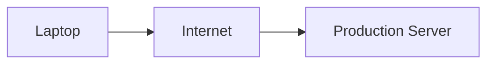

Problems:

```text
Exposed Services

Attack Surface

Open SSH Ports

Risk
```

---

# 5. With VPN

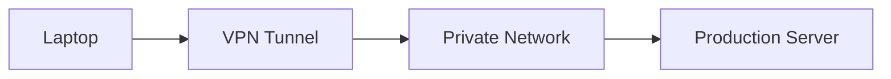

Much safer.

---

# 6. The Core Idea

VPN does three things:

```text
Encryption

Authentication

Secure Routing
```

Remember this.

---

# 7. Why Companies Use VPNs

Common use cases:

```text
Remote Employees

Cloud Infrastructure

Hybrid Cloud

Datacenter Connectivity

Private Databases

Private Kubernetes Clusters
```

---

# 8. Real World Examples

Instead of:

```text
Internet

↓

SSH

↓

Production Server
```

Use:

```text
Internet

↓

VPN

↓

Private Server
```

---

# 9. VPN Components

```text
Client

VPN Server

Tunnel

Encryption

Routing

Authentication
```

---

# 10. VPN Architecture

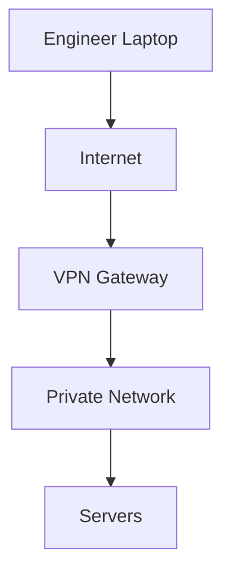

---

# 11. Tunnel Concept

The word tunnel is everywhere.

What is it?

> A tunnel is encapsulating one packet inside another packet.

Original packet:

```text
Client → Server
```

Becomes:

```text
Encrypted Packet

↓

Internet
```

---

# 12. Tunnel Visualization

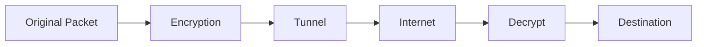

---

# 13. Encapsulation

Think of a letter inside another envelope.

```text
Original Packet

↓

Encrypted Envelope

↓

Internet

↓

Open Envelope

↓

Original Packet
```

---

# 14. VPN Does NOT Replace HTTPS

This is a huge misconception.

Both coexist.

Example:

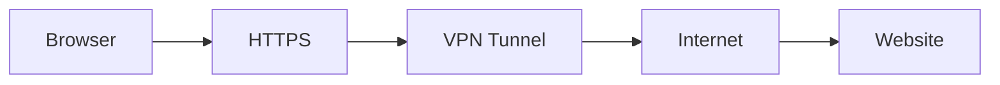

You can have:

```text
HTTPS inside VPN
```

Layered security.

---

# 15. Major VPN Types

```text
Remote Access VPN

Site-to-Site VPN

Cloud VPN

Mesh VPN
```

---

# 16. Remote Access VPN

Most common.

Employee connects to company.

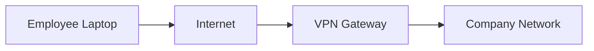

---

# 17. Site-to-Site VPN

Two networks connect.


---

# 18. Cloud VPN

Cloud and datacenter communicate.

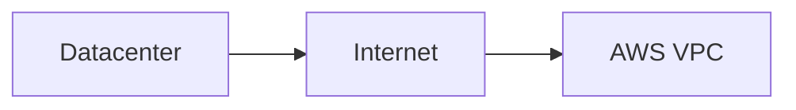

---

# 19. Mesh VPN

Every device communicates privately.

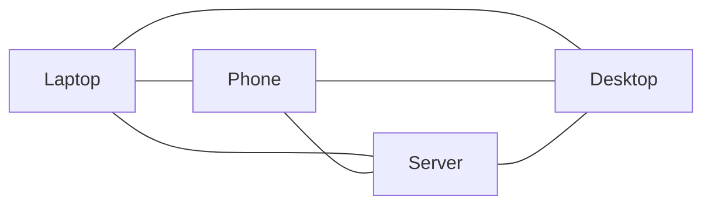

Examples:

```text
Tailscale

NetBird

ZeroTier
```

---

# 20. How VPN Connection Works

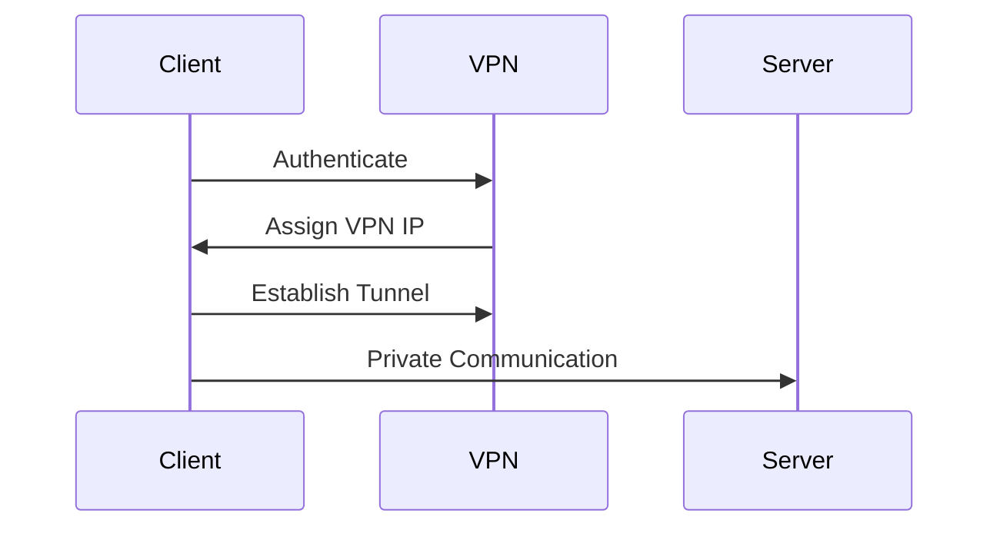

---

# 21. Authentication Methods

VPN users must authenticate.

Methods:

```text
Password

Certificates

MFA

Hardware Tokens

Identity Providers
```

---

# 22. VPN IP Address

When connected:

Old:

```text
Laptop

192.168.1.20
```

New:

```text
Laptop

100.64.x.x
```

or

```text
10.x.x.x
```

VPN assigns addresses.

---

# 23. Full Tunnel VPN

Everything goes through VPN.

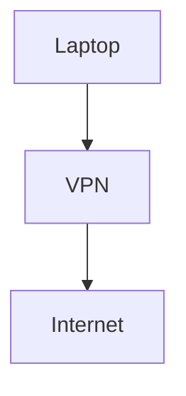

Good security.

More bandwidth usage.

---

# 24. Split Tunnel VPN

Only company traffic uses VPN.

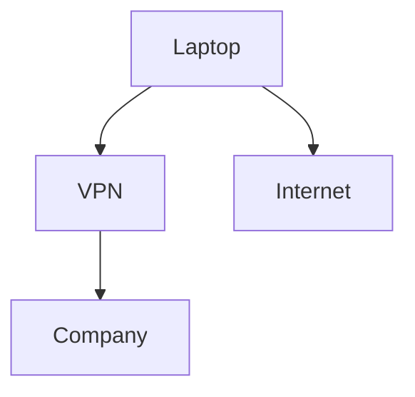

Faster.

Less secure.

---

# 25. Full Tunnel vs Split Tunnel

| Feature     | Full Tunnel | Split Tunnel |
| ----------- | ----------- | ------------ |
| Security    | Higher      | Medium       |
| Bandwidth   | Higher      | Lower        |
| Privacy     | Higher      | Lower        |
| Performance | Lower       | Higher       |

---

# 26. Common VPN Protocols

```text
WireGuard

OpenVPN

IPsec
```

Older:

```text
PPTP

L2TP
```

Avoid PPTP.

---

# 27. WireGuard

Modern VPN.

Characteristics:

```text
Fast

Simple

Modern Cryptography

Efficient
```

Popular today.

---

# 28. OpenVPN

Very mature.

Characteristics:

```text
Stable

Flexible

Widely Supported
```

---

# 29. IPsec

Enterprise standard.

Used heavily in:

```text
Cloud

Datacenters

Routers

Enterprise Networks
```

---

# 30. VPN and Routing

VPN is heavily dependent on routing.

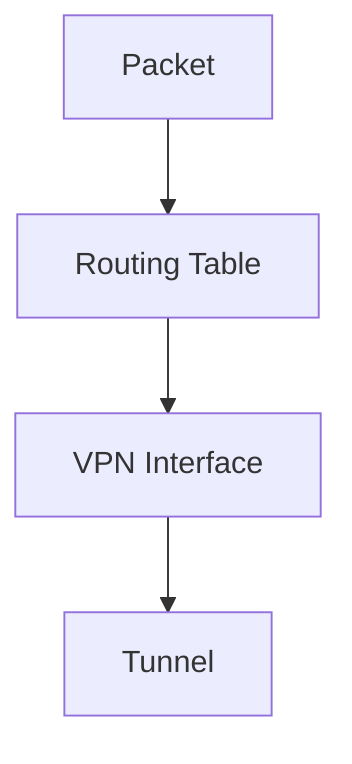

---

# 31. VPN Interfaces

Linux creates interfaces.

Examples:

```text
tun0

wg0

tap0
```

Check:

```bash
ip addr
```

---

# 32. TUN vs TAP

| Feature         | TUN    | TAP   |
| --------------- | ------ | ----- |
| Layer           | L3     | L2    |
| IP Packets      | ✓      | ✓     |
| Ethernet Frames | ❌      | ✓     |
| Performance     | Higher | Lower |

Most modern VPNs use TUN.

---

# 33. VPN and Netfilter

These work together.

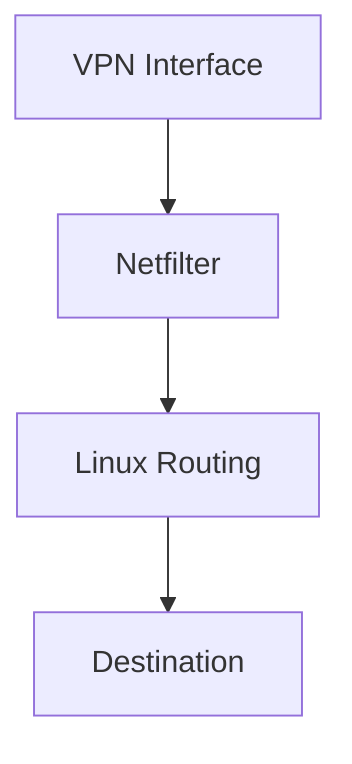

---

# 34. Production Architecture

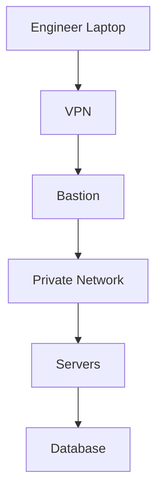

---

# 35. VPN + Bastion Architecture

Very common.

```text
Internet

↓

VPN

↓

Bastion

↓

Private Servers
```

---

# 36. Cloud Example

Instead of:

```text
0.0.0.0:22
```

Use:

```text
VPN Only
```

Access.

Huge security improvement.

---

# 37. Modern Zero Trust VPN

Old model:

```text
Connected = Trusted
```

Modern model:

```text
Connected

↓

Verify Every Request
```

Identity matters.

---

# 38. Common Beginner Mistakes

## Mistake 1

VPN replaces HTTPS.

Wrong.

---

## Mistake 2

VPN equals anonymity.

Wrong.

---

## Mistake 3

VPN means secure server.

Wrong.

Still harden servers.

---

## Mistake 4

Expose databases publicly.

Never do:

```text
5432

3306

6379
```

---

# 39. Troubleshooting Flow

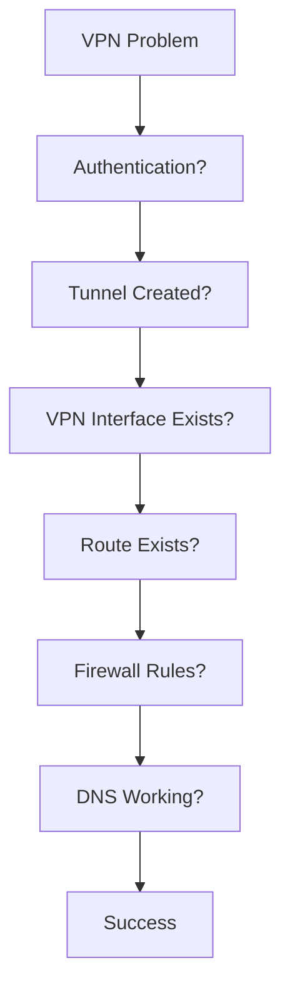

---

# 40. Useful Linux Commands

Interfaces:

```bash
ip addr
```

Routes:

```bash
ip route
```

Connections:

```bash
ss -tulnp
```

DNS:

```bash
resolvectl status
```

Firewall:

```bash
sudo nft list ruleset
```

---

# 41. Interview Questions

### Beginner

* What is a VPN?
* What is a tunnel?
* What is encapsulation?

### Intermediate

* Explain split tunnel vs full tunnel.
* Explain TUN vs TAP.
* Explain site-to-site VPN.

### Advanced

* Why use VPN + Bastion together?
* Explain VPN in cloud architectures.
* How does WireGuard differ from OpenVPN?

---

# 42. Key Takeaways

```text
VPN = Virtual Private Network

Core Concepts:

Tunnel

Encryption

Authentication

Routing

VPN Types:

Remote Access

Site-to-Site

Cloud VPN

Mesh VPN

Modern Technologies:

WireGuard

OpenVPN

IPsec
```

**`wireguard-internals.md` should absolutely exist because WireGuard is becoming the default VPN technology modern engineers encounter in cloud, homelabs, and production infrastructure.**
