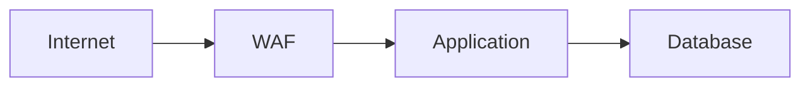
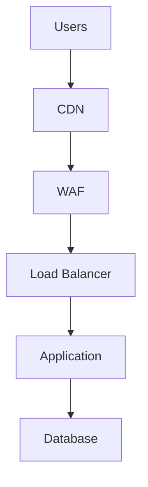
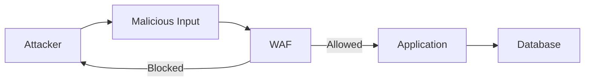
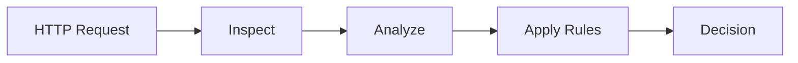
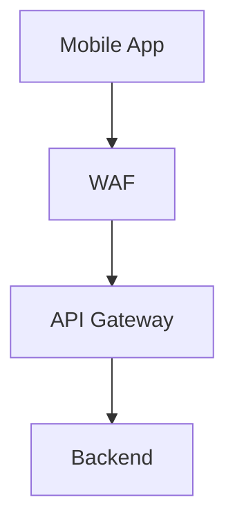
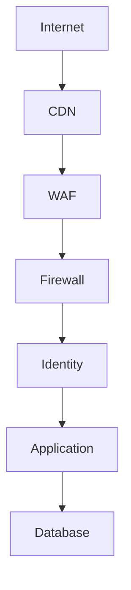

# Web Application Firewall (WAF)

# 1. Why This File Is Extremely Important

Imagine you built an amazing application.

Maybe something like this.

```text
Frontend

↓

Backend API

↓

Database
```

Thousands of users are using it.

Life is good.

Then one day strange requests start arriving.

```text
GET /login

GET /admin

GET /.env

GET /phpmyadmin

GET /config

GET /wp-admin
```

Question:

> Who is making these requests?

Most likely:

```text
Bots

Attackers

Scanners

Automated tools
```

This is where WAF enters the picture.

---

# 2. First Principle: WAF Is NOT A Firewall

This is the biggest misconception.

Many beginners think:

```text
Firewall

↓

WAF

↓

Same thing
```

Wrong.

They solve different problems.

---

# 3. What Does A Traditional Firewall Protect?

Traditional firewalls protect networks.

Question:

> Should this packet even enter?

Traditional firewalls understand:

```text
IP Address

Port

Protocol
```

Examples:

```text
443

80

22

TCP

UDP
```

---

# 4. What Does WAF Protect?

WAF protects applications.

Question:

> Is this HTTP request malicious?

WAF understands:

```text
URLs

Headers

Cookies

Parameters

Request Body

HTTP Methods
```

This is a huge difference.

---

# 5. Firewall vs WAF Mental Model

Imagine a shopping mall.

Traditional firewall:

> Security guard at the building entrance.

Questions:

```text
Who are you?

Where are you going?
```

WAF:

> Security guard inside the store.

Questions:

```text
What are you doing?

Are you behaving suspiciously?

Are you trying to steal?
```

Both are important.

---

# 6. Where Does WAF Sit?

This is very important.

WAF sits in front of applications.



Think:

> WAF protects applications, not infrastructure.

---

# 7. Why Modern Applications Need WAF

Applications expose huge attack surfaces.

Examples:

```text
Login Forms

Search Bars

Upload Systems

Comments

Admin Panels

REST APIs

GraphQL APIs
```

Every user input is a risk.

---

# 8. The Core Problem: Users Control Input

This is one of the most important software engineering truths.

Imagine this.

```text
Application

↓

User Input

↓

Database
```

Question:

> Can users be trusted?

No.

Never.

Professional engineers always assume:

> Every user input is potentially malicious.

---

# 9. Understanding User Input

Normal input:

```text
Name: John
```

Potentially malicious input:

```text
Name: ' OR 1=1 --
```

Question:

> How do we stop dangerous input before it reaches applications?

WAF helps.

---

# 10. The WAF Philosophy

WAF constantly asks:

> Does this request look suspicious?

It doesn't trust requests.

It inspects them.

---

# 11. Understanding HTTP Requests

A request contains many pieces.

Example:

```http
GET /products HTTP/1.1

Host: example.com

User-Agent: Chrome

Cookie: session=abc123
```

WAF analyzes all of these.

---

# 12. WAF Is Like Airport Security

Imagine passengers.

Traditional firewall:

```text
Can this person enter airport?
```

WAF:

```text
What's inside their luggage?

Are they carrying dangerous items?

Do they look suspicious?
```

This analogy is extremely useful.

---

# 13. WAF Is An HTTP Specialist

Traditional firewalls understand:

```text
TCP

UDP

IP
```

WAF understands:

```text
GET

POST

PUT

DELETE

Headers

Cookies

JSON

URLs
```

Different layer.

---

# 14. Where Does WAF Operate?

OSI model:

```text
Layer 7

Application Layer
```

Very important.

---

# 15. Typical Production Architecture



This architecture is extremely common.

---

# 16. What Attacks Does WAF Help Against?

Many application attacks.

Examples:

```text
SQL Injection

Cross Site Scripting (XSS)

Path Traversal

Command Injection

Bot Attacks

Credential Stuffing

API Abuse
```

Notice:

All of these are application attacks.

---

# 17. Understanding SQL Injection

Suppose application code does this.

Bad code:

```javascript
SELECT * FROM users
WHERE name='${input}'
```

Normal input:

```text
John
```

Malicious input:

```text
' OR 1=1 --
```

Result:

```text
Entire database returned
```

WAF tries to detect patterns like this.

---

# 18. SQL Injection Visualization



---

# 19. Understanding Cross Site Scripting (XSS)

Suppose someone submits:

```html
<script>

alert("Hacked")

</script>
```

If application displays it:

Problem.

WAF can detect suspicious patterns.

---

# 20. Understanding Path Traversal

Attackers attempt:

```text
../../etc/passwd
```

Goal:

> Access files outside intended directories.

WAF can detect this.

---

# 21. Credential Stuffing Explained

Attackers use leaked passwords.

Example:

```text
email1 + password1

email2 + password2

email3 + password3
```

Thousands of attempts.

Automated.

WAF can help slow this.

---

# 22. Bot Traffic Is Everywhere

You may think:

> Only humans use my application.

Wrong.

The internet contains enormous amounts of bots.

Examples:

```text
Search Bots

Scrapers

Scanners

Attack Bots
```

Many applications see more bots than humans.

---

# 23. Request Inspection Pipeline

This is how WAF works.



---

# 24. What Does WAF Inspect?

Many things.

```text
URL

Headers

Cookies

Body

IP Reputation

Behavior Patterns
```

The more context, the better.

---

# 25. Rule-Based Detection

Simple example.

Rule:

```text
Block ../../
```

Another rule:

```text
Block <script>
```

Another rule:

```text
Block suspicious SQL keywords
```

Rules are common.

---

# 26. But Attackers Adapt

Attackers evolve.

Simple rules are not enough.

Modern WAFs use:

```text
Behavior Analysis

Rate Analysis

Machine Learning

Threat Intelligence
```

---

# 27. False Positives

One of the biggest WAF problems.

Question:

> What if we block legitimate users?

This is called:

> False Positive

Example:

```text
Normal User

↓

Blocked
```

Bad experience.

---

# 28. False Negatives

Opposite problem.

Question:

> What if attackers pass through?

This is:

> False Negative

Example:

```text
Attacker

↓

Allowed
```

Dangerous.

---

# 29. WAF Is A Tradeoff System

Engineers constantly balance:

```text
Security

Performance

User Experience
```

Too strict:

```text
Users frustrated
```

Too relaxed:

```text
Attackers succeed
```

Balance matters.

---

# 30. Managed WAF vs Self Managed WAF

Managed WAF:

Someone else manages rules.

Examples:

```text
Cloudflare

AWS

Azure
```

Self Managed:

You manage everything.

Examples:

```text
NGINX ModSecurity

Custom Rules
```

---

# 31. APIs Need WAF Too

Many beginners think:

```text
Website

↓

WAF
```

Wrong.

APIs are huge targets.

Example:



---

# 32. Modern Attackers Target APIs

Examples:

```text
Enumeration

Abuse

Scraping

Credential Stuffing

Rate Abuse
```

API protection is critical.

---

# 33. WAF Is One Layer Only

Never think:

```text
WAF

↓

Secure
```

Wrong.

Real systems look like:



Layers work together.

---

# 34. Real World Companies Use WAF Everywhere

Large companies place WAF in front of:

```text
Ecommerce

Banking

Healthcare

SaaS

AI APIs

Admin Dashboards
```

Because applications are valuable targets.

---

# 35. Common Beginner Mistakes

### Mistake 1

WAF = Firewall.

Wrong.

---

### Mistake 2

WAF replaces secure coding.

Wrong.

Still validate inputs.

---

### Mistake 3

WAF replaces authentication.

Wrong.

---

### Mistake 4

WAF solves everything.

Wrong.

Security is layers.

---

# 36. Troubleshooting Framework

Questions:

```text
Why was request blocked?

Which rule triggered?

False positive?

False negative?

Rate limit issue?

Bot issue?
```

Always investigate.

---

# 37. Engineering Thinking Framework

Whenever deploying an application ask:

```text
Who can access it?

What inputs exist?

What data is valuable?

What can attackers abuse?

How do we detect abuse?
```

This framework is extremely valuable.

---

# 38. Interview Questions

## Beginner

* What is WAF?
* Firewall vs WAF?

## Intermediate

* Why do applications need WAF?
* Explain false positives.

## Advanced

* How would you secure APIs?
* How would you deploy WAF in production?
* Explain WAF limitations.

---

# 39. Master Takeaways

```text
WAF = Web Application Firewall

Protects:

Applications

APIs

HTTP Traffic

Core Concepts:

Input Validation

Request Inspection

Rule Engines

Bot Protection

Behavior Analysis

Remember:

WAF ≠ Firewall

WAF ≠ Secure Coding

WAF = One Security Layer
```
