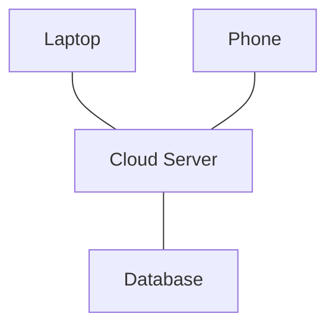
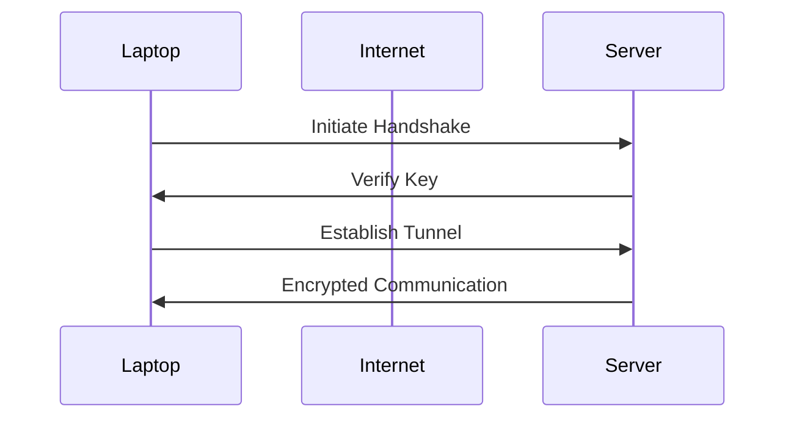
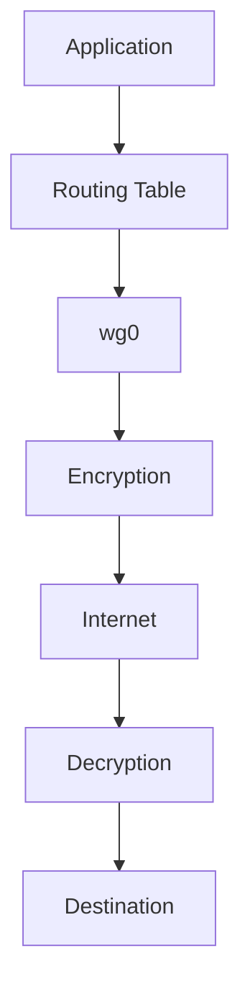
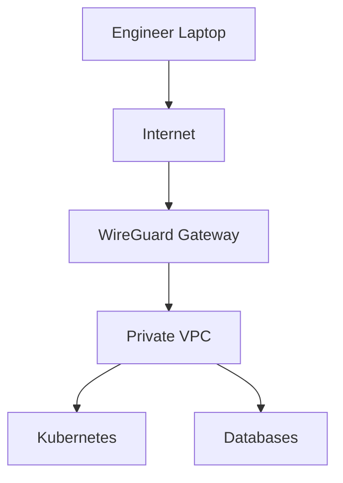
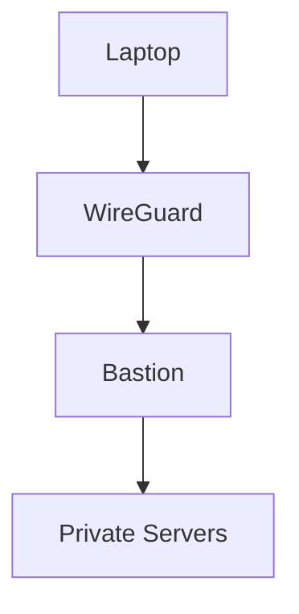
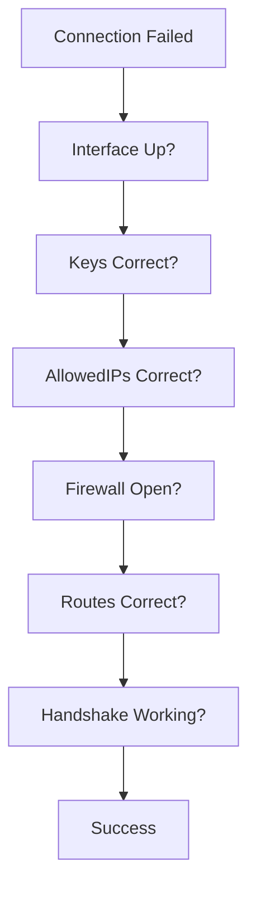

# WireGuard Internals

# 1. Why Should You Care About WireGuard?

Imagine you work at a company.

Your infrastructure looks like this:

```text
Developer Laptop

AWS Servers

Kubernetes Cluster

Databases

CI/CD Systems
```

Question:

> Should these systems be directly exposed to the internet?

Absolutely not.

Instead, companies build private networks.

WireGuard helps build these private networks.

Today WireGuard is used everywhere:

```text
Cloud Infrastructure

Remote Work

Homelabs

Kubernetes

Multi-Cloud

Private Databases

Zero Trust Networks
```

Many engineers are replacing OpenVPN with WireGuard.

---

# 2. What is WireGuard?

WireGuard is a:

> Modern, lightweight, high-performance VPN protocol.

Its job:

> Securely connect devices over untrusted networks.

Think:

```text
Laptop

↓

Internet

↓

Private Cloud Network
```

---

# 3. Why Was WireGuard Created?

Older VPN technologies had problems.

OpenVPN:

```text
Large codebase

Complex configuration

Higher overhead
```

IPsec:

```text
Powerful

But complicated

Difficult to manage
```

WireGuard philosophy:

> Keep things simple.

---

# 4. Mental Model

Imagine creating a private LAN over the internet.

Without WireGuard:

```text
Laptop

↓

Public Internet

↓

Production Server
```

With WireGuard:

```text
Laptop

↓

Encrypted Tunnel

↓

Private Server
```

The internet becomes a giant ethernet cable.

---

# 5. WireGuard Philosophy

WireGuard intentionally stays small.

Approximate codebase:

```text
OpenVPN

Hundreds of thousands of lines

IPsec

Hundreds of thousands

WireGuard

~4000 lines (kernel implementation)
```

Smaller code means:

```text
Easier auditing

Fewer bugs

Better performance

Less complexity
```

---

# 6. WireGuard Architecture


---

# 7. WireGuard Core Concepts

Everything revolves around 5 concepts.

```text
Peer

Interface

Tunnel

Keys

AllowedIPs
```

Memorize these.

---

# 8. What is a Peer?

Peer means:

> Any device participating in WireGuard communication.

Examples:

```text
Laptop

Phone

Server

Router

Cloud VM
```

Everyone is a peer.

Unlike traditional client-server models.

---

# 9. Visualizing Peers



Everyone communicates through secure tunnels.

---

# 10. Interface

WireGuard creates a virtual interface.

Examples:

```text
wg0

wg1
```

Similar to:

```text
eth0

wlan0
```

Check:

```bash
ip addr
```

Example:

```text
wg0
```

---

# 11. What is a Virtual Interface?

A physical interface:

```text
Ethernet Port

WiFi Card
```

Virtual interface:

```text
Software Network Adapter
```

Think:

```text
Software Ethernet Cable
```

---

# 12. Public and Private Keys

WireGuard uses asymmetric cryptography.

Every peer has:

```text
Private Key

Public Key
```

Private key:

```text
Secret

Never share
```

Public key:

```text
Safe to share
```

---

# 13. Key Relationship


Private key mathematically generates public key.

---

# 14. WireGuard Does NOT Use Passwords

Unlike SSH:

```text
Password Login
```

WireGuard says:

```text
Keys Only
```

This simplifies security.

---

# 15. How Connection Happens

Suppose:

```text
Laptop

↓

Server
```

Connection flow:



---

# 16. Handshake Explained

Question:

> How do two peers trust each other?

Step 1:

```text
Exchange Public Keys
```

Step 2:

```text
Verify Identity
```

Step 3:

```text
Generate Session Keys
```

Step 4:

```text
Encrypt Traffic
```

---

# 17. AllowedIPs (Very Important)

This confuses beginners.

It is NOT just routing.

It is BOTH:

```text
Routing Rule

+

Access Control Rule
```

Example:

```text
10.0.0.2/32
```

Means:

```text
Route this traffic

Only trust this peer for this IP
```

---

# 18. Mental Model For AllowedIPs

Think:

```text
Employee Badge
```

Badge says:

```text
Employee

↓

Allowed Floor
```

AllowedIPs says:

```text
Peer

↓

Allowed Network
```

---

# 19. Packet Journey

Suppose:

```text
10.0.0.2

↓

10.0.0.10
```

Journey:



---

# 20. Under The Hood

WireGuard primarily operates in:

```text
Linux Kernel
```

This makes it extremely fast.

Path:

```text
Application

↓

Socket

↓

Routing

↓

wg0

↓

Kernel Encryption

↓

NIC

↓

Internet
```

---

# 21. Encryption Algorithms

WireGuard intentionally limits choices.

Instead of:

```text
Choose 100 algorithms
```

WireGuard says:

```text
We'll choose secure defaults.
```

Algorithms:

```text
ChaCha20

Poly1305

Curve25519

BLAKE2s
```

Beginners do NOT need to memorize all of them.

Just understand:

> Modern cryptography with secure defaults.

---

# 22. Why ChaCha20?

AES is extremely fast on servers.

But phones may lack hardware acceleration.

ChaCha20 performs well everywhere.

Benefits:

```text
Fast

Secure

Consistent
```

---

# 23. NAT Traversal

Many devices sit behind routers.

Example:

```text
Home Router

↓

Laptop
```

WireGuard can still establish connections.

This is called:

```text
NAT Traversal
```

---

# 24. Persistent Keepalive

Problem:

Routers forget inactive connections.

WireGuard solves this.

```text
Every 25 seconds

↓

Small Packet

↓

Keep Connection Alive
```

---

# 25. Production Architecture



---

# 26. WireGuard + Bastion

Modern architecture:



---

# 27. Cloud Example

Bad:

```text
0.0.0.0:22
```

Good:

```text
VPN Only
```

This dramatically reduces attack surface.

---

# 28. WireGuard vs OpenVPN

| Feature       | WireGuard | OpenVPN |
| ------------- | --------- | ------- |
| Speed         | Excellent | Good    |
| Complexity    | Low       | High    |
| Configuration | Simple    | Complex |
| Codebase      | Small     | Large   |
| Modern        | Yes       | Yes     |
| Performance   | Excellent | Good    |

---

# 29. WireGuard vs IPsec

| Feature        | WireGuard | IPsec     |
| -------------- | --------- | --------- |
| Learning Curve | Easy      | Hard      |
| Configuration  | Simple    | Complex   |
| Codebase       | Small     | Large     |
| Cloud Friendly | Excellent | Excellent |

---

# 30. Troubleshooting Flow



---

# 31. Useful Commands

Show interfaces:

```bash
ip addr
```

Show routes:

```bash
ip route
```

Show WireGuard status:

```bash
sudo wg
```

Show configuration:

```bash
sudo wg show
```

Bring interface up:

```bash
sudo wg-quick up wg0
```

Bring interface down:

```bash
sudo wg-quick down wg0
```

---

# 32. Common Beginner Mistakes

### Mistake 1

Treating AllowedIPs as only routing.

Wrong.

---

### Mistake 2

Exposing everything publicly.

Wrong.

---

### Mistake 3

Using WireGuard without firewall rules.

Wrong.

---

### Mistake 4

Thinking VPN replaces security.

Wrong.

Security layers still matter.

---

# 33. Interview Questions

### Beginner

* What is WireGuard?
* Why was WireGuard created?

### Intermediate

* What are peers?
* What is AllowedIPs?
* What is wg0?

### Advanced

* Why is WireGuard faster?
* How does NAT traversal work?
* How would you secure production infrastructure using WireGuard?

---

# 34. Key Takeaways

```text
WireGuard = Modern VPN

Core Concepts:

Peers

Keys

Interfaces

AllowedIPs

Tunnels

Advantages:

Fast

Simple

Secure

Small Codebase

Production Use Cases:

Cloud

Kubernetes

Remote Work

Private Infrastructure

Zero Trust Networks
```
