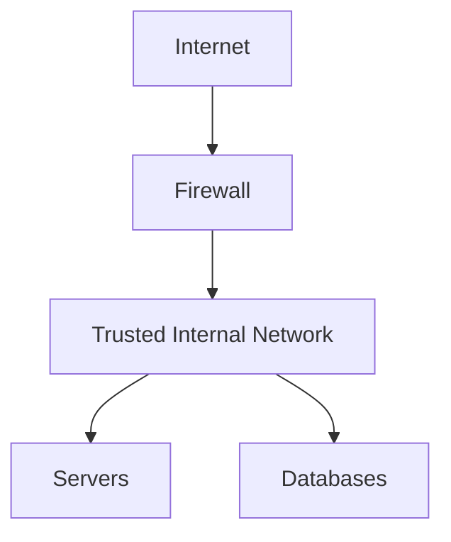
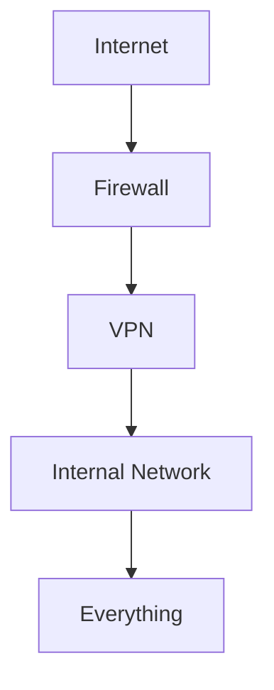
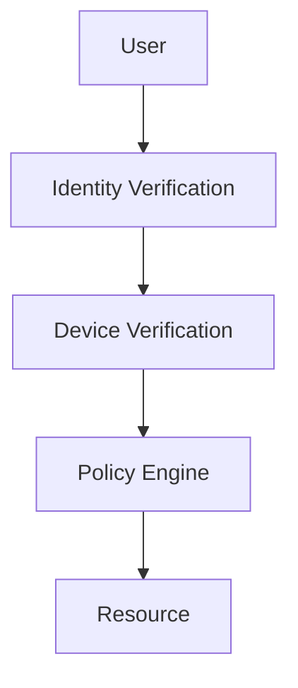
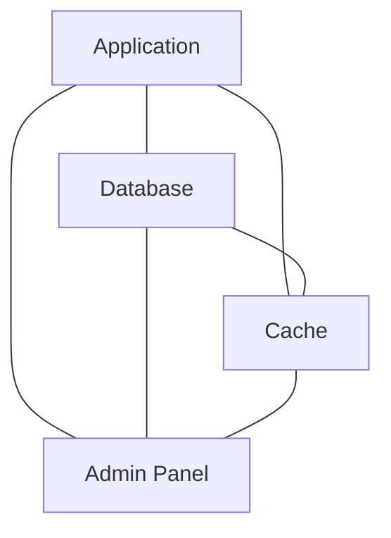
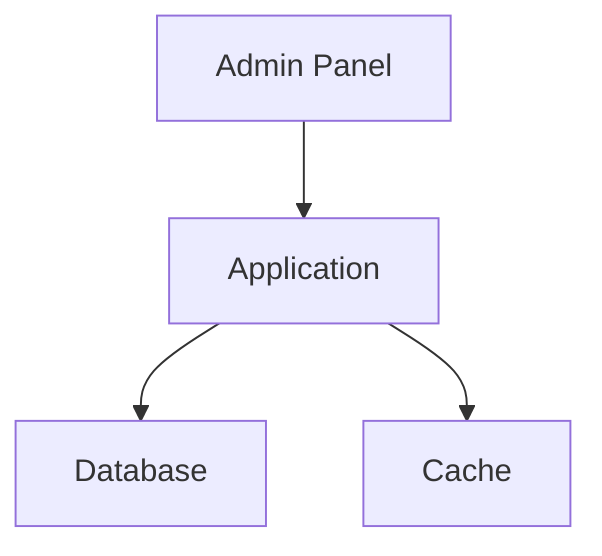
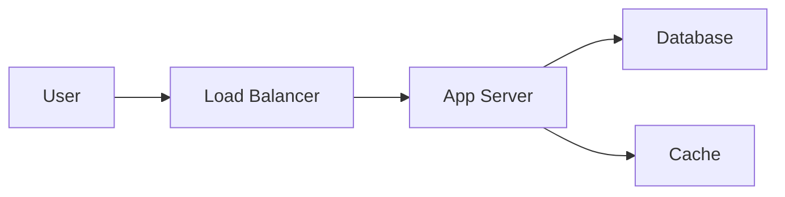
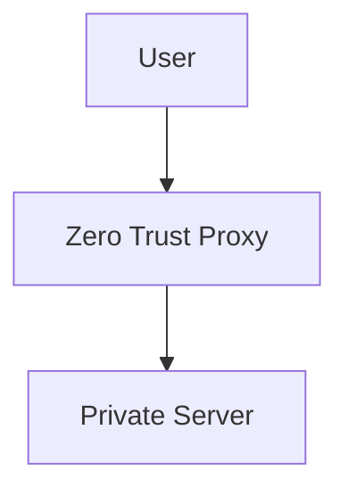
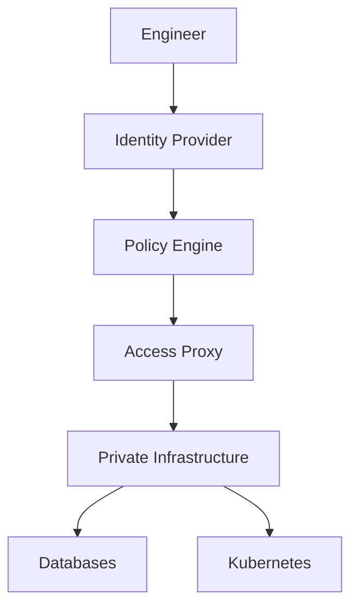
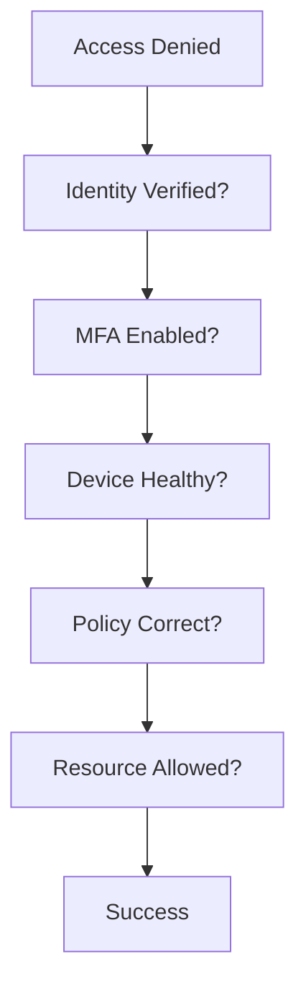

# Zero Trust Networking

# 1. Why Should You Care?

Imagine you work at a company.

The infrastructure looks like this:

```text
Employees

↓

VPN

↓

Cloud Servers

↓

Databases

↓

Kubernetes
```

Question:

> If someone successfully logs into the VPN, should they automatically have access to everything?

Old systems said:

```text
Yes
```

Modern systems say:

```text
Absolutely not
```

This is where Zero Trust was born.

---

# 2. The Problem Zero Trust Solves

For decades, companies designed networks like castles.

```text
Big Wall

↓

Everything Inside = Trusted
```

This worked when:

```text
Everyone sat in offices

One datacenter existed

Few applications existed
```

Modern infrastructure changed.

Now we have:

```text
Cloud

Remote Work

Contractors

Multi-cloud

Kubernetes

Third-party vendors

SaaS applications
```

The old model broke.

---

# 3. The Castle And Moat Problem

Traditional security:



Assumption:

> If you're inside, you're trusted.

This is dangerous.

---

# 4. Imagine A Stolen Laptop

Suppose:

```text
Employee Laptop

↓

Compromised

↓

VPN Credentials Stolen
```

Traditional systems:

```text
Attacker

↓

VPN

↓

Everything Accessible
```

Disaster.

---

# 5. Zero Trust Philosophy

The entire philosophy can be summarized in one sentence.

> **Never trust. Always verify.**

Every single request must prove itself.

---

# 6. The Three Core Principles

Memorize these.

```text
Verify Explicitly

Use Least Privilege

Assume Breach
```

These three ideas drive everything.

---

# 7. Verify Explicitly

Every access request is evaluated.

Question:

```text
Who are you?

Which device?

Where are you?

What time?

What resource?

What risk level?
```

Identity matters.

---

# 8. Use Least Privilege

Give the minimum access possible.

Bad:

```text
Admin access everywhere
```

Good:

```text
Only required permissions
```

---

# 9. Assume Breach

This mindset changes everything.

Assume attackers are already inside.

Question changes from:

```text
How do I stop attackers entering?
```

to

```text
How do I stop attackers moving?
```

---

# 10. Mental Model

Traditional thinking:

```text
Inside = Safe
```

Zero Trust thinking:

```text
Nobody = Trusted
```

Not even internal systems.

---

# 11. Traditional Architecture



One successful login.

Everything accessible.

---

# 12. Zero Trust Architecture



Every request is verified.

---

# 13. Trust Is Replaced By Identity

Old world:

```text
Trust network
```

Modern world:

```text
Trust identity
```

Identity becomes the perimeter.

---

# 14. What Does Identity Mean?

Identity isn't only usernames.

Identity includes:

```text
User

Device

Application

Service

Machine
```

Everything gets an identity.

---

# 15. Modern Security Layers

Zero Trust evaluates many signals.

```text
Who?

Where?

When?

What Device?

What Resource?

What Behavior?
```

---

# 16. Example Scenario

Suppose:

```text
Developer

↓

Production Database
```

Questions:

```text
Are they authenticated?

Is MFA enabled?

Is device healthy?

Are they inside allowed hours?

Are they allowed this resource?
```

Only then allow access.

---

# 17. Device Verification

Modern systems also verify devices.

Questions:

```text
Is OS updated?

Antivirus installed?

Encrypted disk?

Corporate device?
```

If not:

```text
Access denied
```

---

# 18. Context-Based Security

The same user may receive different access.

Example:

Morning:

```text
Office

↓

Allow
```

Unknown country at 3 AM:

```text
Challenge MFA

or

Block
```

---

# 19. Microsegmentation (Very Important)

This is one of Zero Trust's biggest ideas.

Instead of:

```text
One giant network
```

Create many small networks.

---

# 20. Traditional Network



Everything talks to everything.

Very dangerous.

---

# 21. Microsegmented Network



Unnecessary communication is removed.

---

# 22. East-West Traffic

Very important concept.

Traffic inside infrastructure.

```text
Server

↓

Server

↓

Database

↓

Cache
```

This is east-west traffic.

Zero Trust heavily protects this.

---

# 23. North-South Traffic

Traffic entering infrastructure.

```text
User

↓

Application
```

This is north-south traffic.

---

# 24. East-West Visualization



Internal communication requires security too.

---

# 25. Zero Trust Components

Modern systems contain:

```text
Identity Provider

Policy Engine

Device Verification

Logging

Monitoring

Access Proxy
```

---

# 26. Identity Providers

Examples:

```text
Okta

Auth0

Google Workspace

Azure AD

Keycloak
```

They verify identities.

---

# 27. Policy Engine

The brain of Zero Trust.

Question:

> Should this request be allowed?

Inputs:

```text
User

Device

Time

Location

Resource
```

Output:

```text
Allow

Deny

Challenge MFA
```

---

# 28. Access Proxy

Instead of exposing servers.

Use proxies.



Servers stay private.

---

# 29. VPN vs Zero Trust

This is very important.

VPN:

```text
Connect

↓

Trust Entire Network
```

Zero Trust:

```text
Authenticate

↓

Authorize Resource

↓

Verify Every Request
```

---

# 30. Modern Architecture



---

# 31. Cloud Infrastructure Example

Bad:

```text
0.0.0.0/0

↓

SSH Open
```

Good:

```text
Identity Verified

↓

Temporary Access

↓

Private Resource
```

---

# 32. Kubernetes And Zero Trust

Microservices should not trust each other.

Example:

```text
User Service

↓

Auth Service

↓

Payment Service
```

Every call should be verified.

---

# 33. Service Identity

Applications also get identities.

Examples:

```text
API Gateway

Payment Service

Notification Service

AI Service
```

---

# 34. Short-Lived Credentials

Avoid:

```text
Credentials valid forever
```

Prefer:

```text
15 minutes

1 hour

24 hours
```

Temporary access is safer.

---

# 35. Continuous Verification

Zero Trust never stops checking.

```text
Login

↓

Monitor

↓

Re-evaluate

↓

Continue
```

This is continuous verification.

---

# 36. Security Observability

Everything is logged.

Track:

```text
Who?

What?

When?

Where?

Why?
```

---

# 37. Real Companies Using These Ideas

Conceptually:

```text
Google BeyondCorp

Cloudflare Zero Trust

Tailscale

Zscaler
```

---

# 38. Common Beginner Mistakes

## Mistake 1

Zero Trust = VPN

Wrong.

---

## Mistake 2

Zero Trust = Product

Wrong.

It is a security philosophy.

---

## Mistake 3

Zero Trust = Zero Network

Wrong.

Networks still exist.

---

## Mistake 4

Zero Trust = No Firewall

Wrong.

Firewalls still matter.

---

# 39. Troubleshooting Flow



---

# 40. Interview Questions

### Beginner

* What is Zero Trust?
* Why was Zero Trust created?

### Intermediate

* Explain least privilege.
* Explain microsegmentation.
* Explain identity as perimeter.

### Advanced

* VPN vs Zero Trust?
* How would you secure a Kubernetes cluster using Zero Trust?
* How would you build a production Zero Trust architecture?

---

# 41. Key Takeaways

```text
Zero Trust = Never Trust, Always Verify

Three Principles:

Verify Explicitly

Least Privilege

Assume Breach

Major Concepts:

Identity

Device Verification

Microsegmentation

Policy Engines

Continuous Verification

Identity-Based Security
```
**`network-segmentation.md` should come next because it is one of the most important production networking concepts used in AWS, Kubernetes, datacenters, and Zero Trust architectures.**
