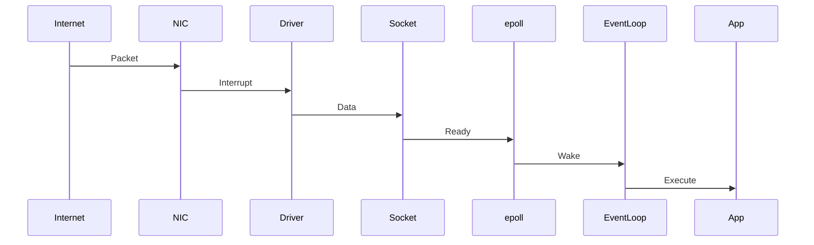

# Linux epoll Internals

# Understanding How Linux Wakes Applications Efficiently

---

# The Biggest Misconception

Many people think:

```text
epoll

↓

Checks sockets
```

Wrong.

epoll does not continuously check sockets.

If it did, Linux would still be slow.

Instead Linux does something much smarter.

Linux says:

```text
Don't ask repeatedly.

Notify me when something changes.
```

This is the entire idea.

---

# First Build The Big Picture

This is the most important diagram of the file.

```mermaid
flowchart TD

Internet

↓

NIC

↓

Driver

↓

Socket Buffer

↓

Socket

↓

epoll

↓

Event Loop

↓

Application
```

Everything revolves around this.

---

# The Historical Problem

Suppose:

```text
1 million connections
```

Question:

> How do we know which sockets have data?

Old systems did this.

```mermaid
flowchart TD

Socket1

↓

Socket2

↓

Socket3

↓

Socket4

↓

Socket1000000
```

Scan everything.

This is terrible.

---

# Why Is Scanning Bad?

Suppose:

```text
1,000,000 sockets
```

Only:

```text
50 users
```

are active.

Scanning:

```text
999,950 idle sockets
```

is wasteful.

---

# Linux Needed A New Idea

Instead of:

```text
Ask every socket
```

Linux changed to:

```text
Tell me when ready
```

---

# The epoll Philosophy

```mermaid
flowchart TD

Sockets

↓

Events

↓

epoll

↓

Application
```

Not:

```text
Sockets

↓

Scanning

↓

Application
```

---

# The Three Core Concepts

Everything revolves around these.

```mermaid
mindmap

root((epoll))

Interest List

Ready List

Wait Queue
```

Memorize these.

---

# Concept 1

# Interest List

Question:

> Which sockets should Linux monitor?

These go here.

---

# Visual

```mermaid
flowchart TD

Socket1

Socket2

Socket3

Socket4

↓

Interest List
```

This list is maintained inside the kernel.

---

# Concept 2

# Ready List

Question:

> Which sockets currently have work?

These go here.

---

# Visual

```mermaid
flowchart TD

Socket2

Socket8

Socket99

↓

Ready List
```

Only active sockets appear.

---

# Concept 3

# Wait Queue

Question:

> Where does epoll sleep?

Linux creates a waiting mechanism.

---

# Visual

```mermaid
flowchart TD

EventLoop

↓

epoll_wait

↓

Wait Queue

↓

Sleeping
```

---

# Internal epoll Architecture

This is one of the most important visuals.

```mermaid
flowchart TD

Application

↓

epoll FD

↓

Interest List

↓

Ready List

↓

Wait Queue

↓

Sockets

↓

Kernel Networking Stack
```

Memorize this.

---

# Wait... epoll Has Its Own File Descriptor?

Yes.

Linux says:

```text
Everything is a file.
```

Even epoll itself.

---

# Creation Flow

Application creates epoll.

```mermaid
flowchart TD

Application

↓

epoll_create

↓

Kernel

↓

epoll Object

↓

epoll FD
```

---

# The Three Main System Calls

Everything revolves around these.

```text
epoll_create()

epoll_ctl()

epoll_wait()
```

But let's understand what they actually do.

---

# epoll_create()

Question:

> What happens here?

Linux creates:

```text
epoll instance
```

which contains internal structures.

---

# Visual

```mermaid
flowchart TD

Application

↓

epoll_create

↓

epoll Instance

↓

Interest List

Ready List

Wait Queue
```

---

# epoll_ctl()

Question:

> Which sockets should Linux watch?

Answer:

```text
epoll_ctl()
```

---

# Visual

```mermaid
flowchart TD

Socket

↓

epoll_ctl

↓

Interest List
```

---

# epoll_wait()

Question:

> What is this actually doing?

Linux sleeps.

---

# Visual

```mermaid
flowchart TD

EventLoop

↓

epoll_wait

↓

Sleeping

↓

Wake When Event Arrives
```

This is extremely important.

---

# Let's Follow One Packet

Suppose:

```text
Browser

↓

GET /users
```

arrives.

---

# Complete Journey



This is modern Linux.

---

# Let's Slow This Down

Step 1

NIC receives packet.

```mermaid
flowchart TD

Internet

↓

NIC
```

---

# Step 2

Driver processes it.

```mermaid
flowchart TD

NIC

↓

Driver
```

---

# Step 3

Linux puts packet inside socket buffers.

```mermaid
flowchart TD

Driver

↓

Socket Buffer

↓

Socket
```

---

# Step 4

Socket state changes.

```text
Empty

↓

Data Available
```

---

# Step 5

Socket notifies epoll.

```mermaid
flowchart TD

Socket

↓

epoll

↓

Ready List
```

---

# Step 6

epoll wakes sleeping applications.

```mermaid
flowchart TD

Ready List

↓

Wake Event Loop

↓

Application
```

---

# This Is The Entire Magic

Notice:

```text
Linux never scanned 1 million sockets.
```

Instead:

```text
Socket itself notified epoll.
```

Huge difference.

---

# How Does Socket Notify epoll?

Linux internally connects them.

---

# Architecture

```mermaid
flowchart TD

Socket

↓

Callback Function

↓

epoll

↓

Ready List
```

The socket has references to interested epoll instances.

---

# Internal Relationship


Linux builds this relationship once.

---

# Why Is epoll Fast?

Because work only happens on events.

---

# Old Model

```text
1M sockets

↓

1M checks
```

---

# New Model

```text
1M sockets

↓

50 active

↓

50 checks
```

Huge improvement.

---

# Understanding O(1)

People misuse this term.

It does NOT mean:

```text
1 microsecond forever
```

It means:

> Performance depends mostly on active events, not total sockets.

---

# Compare Everything

## select()

```mermaid
flowchart TD

Sockets

↓

Scan Everything

↓

Application
```

---

## poll()

```mermaid
flowchart TD

Sockets

↓

Scan Everything

↓

Application
```

---

## epoll()

```mermaid
flowchart TD

Sockets

↓

Ready Events

↓

Application
```

---

# Comparison Table

| System | Strategy | Scales    |
| ------ | -------- | --------- |
| select | Scan     | Poor      |
| poll   | Scan     | Moderate  |
| epoll  | Events   | Excellent |

---

# Edge Triggered Internals

Linux says:

```text
Notify once.
```

---

# Visual

```mermaid
flowchart TD

Data Arrives

↓

Notification

↓

Application Must Drain Data
```

---

# Level Triggered Internals

Linux says:

```text
Still data here.

Still data here.

Still data here.
```

---

# Visual

```mermaid
flowchart TD

Data Exists

↓

Notify

↓

Still Exists

↓

Notify Again
```

---

# Why Edge Triggered Is Hard

Suppose:

```text
100 bytes available
```

Application reads:

```text
10 bytes
```

90 remain.

Linux may never notify again.

---

# Correct Mental Model

```text
Edge Triggered

↓

Read Until EAGAIN
```

---

# Why Nginx Is Fast

Architecture:

```mermaid
flowchart TD

Users

↓

epoll

↓

Workers

↓

Nginx
```

---

# Nginx Worker Internals

```mermaid
flowchart TD

Worker

↓

epoll_wait

↓

HTTP Request

↓

Handle

↓

epoll_wait
```

Forever.

---

# Redis Internals

Redis does something very similar.

```mermaid
flowchart TD

Clients

↓

epoll

↓

Single Thread

↓

Redis Commands
```

---

# NodeJS Internals

Many people think JavaScript does this.

Wrong.

---

# Reality

```mermaid
flowchart TD

JavaScript

↓

Node Runtime

↓

libuv

↓

epoll

↓

Linux
```

---

# Event Loop + epoll Relationship

This diagram is extremely important.

```mermaid
flowchart TD

Sockets

↓

epoll

↓

Event Loop

↓

Application Logic
```

---

# Production Bottleneck 1

Too many active users.

Notice:

```text
epoll scales with idle users.

NOT active users.
```

Huge distinction.

---

# Example

```text
1M users

↓

10 active

↓

Easy
```

vs

```text
1M users

↓

800k active

↓

CPU explosion
```

---

# Production Bottleneck 2

Blocking operations.

```mermaid
flowchart TD

Event Loop

↓

Slow Task

↓

Everything Stops
```

---

# Production Bottleneck 3

Slow database.

```mermaid
flowchart TD

Users

↓

API

↓

Database

↓

Slow

↓

Backpressure
```

---

# Production Bottleneck 4

Slow consumers.

```mermaid
flowchart TD

Packets

↓

Buffers

↓

Slow Application

↓

Memory Growth
```

---

# The Hidden Relationship With Interrupts

Very important.

```mermaid
flowchart TD

Internet

↓

NIC

↓

Interrupt

↓

Driver

↓

Socket

↓

epoll
```

epoll is indirectly connected to hardware.

---

# The Hidden Relationship With NAPI

Modern Linux often looks like this.

```mermaid
flowchart TD

Internet

↓

NIC

↓

NAPI

↓

Socket

↓

epoll

↓

Application
```

---

# The Most Important Diagram In This Entire File

Memorize this forever.

```mermaid
flowchart TD

Internet

↓

NIC

↓

Driver

↓

Socket Buffer

↓

Socket

↓

epoll

↓

Event Loop

↓

Application
```

This explains:

```text
Nginx

Redis

NodeJS

Kafka

HAProxy

Envoy

API Gateways
```

all at once.

---

# Debugging Mindset

When epoll systems become slow, ask:

```text
1. Is CPU saturated?

2. Are users active or idle?

3. Is the event loop blocked?

4. Is the database slow?

5. Is memory growing?

6. Are buffers full?

7. Is backpressure propagating?
```

---

# Useful Commands

See sockets:

```bash
ss -s
```

See processes:

```bash
ss -tulpn
```

See open files:

```bash
lsof -i
```

See file descriptors:

```bash
ls /proc/PID/fd
```

CPU usage:

```bash
htop
```

Trace system calls:

```bash
strace -p PID
```

See interrupts:

```bash
cat /proc/interrupts
```

---

# Engineer Mental Model

Never think:

```text
Users

↓

Application
```

Always think:

```mermaid
flowchart TD

Users

↓

Sockets

↓

epoll

↓

Event Loop

↓

Application
```
