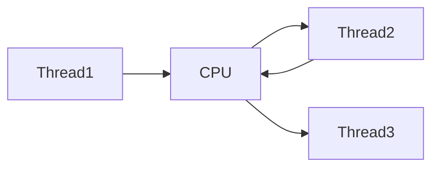
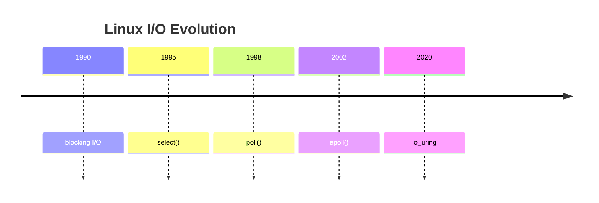

# Linux epoll

# Understanding How Linux Handles Millions Of Connections

---

# Why This File Exists

Imagine building a server.

```text
100 users
```

Easy.

Now imagine:

```text
1000 users
```

Still okay.

Now:

```text
100000 users
```

Now:

```text
1000000 users
```

Question:

> How can Linux handle 1 million users simultaneously?

Answer:

```text
epoll
```

Without epoll:

```text
Modern internet doesn't exist.
```

---

# Learning Goals

After this file you should understand:

* Why epoll exists
* C10K problem
* Event driven architecture
* Kernel internals
* Event loops
* Readiness notifications
* Modern server architectures
* Nginx internals
* Redis internals
* NodeJS internals
* Production bottlenecks

---

# The Big Question

Suppose:

```text
1 million users
```

connect to your server.

Question:

> Should Linux create 1 million threads?

No.

That would be disastrous.

---

# Mental Model

Never think:

```text
User

↓

Thread

↓

Application
```

Think:

```text
Users

↓

epoll

↓

Event Loop

↓

Workers
```

This is the foundation of modern servers.

---

# The Big Picture

```mermaid
flowchart TD

1MillionConnections

↓

epoll

↓

EventLoop

↓

Workers

↓

Application
```

---

# The Historical Problem

Old servers used:

```text
Thread Per Connection
```

---

# Old Architecture

```mermaid
flowchart TD

User1

↓

Thread1

↓

Server

User2

↓

Thread2

↓

Server

User3

↓

Thread3

↓

Server
```

---

# Why This Fails

Imagine:

```text
1 Million Users
```

This becomes:

```text
1 Million Threads
```

Disaster.

---

# Problems

```mermaid
mindmap

root((Problems))

Memory

Context Switching

CPU Overhead

Latency

Thread Scheduling
```

---

# Memory Explosion

Suppose:

```text
1 Thread = 1 MB stack
```

Then:

```text
1 Million Threads

↓

1 TB RAM
```

Impossible.

---

# Context Switching Problem

CPU constantly switches.

---

# Visual



Huge overhead.

---

# Linux Needed A Better Idea

Linux asked:

Question:

> What if we only wake applications when work exists?

That became epoll.

---

# Event Driven Architecture

```mermaid
flowchart TD

Connections

↓

epoll

↓

EventLoop

↓

Workers
```

---

# The Core Idea

Don't ask:

```text
Can you read?

Can you read?

Can you read?
```

Instead:

```text
Tell me when ready.
```

---

# Restaurant Analogy

Old model:

```text
Waiter

↓

Checks every table repeatedly
```

Wasteful.

epoll:

```text
Customer raises hand

↓

Waiter responds
```

Efficient.

---

# Evolution



---

# Why select() Failed

select():

```text
Loop through every socket
```

every time.

---

# Visual

```mermaid
flowchart TD

Socket1

↓

Socket2

↓

Socket3

↓

Socket100000
```

Very expensive.

---

# poll() Problem

Same problem.

---

# Linux Solution

epoll uses:

```text
Interest List

+

Ready List
```

---

# This Is The Most Important Concept

```mermaid
flowchart TD

Sockets

↓

Interest List

↓

Ready List

↓

Application
```

Memorize this.

---

# Interest List

Question:

> Which sockets should Linux watch?

---

# Visual

```mermaid
flowchart TD

Socket1

Socket2

Socket3

↓

InterestList
```

---

# Ready List

Question:

> Which sockets are ready right now?

---

# Visual

```mermaid
flowchart TD

Socket2

Socket5

Socket9

↓

ReadyList
```

---

# Why This Is Powerful

Suppose:

```text
1 Million Connections

↓

10 Active Users
```

epoll only wakes:

```text
10
```

Huge efficiency.

---

# Architecture

```mermaid
flowchart TD

Connections

↓

Kernel

↓

epoll

↓

Ready Events

↓

Application
```

---

# Internal Architecture

This is extremely important.

```mermaid
flowchart TD

Application

↓

epoll FD

↓

Interest Tree

↓

Ready Queue

↓

Socket Events
```

---

# Wait... epoll Has Its Own FD?

Yes.

```text
Everything is a file.
```

---

# Event Loop Architecture

```mermaid
flowchart TD

Start

↓

Wait

↓

Events Arrive

↓

Process

↓

Repeat
```

Simple but powerful.

---

# Event Loop Visualization

```mermaid
flowchart TD

epoll_wait

↓

Event

↓

Handle

↓

epoll_wait
```

Forever.

---

# Complete Lifecycle

```mermaid
flowchart TD

Create epoll

↓

Register Socket

↓

Wait

↓

Event Ready

↓

Process

↓

Wait Again
```

---

# Kernel Relationship

```mermaid
flowchart TD

Application

↓

epoll

↓

Socket

↓

Kernel Networking Stack
```

---

# Event Types

```mermaid
mindmap

root((Events))

Read

Write

Error

Hangup
```

---

# EPOLLIN

Means:

```text
Data available to read.
```

---

# EPOLLOUT

Means:

```text
Ready to write.
```

---

# EPOLLERR

Means:

```text
Something broke.
```

---

# EPOLLHUP

Means:

```text
Connection closed.
```

---

# Edge Triggered vs Level Triggered

This confuses many engineers.

---

# Level Triggered

Linux repeatedly reminds you.

---

# Visual

```mermaid
flowchart TD

Data Exists

↓

Notify

↓

Still Exists

↓

Notify Again
```

---

# Edge Triggered

Linux notifies once.

---

# Visual

```mermaid
flowchart TD

Data Arrives

↓

Notify Once

↓

Application Must Drain Data
```

---

# Comparison

| Feature       | Level    | Edge   |
| ------------- | -------- | ------ |
| Notifications | Repeated | Once   |
| Easier        | Yes      | No     |
| Faster        | Good     | Better |
| Complexity    | Low      | Higher |

---

# Why Nginx Uses epoll

Architecture:

```mermaid
flowchart TD

Users

↓

epoll

↓

Workers

↓

Nginx
```

---

# Why Redis Uses epoll

```mermaid
flowchart TD

Clients

↓

epoll

↓

Single Thread

↓

Redis
```

---

# Why Redis Is Fast

Redis does:

```text
Thousands users

↓

Single thread

↓

epoll
```

No thread explosion.

---

# NodeJS Architecture

```mermaid
flowchart TD

Users

↓

epoll

↓

libuv

↓

EventLoop

↓

JavaScript
```

---

# NodeJS Reality

JavaScript never directly talks to epoll.

---

# Architecture

```mermaid
flowchart TD

JavaScript

↓

Node Runtime

↓

libuv

↓

epoll

↓

Kernel
```

---

# HAProxy Architecture

```mermaid
flowchart TD

Users

↓

epoll

↓

Workers

↓

Backend Servers
```

---

# Envoy Architecture

```mermaid
flowchart TD

Users

↓

epoll

↓

Workers

↓

Microservices
```

---

# Kafka Architecture

```mermaid
flowchart TD

Producers

Consumers

↓

epoll

↓

Kafka Broker
```

---

# Modern Internet Architecture

```mermaid
flowchart TD

Users

↓

CDN

↓

LoadBalancer

↓

API

↓

Redis

↓

Database
```

Almost every component uses epoll.

---

# Cloud Native Architecture

```mermaid
flowchart TD

Users

↓

Ingress

↓

Service Mesh

↓

Pods

↓

Database
```

Many layers use epoll.

---

# Linux Networking Pipeline

This is extremely important.

```mermaid
flowchart TD

Internet

↓

NIC

↓

Driver

↓

Socket Buffer

↓

epoll

↓

Application
```

---

# Packet Journey

```mermaid
sequenceDiagram

participant User

participant Kernel

participant Socket

participant epoll

participant App

User->>Kernel: Packet

Kernel->>Socket: Store

Socket->>epoll: Ready Event

epoll->>App: Wake Up
```

---

# Production Bottleneck #1

Slow application.

---

# Visual

```mermaid
flowchart TD

Users

↓

Buffers

↓

epoll

↓

Slow App

↓

Queue Growth
```

---

# Production Bottleneck #2

Too many active users.

---

# Visual

```mermaid
flowchart TD

1M Users

↓

500K Active

↓

CPU Overload
```

---

# Production Bottleneck #3

Blocking code.

---

# Visual

```mermaid
flowchart TD

EventLoop

↓

Blocking Function

↓

Everything Stops
```

---

# Production Bottleneck #4

Slow database.

---

# Visual

```mermaid
flowchart TD

Users

↓

API

↓

Database

↓

Slow

↓

Backpressure
```

---

# The Golden Rule

Never block the event loop.

---

# Event Loop Disaster

```mermaid
flowchart TD

EventLoop

↓

Slow Operation

↓

Queue Growth

↓

Latency

↓

Timeouts
```

---

# Linux Limits Matter

Check:

```bash
ulimit -n
```

---

# Why?

1 million sockets require:

```text
1 million file descriptors
```

---

# Important Kernel Settings

View:

```bash
sysctl fs.file-max
```

Backlog:

```bash
sysctl net.core.somaxconn
```

---

# Useful Commands

View sockets:

```bash
ss -s
```

Processes:

```bash
ss -tulpn
```

Open files:

```bash
lsof -i
```

Open FDs:

```bash
ls /proc/<PID>/fd
```

Monitor:

```bash
watch ss -s
```

---

# Common Misconceptions

### ❌ epoll creates threads

Wrong.

---

### ❌ epoll replaces sockets

Wrong.

---

### ❌ epoll makes applications fast automatically

Wrong.

---

### ❌ NodeJS invented event loops

Wrong.

Linux epoll enabled it.

---

### ❌ Redis is fast because it's single threaded

Incomplete.

Redis + epoll is fast.

---

# Engineer Mental Model

Never think:

```text
1 User

↓

1 Thread
```

Always think:

```mermaid
flowchart TD

MillionsConnections

↓

epoll

↓

EventLoop

↓

Workers

↓

Application
```

Memorize this.

---

# Capability Checklist

After this file you should understand:

✅ C10K problem

✅ Event loops

✅ Interest list

✅ Ready list

✅ Kernel internals

✅ Nginx internals

✅ Redis internals

✅ NodeJS internals

✅ Modern server architectures

✅ Production bottlenecks
