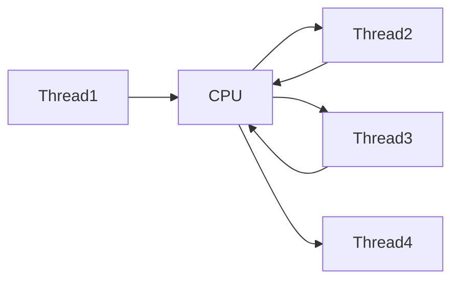
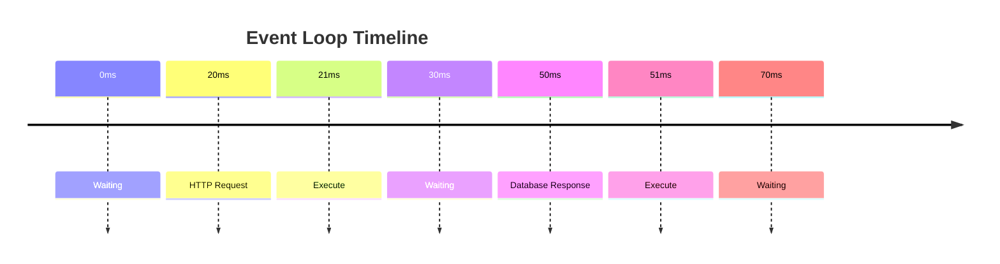
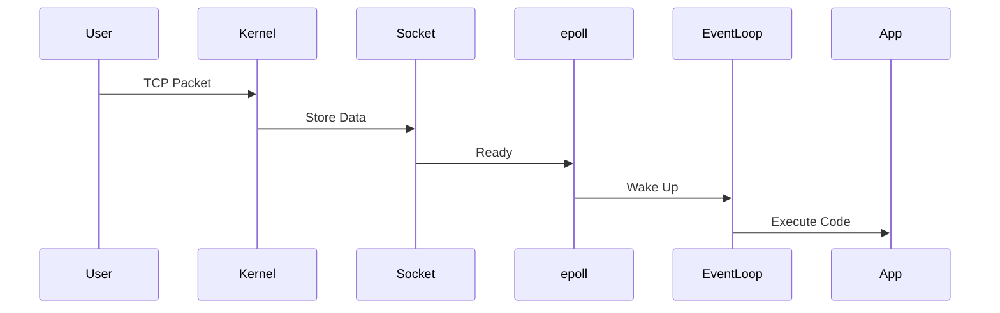
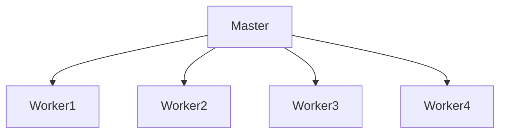

# Event Loop

# Understanding The Engine Behind Modern Servers

---

# Why This File Exists

Imagine these systems:

```text
Nginx

Redis

NodeJS

HAProxy

Envoy

Kafka

API Gateways
```

Question:

> How can these systems handle hundreds of thousands of users without creating hundreds of thousands of threads?

The answer is:

```text
Event Loop Architecture
```

This file explains one of the most important ideas in modern computing.

---

# Build The Correct Mental Model First

Most beginners think:

```text
User

↓

Thread

↓

Application
```

Modern systems think:

```text
Users

↓

Events

↓

Event Loop

↓

Application
```

That single change explains modern infrastructure.

---

# Event Loop In One Sentence

An event loop is:

> A system that continuously waits for work and executes code only when work arrives.

It is extremely simple.

Yet it powers most of the internet.

---

# The Infinite Loop

This is literally the core idea.

```text
while(true){

 wait_for_events()

 process_events()

}
```

Everything else is optimization.

---

# Visualize The Entire Architecture

```mermaid
flowchart TD

Users

↓

Sockets

↓

Kernel

↓

epoll

↓

EventLoop

↓

Application
```

Memorize this diagram.

---

# Why Was Event Loop Created?

Old servers had a huge problem.

---

# Old Architecture

```mermaid
flowchart TD

User1

↓

Thread1

↓

Server

User2

↓

Thread2

↓

Server

User3

↓

Thread3

↓

Server
```

Works for:

```text
100 users
```

Fails for:

```text
100000 users
```

---

# Why Does It Fail?

Every thread consumes resources.

Each thread needs:

```text
Memory

Stack

CPU scheduling

Context switching
```

---

# The Disaster

Imagine:

```text
100000 users
```

becomes:

```text
100000 threads
```

Now Linux must constantly switch.

---

# Thread Switching Visualization



This is expensive.

---

# Most Users Are Actually Idle

This is one of the most important ideas.

Imagine a website.

```text
100000 users
```

Reality:

```text
95000 users

↓

Waiting
```

Only:

```text
5000 users

↓

Doing work
```

Creating 100000 threads is wasteful.

---

# Event Driven Thinking

Instead of:

```text
Create workers for everyone
```

Do:

```text
Wake workers only when work exists
```

---

# The Restaurant Analogy

This analogy is extremely powerful.

---

# Bad Waiter

```text
Waiter

↓

Table1 : Anything?

↓

Table2 : Anything?

↓

Table3 : Anything?

↓

Table4 : Anything?
```

Repeat forever.

Wasteful.

---

# Smart Waiter

```text
Customer

↓

Raises Hand

↓

Waiter Responds
```

This is event driven architecture.

---

# Event Loop Architecture

This is the foundation.

```mermaid
flowchart TD

Sockets

↓

epoll

↓

Ready Events

↓

Event Loop

↓

Callbacks

↓

Application
```

---

# Let's Slow Down

What exactly is happening?

Suppose:

```text
10000 users connected
```

Most users are waiting.

Linux does this:

```text
Watch all sockets

↓

Wake me when one becomes active
```

That's all.

---

# Event Loop Cycle

This is one of the most important diagrams.

```mermaid
flowchart TD

Start

↓

Wait

↓

Event Arrives

↓

Execute Handler

↓

Return To Wait
```

Repeat forever.

---

# The Event Loop Is Always Sleeping

This is important.

The event loop spends most of its life here:

```text
WAITING
```

Not executing.

---

# Event Timeline



---

# Event Sources

Many things can create events.

```mermaid
mindmap

root((Events))

Socket

HTTP

Timer

File

Signal

Database

DNS
```

---

# Real Linux Architecture

Now let's connect everything.

```mermaid
flowchart TD

Internet

↓

NIC

↓

Driver

↓

Socket Buffer

↓

Socket

↓

epoll

↓

Event Loop

↓

Application
```

---

# The Journey Of An HTTP Request

Suppose user visits:

```text
https://example.com
```

---

# Complete Flow



This is modern infrastructure.

---

# Understanding The Queue

Events wait in a queue.

```mermaid
flowchart TD

HTTP Request

Timer

Database Response

↓

Event Queue

↓

Event Loop
```

---

# How The Event Loop Thinks

Internally:

```text
Do we have work?

↓

Yes

↓

Execute

↓

No

↓

Sleep
```

That's it.

---

# Event Loop Pseudocode

Very simplified.

```text
while(true){

 events = epoll_wait()

 for(event in events){

   execute(event)

 }

}
```

This is surprisingly close to reality.

---

# Where epoll Fits

Many people confuse this.

Question:

> Is epoll the event loop?

No.

---

# Relationship

```mermaid
flowchart TD

Linux Kernel

↓

epoll

↓

Event Loop

↓

Application
```

---

# epoll's Job

epoll only says:

```text
Socket 52 is ready

Socket 99 is ready
```

The event loop decides:

```text
What to do next
```

---

# Real World Example

# Nginx

Architecture:

```mermaid
flowchart TD

Users

↓

epoll

↓

Workers

↓

Nginx
```

---

# Nginx Workers



Each worker runs an event loop.

---

# NodeJS Architecture

This is heavily misunderstood.

---

# Wrong Mental Model

```text
JavaScript

↓

Internet
```

Wrong.

---

# Correct Mental Model

```mermaid
flowchart TD

JavaScript

↓

Node Runtime

↓

libuv

↓

epoll

↓

Linux
```

---

# libuv Is The Secret

libuv is a C library.

Its job:

```text
Timers

↓

Event Loop

↓

I/O Scheduling

↓

Thread Pool
```

---

# Redis Architecture

Redis is beautifully simple.

```mermaid
flowchart TD

Clients

↓

epoll

↓

Event Loop

↓

Redis
```

---

# Why Redis Is Fast

Redis avoids:

```text
Thread synchronization

Mutex locks

Excessive context switching
```

---

# Kafka Architecture

```mermaid
flowchart TD

Producers

↓

epoll

↓

Broker

↓

Consumers
```

---

# HAProxy Architecture

```mermaid
flowchart TD

Users

↓

epoll

↓

Workers

↓

Backend Servers
```

---

# Envoy Architecture

```mermaid
flowchart TD

Users

↓

epoll

↓

Workers

↓

Microservices
```

---

# Event Loop Strengths

```mermaid
mindmap

root((Strengths))

Scalable

Low Memory

Low CPU

High Throughput

Simple Architecture
```

---

# But Event Loops Have Weaknesses Too

This is where engineers make mistakes.

Event loops hate blocking operations.

---

# Blocking Disaster

Imagine this.

```text
Event Loop

↓

Database Query

↓

10 Seconds
```

Everything stops.

---

# Visual

```mermaid
flowchart TD

EventLoop

↓

Blocking Task

↓

Queue Growth

↓

Latency

↓

Timeouts
```

---

# The Golden Rule

Never block the event loop.

---

# Dangerous Operations

```text
Long Loops

Big CPU Calculations

Synchronous File Reads

Slow Database Queries

Heavy JSON Parsing

Image Processing
```

These can destroy performance.

---

# Why CPU Heavy Work Is Dangerous

Event loops are optimized for:

```text
I/O

NOT CPU
```

---

# Example

Bad:

```text
User Request

↓

100 Million Iterations

↓

Everything Waits
```

---

# Modern Solution

Offload heavy work.

---

# Architecture

```mermaid
flowchart TD

Users

↓

Event Loop

↓

Worker Pool

↓

Heavy Tasks
```

---

# This Is What NodeJS Does

```mermaid
flowchart TD

JavaScript

↓

Event Loop

↓

Thread Pool

↓

Disk

DNS

Crypto
```

---

# Modern Server Architecture

This is one of the most important diagrams.

```mermaid
flowchart TD

Users

↓

LoadBalancer

↓

API Gateway

↓

Services

↓

Caches

↓

Databases
```

Almost every box contains event loops.

---

# Kubernetes Architecture

```mermaid
flowchart TD

Users

↓

LoadBalancer

↓

Ingress

↓

Pods

↓

Services
```

Many ingress controllers use event loops.

---

# The Event Loop Is Everywhere

```mermaid
mindmap

root((Event Loop Usage))

Nginx

NodeJS

Redis

HAProxy

Envoy

Kafka

Gateways
```

---

# Production Failure 1

CPU at 100%.

Question:

```text
What is blocking the loop?
```

---

# Production Failure 2

Huge latency spikes.

Question:

```text
Is the event queue growing?
```

---

# Production Failure 3

Database slowdown.

Question:

```text
Is backpressure propagating?
```

---

# Production Failure 4

Millions of users.

Question:

```text
Are workers saturated?
```

---

# Production Bottleneck Visualization

```mermaid
flowchart TD

Users

↓

EventLoop

↓

Database

↓

Slow

↓

Queue Growth

↓

Timeouts
```

---

# Observability Mindset

When debugging event-loop systems, think:

```text
1. Is CPU high?

2. Is memory high?

3. Is queue growing?

4. Is DB slow?

5. Is external API slow?

6. Is the event loop blocked?
```

---

# Engineer Mental Model (Very Important)

Never think:

```text
User

↓

Thread

↓

Server
```

Always think:

```mermaid
flowchart TD

Users

↓

Sockets

↓

epoll

↓

Event Loop

↓

Application
```

Memorize this forever.
