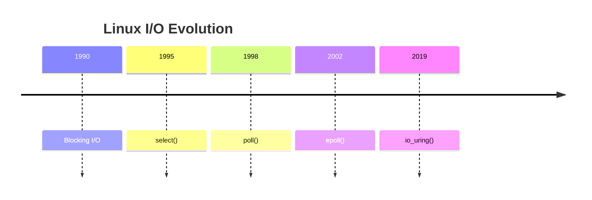
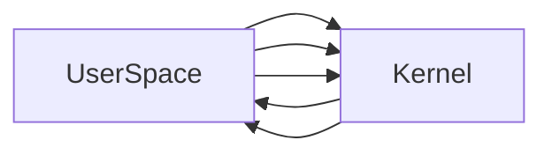

# Linux io_uring

# Understanding The Future Of Linux I/O

---

# Why This File Exists

Imagine these systems.

```text
Nginx

Redis

Kafka

PostgreSQL

Databases

CDNs

AI Inference Servers

Object Storage

Proxy Servers
```

Question:

> Is epoll the final evolution?

No.

Linux engineers discovered another bottleneck.

---

# The Story Of Linux Evolution

This timeline is extremely important.



Each generation solved one problem.

---

# The Big Problem After epoll

Question:

> Why did Linux need another system?

Because epoll only solved:

```text
Event detection
```

It did NOT solve:

```text
System call overhead

Memory copies

Context switching

Kernel transitions
```

These still existed.

---

# Build The Correct Mental Model First

Never think:

```text
epoll

↓

Fast
```

Think:

```text
epoll

↓

Still expensive

↓

Still syscall heavy
```

---

# The Hidden Cost Nobody Talks About

Suppose Nginx receives a request.

The flow is:

```mermaid
flowchart TD

User

↓

NIC

↓

Kernel

↓

Socket

↓

epoll

↓

Application

↓

read()

↓

write()
```

Looks okay.

But many expensive transitions are happening.

---

# Understanding Context Switching

This is one of the most important concepts.

Every time applications ask Linux for something:

```text
User Space

↓

Kernel Space

↓

User Space

↓

Kernel Space
```

Linux must switch contexts.

---

# Visualize The Problem



Thousands of times.

Expensive.

---

# Imagine A Busy Server

Suppose:

```text
100000 users
```

Every second:

```text
read()

write()

send()

recv()

accept()
```

Millions of syscalls happen.

---

# epoll Is Not Enough

Even epoll still does:

```text
epoll_wait()

↓

read()

↓

write()
```

Multiple syscalls.

---

# Linux Engineers Asked

Question:

> What if applications could place work inside Linux once and collect results later?

This became:

```text
io_uring
```

---

# The New Philosophy

Instead of:

```text
Ask Linux repeatedly
```

Linux says:

```text
Give me jobs.

I'll do them.

Come back later.
```

---

# Restaurant Analogy

Old world:

```text
Customer

↓

Order

↓

Wait

↓

Order Again

↓

Wait Again
```

io_uring:

```text
Customer

↓

Drop 100 Orders

↓

Continue Working

↓

Collect Results Later
```

---

# The Big Picture

This is the most important diagram.

```mermaid
flowchart TD

Application

↓

Submission Queue

↓

Linux Kernel

↓

Completion Queue

↓

Application
```

Everything revolves around this.

---

# The Two Ring Buffers

io_uring uses two shared ring buffers.

```mermaid
mindmap

root((io_uring))

Submission Queue

Completion Queue
```

Memorize these.

---

# Submission Queue (SQ)

Question:

> What work should Linux do?

Applications put jobs here.

Example:

```text
Read File

Write File

Send Packet

Accept Connection
```

---

# Visual

```mermaid
flowchart TD

Application

↓

Submission Queue

↓

Kernel
```

---

# Completion Queue (CQ)

Question:

> What work is finished?

Linux puts results here.

---

# Visual

```mermaid
flowchart TD

Kernel

↓

Completion Queue

↓

Application
```

---

# This Is The Magic

Notice:

```text
Application

↓

Kernel

↓

Application

↓

Kernel
```

has disappeared.

Instead:

```text
Shared Memory
```

is used.

---

# Shared Memory Architecture

```mermaid
flowchart TD

subgraph User Space

Application

end

subgraph Shared Memory

Submission Queue

Completion Queue

end

subgraph Kernel

Linux Engine

end

Application --> Submission Queue

Linux Engine --> Completion Queue
```

This is revolutionary.

---

# Let's Follow A Request

Suppose:

```text
Read a file
```

Application does:

---

# Step 1

Place job in SQ.

```mermaid
flowchart TD

Application

↓

SQ

↓

Read File
```

---

# Step 2

Kernel executes.

```mermaid
flowchart TD

SQ

↓

Kernel

↓

Disk
```

---

# Step 3

Kernel writes result.

```mermaid
flowchart TD

Kernel

↓

CQ

↓

Done
```

---

# Step 4

Application collects.

```mermaid
flowchart TD

CQ

↓

Application
```

Done.

---

# Compare Architectures

# Traditional I/O

```mermaid
flowchart TD

Application

↓

read

↓

Kernel

↓

Application

↓

write

↓

Kernel

↓

Application
```

Many transitions.

---

# epoll

```mermaid
flowchart TD

Application

↓

epoll_wait

↓

read

↓

write

↓

Application
```

Better.

Still syscall heavy.

---

# io_uring

```mermaid
flowchart TD

Application

↓

SQ

↓

Kernel

↓

CQ

↓

Application
```

Very efficient.

---

# Why Is It Faster?

Three big reasons.

```mermaid
mindmap

root((Performance))

Fewer Syscalls

Shared Memory

Batch Processing
```

---

# Batching Is Huge

Suppose:

```text
1000 operations
```

Old way:

```text
1000 syscalls
```

io_uring:

```text
1 batch
```

Huge improvement.

---

# Kernel Workers

Question:

> Who actually does the work?

Linux creates internal workers.

---

# Architecture

```mermaid
flowchart TD

Application

↓

SQ

↓

Kernel Workers

↓

CQ
```

---

# SQPOLL Mode

This is an advanced optimization.

Linux creates a dedicated kernel thread.

---

# Visual

```mermaid
flowchart TD

Application

↓

SQ

↓

SQPOLL Thread

↓

Kernel
```

The kernel continuously watches the queue.

Even fewer syscalls.

---

# This Is Extremely Powerful

Applications no longer repeatedly wake Linux.

Linux is already waiting.

---

# Real World Example

# Nginx

Traditional architecture:

```mermaid
flowchart TD

Users

↓

epoll

↓

read

↓

write

↓

Nginx
```

Potential future:

```mermaid
flowchart TD

Users

↓

io_uring

↓

Nginx
```

---

# PostgreSQL

Databases love io_uring.

Why?

Because databases constantly do:

```text
Read

Write

fsync

Network
```

io_uring optimizes all of them.

---

# Storage Engines Love io_uring

```mermaid
flowchart TD

Application

↓

io_uring

↓

Disk
```

---

# Object Storage Systems

Systems like:

```text
MinIO

Ceph

Storage Engines
```

benefit greatly.

---

# AI Infrastructure

AI systems perform massive I/O.

```mermaid
flowchart TD

AI Model

↓

Dataset

↓

Storage

↓

GPU
```

io_uring can reduce bottlenecks.

---

# Modern Systems Using io_uring

```mermaid
mindmap

root((io_uring))

Databases

CDNs

AI Systems

Storage Engines

Proxy Servers

Load Balancers
```

---

# Relationship With Linux Networking

This is extremely important.

```mermaid
flowchart TD

Internet

↓

NIC

↓

Driver

↓

Socket

↓

io_uring

↓

Application
```

---

# Relationship With epoll

Many people ask:

> Does io_uring replace epoll?

Answer:

```text
Not exactly.
```

io_uring can also monitor events.

But its bigger purpose is:

```text
General async I/O
```

---

# epoll vs io_uring

| Feature             | epoll     | io_uring  |
| ------------------- | --------- | --------- |
| Event notifications | Excellent | Excellent |
| Disk I/O            | No        | Yes       |
| Batch processing    | No        | Yes       |
| Shared memory       | No        | Yes       |
| Syscall reduction   | Moderate  | Excellent |
| Complexity          | Lower     | Higher    |

---

# When Should Engineers Use io_uring?

Decision tree.

```mermaid
flowchart TD

START[Workload]

START --> SIMPLE[Simple API]

SIMPLE --> EPOLL[epoll]

START --> EXTREME[High Throughput]

EXTREME --> IOURING[io_uring]
```

---

# Where Is io_uring NOT Ideal?

Do not think:

```text
Newer = Always Better
```

Wrong.

Small applications:

```text
Simple API

Low traffic

Few users
```

often don't need it.

---

# Production Challenges

# Challenge 1

Complexity.

io_uring is harder to debug.

---

# Challenge 2

Kernel compatibility.

Requires newer kernels.

---

# Challenge 3

Memory management.

Queue sizes matter.

---

# Challenge 4

Backpressure still exists.

---

# Backpressure Visualization

```mermaid
flowchart TD

Users

↓

SQ

↓

Kernel

↓

CQ

↓

Slow Application

↓

Queue Growth
```

---

# The Future Linux Architecture

This is one of the most important diagrams in this entire repository.

```mermaid
flowchart TD

Internet

↓

NIC

↓

Driver

↓

Socket

↓

io_uring

↓

Application
```

Linux is moving toward this.

---

# Modern Infrastructure Evolution

```mermaid
timeline

title Infrastructure Evolution

2002 : epoll

2010 : Event Loops

2015 : Cloud Native

2020 : io_uring

2025 : eBPF + io_uring
```

---

# Relationship With eBPF

This is the future.

```mermaid
flowchart TD

Internet

↓

eBPF

↓

io_uring

↓

Application
```

Linux is becoming programmable.

---

# The Three Linux Eras

This diagram is extremely important.

```mermaid
flowchart TD

BlockingIO

↓

epoll

↓

io_uring
```

or

```mermaid
flowchart LR

Blocking

-->

Event Driven

-->

Queue Driven
```

---

# Production Debugging Mindset

If an io_uring system is slow, ask:

```text
1. Is SQ full?

2. Is CQ full?

3. Are kernel workers overloaded?

4. Is storage slow?

5. Is backpressure occurring?

6. Is memory exhausted?
```

---

# Useful Commands

Check kernel version:

```bash
uname -r
```

Kernel release:

```bash
cat /proc/version
```

CPU:

```bash
htop
```

Memory:

```bash
free -h
```

Observe processes:

```bash
pidstat
```

Trace syscalls:

```bash
strace -p PID
```

See interrupts:

```bash
cat /proc/interrupts
```

---

# The Most Important Mental Model Of This Entire File

Never think:

```text
Application

↓

Kernel
```

Always think:

```mermaid
flowchart TD

Application

↓

Submission Queue

↓

Kernel

↓

Completion Queue

↓

Application
```
