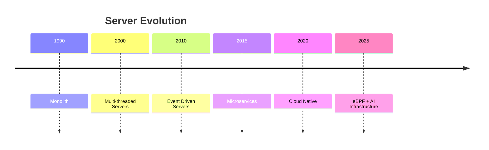
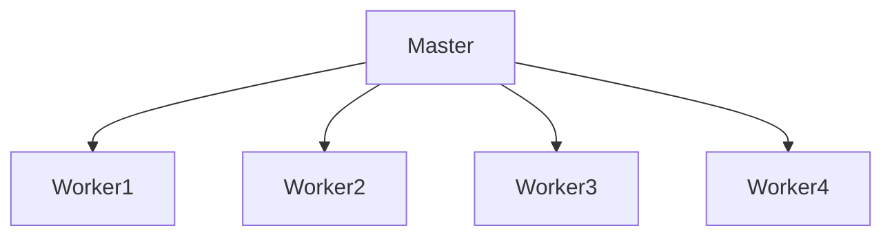
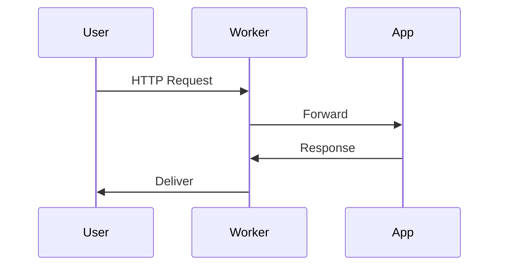
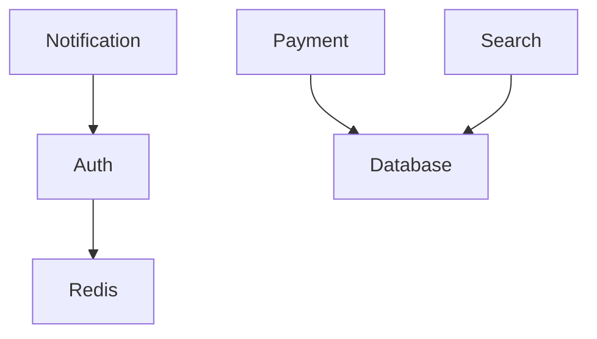

# Modern Server Architectures

# Understanding How The Internet Actually Works

---

# Why This File Exists

Imagine:

```text
10 users
```

Easy.

Now imagine:

```text
100 users
```

Still easy.

Now imagine:

```text
100000 users
```

Now:

```text
10 million users
```

Question:

> How do companies like Google, Netflix, Amazon, GitHub and Cloudflare build systems that scale?

The answer is:

> They do **not** build one giant server.

They build systems around Linux primitives.

---

# Learning Goals

After this file you should understand:

* Evolution of server architectures
* Why old models failed
* Event-driven systems
* Worker architectures
* Load balancing
* API gateways
* Microservices
* Modern cloud-native systems
* Production bottlenecks
* Engineering mental models

---

# The Biggest Misconception

Most beginners think:

```text
User

↓

Server

↓

Database
```

Reality:

```text
User

↓

CDN

↓

Load Balancer

↓

API Gateway

↓

Microservices

↓

Caches

↓

Databases

↓

Queues

↓

Storage
```

---

# Evolution Of Server Architectures



---

# Generation 1: Single Process Server

Very simple.

```mermaid
flowchart TD

User

↓

Server
```

Works for:

```text
10 users
```

Fails quickly.

---

# Problem

If one user blocks:

```text
Everyone waits.
```

---

# Generation 2: Thread Per Connection

Old model.

```mermaid
flowchart TD

User1

↓

Thread1

↓

Server

User2

↓

Thread2

↓

Server

User3

↓

Thread3

↓

Server
```

---

# Why It Fails

Imagine:

```text
100000 users
```

becomes:

```text
100000 threads
```

Problems:

```mermaid
mindmap

root((Problems))

Memory

CPU

Context Switching

Scheduling

Latency
```

---

# Generation 3: Worker Pool

Linux improved things.

```mermaid
flowchart TD

Users

↓

Queue

↓

Workers

↓

Application
```

---

# Better But Still Limited

Problem:

```text
Idle users still consume resources.
```

---

# Generation 4: Event Driven Servers

Huge breakthrough.

```mermaid
flowchart TD

Connections

↓

epoll

↓

EventLoop

↓

Workers
```

This powers modern internet infrastructure.

---

# The Golden Rule

Do not create resources for idle users.

---

# Event Driven Philosophy

```text
Do work only when events exist.
```

---

# Mental Model

Never think:

```text
User

↓

Thread

↓

Server
```

Think:

```text
Users

↓

epoll

↓

Event Loop

↓

Workers
```

---

# Nginx Architecture

This is one of the most important diagrams.

```mermaid
flowchart TD

Users

↓

Master

↓

Workers

↓

epoll

↓

Sockets
```

---

# Nginx Worker Model



Each worker handles thousands of connections.

---

# Nginx Request Flow



---

# NodeJS Architecture

NodeJS is event-driven.

---

# Big Picture

```mermaid
flowchart TD

Users

↓

libuv

↓

epoll

↓

EventLoop

↓

JavaScript
```

---

# NodeJS Mental Model

```text
JavaScript

↓

Runtime

↓

libuv

↓

epoll

↓

Linux
```

---

# Redis Architecture

Redis is extremely elegant.

```mermaid
flowchart TD

Clients

↓

epoll

↓

Single Thread

↓

Memory
```

---

# Why Redis Is Fast

Redis avoids:

```text
Thread overhead

Locking overhead

Context switching
```

---

# PostgreSQL Architecture

PostgreSQL is different.

It still uses processes.

---

# Visual

```mermaid
flowchart TD

Users

↓

Connection Pool

↓

PostgreSQL Processes

↓

Database
```

---

# Why PostgreSQL Uses Pools

Without pooling:

```text
100000 users

↓

100000 DB connections
```

Disaster.

---

# Modern Database Architecture

```mermaid
flowchart TD

Users

↓

API

↓

Pooler

↓

Database
```

Examples:

```text
PgBouncer

RDS Proxy
```

---

# Kafka Architecture

Kafka is event-driven.

---

# Visual

```mermaid
flowchart TD

Producers

↓

Kafka Broker

↓

Consumers
```

---

# Kafka Internals

```mermaid
flowchart TD

Clients

↓

epoll

↓

Broker

↓

Disk
```

---

# API Gateway Architecture

Very common today.

---

# Big Picture

```mermaid
flowchart TD

Users

↓

Gateway

↓

Microservices
```

Examples:

```text
Kong

Traefik

Envoy

NGINX
```

---

# Microservices Architecture



---

# Why Microservices Exist

Monolith problem:

```text
Everything tightly coupled.
```

Microservices:

```text
Independent systems.
```

---

# Modern Production Architecture

This is one of the most important diagrams.

```mermaid
flowchart TD

Users

↓

CDN

↓

LoadBalancer

↓

API Gateway

↓

Microservices

↓

Caches

↓

Databases
```

---

# Load Balancers

Purpose:

```text
Spread traffic.
```

---

# Visual

```mermaid
flowchart TD

Users

↓

LB

↓

Server1

Server2

Server3
```

---

# API Gateway Responsibilities

```mermaid
mindmap

root((API Gateway))

Auth

Rate Limiting

Caching

Routing

Logging

TLS
```

---

# Modern Cloud Native Architecture

```mermaid
flowchart TD

Users

↓

CDN

↓

LoadBalancer

↓

Ingress

↓

Services

↓

Pods

↓

Databases
```

---

# Kubernetes Architecture

```mermaid
flowchart TD

Users

↓

LoadBalancer

↓

Ingress

↓

Service

↓

Pods
```

---

# Service Mesh Architecture

```mermaid
flowchart TD

ServiceA

↓

Sidecar

↓

Sidecar

↓

ServiceB
```

Examples:

```text
Istio

Linkerd
```

---

# Internal Linux Foundation

All of this eventually becomes:

```mermaid
flowchart TD

Application

↓

epoll

↓

Sockets

↓

Buffers

↓

TCP

↓

IP

↓

NIC
```

This diagram is incredibly important.

---

# Modern Request Journey

Suppose user opens an app.

---

# End To End Flow

```mermaid
sequenceDiagram

participant User

participant CDN

participant LB

participant Gateway

participant Service

participant DB

User->>CDN: Request

CDN->>LB: Forward

LB->>Gateway: Route

Gateway->>Service: API Call

Service->>DB: Query

DB->>User: Response
```

---

# Where Bottlenecks Happen

```mermaid
flowchart TD

Users

↓

LB

↓

Gateway

↓

Service

↓

Database
```

Every arrow is a bottleneck candidate.

---

# Production Failure #1

Database slowdown.

---

# Visual

```mermaid
flowchart TD

Users

↓

API

↓

Database

↓

Slow

↓

Everything Slow
```

---

# Production Failure #2

Cache failure.

---

# Visual

```mermaid
flowchart TD

Redis Down

↓

Database Overloaded
```

---

# Production Failure #3

Thread explosion.

---

# Visual

```mermaid
flowchart TD

100000 Users

↓

100000 Threads

↓

Crash
```

---

# Production Failure #4

Event loop blocking.

---

# Visual

```mermaid
flowchart TD

Slow Function

↓

EventLoop

↓

Everything Waits
```

---

# Production Failure #5

Connection explosion.

---

# Visual

```mermaid
flowchart TD

Users

↓

Sockets

↓

Buffers

↓

Memory Exhaustion
```

---

# Modern Scaling Strategy

Horizontal scaling.

---

# Visual

```mermaid
flowchart TD

Users

↓

LB

↓

Server1

Server2

Server3

Server4
```

---

# Vertical Scaling

```mermaid
flowchart TD

Server

↓

More CPU

↓

More RAM
```

---

# Modern Reality

Horizontal scaling wins.

---

# Server Architecture Decision Tree

```mermaid
flowchart TD

START[Application]

START --> SMALL[100 Users]

SMALL --> MONOLITH[Monolith]

START --> MEDIUM[10000 Users]

MEDIUM --> EVENT[Event Driven]

START --> LARGE[1000000 Users]

LARGE --> CLOUD[Cloud Native]
```

---

# Observability Layer

Modern systems require visibility.

```mermaid
flowchart TD

Applications

↓

Logs

Metrics

Traces

↓

Dashboard
```

---

# The Three Pillars

```mermaid
mindmap

root((Observability))

Logs

Metrics

Traces
```

---

# Useful Tools

Load Balancers:

```text
Nginx

HAProxy

Envoy
```

API Gateways:

```text
Kong

Traefik

NGINX
```

Monitoring:

```text
Prometheus

Grafana

OpenTelemetry
```

---

# Engineer Mental Model

Never think:

```text
User

↓

Server

↓

Database
```

Always think:

```mermaid
flowchart TD

Users

↓

CDN

↓

LB

↓

Gateway

↓

Microservices

↓

Caches

↓

Databases

↓

Storage
```

---

# The Most Important Mental Model In This File

Memorize this forever.

```mermaid
flowchart TD

Application

↓

epoll

↓

Sockets

↓

Buffers

↓

TCP

↓

IP

↓

NIC

↓

Internet
```

Every modern server eventually becomes this.

---

# Capability Checklist

After this file you should understand:

✅ Modern server evolution

✅ Event-driven systems

✅ Nginx architecture

✅ NodeJS architecture

✅ Redis architecture

✅ PostgreSQL architecture

✅ Kafka architecture

✅ API gateways

✅ Microservices

✅ Cloud native systems

✅ Production bottlenecks
