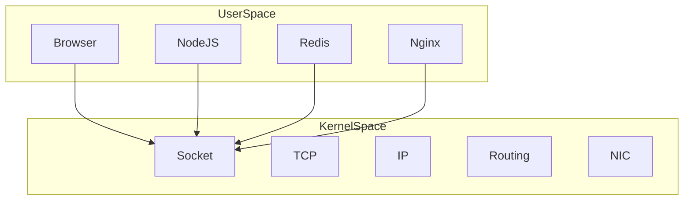
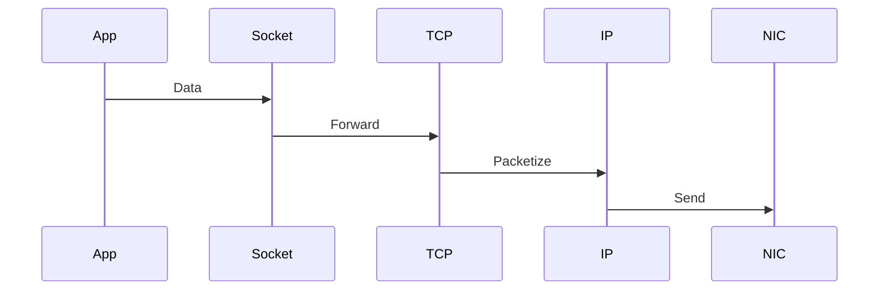
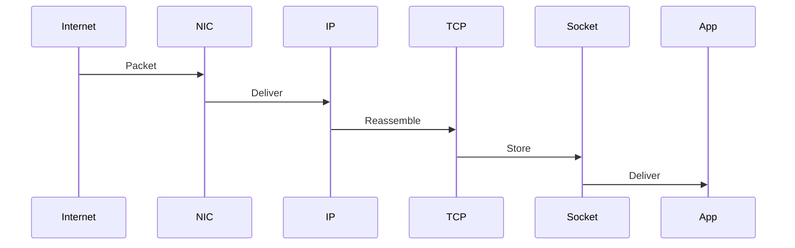
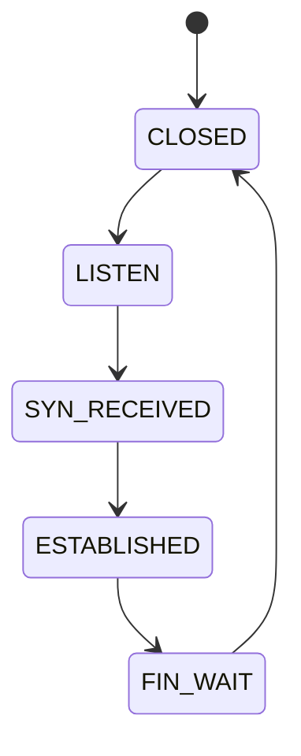

# Linux Socket Internals

# Understanding What Actually Happens Inside Linux

---

# Why This File Exists

Most engineers think:

```c
socket()
```

creates networking.

No.

It creates a kernel object.

Everything else happens afterwards.

Question:

> When Chrome opens google.com, what actually happens inside Linux?

This file answers that.

---

# Learning Goals

After this file you should understand:

* What a socket actually is
* Kernel internals
* File descriptor relationship
* Memory structures
* Packet ownership
* Kernel networking pipeline
* Buffers
* Queues
* Interrupt relationships
* Modern server architectures
* Production bottlenecks

---

# The Big Question

Suppose Chrome does:

```text
google.com
```

Question:

> What does Linux actually build?

---

# Mental Model

Never think:

```text
Application

↓

Internet
```

Think:

```text
Application

↓

File Descriptor

↓

Socket Object

↓

TCP/UDP

↓

Linux Networking Stack

↓

Internet
```

Everything revolves around this.

---

# Big Picture

```mermaid
flowchart TD

Application

↓

FileDescriptor

↓

SocketObject

↓

TCP_UDP

↓

IP

↓

Routing

↓

NIC

↓

Internet
```

---

# What Is A Socket Internally?

A socket is:

> A kernel-managed communication object.

Think:

> A data structure Linux uses to track communication.

---

# Socket Is A Kernel Object

```mermaid
flowchart TD

Application

↓

SystemCall

↓

KernelSocketObject

↓

NetworkingStack
```

---

# User Space vs Kernel Space

This distinction is extremely important.



---

# What Happens When You Call socket()?

Suppose:

```c
socket(AF_INET, SOCK_STREAM, 0);
```

Linux does many things.

---

# Internal Steps

```mermaid
flowchart TD

Application

↓

Syscall

↓

Allocate Socket

↓

Allocate Memory

↓

Assign Protocol

↓

Create FileDescriptor

↓

Return FD
```

---

# Kernel Components Created

Linux creates multiple objects.

```mermaid
mindmap

root((Socket Creation))

File Descriptor

Socket Object

Protocol Object

Buffers

Queues

State Machine
```

---

# File Descriptor Relationship

This is one of Linux's greatest abstractions.

Linux says:

```text
Everything is a file
```

including sockets.

---

# Process Architecture

```mermaid
flowchart TD

Process

↓

FDTable

↓

FD3

↓

Socket
```

---

# Example

```text
FD0

stdin

FD1

stdout

FD2

stderr

FD3

socket
```

---

# File Descriptor Table

Every process owns one.

```mermaid
flowchart TD

Process

↓

FDTable

↓

0

1

2

3

4

5
```

---

# What Does The Socket Object Contain?

A lot.

---

# Internal Structure

```mermaid
mindmap

root((Socket Object))

State

Buffers

Protocol

Queues

Timers

Ownership

Address

Flags
```

---

# Linux Internal Architecture

```mermaid
flowchart TD

Application

↓

FD

↓

Socket

↓

Protocol

↓

IP

↓

Routing

↓

NIC
```

---

# The Hidden Protocol Layer

Sockets don't send packets.

Protocols do.

---

# Visual

```mermaid
flowchart TD

Application

↓

Socket

↓

TCP

↓

IP

↓

NIC
```

---

# Send Path

Suppose application sends:

```text
GET /users
```

---

# Journey



---

# Receive Path



---

# Socket Buffers

Extremely important.

---

# Architecture

```mermaid
flowchart TD

Application

↓

SendBuffer

↓

Kernel

↓

ReceiveBuffer

↓

Application
```

---

# Why Buffers Exist

Applications and networks are asynchronous.

Example:

```text
CPU

↓

Fast

Network

↓

Slow
```

Need temporary storage.

---

# Send Buffer

Outgoing packets wait here.

```mermaid
flowchart TD

Application

↓

SendBuffer

↓

TCP

↓

Internet
```

---

# Receive Buffer

Incoming packets wait here.

```mermaid
flowchart TD

Internet

↓

TCP

↓

ReceiveBuffer

↓

Application
```

---

# Queue Architecture

Linux uses many queues.

```mermaid
mindmap

root((Socket Queues))

Accept Queue

Backlog Queue

Receive Queue

Send Queue
```

---

# Accept Queue

Used by servers.

---

# Visual

```mermaid
flowchart TD

Clients

↓

AcceptQueue

↓

Application
```

---

# Why Accept Queue Exists

Imagine:

```text
10000 users
```

arrive simultaneously.

Applications cannot instantly process them.

Queue required.

---

# Backlog Queue

Very important.

```mermaid
flowchart TD

IncomingConnections

↓

Backlog

↓

AcceptQueue

↓

Application
```

---

# State Machine

TCP sockets have states.

---

# Visual



---

# Ownership Tracking

Linux must know:

```text
Who owns this packet?
```

---

# Packet Matching

Linux uses:

```text
5 Tuple
```

---

# Visual

```mermaid
graph TD

Connection

↓

SourceIP

DestinationIP

SourcePort

DestinationPort

Protocol
```

---

# Example

```text
10.0.0.5

↓

8.8.8.8

↓

52311

↓

443

↓

TCP
```

Unique identifier.

---

# The Hidden Memory Cost

Every connection consumes memory.

---

# Visual

```mermaid
flowchart TD

Connection

↓

Socket

↓

Buffers

↓

Timers

↓

Memory
```

---

# Why 1 Million Connections Are Hard

Imagine:

```text
1M users
```

means:

```text
1M sockets
```

Linux must manage:

```text
1M buffers

1M timers

1M states
```

Huge engineering challenge.

---

# Modern Server Problem

Thread per connection fails.

---

# Bad Architecture

```mermaid
flowchart TD

1MillionUsers

↓

1MillionThreads

↓

Crash
```

---

# Modern Architecture

```mermaid
flowchart TD

1MillionUsers

↓

epoll

↓

EventLoop

↓

Workers
```

---

# How Nginx Works

```mermaid
flowchart TD

Clients

↓

epoll

↓

Worker

↓

Sockets
```

---

# How NodeJS Works

```mermaid
flowchart TD

Clients

↓

EventLoop

↓

Sockets

↓

Application
```

---

# How Redis Works

```mermaid
flowchart TD

Clients

↓

epoll

↓

SingleThread

↓

Redis
```

---

# Modern Infrastructure

Everything eventually becomes sockets.

```mermaid
mindmap

root((Modern Systems))

Nginx

NodeJS

Redis

Kafka

PostgreSQL

Docker

Kubernetes
```

---

# Docker Relationship

```mermaid
flowchart TD

Container

↓

Socket

↓

Linux Kernel

↓

Internet
```

---

# Kubernetes Relationship

```mermaid
flowchart TD

Pod

↓

Socket

↓

Linux Networking

↓

Internet
```

---

# Interrupt Relationship

NIC eventually delivers packets.

---

# Visual

```mermaid
flowchart TD

Internet

↓

NIC

↓

Driver

↓

Socket

↓

Application
```

---

# Production Problems

Problem 1.

Too many open sockets.

Symptoms:

```text
Memory growth
```

---

# Problem 2.

Socket leaks.

Symptoms:

```text
File descriptor exhaustion
```

---

# Problem 3.

Buffer exhaustion.

Symptoms:

```text
Packet drops
```

---

# Problem 4.

Accept queue overflow.

Symptoms:

```text
Connection refused
```

---

# Production Bottleneck Visualization

```mermaid
flowchart TD

Users

↓

Socket

↓

Buffers

↓

Memory

↓

CPU

↓

Latency
```

---

# Linux Limits

Check:

```bash
ulimit -n
```

System limit:

```bash
cat /proc/sys/fs/file-max
```

---

# Useful Commands

View sockets:

```bash
ss
```

View processes:

```bash
ss -tulpn
```

Open files:

```bash
lsof -i
```

Socket summary:

```bash
ss -s
```

File descriptors:

```bash
ls /proc/<PID>/fd
```

---

# Troubleshooting Flow

```mermaid
flowchart TD

START[Application Slow]

START --> FD[FD Exhausted?]

FD --> BUFFER[Buffers Full?]

BUFFER --> QUEUE[Queue Overflow?]

QUEUE --> MEMORY[Memory Exhausted?]

MEMORY --> SUCCESS[Healthy]
```

---

# Common Misconceptions

### ❌ Socket = TCP

Wrong.

---

### ❌ socket() creates a connection

Wrong.

It creates a kernel object.

---

### ❌ Connections are free

Wrong.

Each connection consumes memory.

---

### ❌ Nginx handles millions of users magically

Wrong.

Linux sockets + epoll make it possible.

---

# Engineer Mental Model

Never think:

```text
Application

↓

Internet
```

Always think:

```mermaid
flowchart TD

Application

↓

FileDescriptor

↓

SocketObject

↓

Protocol

↓

IP

↓

NIC

↓

Internet
```

---

# Capability Checklist

After this file you should understand:

✅ Socket internals

✅ File descriptors

✅ Kernel objects

✅ Buffers

✅ Queues

✅ State machines

✅ Packet ownership

✅ Modern server architectures

✅ Memory costs

✅ Production bottlenecks
