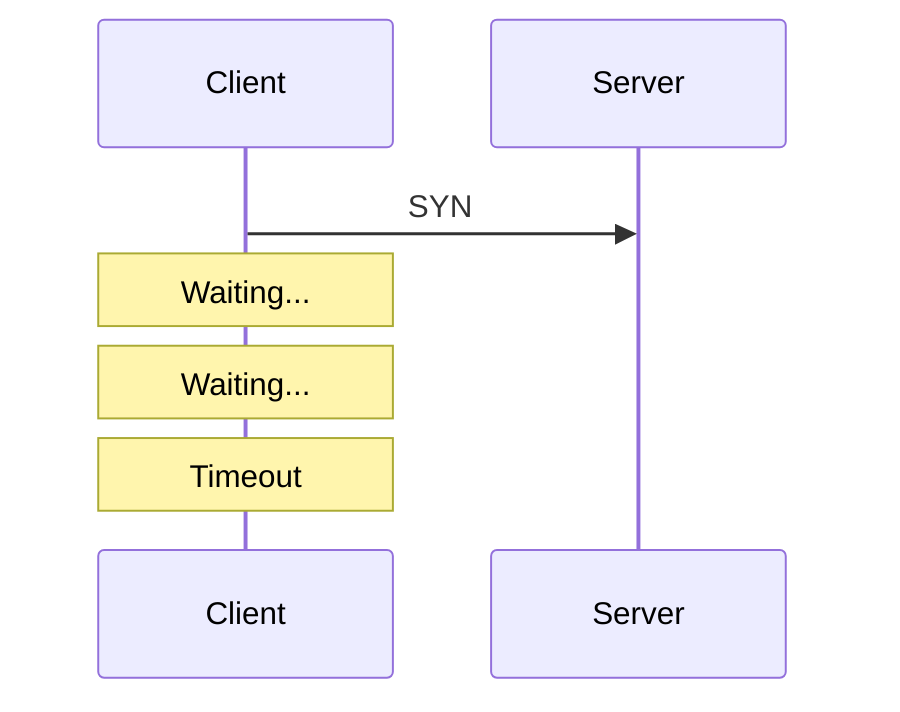
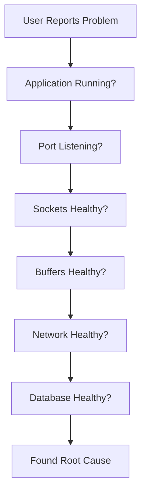

# Linux Socket Troubleshooting

# A Production Engineer Handbook

> If a website is slow, an API is timing out, users cannot connect, or a server crashes under load, this file teaches you how engineers investigate it.

---

# The Golden Rule

Never troubleshoot this way.

```text
Application Slow

↓

Restart Server

↓

Hope It Works
```

Always troubleshoot this way.

```text
Symptom

↓

Observe

↓

Measure

↓

Locate Bottleneck

↓

Fix Root Cause
```

---

# Build This Mental Model First

Everything eventually becomes this.

```mermaid
flowchart TD

Application

↓

Socket

↓

Buffers

↓

TCP

↓

IP

↓

Firewall

↓

Routing

↓

NIC

↓

Internet
```

The question is:

> Which layer is broken?

---

# The Troubleshooting Pyramid

Always move top → bottom.

```mermaid
flowchart TD

Application

↓

Socket

↓

Kernel

↓

Network

↓

NIC

↓

Physical Network
```

---

# The 7 Questions Every Engineer Asks

Whenever networking breaks, ask:

```text
1. Is application alive?

2. Is process listening?

3. Is socket created?

4. Is TCP connection established?

5. Is data flowing?

6. Is network healthy?

7. Is infrastructure overloaded?
```

Never randomly execute commands.

---

# Problem 1

# Website Is Not Reachable

User says:

```text
Cannot open website.
```

Don't panic.

Think systematically.

---

# Investigation Flow

```mermaid
flowchart TD

Website Down

↓

Process Running?

↓

Port Listening?

↓

Firewall Blocking?

↓

DNS Working?

↓

Network Reachable?

↓

Healthy
```

---

# Step 1

Check application.

```bash
ps aux | grep nginx
```

or

```bash
systemctl status nginx
```

---

# Step 2

Is port listening?

```bash
ss -tulnp
```

Example:

```text
LISTEN 0 511 *:80
```

means:

```text
Nginx is listening.
```

---

# Understand LISTEN

This state is extremely important.

```mermaid
flowchart TD

Application

↓

listen()

↓

Kernel

↓

Port Open
```

If LISTEN is absent:

```text
Nobody is accepting users.
```

---

# Problem 2

# Connection Refused

Error:

```text
Connection refused
```

What does this actually mean?

Linux says:

```text
Nobody is listening.
```

---

# Visualization

```mermaid
flowchart TD

Client

↓

Port 8080

↓

Nobody There

↓

Refused
```

Common causes:

```text
Application down

Wrong port

Crash

Firewall rule
```

---

# Problem 3

# Timeout

Error:

```text
Connection timed out
```

Different from refused.

Refused:

```text
Server answered NO.
```

Timeout:

```text
Nobody answered.
```

---

# Visual



Common causes:

```text
Firewall

Dropped packets

Routing issue

Security group

Server overload
```

---

# Connection Refused vs Timeout

This distinction is critical.

| Refused          | Timeout              |
| ---------------- | -------------------- |
| Immediate        | Slow                 |
| Server reachable | Server unreachable   |
| Nobody listening | Packets disappearing |

---

# Problem 4

# Application Is Slow

This is the most common production issue.

Question:

> Which layer is slow?

Never blame the application immediately.

---

# Investigation Flow

```mermaid
flowchart TD

Application Slow

↓

CPU?

↓

Memory?

↓

Sockets?

↓

Buffers?

↓

Database?

↓

Network?
```

---

# First Check

```bash
top
```

or

```bash
htop
```

Look for:

```text
100% CPU

Memory exhaustion

Load spikes
```

---

# Problem 5

# Too Many Open Files

This is extremely common.

Symptoms:

```text
Cannot create socket

Cannot accept users

Random failures
```

---

# Why This Happens

Everything is a file.

```mermaid
flowchart TD

Process

↓

FD Table

↓

Sockets

↓

Limit Reached

↓

Failure
```

---

# Check Current Limit

```bash
ulimit -n
```

---

# Check Process Usage

```bash
ls /proc/PID/fd | wc -l
```

---

# Check System Limit

```bash
cat /proc/sys/fs/file-max
```

---

# Problem 6

# Too Many Connections

Symptoms:

```text
Website slow

High memory

High latency
```

---

# Visual

```mermaid
flowchart TD

Users

↓

Sockets

↓

Buffers

↓

Memory
```

---

# Check

```bash
ss -s
```

Example:

```text
TCP: 85000
```

means:

```text
85000 TCP connections
```

---

# Problem 7

# TIME_WAIT Explosion

Very common.

Check:

```bash
ss -tan
```

Suppose:

```text
TIME_WAIT

150000
```

Huge issue.

---

# Why TIME_WAIT Exists

Linux waits before deleting connections.

```mermaid
flowchart TD

Close

↓

TIME_WAIT

↓

Cleanup
```

---

# Why It Becomes Dangerous

Millions of short requests.

```text
Users

↓

API

↓

Close

↓

TIME_WAIT
```

consume resources.

---

# Problem 8

# Accept Queue Overflow

Symptoms:

```text
Users cannot connect

Connection refused
```

---

# Architecture

```mermaid
flowchart TD

Users

↓

SYN Queue

↓

Accept Queue

↓

Application
```

Application is too slow.

---

# Check Queue

```bash
ss -lt
```

Check:

```text
Recv-Q

Send-Q
```

---

# Problem 9

# SYN Flood Attack

Symptoms:

```text
CPU spike

Half open connections

Users fail
```

---

# Visual

```mermaid
flowchart TD

Attacker

↓

Millions SYN

↓

SYN Queue

↓

Exhausted
```

---

# Check

```bash
ss -tan state syn-recv
```

Large numbers are suspicious.

---

# Problem 10

# Socket Buffer Exhaustion

Symptoms:

```text
Packet loss

Latency

Timeouts
```

---

# Architecture

```mermaid
flowchart TD

Packets

↓

Buffer

↓

Full

↓

Drop
```

---

# Check Memory

```bash
ss -m
```

---

# Problem 11

# Retransmissions

Symptoms:

```text
Slow website

Slow downloads

Lag
```

Check:

```bash
netstat -s
```

or

```bash
ss -i
```

Look for:

```text
retransmits
```

---

# Problem 12

# DNS Is Slow

People often blame applications.

Actually:

```mermaid
flowchart TD

Application

↓

DNS

↓

Internet

↓

DNS Server
```

Check:

```bash
dig google.com
```

or

```bash
nslookup google.com
```

---

# Problem 13

# Database Is Slow

Most applications are database bottlenecks.

---

# Architecture

```mermaid
flowchart TD

Users

↓

API

↓

Database

↓

Slow

↓

Everything Slow
```

---

# Problem 14

# Event Loop Blocking

Very common in:

```text
NodeJS

Redis

Nginx plugins
```

---

# Visual

```mermaid
flowchart TD

EventLoop

↓

Slow Function

↓

Everything Waits
```

---

# Problem 15

# Backpressure

One of the biggest modern issues.

---

# Example

```mermaid
flowchart TD

Users

↓

API

↓

Redis

↓

Database

↓

Slow

↓

Pressure Upstream
```

Everything slows down.

---

# The Golden Production Flow

This is one of the most important diagrams in the entire repository.

```mermaid
flowchart TD

Users

↓

LoadBalancer

↓

API

↓

Redis

↓

Database

↓

Storage
```

Every arrow is a potential bottleneck.

---

# The 10 Linux Commands Every Engineer Must Know

### See sockets

```bash
ss
```

---

### Listening sockets

```bash
ss -l
```

---

### TCP sockets

```bash
ss -t
```

---

### UDP sockets

```bash
ss -u
```

---

### Process ownership

```bash
ss -tulpn
```

---

### Memory

```bash
ss -m
```

---

### Socket summary

```bash
ss -s
```

---

### Packet capture

```bash
sudo tcpdump -i eth0
```

---

### Network interfaces

```bash
ip a
```

---

### Routes

```bash
ip route
```

---

# Troubleshooting Decision Tree

Memorize this.



---

# The Production Engineer Mental Model

Never think:

```text
Application

↓

Internet
```

Always think:

```mermaid
flowchart TD

Application

↓

Socket

↓

Buffers

↓

TCP

↓

IP

↓

Firewall

↓

Routing

↓

NIC

↓

Internet
```
