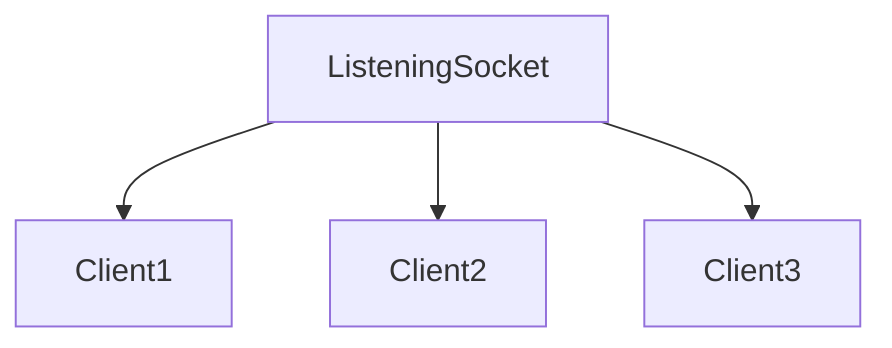
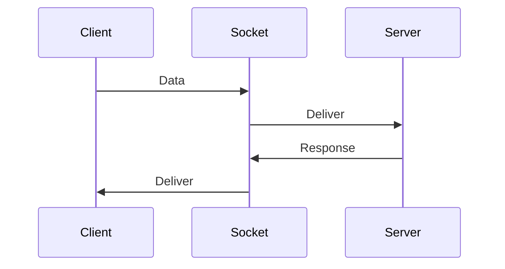
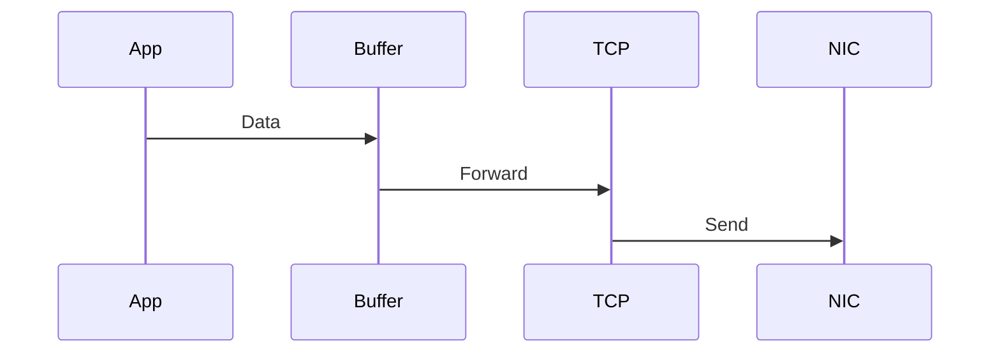
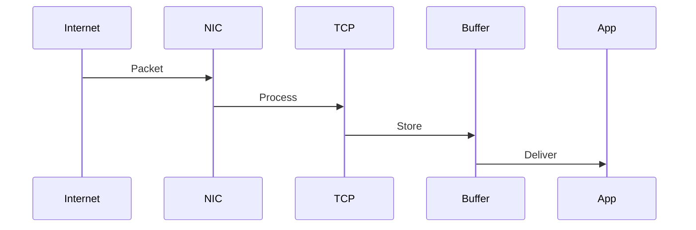
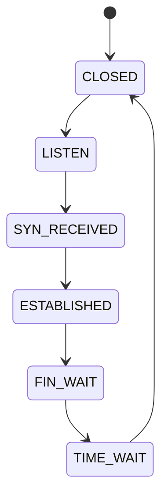

# Linux Socket Lifecycle

# Understanding How Connections Are Born, Live, And Die Inside Linux

---

# Why This File Exists

Imagine this.

```text
Chrome

↓

google.com
```

Question:

> What actually happens from the moment a connection starts until it disappears?

Many engineers know:

```c
socket()

connect()

send()

recv()

close()
```

But Linux is doing much more.

---

# Learning Goals

After this file you should understand:

* Complete socket lifecycle
* Server lifecycle
* Client lifecycle
* Kernel internals
* Queues
* State transitions
* Connection management
* Resource allocation
* Resource cleanup
* Production bottlenecks

---

# The Big Picture

Every connection goes through a lifecycle.

```mermaid
flowchart TD

Birth

↓

Configuration

↓

Connection

↓

Communication

↓

Termination

↓

Cleanup
```

Memorize this.

---

# Mental Model

Never think:

```text
Application

↓

Internet
```

Always think:

```text
Application

↓

Socket Lifecycle

↓

Linux Networking Stack

↓

Internet
```

---

# Complete Lifecycle Overview

This is the most important visual.

```mermaid
flowchart TD

socket

↓

bind

↓

listen

↓

accept

↓

communicate

↓

close
```

---

# Human Analogy

Think of opening a restaurant.

```text
Build Restaurant

↓

Assign Address

↓

Open Doors

↓

Accept Customers

↓

Serve Food

↓

Close Restaurant
```

Linux works similarly.

---

# Step 1: socket()

Question:

> What does socket() actually do?

It creates a kernel communication object.

---

# Visual

```mermaid
flowchart TD

Application

↓

socket()

↓

KernelSocketObject

↓

FileDescriptor
```

---

# Internally Linux Creates

```mermaid
mindmap

root((Socket Creation))

Socket Object

File Descriptor

Protocol Layer

Buffers

Queues

State Machine
```

---

# Internal State

```text
CLOSED
```

Initially nothing is connected.

---

# Step 2: bind()

Question:

> Where should Linux receive data?

bind() answers that.

---

# Example

```text
0.0.0.0:8080
```

means:

```text
All interfaces

Port 8080
```

---

# Visual

```mermaid
flowchart TD

Socket

↓

Bind Address

↓

Port

↓

Kernel Table
```

---

# Why bind() Exists

Without bind:

```text
Linux wouldn't know where packets belong.
```

---

# Kernel Registration

```mermaid
flowchart TD

Socket

↓

Port Table

↓

Kernel Registration
```

---

# Step 3: listen()

Question:

> How does a server become a server?

listen() transforms it.

---

# Visual

```mermaid
flowchart TD

Socket

↓

listen()

↓

ListeningSocket
```

---

# Important Insight

Listening socket:

```text
DOES NOT transfer data.
```

It only accepts connections.

---

# Visual

```mermaid
flowchart TD

ListeningSocket

↓

Creates

↓

ClientSockets
```

---

# Why listen() Exists

Imagine:

```text
10000 users
```

arriving simultaneously.

Linux needs waiting rooms.

---

# Two Queues Exist

This is extremely important.

```mermaid
mindmap

root((Server Queues))

SYN Queue

Accept Queue
```

---

# Queue Architecture

```mermaid
flowchart TD

Internet

↓

SYN Queue

↓

Accept Queue

↓

Application
```

Memorize this.

---

# SYN Queue

Temporary half-open connections.

---

# Visual

```mermaid
flowchart TD

Client

↓

SYN

↓

SYN Queue
```

---

# Accept Queue

Fully established connections.

---

# Visual

```mermaid
flowchart TD

Connection

↓

Accept Queue

↓

Application
```

---

# Step 4: accept()

Question:

> How does the application get clients?

accept() pulls from the queue.

---

# Visual

```mermaid
flowchart TD

AcceptQueue

↓

accept()

↓

ClientSocket
```

---

# Very Important Concept

Linux creates:

```text
1 listening socket

+

N client sockets
```

---

# Architecture



---

# This Is Why Servers Scale

Nginx:

```text
1 listening socket

↓

Thousands of client sockets
```

---

# Step 5: Communication

Data starts flowing.

---

# Visual



---

# Internal Pipeline

```mermaid
flowchart TD

Application

↓

Socket

↓

TCP

↓

IP

↓

Routing

↓

NIC

↓

Internet
```

---

# send()

Question:

> What actually happens?

---

# Journey



---

# recv()

Question:

> Where does incoming data go?

---

# Journey



---

# Buffers Are Critical

```mermaid
flowchart TD

Application

↓

Send Buffer

↓

Internet

↓

Receive Buffer

↓

Application
```

---

# Socket States

This is extremely important.

---

# Full State Machine



---

# ESTABLISHED

This is normal operation.

```text
Data flows.
```

---

# Step 6: close()

Question:

> How do connections die?

TCP performs a graceful shutdown.

---

# Four Way Close

```mermaid
sequenceDiagram

participant Client

participant Server

Client->>Server: FIN

Server->>Client: ACK

Server->>Client: FIN

Client->>Server: ACK
```

---

# Human Analogy

```text
Client: I'm done.

Server: Okay.

Server: I'm done too.

Client: Goodbye.
```

---

# TIME_WAIT

This confuses many engineers.

Question:

> Why doesn't Linux instantly remove connections?

Answer:

```text
Delayed packets still exist.
```

Linux waits.

---

# Visual

```mermaid
flowchart TD

Close

↓

TIME_WAIT

↓

Cleanup
```

---

# Full Lifecycle Diagram

This is one of the most important visuals.

```mermaid
flowchart TD

socket

↓

bind

↓

listen

↓

SYN Queue

↓

Accept Queue

↓

accept

↓

communicate

↓

close

↓

TIME_WAIT

↓

cleanup
```

---

# Client Lifecycle

Clients are simpler.

```mermaid
flowchart TD

socket

↓

connect

↓

communicate

↓

close
```

---

# Client Connection

```mermaid
sequenceDiagram

participant Client

participant Server

Client->>Server: SYN

Server->>Client: SYN ACK

Client->>Server: ACK
```

---

# Linux Ownership Model

Question:

> How does Linux know where packets belong?

Linux uses:

```text
5 Tuple
```

---

# Visual

```mermaid
mindmap

root((5 Tuple))

Source IP

Destination IP

Source Port

Destination Port

Protocol
```

---

# Every Connection Consumes Resources

```mermaid
mindmap

root((Per Connection))

Socket

Buffers

Timers

State

Memory

Queues
```

---

# Modern Web Server Architecture

```mermaid
flowchart TD

Users

↓

LoadBalancer

↓

Nginx

↓

Application

↓

Database
```

Everything is sockets.

---

# Nginx Lifecycle

```mermaid
flowchart TD

Users

↓

ListeningSocket

↓

epoll

↓

Workers

↓

ClientSockets
```

---

# NodeJS Lifecycle

```mermaid
flowchart TD

Users

↓

ListeningSocket

↓

EventLoop

↓

Sockets

↓

Application
```

---

# Redis Lifecycle

```mermaid
flowchart TD

Clients

↓

epoll

↓

Redis

↓

Memory
```

---

# Kubernetes Lifecycle

```mermaid
flowchart TD

Pod

↓

Socket

↓

Service

↓

Socket

↓

Pod
```

---

# Docker Lifecycle

```mermaid
flowchart TD

Container

↓

Socket

↓

Linux Kernel

↓

Internet
```

---

# Production Bottlenecks

## Problem 1

Accept queue overflow.

Symptoms:

```text
Connection refused
```

---

## Problem 2

SYN flood.

Symptoms:

```text
Half-open connections
```

---

# SYN Flood Visual

```mermaid
flowchart TD

Attacker

↓

Millions SYN

↓

SYN Queue

↓

Exhausted
```

---

## Problem 3

Too many open files.

Symptoms:

```text
Cannot create sockets
```

---

## Problem 4

TIME_WAIT explosion.

Symptoms:

```text
Port exhaustion
```

---

# Troubleshooting Flow

```mermaid
flowchart TD

START[Cannot Connect]

START --> LISTEN[Listening?]

LISTEN --> QUEUE[Queue Full?]

QUEUE --> FD[FD Exhausted?]

FD --> TIMEWAIT[TIME_WAIT Explosion?]

TIMEWAIT --> SUCCESS[Healthy]
```

---

# Useful Commands

Listening sockets:

```bash
ss -l
```

All sockets:

```bash
ss -tulnp
```

Connection states:

```bash
ss -tan
```

Socket summary:

```bash
ss -s
```

File descriptors:

```bash
ls /proc/<PID>/fd
```

Open files limit:

```bash
ulimit -n
```

Backlog:

```bash
sysctl net.core.somaxconn
```

SYN queue:

```bash
sysctl net.ipv4.tcp_max_syn_backlog
```

---

# Common Misconceptions

### ❌ listen() accepts clients

Wrong.

---

### ❌ Listening socket transfers data

Wrong.

---

### ❌ One socket serves all clients

Wrong.

---

### ❌ close() instantly removes connections

Wrong.

TIME_WAIT exists.

---

# Engineer Mental Model

Never think:

```text
Application

↓

Internet
```

Always think:

```mermaid
flowchart TD

socket

↓

bind

↓

listen

↓

accept

↓

communicate

↓

close

↓

cleanup
```

---

# Capability Checklist

After this file you should understand:

✅ Socket lifecycle

✅ Listening sockets

✅ Client sockets

✅ SYN queue

✅ Accept queue

✅ State machines

✅ Four-way close

✅ TIME_WAIT

✅ Modern server architectures

✅ Production bottlenecks
