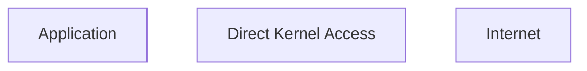
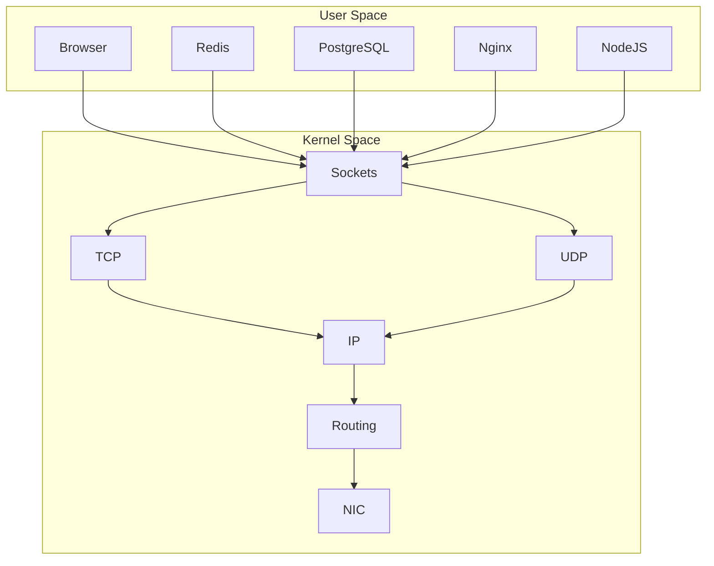
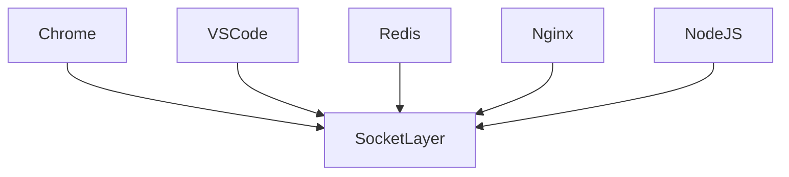
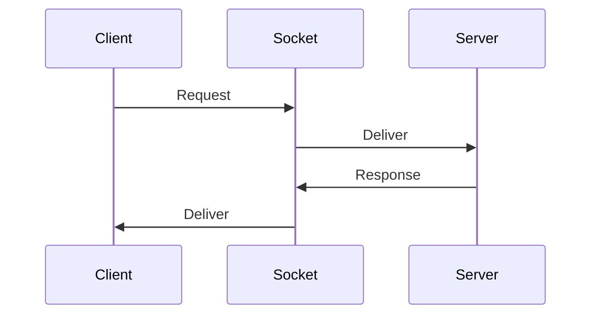
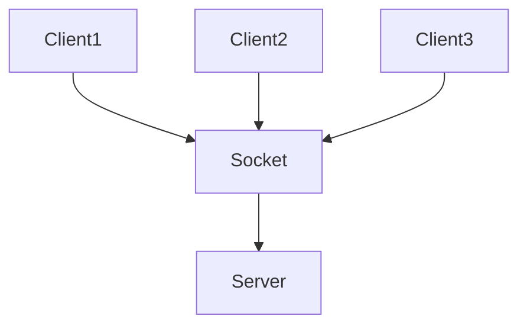
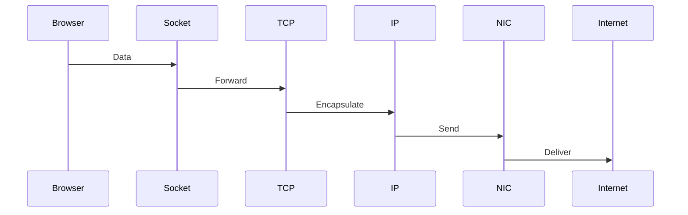
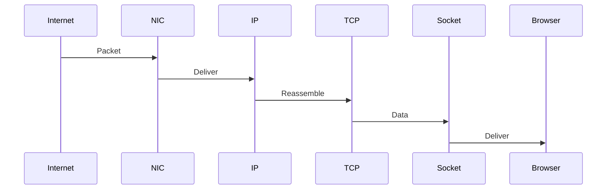

# Linux Sockets

# Understanding The Communication Interface Between Applications And The Kernel

---

# Why This File Exists

Many engineers think:

> Socket = Networking code.

That's wrong.

Sockets are much more important.

Sockets are one of the core abstractions of modern computing.

Everything uses them.

Examples:

```text
Chrome

Redis

PostgreSQL

NodeJS

Nginx

Docker

Kubernetes

gRPC

WebSockets

Databases

Microservices

Cloud systems
```

Without sockets:

```text
Modern software doesn't exist.
```

---

# Learning Goals

After this file you should understand:

* What sockets are
* Why sockets exist
* Why applications cannot directly use NICs
* Socket architecture
* Socket lifecycle
* Linux internals
* File descriptor relationship
* Buffers
* TCP relationship
* UDP relationship
* Modern servers
* Cloud architectures
* Production bottlenecks

---

# The Big Question

Imagine this.

```text
Chrome

↓

google.com
```

Question:

> How does Chrome talk to Linux networking?

Chrome cannot directly manipulate:

```text
NIC

TCP

Routing

Firewalls

Kernel memory
```

It needs an interface.

That interface is:

```text
Socket
```

---

# Socket Definition

A socket is:

> An operating system communication endpoint.

Think:

> A door between applications and the Linux kernel.

---

# Mental Model

Never think:

```text
Browser

↓

Internet
```

Think:

```text
Browser

↓

Socket

↓

Kernel Networking Stack

↓

Internet
```

This mental model explains almost everything.

---

# The Big Picture

```mermaid
flowchart TD

Application

↓

Socket

↓

TCP/UDP

↓

IP

↓

Routing

↓

NIC

↓

Internet
```

---

# What Problem Does A Socket Solve?

Without sockets:



Chaos.

Applications could break the system.

With sockets:

```mermaid
flowchart TD

Application

↓

Socket

↓

Kernel

↓

Internet
```

Controlled access.

---

# The Linux Architecture



---

# Why Applications Need Sockets

Imagine thousands of applications.



Linux provides one standard interface.

---

# Modern World Reality

Everything eventually becomes this.

```mermaid
mindmap

root((Sockets))

Browsers

Databases

Containers

Microservices

Kubernetes

Cloud

VPNs

AI Systems

APIs

Load Balancers
```

---

# WH Questions

## What is a socket?

A communication endpoint.

---

## Why do sockets exist?

Applications cannot directly manipulate networking hardware.

---

## Who creates sockets?

Applications.

---

## Where do sockets live?

Inside the Linux kernel.

---

## When are sockets created?

When applications need communication.

---

## Why are sockets so important?

Because modern software is distributed.

---

# Socket Analogy

Think of a restaurant.

```text
Customer

↓

Waiter

↓

Kitchen
```

Applications are customers.

Linux kernel is the kitchen.

Sockets are the waiter.

---

# Visual

```mermaid
flowchart TD

Application

↓

Socket

↓

Kernel

↓

NIC

↓

Internet
```

---

# Socket Is Not The Network

Very important.

Many beginners confuse this.

Socket is NOT:

```text
TCP

UDP

IP

Internet
```

Socket is an interface.

---

# Socket Relationship

```mermaid
flowchart TD

Application

↓

Socket

↓

Protocol

↓

Internet
```

---

# Types Of Sockets

Three major types.

```mermaid
mindmap

root((Sockets))

UNIX

TCP

UDP
```

We'll learn each in separate files.

---

# Socket Internals

A socket is a kernel object.

Think:

```text
Kernel Data Structure
```

---

# Internal Architecture

```mermaid
flowchart TD

Application

↓

FileDescriptor

↓

SocketObject

↓

ProtocolStack

↓

NIC
```

---

# Wait... File Descriptor?

Very important.

Linux treats sockets as files.

---

# Visual

```mermaid
flowchart TD

Process

↓

File Descriptor Table

↓

Socket

↓

Kernel
```

---

# Example

```text
FD 0

stdin

FD 1

stdout

FD 2

stderr

FD 3

socket
```

---

# Everything Is A File Philosophy

Linux philosophy:

```text
Files

Pipes

Devices

Sockets
```

are all file descriptors.

---

# Socket Lifecycle

One of the most important concepts.

---

# Complete Lifecycle

```mermaid
flowchart TD

Create

↓

Configure

↓

Bind

↓

Listen

↓

Accept

↓

Communicate

↓

Close
```

We will learn this deeply later.

---

# Visualizing A Server



---

# Multiple Clients



---

# Kernel Networking Stack

Sockets connect applications to this stack.

```mermaid
flowchart TD

Socket

↓

TCP

↓

IP

↓

Netfilter

↓

Routing

↓

TrafficControl

↓

NIC

↓

Internet
```

---

# Sending Data Journey

Imagine:

```text
Browser

↓

google.com
```

---

# TX Journey



---

# Receive Journey



---

# Socket Buffers

Important concept.

Sockets use memory buffers.

```mermaid
flowchart TD

Application

↓

Send Buffer

↓

Kernel

↓

Receive Buffer

↓

Application
```

---

# Why Buffers Exist

Applications and networks run at different speeds.

Example:

```text
CPU

↓

Very fast

Internet

↓

Slower
```

Need temporary storage.

---

# Buffer Overflow Problem

```mermaid
flowchart TD

Packets

↓

Buffer

↓

Full?

↓

Drop
```

This happens in production.

---

# Client-Server Architecture

Almost everything uses this.

```mermaid
flowchart TD

Client

↓

Socket

↓

Server
```

---

# Modern Architecture

```mermaid
graph TD

Frontend

API

Redis

PostgreSQL

Frontend --> API

API --> Redis

API --> PostgreSQL
```

Every arrow is sockets.

---

# Example: Browser Loading YouTube

```mermaid
flowchart TD

Browser

↓

DNS

↓

Socket

↓

TCP

↓

Google Server

↓

Video Data

↓

Browser
```

Sockets everywhere.

---

# Example: NodeJS API

```mermaid
flowchart TD

User

↓

Nginx

↓

NodeJS

↓

PostgreSQL
```

Each connection is sockets.

---

# Example: Docker

```mermaid
flowchart TD

Container

↓

Socket

↓

Linux Kernel

↓

Internet
```

---

# Example: Kubernetes

```mermaid
flowchart TD

Pod

↓

Socket

↓

Linux Networking

↓

Internet
```

---

# Example: Microservices

```mermaid
graph TD

Auth

Payment

Notification

Redis

Auth --> Payment

Payment --> Redis

Notification --> Auth
```

All sockets.

---

# Modern World Technologies Built On Sockets

```mermaid
mindmap

root((Modern Systems))

REST APIs

gRPC

GraphQL

WebSockets

Databases

Redis

Kafka

NATS

Docker

Kubernetes
```

---

# Production Problems

Problem 1

Too many open sockets.

Symptoms:

```text
Resource exhaustion
```

---

# Problem 2

Socket leaks.

Symptoms:

```text
Memory growth

Slow systems
```

---

# Problem 3

Too many connections.

Symptoms:

```text
Latency spikes
```

---

# Problem 4

Buffer exhaustion.

Symptoms:

```text
Packet drops
```

---

# Production Architecture

```mermaid
flowchart TD

Users

↓

LoadBalancer

↓

API

↓

Redis

↓

Database
```

Every connection is sockets.

---

# Modern Server Architectures

There are three models.

```mermaid
mindmap

root((Server Models))

Thread Per Connection

Event Driven

Async
```

We'll learn these later.

---

# Event Driven Architecture

```mermaid
flowchart TD

Clients

↓

EventLoop

↓

Sockets

↓

Application
```

NodeJS works like this.

---

# High Scale Architecture

```mermaid
flowchart TD

1MillionConnections

↓

epoll

↓

EventLoop

↓

Workers
```

Modern servers use this.

---

# Where Sockets Fit In Linux Networking

This is the most important visual of this file.

```mermaid
flowchart TD

Application

↓

Socket

↓

TCP_UDP

↓

IP

↓

Conntrack

↓

Netfilter

↓

Routing

↓

TrafficControl

↓

Driver

↓

NIC

↓

Internet
```

Memorize this.

---

# Essential Commands

Show all sockets:

```bash
ss
```

Listening sockets:

```bash
ss -l
```

TCP sockets:

```bash
ss -t
```

UDP sockets:

```bash
ss -u
```

Processes:

```bash
ss -tulnp
```

Legacy:

```bash
netstat -tulnp
```

---

# Common Misconceptions

### ❌ Socket = TCP

Wrong.

---

### ❌ Socket = Internet

Wrong.

---

### ❌ Socket = Network Card

Wrong.

---

### ❌ Only web applications use sockets

Wrong.

Everything uses sockets.

---

# Engineer Mental Model

Never think:

```text
Application

↓

Internet
```

Always think:

```mermaid
flowchart TD

Application

↓

Socket

↓

Kernel Networking Stack

↓

NIC

↓

Internet
```

---

# Capability Checklist

After this file you should understand:

✅ What sockets are

✅ Why sockets exist

✅ User space vs kernel space

✅ File descriptors

✅ Socket lifecycle

✅ Buffering

✅ Modern architectures

✅ Microservices

✅ Docker relationship

✅ Kubernetes relationship

