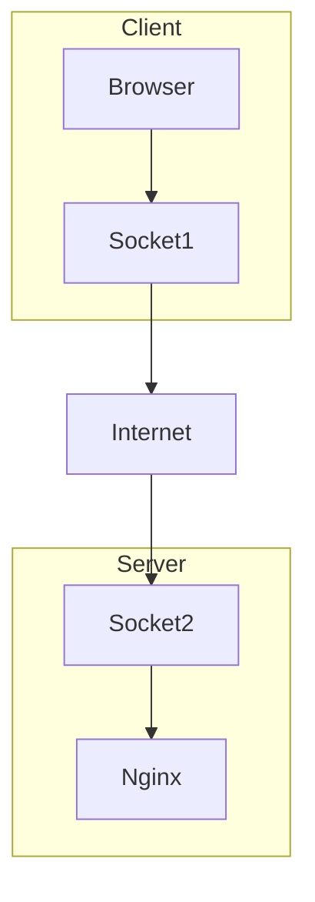
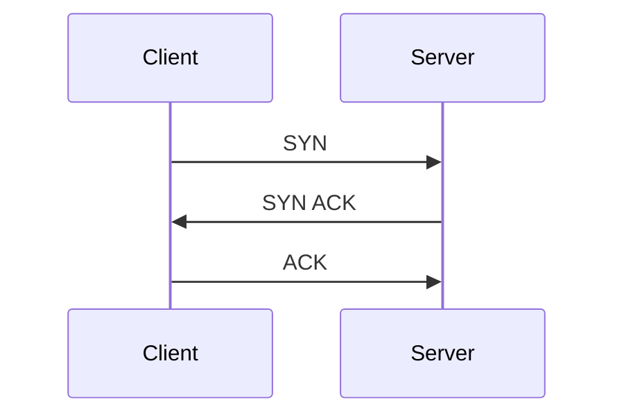
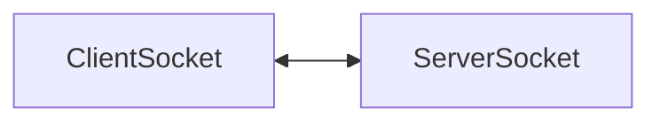
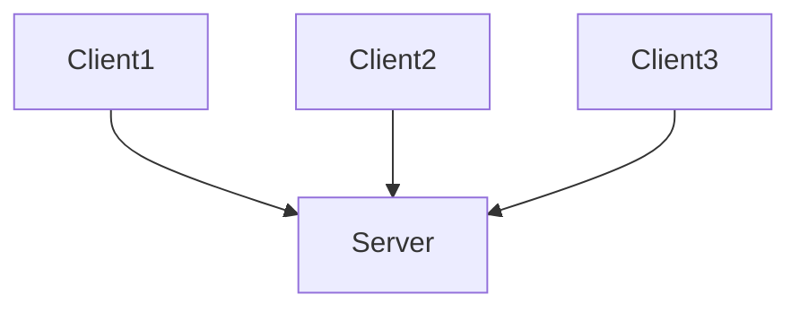
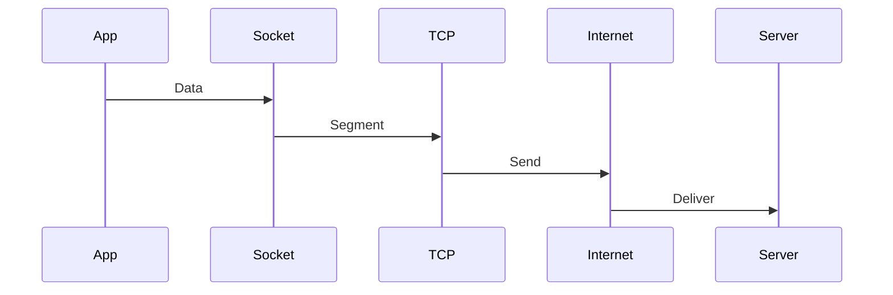
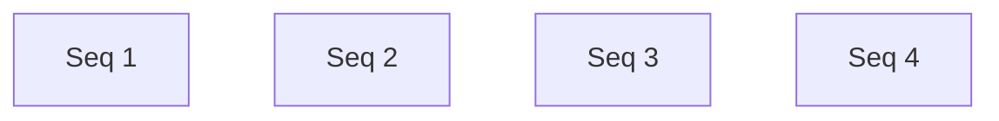
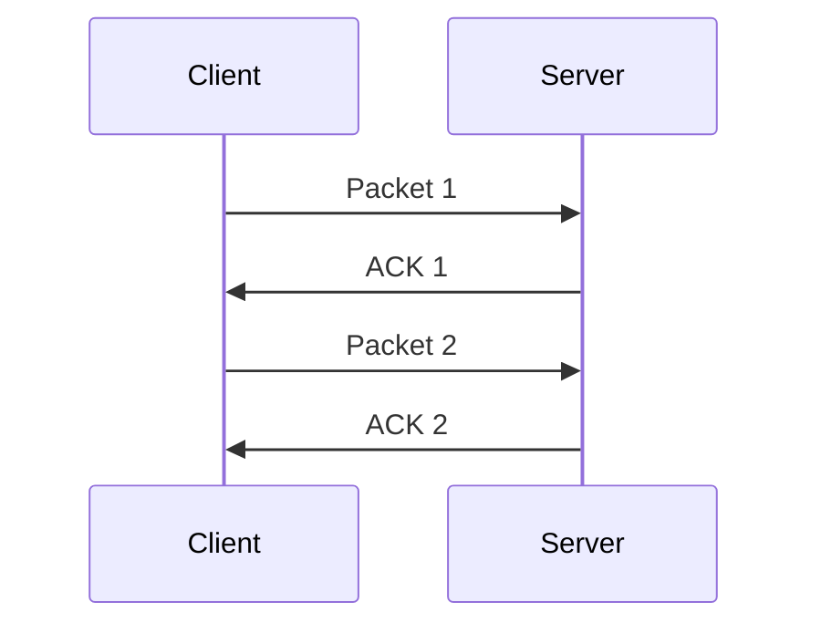
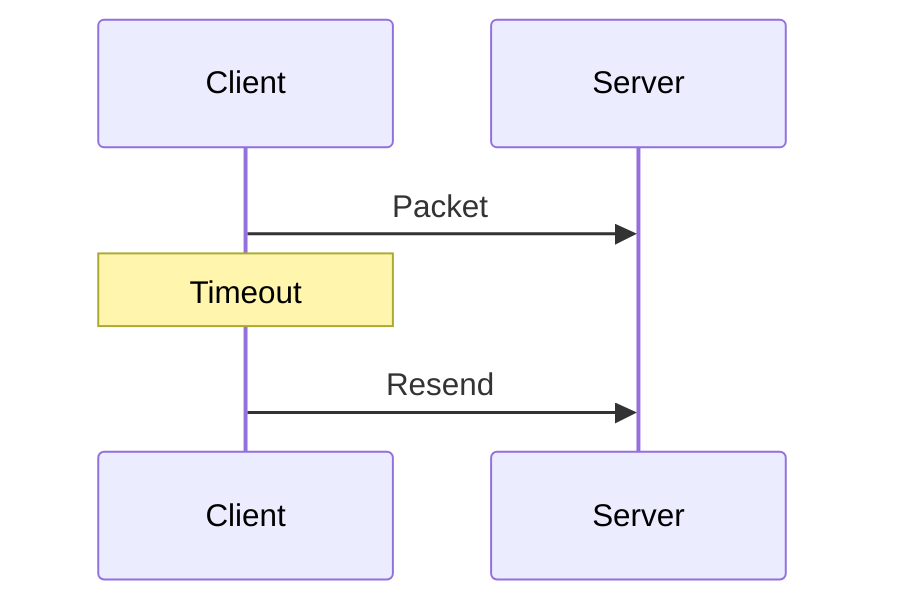

# TCP Sockets

# Understanding How Modern Applications Actually Communicate

---

# Why This File Exists

Most engineers think:

```text
Browser

↓

Website
```

Reality:

```text
Browser

↓

TCP Socket

↓

Linux Kernel

↓

Internet

↓

Linux Kernel

↓

TCP Socket

↓

Server
```

Almost all modern infrastructure depends on TCP sockets.

Examples:

```text
HTTPS

REST APIs

gRPC

PostgreSQL

Redis

Kafka

Nginx

Docker Registry

GitHub

Cloud APIs
```

---

# Learning Goals

After this file you should understand:

* What TCP sockets are
* Why they exist
* Connection lifecycle
* Kernel internals
* Handshakes
* Buffers
* Flow control
* Congestion control
* Modern server architectures
* Cloud infrastructure usage
* Production bottlenecks
* Troubleshooting mindset

---

# The Big Question

Suppose:

```text
Browser

↓

google.com
```

Question:

> How does the browser reliably send data to another machine?

The answer:

```text
TCP Socket
```

---

# Mental Model

Never think:

```text
Application

↓

Internet
```

Think:

```text
Application

↓

TCP Socket

↓

Linux Networking Stack

↓

Internet
```

---

# What Is A TCP Socket?

A TCP socket is:

> A reliable communication endpoint built on top of TCP.

It provides:

```text
Reliable delivery

Ordered delivery

Error detection

Flow control

Congestion control
```

---

# Big Picture

```mermaid
flowchart TD

Application

↓

TCP Socket

↓

TCP

↓

IP

↓

Routing

↓

NIC

↓

Internet
```

---

# What Problem Does TCP Solve?

Imagine sending 100 messages.

Without TCP:

```text
Message 1

Message 5

Message 3

Message 9
```

Chaos.

With TCP:

```text
1

2

3

4

5
```

Reliable order.

---

# The End To End Architecture



---

# Socket Is Not TCP

Important.

```text
Socket = Interface

TCP = Protocol
```

Relationship:

```mermaid
flowchart TD

Application

↓

Socket

↓

TCP

↓

Internet
```

---

# The 5 Questions

## What?

Reliable communication endpoint.

---

## Why?

Applications need reliable communication.

---

## Who?

Applications create them.

---

## Where?

Inside the kernel.

---

## When?

Whenever applications need communication.

---

# Connection Lifecycle

This is one of the most important concepts.

```mermaid
flowchart TD

Create

↓

Connect

↓

Communicate

↓

Close
```

---

# The Three-Way Handshake

One of the most famous mechanisms in computing.

---

# Why Does It Exist?

Question:

> How do two machines agree to communicate?

Linux solves this.

---

# Visual



Connection established.

---

# Human Analogy

```text
Client: Can we talk?

Server: Yes.

Client: Great.
```

---

# Full Lifecycle

```mermaid
flowchart TD

Application

↓

Socket()

↓

Connect()

↓

SYN

↓

SYN ACK

↓

ACK

↓

Data Transfer

↓

Close
```

---

# Kernel Internals

Linux creates kernel objects.

---

# Internal Architecture

```mermaid
flowchart TD

Application

↓

File Descriptor

↓

Socket Object

↓

TCP Engine

↓

IP Layer

↓

NIC
```

---

# Every Connection Gets A Socket Pair



Every client gets its own connection.

---

# Multiple Clients



Server creates multiple sockets.

---

# The Real Kernel Pipeline

```mermaid
flowchart TD

Application

↓

Socket

↓

TCP

↓

IP

↓

Conntrack

↓

Netfilter

↓

Routing

↓

TrafficControl

↓

Driver

↓

NIC

↓

Internet
```

This is extremely important.

---

# Socket Buffers

Very important.

---

# Architecture

```mermaid
flowchart TD

Application

↓

Send Buffer

↓

Kernel

↓

Receive Buffer

↓

Application
```

---

# Why Buffers Exist

Applications and networks run at different speeds.

```text
CPU

↓

Fast

Internet

↓

Slower
```

Buffers absorb the difference.

---

# Packet Journey

Suppose:

```text
GET /users
```

travels.

---

# Visual



---

# Segmentation

TCP splits data.

Example:

```text
10 MB
```

becomes:

```text
1460 bytes

1460 bytes

1460 bytes
```

many times.

---

# Visual

```mermaid
flowchart LR

LargeData

↓

Packet1

Packet2

Packet3

Packet4
```

---

# Sequence Numbers

TCP labels everything.

---

# Visual



---

# Why Sequence Numbers Exist

Packets may arrive out of order.

TCP reorders them.

---

# ACK Mechanism

Receiver confirms delivery.



---

# Retransmission

Suppose ACK never arrives.

Linux resends.



---

# Flow Control

Question:

> What if the receiver is slow?

Solution:

```text
Window Size
```

---

# Visual

```mermaid
flowchart LR

Sender

↓

Window

↓

Receiver
```

---

# Congestion Control

Question:

> What if the internet becomes overloaded?

TCP slows down.

---

# Visual

```mermaid
flowchart TD

Traffic

↓

Congestion

↓

Reduce Speed

↓

Recover
```

---

# Congestion Window

```mermaid
flowchart LR

TCP

↓

CWND

↓

Allowed Data
```

---

# Modern Algorithms

Linux uses sophisticated algorithms.

```mermaid
mindmap

root((Algorithms))

Reno

Cubic

BBR
```

---

# Modern Linux Default

Usually:

```text
CUBIC
```

Cloud providers increasingly use:

```text
BBR
```

---

# Server Architecture

```mermaid
flowchart TD

Users

↓

LoadBalancer

↓

Nginx

↓

Application

↓

Database
```

Every arrow is TCP sockets.

---

# Nginx Example

```mermaid
flowchart TD

Browser

↓

443

↓

Nginx

↓

3000

↓

NodeJS
```

---

# Microservices

```mermaid
graph TD

Auth

Payment

Notification

Redis

Database

Auth --> Payment

Payment --> Redis

Auth --> Database

Notification --> Auth
```

Everything uses TCP sockets.

---

# Cloud Architecture

```mermaid
flowchart TD

User

↓

CDN

↓

LoadBalancer

↓

API

↓

Database
```

---

# Kubernetes Architecture

```mermaid
flowchart TD

Pod

↓

TCP Socket

↓

Service

↓

TCP Socket

↓

Pod
```

---

# Docker Architecture

```mermaid
flowchart TD

Container

↓

TCP Socket

↓

Linux Kernel

↓

Internet
```

---

# Modern Technologies Built On TCP

```mermaid
mindmap

root((TCP Based))

HTTPS

REST

gRPC

HTTP2

Kafka

PostgreSQL

Redis

Git

SSH
```

---

# Connection States

Very important.

---

# State Machine

```mermaid
stateDiagram-v2

[*] --> CLOSED

CLOSED --> SYN_SENT

SYN_SENT --> ESTABLISHED

ESTABLISHED --> FIN_WAIT

FIN_WAIT --> CLOSED
```

---

# Production Problems

## Problem 1

Too many connections.

Symptoms:

```text
Memory growth

Latency spikes
```

---

## Problem 2

Slow receiver.

Symptoms:

```text
Window exhaustion
```

---

## Problem 3

Network congestion.

Symptoms:

```text
Retransmissions
```

---

## Problem 4

SYN flood attack.

Symptoms:

```text
Half open connections
```

---

# SYN Flood Visual

```mermaid
flowchart TD

Attacker

↓

Millions Of SYN

↓

Server Queue

↓

Exhausted
```

---

# Modern Server Challenge

```text
100000 users
```

means:

```text
100000 sockets
```

Servers must scale.

---

# Scaling Architecture

```mermaid
flowchart TD

Users

↓

epoll

↓

EventLoop

↓

Workers
```

Modern servers use this.

---

# Troubleshooting Flow

```mermaid
flowchart TD

START[Application Slow]

START --> SOCKET[Too Many Sockets?]

SOCKET --> BUFFER[Buffers Full?]

BUFFER --> CONGESTION[Congestion?]

CONGESTION --> RETRANSMIT[Retransmissions?]

RETRANSMIT --> SUCCESS[Healthy]
```

---

# Essential Commands

Show TCP sockets:

```bash
ss -t
```

Listening:

```bash
ss -lt
```

Processes:

```bash
ss -tulpn
```

Statistics:

```bash
ss -s
```

Monitor:

```bash
watch ss -s
```

Packet capture:

```bash
sudo tcpdump -i eth0 tcp
```

---

# Common Misconceptions

### ❌ Socket = TCP

Wrong.

---

### ❌ TCP = Internet

Wrong.

---

### ❌ Every application uses UDP

Wrong.

Most business applications use TCP.

---

### ❌ Connections are free

Wrong.

Each connection consumes resources.

---

# Engineer Mental Model

Never think:

```text
Browser

↓

Website
```

Always think:

```mermaid
flowchart TD

Browser

↓

TCP Socket

↓

Kernel

↓

TCP

↓

IP

↓

NIC

↓

Internet

↓

Kernel

↓

TCP Socket

↓

Server
```

---

# Capability Checklist

After this file you should understand:

✅ TCP sockets

✅ Handshake

✅ ACKs

✅ Retransmissions

✅ Buffers

✅ Flow control

✅ Congestion control

✅ Server architectures

✅ Cloud systems

✅ Production failures

:** Once `epoll.md` and `modern-server-architectures.md` are complete, this entire section becomes **far beyond Linux fundamentals and enters distributed systems engineering territory**.
