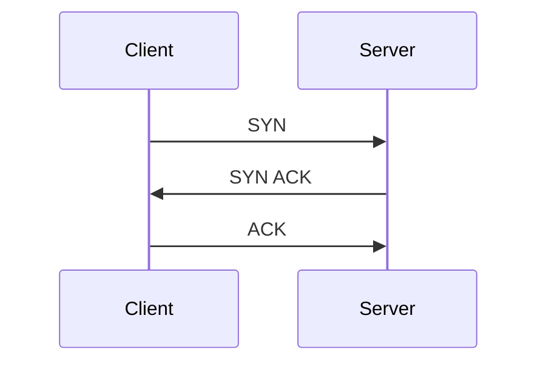
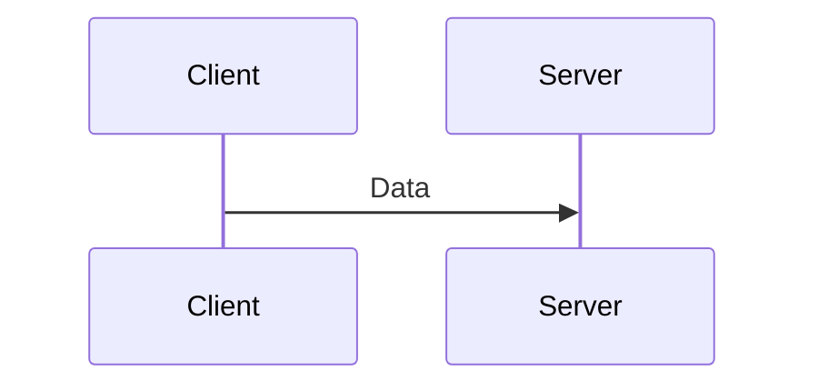
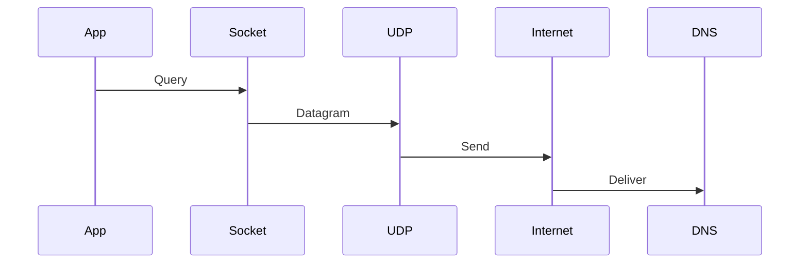
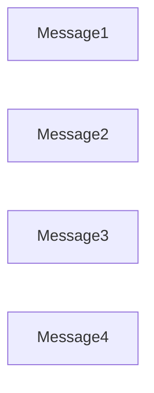
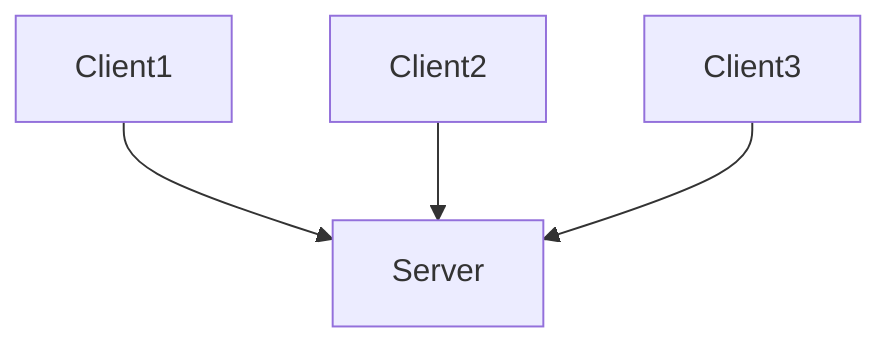
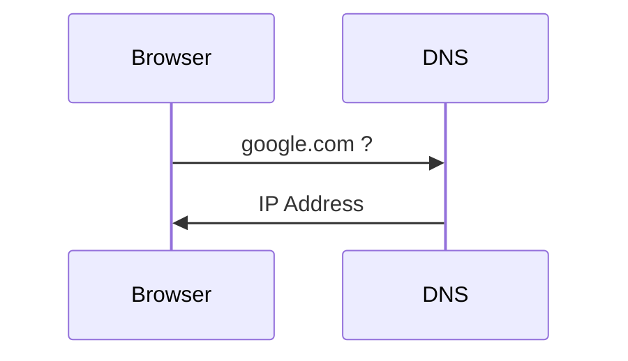
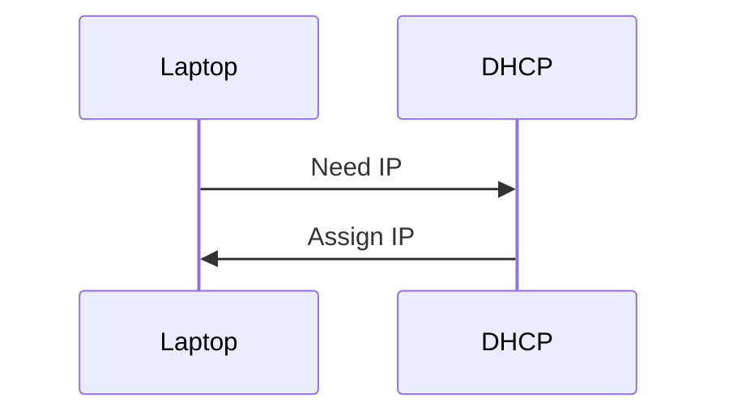
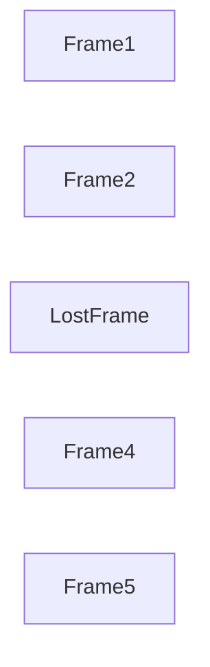
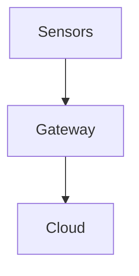
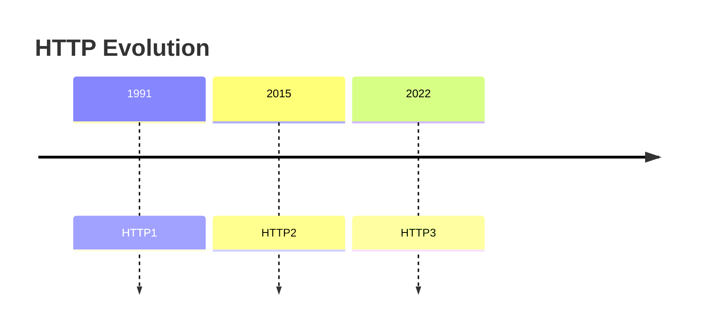

# UDP Sockets

# Understanding The Minimal Communication Engine Of Modern Infrastructure

---

# Why This File Exists

Many engineers hear this.

```text
TCP = Reliable

UDP = Fast
```

This is incomplete.

Modern internet systems heavily depend on UDP.

Examples:

```text
DNS

HTTP/3

QUIC

VoIP

Video Calls

Online Gaming

Live Streaming

IoT

Telemetry
```

UDP is becoming more important every year.

---

# Learning Goals

After this file you should understand:

* What UDP sockets are
* Why UDP exists
* Why modern systems use UDP
* Kernel internals
* Packet flow
* QUIC relationship
* HTTP/3 relationship
* DNS relationship
* Production architectures
* Tradeoffs
* Troubleshooting mindset

---

# The Big Question

Imagine you're on a video call.

Question:

> Is waiting for retransmissions always a good idea?

No.

Late data is often useless.

This is where UDP shines.

---

# Mental Model

Never think:

```text
UDP

↓

Unreliable

↓

Bad
```

Think:

```text
UDP

↓

Minimal

↓

Flexible

↓

Application Controlled
```

---

# Definition

UDP socket is:

> A communication endpoint built on top of the User Datagram Protocol.

Linux provides:

```text
Socket API

↓

UDP Engine

↓

IP

↓

Internet
```

---

# Big Picture

```mermaid
flowchart TD

Application

↓

UDP Socket

↓

UDP

↓

IP

↓

Routing

↓

NIC

↓

Internet
```

---

# Why UDP Exists

TCP does many things.

```text
Connection Setup

Ordering

Retransmission

Congestion Control

Flow Control
```

Sometimes these are unnecessary.

Linux needed something simpler.

---

# TCP vs UDP Philosophy

```mermaid
flowchart LR

TCP

-->

Reliable Transport

UDP

-->

Minimal Transport
```

---

# Key Difference

TCP says:

```text
I will guarantee delivery.
```

UDP says:

```text
I will deliver if possible.
```

---

# WH Questions

## What?

Connectionless communication.

---

## Why?

Low latency communication.

---

## Who?

Applications.

---

## Where?

Kernel networking stack.

---

## When?

When applications prioritize speed.

---

## Why is it useful?

Applications gain more control.

---

# Architecture

```mermaid
flowchart TD

Application

↓

UDP Socket

↓

UDP

↓

IP

↓

NIC

↓

Internet
```

---

# Important Reality

UDP is still a socket.

```text
Application

↓

Socket

↓

UDP
```

---

# Connectionless Model

TCP:



UDP:



No setup.

---

# Why Is This Fast?

No handshake.

```text
Send immediately.
```

---

# Packet Journey

Suppose DNS query.

---

# Journey



---

# Datagram Concept

TCP:

```text
Continuous stream
```

UDP:

```text
Independent messages
```

---

# Visual



Each stands alone.

---

# UDP Doesn't Do These Things

```mermaid
mindmap

root((UDP Doesn't Do))

Handshake

Ordering

Retransmission

Flow Control

Congestion Control
```

Applications implement these if needed.

---

# Kernel Internals

Architecture:

```mermaid
flowchart TD

Application

↓

FileDescriptor

↓

SocketObject

↓

UDP Engine

↓

IP

↓

NIC
```

---

# Multiple Clients

UDP is stateless.

---

# Visual



No per-client connection objects.

---

# Why This Scales Well

TCP:

```text
100000 users

↓

100000 connections
```

UDP:

```text
100000 users

↓

100000 packets
```

Less overhead.

---

# DNS Example

This is the perfect use case.



Tiny communication.

TCP is unnecessary.

---

# DHCP Example



UDP.

---

# Video Streaming

Question:

> If a frame is lost, should we wait?

No.

The next frame arrives anyway.

---

# Visual



Keep going.

---

# Gaming Example


Real time matters.

---

# IoT Example



Millions of tiny messages.

UDP is efficient.

---

# The Biggest Modern Evolution

QUIC.

This changed everything.

---

# Old Internet

```mermaid
flowchart TD

Browser

↓

TCP

↓

HTTPS
```

---

# Modern Internet

```mermaid
flowchart TD

Browser

↓

UDP

↓

QUIC

↓

HTTP3
```

---

# Why Did QUIC Use UDP?

Because browsers wanted control.

TCP is implemented inside kernels.

Hard to innovate.

QUIC moved networking to user space.

---

# QUIC Architecture

```mermaid
flowchart TD

Application

↓

QUIC

↓

UDP

↓

IP

↓

Internet
```

---

# Important Insight

QUIC rebuilt TCP features.

```mermaid
mindmap

root((QUIC))

Reliability

Encryption

Streams

Recovery

Congestion Control
```

But over UDP.

---

# HTTP Evolution



---

# HTTP Relationship

```mermaid
flowchart TD

HTTP1

↓

TCP

HTTP2

↓

TCP

HTTP3

↓

QUIC

↓

UDP
```

---

# Socket Buffers

UDP also uses buffers.

---

# Architecture

```mermaid
flowchart TD

Application

↓

Send Buffer

↓

Kernel

↓

Receive Buffer

↓

Application
```

---

# Buffer Overflow Problem

UDP has no retransmission.

Overflow means:

```text
Packet lost forever.
```

---

# Visual

```mermaid
flowchart TD

Packets

↓

Buffer

↓

Full

↓

Drop
```

---

# Production Architectures

DNS.

```mermaid
flowchart TD

Browser

↓

DNS Resolver

↓

DNS Server
```

---

# Streaming Architecture

```mermaid
flowchart TD

Broadcaster

↓

CDN

↓

Viewer
```

---

# Video Call Architecture

```mermaid
flowchart TD

User1

↓

STUN

↓

TURN

↓

User2
```

Mostly UDP.

---

# Cloud Native Architecture

```mermaid
flowchart TD

IoT

↓

Gateway

↓

Cloud

↓

Analytics
```

---

# Kubernetes Usage

Kubernetes uses UDP too.

Examples:

```text
DNS

Overlay Networks

Service Discovery
```

---

# DNS Architecture

```mermaid
flowchart TD

Pod

↓

CoreDNS

↓

Internet DNS
```

Mostly UDP.

---

# Linux Pipeline

```mermaid
flowchart TD

Application

↓

UDP Socket

↓

UDP

↓

IP

↓

Conntrack

↓

Routing

↓

TrafficControl

↓

NIC

↓

Internet
```

---

# Production Problems

Problem 1.

Packet loss.

Symptoms:

```text
Audio glitches

Video lag
```

---

# Problem 2.

Buffer overflow.

Symptoms:

```text
Missing packets
```

---

# Problem 3.

Network congestion.

Symptoms:

```text
Jitter
```

---

# Problem 4.

Application overload.

Symptoms:

```text
Dropped messages
```

---

# UDP vs TCP Decision Tree

```mermaid
flowchart TD

START[Need Communication]

START --> RELIABLE[Need Reliability?]

RELIABLE -->|Yes| TCP

RELIABLE -->|No| LATENCY[Low Latency Critical?]

LATENCY -->|Yes| UDP

LATENCY -->|No| TCP
```

---

# Modern World Decision Tree

```mermaid
flowchart TD

WebAPI --> TCP

Database --> TCP

DNS --> UDP

Gaming --> UDP

VideoCall --> UDP

Streaming --> UDP

HTTP3 --> UDP
```

---

# Troubleshooting Flow

```mermaid
flowchart TD

START[Missing Data]

START --> LOSS[Packet Loss?]

LOSS --> BUFFER[Buffer Full?]

BUFFER --> CONGESTION[Congestion?]

CONGESTION --> APP[Application Overloaded?]

APP --> SUCCESS[Healthy]
```

---

# Essential Commands

UDP sockets:

```bash
ss -u
```

Listening:

```bash
ss -lu
```

Processes:

```bash
ss -ulpn
```

Statistics:

```bash
ss -s
```

Packet capture:

```bash
sudo tcpdump -i eth0 udp
```

---

# Common Misconceptions

### ❌ UDP is unreliable therefore bad

Wrong.

---

### ❌ UDP is always faster

Wrong.

Depends on workload.

---

### ❌ UDP means no buffering

Wrong.

---

### ❌ Modern internet uses only TCP

Wrong.

HTTP/3 uses UDP.

---

# Engineer Mental Model

Never think:

```text
Application

↓

Internet
```

Always think:

```mermaid
flowchart TD

Application

↓

UDP Socket

↓

UDP

↓

IP

↓

NIC

↓

Internet
```

---

# Capability Checklist

After this file you should understand:

✅ UDP sockets

✅ Datagram model

✅ Connectionless architecture

✅ DNS relationship

✅ QUIC relationship

✅ HTTP/3 relationship

✅ Streaming systems

✅ Gaming systems

✅ Cloud systems

✅ Production bottlenecks
 → epoll → modern-server-architectures** is where people finally understand **how Nginx, NodeJS, Redis, PostgreSQL, Kafka and high-scale systems actually work internally**.
