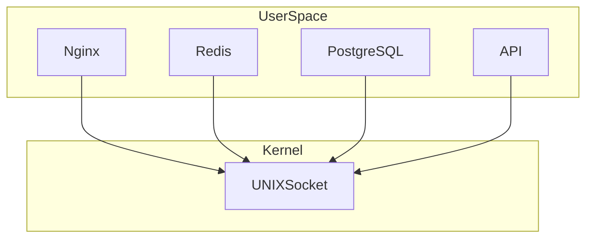
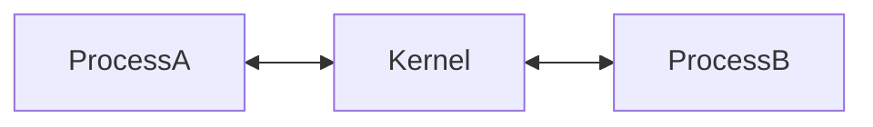
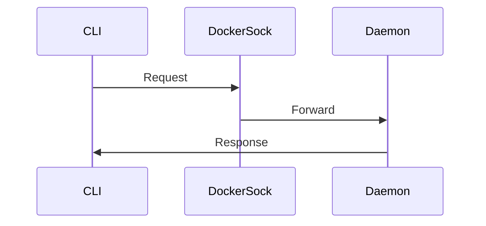

# UNIX Domain Sockets

# Understanding Linux's High-Speed Local Communication System

---

# Why This File Exists

Imagine these processes:

```text
Nginx

↓

NodeJS API

↓

Redis

↓

PostgreSQL
```

Question:

> Do they always communicate over the internet?

No.

If everything is running on the same machine, using TCP is wasteful.

Linux created:

```text
UNIX Domain Sockets (UDS)
```

for extremely fast local communication.

---

# Learning Goals

After this file you should understand:

* What UNIX sockets are
* Why they exist
* Why they're faster than TCP
* Kernel internals
* Filesystem relationship
* Process communication
* Buffering
* Modern infrastructure usage
* Docker relationship
* Kubernetes relationship
* Security implications
* Production architectures

---

# The Big Question

Suppose:

```text
Nginx

↓

NodeJS API
```

both run on the same server.

Question:

> Why do this?

```mermaid
flowchart TD

Nginx

↓

TCP

↓

Kernel

↓

NIC

↓

Kernel

↓

NodeJS
```

No reason.

It's unnecessary.

---

# Linux Solution

Skip the network stack.

```mermaid
flowchart TD

Nginx

↓

UNIX Socket

↓

NodeJS
```

Much faster.

---

# Definition

UNIX Domain Socket is:

> A local IPC (Inter-Process Communication) mechanism for processes running on the same machine.

Think:

> High-speed internal network.

---

# Mental Model

Never think:

```text
UNIX Socket

↓

Internet
```

Think:

```text
Process

↓

UNIX Socket

↓

Process
```

---

# Big Picture



---

# Where UNIX Sockets Live

They live entirely inside the machine.

---

# Visual

```mermaid
flowchart TD

Application

↓

UNIX Socket

↓

Kernel Memory

↓

Application
```

No internet.

No NIC.

No routing.

---

# Compare With TCP

TCP:

```mermaid
flowchart TD

AppA

↓

TCP

↓

IP

↓

NIC

↓

Kernel

↓

AppB
```

UNIX Socket:

```mermaid
flowchart TD

AppA

↓

UNIX Socket

↓

Kernel Memory

↓

AppB
```

Much simpler.

---

# Why Is It Faster?

Linux skips many layers.

TCP requires:

```text
TCP

IP

Routing

Firewall

Traffic Control

NIC
```

UNIX sockets avoid them.

---

# Performance Comparison

```mermaid
flowchart LR

TCP

-->

Many Layers

UNIX

-->

Few Layers
```

---

# Linux Architecture

```mermaid
flowchart TD

ApplicationA

↓

SocketAPI

↓

UNIX Socket Layer

↓

Kernel Memory

↓

ApplicationB
```

---

# Where Are UNIX Sockets Used?

Everywhere.

```mermaid
mindmap

root((UNIX Sockets))

Docker

containerd

systemd

Nginx

PostgreSQL

Redis

SSH

Linux Daemons
```

---

# WH Questions

## What is a UNIX socket?

Local process communication.

---

## Why does it exist?

To avoid unnecessary networking overhead.

---

## Where does it work?

Only on the same machine.

---

## Who uses it?

Most Linux infrastructure.

---

## Why is it fast?

No network stack traversal.

---

# File System Relationship

Very important.

UNIX sockets often appear as files.

Example:

```text
/var/run/docker.sock

/run/containerd/containerd.sock

/var/run/postgresql/.s.PGSQL.5432
```

---

# Visual

```mermaid
flowchart TD

Filesystem

↓

docker.sock

↓

Kernel Socket Object

↓

Docker Engine
```

---

# Wait... Is It A Real File?

Not exactly.

It is a special file.

---

# File Types

```mermaid
mindmap

root((Linux Files))

Regular

Directory

Block

Character

Pipe

Socket
```

---

# Verify

```bash
ls -l /var/run/docker.sock
```

Example:

```text
srw-rw----
```

The `s` means socket.

---

# Linux Internals

Applications call:

```text
socket()

bind()

connect()

send()

recv()
```

Kernel creates internal structures.

---

# Internal Architecture

```mermaid
flowchart TD

Application

↓

FileDescriptor

↓

SocketObject

↓

SocketBuffer

↓

KernelMemory

↓

Application
```

---

# Socket Pair Concept

Think of a tunnel.



---

# Lifecycle

UNIX sockets have a lifecycle.

```mermaid
flowchart TD

Create

↓

Bind

↓

Listen

↓

Connect

↓

Communicate

↓

Close
```

---

# Example: Nginx → PHP-FPM

Very common architecture.

```mermaid
flowchart TD

Browser

↓

Nginx

↓

php-fpm.sock

↓

PHP-FPM
```

Instead of TCP.

---

# Example: Docker

This is extremely important.

---

# Docker Architecture

```mermaid
flowchart TD

DockerCLI

↓

docker.sock

↓

DockerDaemon

↓

Containers
```

---

# Actual Example

When you run:

```bash
docker ps
```

This happens.



---

# Kubernetes Relationship

Kubernetes also uses them.

---

# Architecture

```mermaid
flowchart TD

Kubelet

↓

containerd.sock

↓

containerd

↓

Containers
```

---

# systemd Relationship

```mermaid
flowchart TD

Application

↓

systemd Socket

↓

systemd
```

This is called:

```text
Socket Activation
```

---

# PostgreSQL Relationship

```mermaid
flowchart TD

Application

↓

postgres.sock

↓

PostgreSQL
```

---

# Redis Relationship

```mermaid
flowchart TD

Application

↓

redis.sock

↓

Redis
```

---

# Modern Microservice Architecture

Same machine optimization.

```mermaid
graph TD

Nginx

API

Redis

PostgreSQL

Nginx --> API

API --> Redis

API --> PostgreSQL
```

Many internal communications can use UNIX sockets.

---

# Data Flow

This is important.

```mermaid
flowchart TD

ProcessA

↓

Kernel Buffer

↓

ProcessB
```

---

# Buffer Architecture

```mermaid
flowchart TD

Sender

↓

Send Buffer

↓

Kernel

↓

Receive Buffer

↓

Receiver
```

---

# Security Advantages

UNIX sockets are secure.

Because:

```text
No public network

No exposed port

Filesystem permissions
```

control access.

---

# Permission Model

```mermaid
flowchart TD

User

↓

Filesystem Permission

↓

Socket

↓

Service
```

---

# Docker Security Risk

This is extremely important.

Never expose:

```text
/var/run/docker.sock
```

carelessly.

Why?

Because whoever controls it can control Docker.

---

# Dangerous Architecture

```mermaid
flowchart TD

Attacker

↓

docker.sock

↓

DockerDaemon

↓

HostMachine
```

Host compromise.

---

# Production Rule

Avoid this.

```bash
-v /var/run/docker.sock:/var/run/docker.sock
```

unless absolutely necessary.

---

# Namespaces Relationship

UNIX sockets exist inside namespaces too.

```mermaid
flowchart TD

Namespace

↓

ProcessA

↓

UNIX Socket

↓

ProcessB
```

---

# Performance Comparison

| Feature       | UNIX Socket            | TCP      |
| ------------- | ---------------------- | -------- |
| Same machine  | Excellent              | Good     |
| Cross machine | No                     | Yes      |
| Latency       | Very low               | Higher   |
| Routing       | No                     | Yes      |
| NIC involved  | No                     | Yes      |
| Security      | Filesystem permissions | Firewall |

---

# Production Architecture Example

```mermaid
flowchart TD

Internet

↓

Nginx

↓

unix.sock

↓

API

↓

redis.sock

↓

Redis

↓

postgres.sock

↓

PostgreSQL
```

---

# Modern Infrastructure Usage

```mermaid
mindmap

root((UNIX Sockets))

Docker

Kubernetes

PostgreSQL

Redis

Nginx

systemd

SSH

Container Runtime
```

---

# Troubleshooting Flow

```mermaid
flowchart TD

START[Connection Failed]

START --> FILE[Socket File Exists?]

FILE --> PERM[Permissions Correct?]

PERM --> SERVICE[Service Running?]

SERVICE --> PROCESS[Process Listening?]

PROCESS --> SUCCESS[Healthy]
```

---

# Useful Commands

List UNIX sockets:

```bash
ss -x
```

Listening UNIX sockets:

```bash
ss -lx
```

All sockets:

```bash
ss -xap
```

Find socket files:

```bash
find /run -type s

find /var/run -type s
```

Inspect:

```bash
ls -l /var/run/docker.sock
```

---

# Common Misconceptions

### ❌ UNIX sockets are internet sockets

Wrong.

---

### ❌ UNIX sockets are physical files

Wrong.

They're kernel socket objects represented by special files.

---

### ❌ Only databases use them

Wrong.

Most Linux infrastructure uses them.

---

### ❌ Docker CLI directly talks to containers

Wrong.

Docker CLI talks to Docker daemon through docker.sock.

---

# Engineer Mental Model

Never think:

```text
Application

↓

Application
```

Always think:

```mermaid
flowchart TD

Application

↓

UNIX Socket

↓

Kernel Memory

↓

Application
```

---

# Capability Checklist

After this file you should understand:

✅ UNIX sockets

✅ IPC

✅ Filesystem relationship

✅ Performance benefits

✅ Security model

✅ Docker relationship

✅ Kubernetes relationship

✅ systemd relationship

✅ Production architectures

          s will become one of the strongest chapters in the repository.
