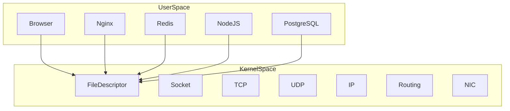
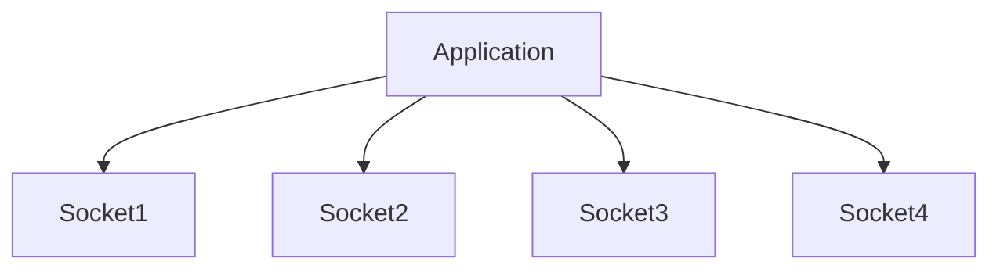
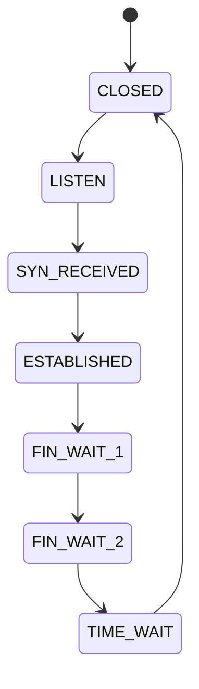
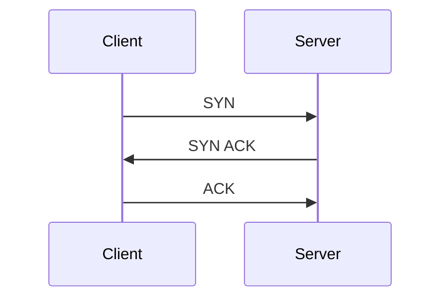
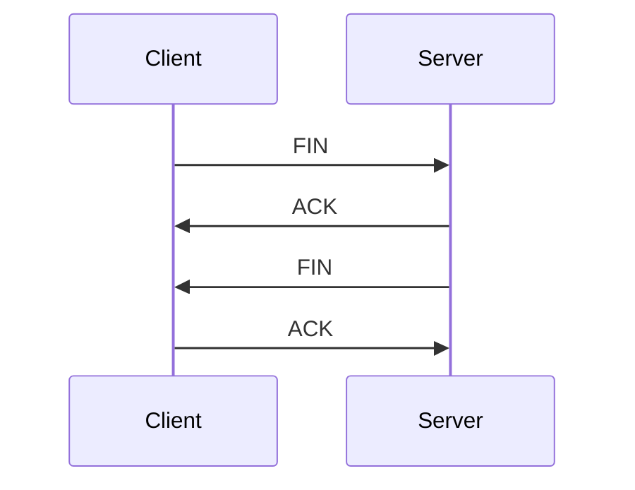
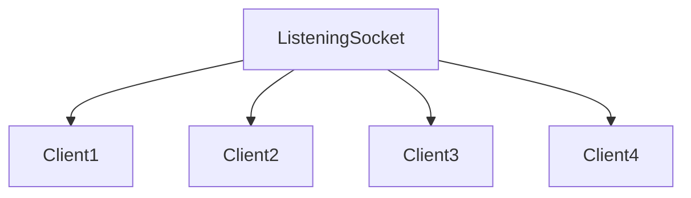
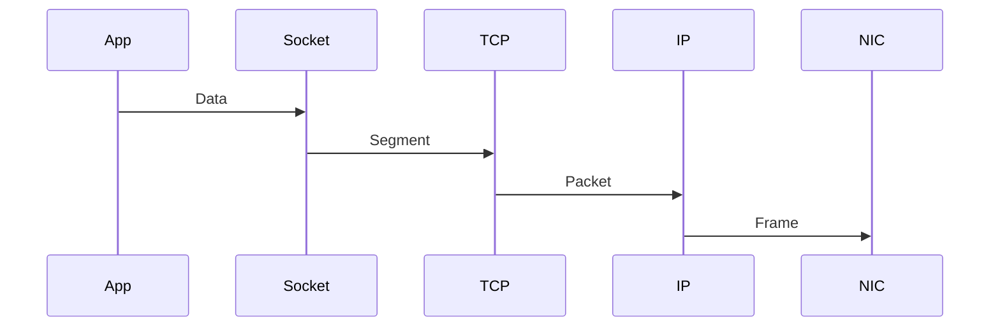
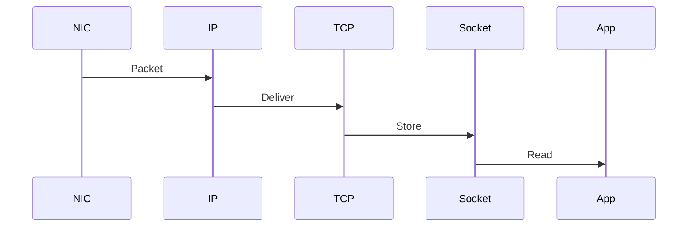

# Linux Sockets Visual Atlas

# Visualizing How Modern Servers Actually Work

---

# Socket Ecosystem Map

```mermaid
mindmap

root((Linux Sockets))

Unix Sockets

TCP Sockets

UDP Sockets

Socket Internals

Socket Lifecycle

Socket Buffers

epoll

Event Loop

Modern Servers

API Gateways

Load Balancers
```

---

# Everything Eventually Becomes This

```mermaid
flowchart TD

Application

↓

Socket

↓

Protocol

↓

IP

↓

NIC

↓

Internet
```

---

# User Space vs Kernel Space



---

# Socket Architecture

```mermaid
flowchart TD

Application

↓

File Descriptor

↓

Socket Object

↓

TCP/UDP

↓

IP

↓

NIC

↓

Internet
```

---

# Linux Networking Layers

```mermaid
flowchart TD

Application Layer

↓

Socket Layer

↓

Transport Layer

↓

Network Layer

↓

Link Layer

↓

Hardware Layer
```

---

# What socket() Creates

```mermaid
flowchart TD

socket()

↓

Kernel Object

↓

File Descriptor

↓

Buffers

↓

Protocol Association

↓

State Machine
```

---

# Socket Memory Layout

```mermaid
flowchart TD

Socket

↓

State

Buffers

Timers

Queues

Flags

Ownership

Protocol
```

---

# File Descriptor Relationship

```mermaid
flowchart TD

Process

↓

FD Table

↓

FD 0

FD 1

FD 2

FD 3(Socket)

FD 4(Socket)
```

---

# One Process Multiple Sockets



---

# TCP Connection Lifecycle



---

# Three Way Handshake



---

# Four Way Close



---

# Server Creation Lifecycle

```mermaid
flowchart TD

socket()

↓

bind()

↓

listen()

↓

accept()

↓

send()

↓

recv()

↓

close()
```

---

# Listening Socket vs Client Sockets



---

# Linux Server Queues

```mermaid
flowchart TD

Internet

↓

SYN Queue

↓

Accept Queue

↓

Application
```

---

# Complete Packet Journey

```mermaid
flowchart TD

Internet

↓

NIC

↓

Driver

↓

Socket Buffer

↓

Socket

↓

Application
```

---

# Data Send Journey



---

# Data Receive Journey



---

# Socket Buffers

```mermaid
flowchart LR

Application

-->

Send Buffer

-->

Internet

-->

Receive Buffer

-->

Application
```

---

# Why Buffers Exist

```mermaid
flowchart TD

Fast CPU

↓

Slow Network

↓

Buffers
```

---

# Buffer Overflow

```mermaid
flowchart TD

Packets

↓

Buffer

↓

Full

↓

Drop
```

---

# Backpressure Propagation

```mermaid
flowchart TD

Database Slow

↓

API Slow

↓

Gateway Slow

↓

Users Wait
```

---

# TCP Internals

```mermaid
flowchart TD

Application

↓

TCP

↓

Flow Control

↓

Congestion Control

↓

IP
```

---

# UDP Internals

```mermaid
flowchart TD

Application

↓

UDP

↓

IP

↓

Internet
```

---

# TCP vs UDP

```mermaid
flowchart LR

TCP

-->

Reliable

-->

Ordered

-->

State Machine

UDP

-->

Minimal

-->

Low Latency

-->

Application Controlled
```

---

# DNS Architecture

```mermaid
flowchart TD

Browser

↓

UDP Socket

↓

DNS Resolver

↓

DNS Server
```

---

# HTTP/3 Architecture

```mermaid
flowchart TD

Browser

↓

QUIC

↓

UDP

↓

Internet
```

---

# Socket Ownership Model

```mermaid
flowchart TD

Source IP

↓

Destination IP

↓

Source Port

↓

Destination Port

↓

Protocol
```

---

# The 5-Tuple

```mermaid
mindmap

root((5 Tuple))

Source IP

Destination IP

Source Port

Destination Port

Protocol
```

---

# epoll Architecture

```mermaid
flowchart TD

Sockets

↓

epoll

↓

Event Loop

↓

Application
```

---

# epoll Internal Components

```mermaid
flowchart TD

epoll

↓

Interest List

Ready List

Wait Queue
```

---

# Event Loop Engine

```mermaid
flowchart TD

Wait

↓

Event

↓

Execute

↓

Wait
```

---

# Event Loop System

```mermaid
flowchart TD

Sockets

↓

epoll

↓

Event Loop

↓

Application Logic
```

---

# Nginx Internals

```mermaid
flowchart TD

Users

↓

Master

↓

Workers

↓

epoll

↓

Sockets
```

---

# Redis Internals

```mermaid
flowchart TD

Clients

↓

epoll

↓

Single Thread

↓

Memory
```

---

# NodeJS Internals

```mermaid
flowchart TD

JavaScript

↓

Node Runtime

↓

libuv

↓

epoll

↓

Linux
```

---

# API Gateway Internals

```mermaid
flowchart TD

User

↓

Gateway

↓

Authentication

↓

Authorization

↓

Rate Limiting

↓

Routing

↓

Service Discovery

↓

Microservice
```

---

# Load Balancer Architecture

```mermaid
flowchart TD

Users

↓

Load Balancer

↓

Server1

Server2

Server3

Server4
```

---

# Service Mesh Architecture

```mermaid
flowchart TD

Gateway

↓

Service A

↔

Service B

↔

Service C
```

---

# Modern Cloud Architecture

```mermaid
flowchart TD

Users

↓

CDN

↓

LoadBalancer

↓

API Gateway

↓

Services

↓

Database
```

---

# Kubernetes Networking Path

```mermaid
flowchart TD

User

↓

LoadBalancer

↓

Ingress

↓

Service

↓

Pod

↓

Socket
```

---

# Linux Foundation Of Everything

This is probably the most important diagram in the entire sockets repository.

```mermaid
flowchart TD

Internet

↓

NIC

↓

Driver

↓

Socket Buffer

↓

Socket

↓

epoll

↓

Event Loop

↓

Application
```

---

# Modern Internet Architecture

```mermaid
flowchart TD

Users

↓

CDN

↓

Load Balancer

↓

API Gateway

↓

Microservices

↓

Cache

↓

Database

↓

Storage
```

---

# The Three Linux Scalability Eras

```mermaid
timeline

title Linux Scalability Evolution

1990 : Blocking IO

2002 : epoll

2019 : io_uring
```

---

# Linux Evolution

```mermaid
flowchart LR

Blocking IO

-->

Thread Per Connection

-->

epoll

-->

Event Loop

-->

io_uring
```

---

# Systems Engineering Pyramid

```mermaid
flowchart TD

Applications

↓

Event Loops

↓

epoll

↓

Sockets

↓

TCP/UDP

↓

IP

↓

NIC

↓

Hardware
```

---

# The Single Diagram To Memorize Forever

If someone remembers only one diagram from the entire repository, it should be this.

```mermaid
flowchart TD

Users

↓

Internet

↓

NIC

↓

Driver

↓

Socket Buffer

↓

Socket

↓

epoll

↓

Event Loop

↓

Application

↓

Gateway

↓

Microservice

↓

Database
```
