# Networking Visuals

> This file contains visual explanations of important networking concepts using Mermaid diagrams. The goal is to build intuition rather than memorize definitions.

---

# Table of Contents

1. Network Communication Overview
2. Client-Server Architecture
3. OSI Model
4. TCP/IP Model
5. Packet Journey
6. DNS Resolution
7. HTTP Request Flow
8. TCP Three-Way Handshake
9. TCP Four-Way Termination
10. SSH Connection Flow
11. Routing
12. NAT
13. Home Network Architecture
14. Cloud Architecture
15. Reverse Proxy
16. Load Balancer
17. Firewall
18. Docker Networking
19. Kubernetes Networking

---

# 1. Network Communication Overview

Everything starts here.

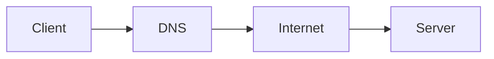

Flow:

```text
Client
 ↓
DNS
 ↓
Internet
 ↓
Server
```

---

# 2. Client Server Architecture

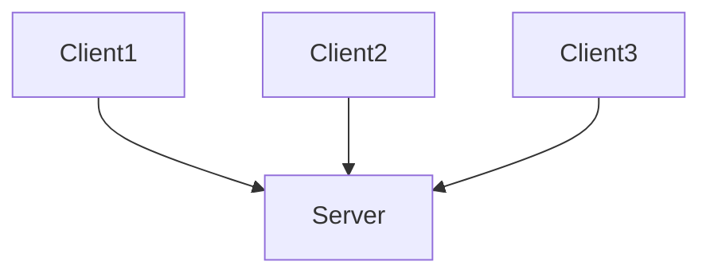

Examples:

```text
Browser → Website

Mobile App → Backend API

Laptop → Database Server
```

---

# 3. OSI Model

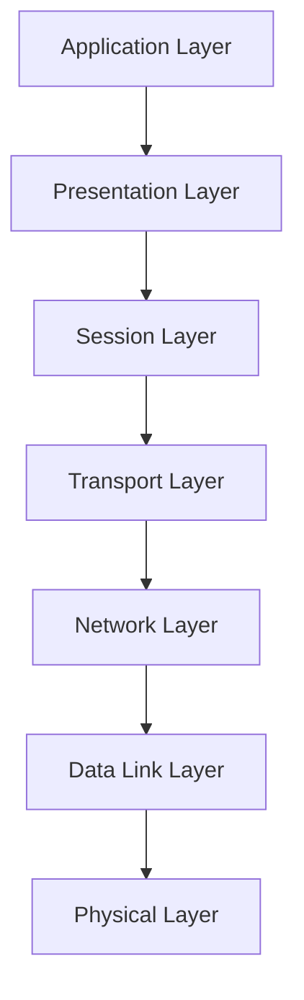

Memory Trick:

```text
Application
Presentation
Session
Transport
Network
Data Link
Physical
```

---

# 4. TCP/IP Model

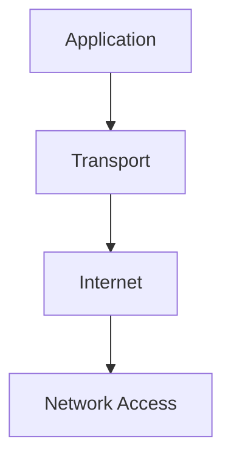

---

# 5. OSI vs TCP/IP

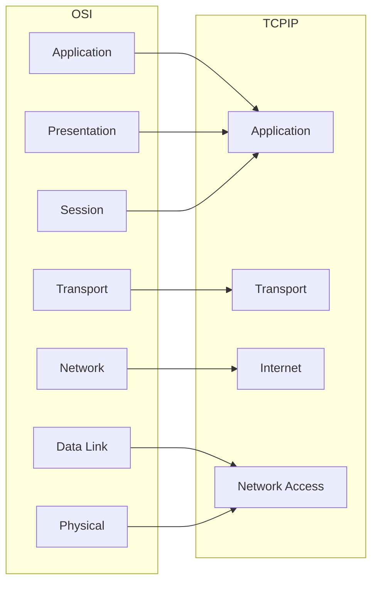

---

# 6. Packet Journey

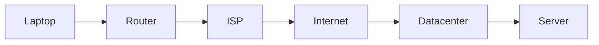

---

# 7. DNS Resolution

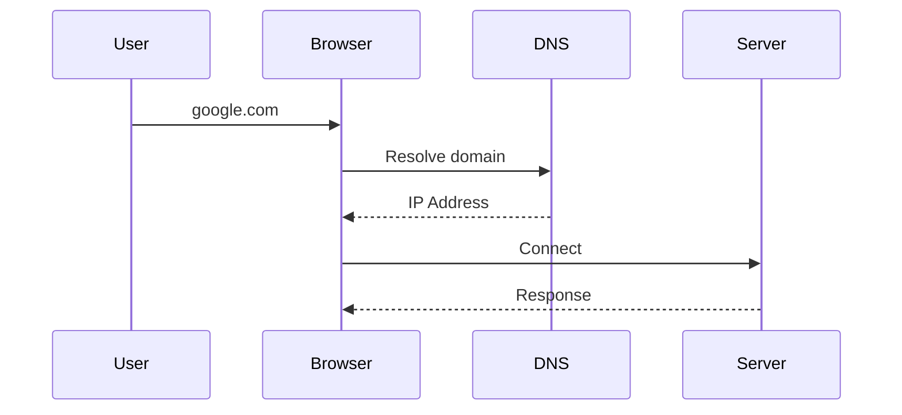

---

# 8. HTTP Request Flow

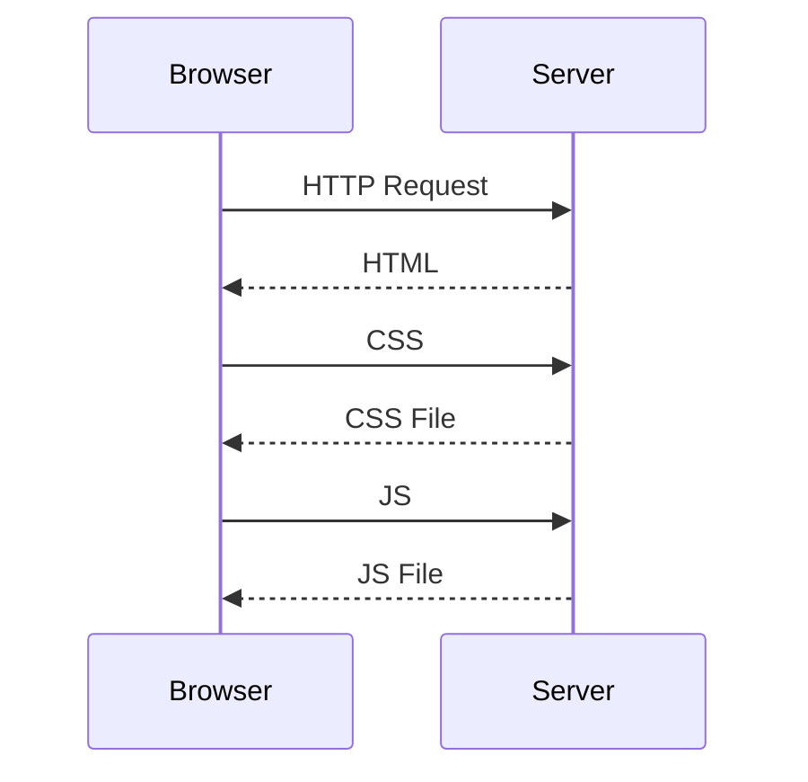

---

# 9. TCP Three-Way Handshake

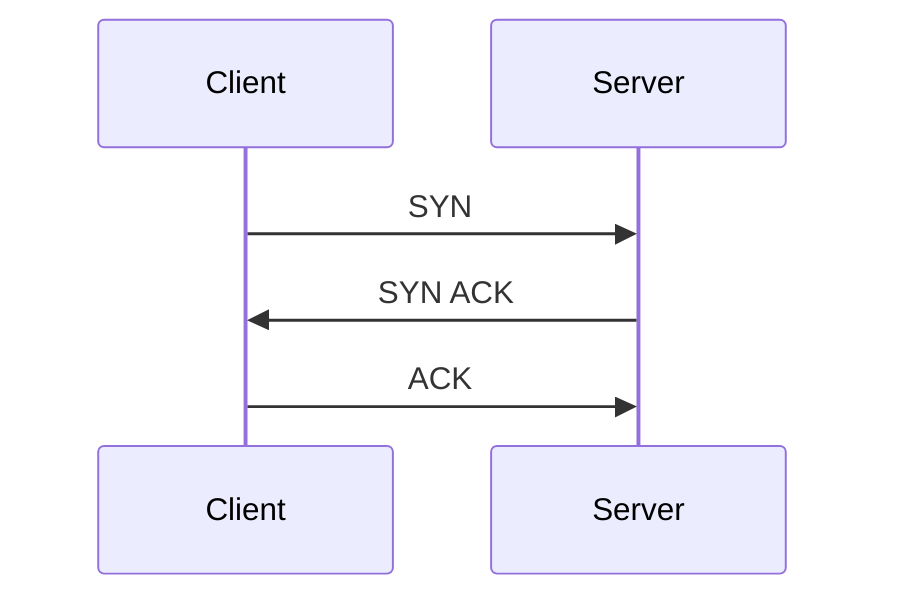

Visual:

```text
Client            Server

SYN ------------>

<------ SYN ACK

ACK ------------>
```

Connection Established.

---

# 10. TCP Four-Way Termination

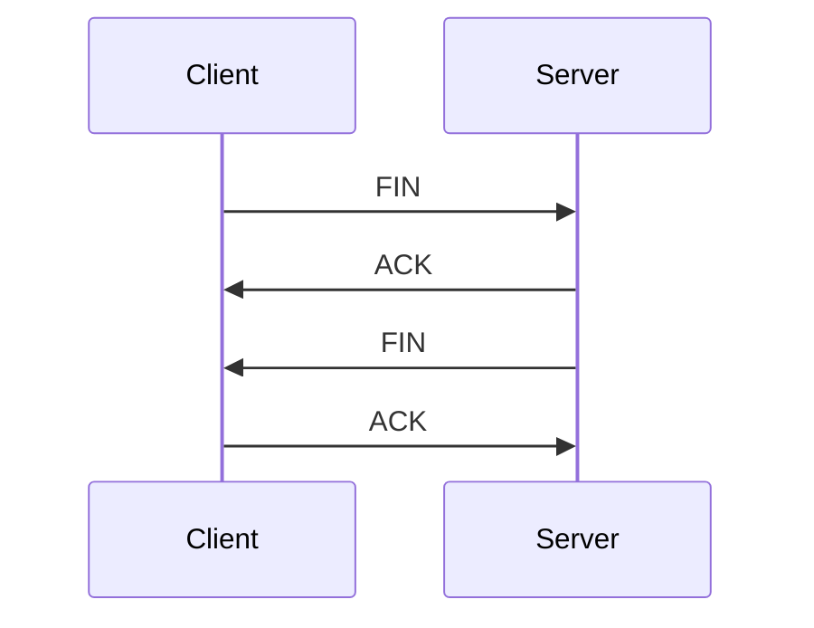

---

# 11. SSH Connection

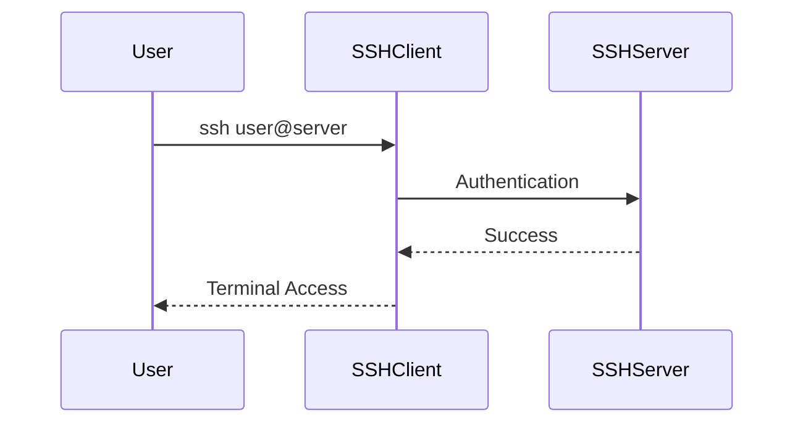

---

# 12. Routing

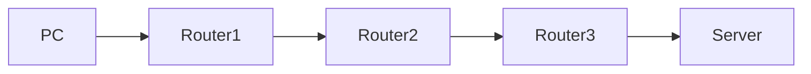

Routers decide where packets should go.

---

# 13. NAT

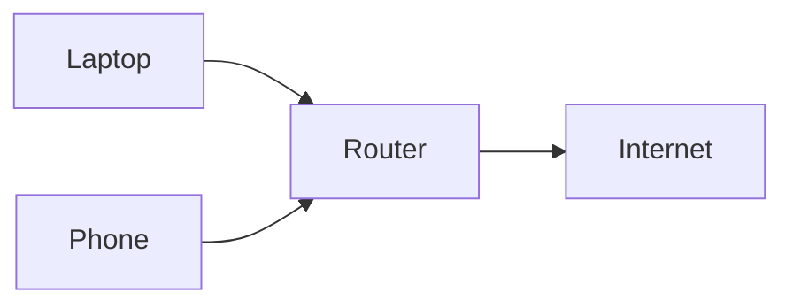

Visual:

```text
192.168.1.10

192.168.1.20

↓

Public IP

↓

Internet
```

---

# 14. Home Network Architecture

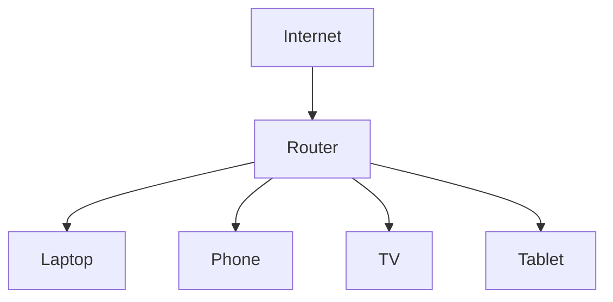

---

# 15. Reverse Proxy

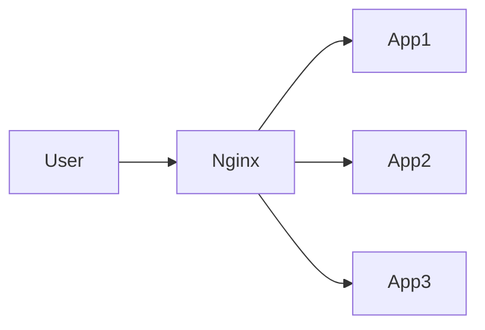

Benefits:

```text
Security

Load Distribution

SSL Termination
```

---

# 16. Load Balancer

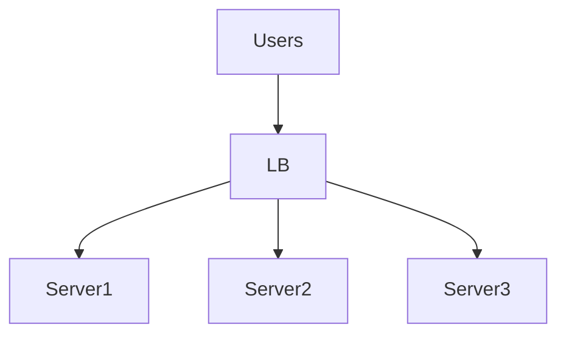

Purpose:

```text
Distribute Traffic
```

---

# 17. Firewall

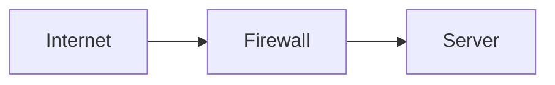

Firewall filters traffic.

---

# 18. Docker Networking

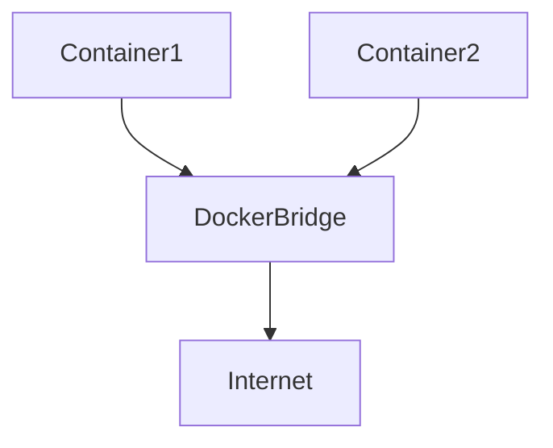

---

# 19. Kubernetes Networking

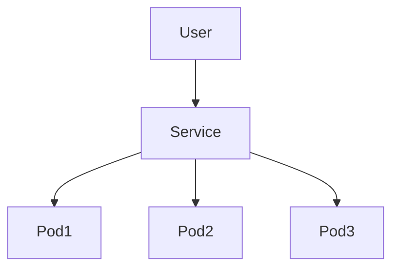

---

# 20. Full Modern Web Architecture

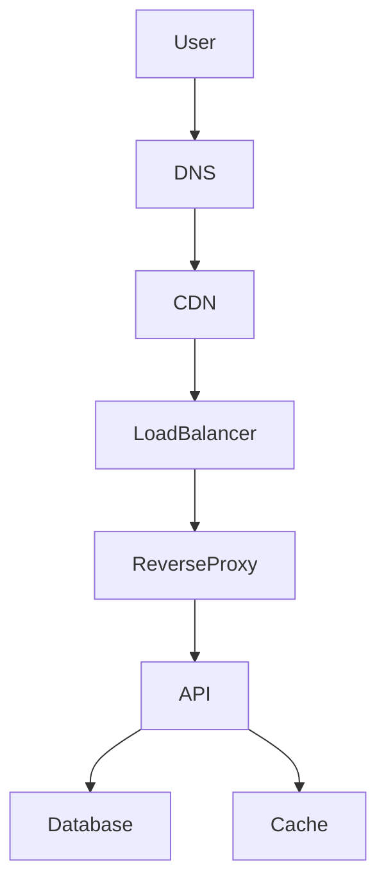

---

# 21. Networking Mental Model

```text
Application

↓

Protocol

↓

Packet

↓

IP Address

↓

Router

↓

Internet

↓

Router

↓

Destination

↓

Application
```

---

# Recommended Study Order

```text
Client Server

↓

OSI

↓

TCP/IP

↓

DNS

↓

TCP

↓

HTTP

↓

Routing

↓

NAT

↓

SSH

↓

Reverse Proxy

↓

Load Balancer

↓

Docker Networking

↓

Kubernetes Networking
```
