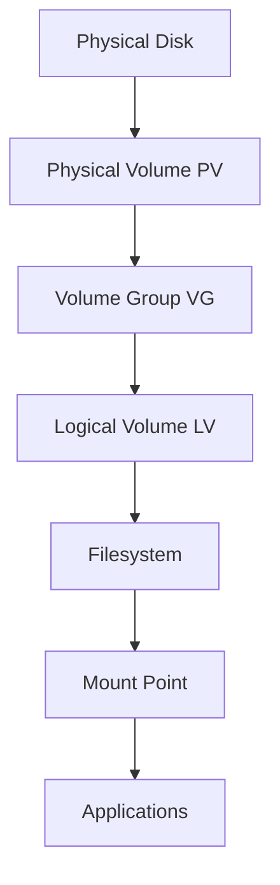
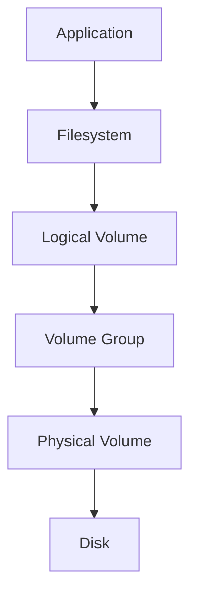
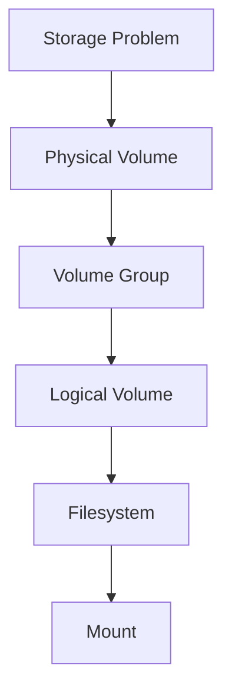

# LVM (Logical Volume Manager)

> LVM is one of Linux's greatest engineering inventions.
>
> Great Linux engineers don't think:
>
> "I have disks."
>
> They think:
>
> "I have a storage pool that I can dynamically allocate."
>
> LVM transforms rigid storage into programmable infrastructure.
>
> It is software-defined storage for Linux.

---

# Why This File Exists

Imagine a server.

```text
500 GB SSD

↓

100 GB /

↓

400 GB /home
```

Six months later.

```text
/

↓

100% Full
```

Problem.

```text
Home

↓

300 GB Free
```

Can we borrow storage?

Traditional partitions:

```text
No
```

LVM:

```text
Yes
```

That's why LVM was invented.

---

# Problem It Solves

This file answers:

```text
Why does LVM exist?

What problem does it solve?

How does LVM work?

Why do enterprises use it?

How do cloud engineers use it?

How does LVM fit into Linux architecture?

How does LVM help databases and containers?
```

---

# Mental Model: Water Tank System

Imagine your house.

Without LVM:

```text
3 Water Tanks

100 L

100 L

100 L

Cannot share water
```

One tank is empty.

Another is full.

Wasteful.

With LVM:

```text
3 Tanks

↓

One Big Pool

↓

Dynamic Allocation
```

That's LVM.

---

# First Principles

Traditional storage:

```text
Disk

↓

Partition

↓

Filesystem

↓

Mount
```

Problem:

```text
Rigid
```

Cannot easily resize.

LVM inserts a layer.

```text
Disk

↓

LVM

↓

Filesystem

↓

Mount
```

Now storage becomes flexible.

---

# The Big Idea

LVM separates:

```text
Physical Storage

↓

Logical Storage
```

This is abstraction.

Exactly like virtualization.

---

# Storage Evolution

## Generation 1

Raw Disks

```text
Disk

↓

Filesystem
```

---

## Generation 2

Partitions

```text
Disk

↓

Partitions

↓

Filesystem
```

---

## Generation 3

LVM

```text
Disk

↓

Storage Pool

↓

Logical Volumes

↓

Filesystem
```

Much better.

---

# Where LVM Fits

Memorize this.

```text
Physical Disk

↓

Partition

↓

Physical Volume

↓

Volume Group

↓

Logical Volume

↓

Filesystem

↓

Mount Point

↓

Applications
```

This pipeline is extremely important.

---

# Linux Storage Architecture



---

# The Three Core Components

LVM has three building blocks.

```text
PV

VG

LV
```

Memorize forever.

---

# Component 1: Physical Volume (PV)

Physical storage devices.

Examples:

```text
SSD

HDD

NVMe

Partitions
```

Examples:

```text
/dev/sdb1

/dev/sdc1
```

Mental model:

```text
Storage Bricks
```

---

# Component 2: Volume Group (VG)

Pool multiple disks together.

Visual:

```text
500 GB SSD

+

500 GB SSD

↓

1000 GB Pool
```

Mental model:

```text
Storage Lake
```

---

# Component 3: Logical Volume (LV)

Create virtual storage devices.

Example:

```text
100 GB Root

300 GB Database

600 GB Data
```

These are flexible.

Mental model:

```text
Virtual Partitions
```

---

# The Complete Pipeline

```text
Disk A

500 GB

+

Disk B

500 GB

↓

Volume Group

1000 GB

↓

Logical Volumes

100 GB /

300 GB DB

600 GB Data
```

---

# Why Engineers Love LVM

Question:

What if root becomes full?

Traditional partitions:

```text
Very difficult
```

LVM:

```text
Extend volume
```

Simple.

---

# Real Example

Traditional.

```text
1 TB SSD

↓

100 GB /

↓

900 GB /home
```

Problem:

```text
/

100% full

/home

700 GB free
```

Bad design.

---

# With LVM

```text
1 TB Pool

↓

200 GB /

↓

800 GB /home
```

Later:

```text
/

Need 100 GB more
```

Simply resize.

---

# LVM Workflow

Engineers memorize this.

```text
Disk

↓

PV

↓

VG

↓

LV

↓

Filesystem

↓

Mount
```

---

# The Core Commands

## Create Physical Volume

```bash
sudo pvcreate /dev/sdb1
```

---

## Show Physical Volumes

```bash
sudo pvs
```

---

## Create Volume Group

```bash
sudo vgcreate data-vg /dev/sdb1
```

---

## Show Volume Groups

```bash
sudo vgs
```

---

## Create Logical Volume

```bash
sudo lvcreate -L 100G -n app-lv data-vg
```

---

## Show Logical Volumes

```bash
sudo lvs
```

---

# Mental Model: Building A City

```text
Land

↓

City

↓

Neighborhoods

↓

Buildings
```

Linux:

```text
PV

↓

VG

↓

LV

↓

Filesystem
```

---

# Dynamic Resizing

This is LVM's superpower.

Visual:

```text
100 GB

↓

Need More

↓

150 GB
```

Command:

```bash
sudo lvextend -L +50G /dev/data-vg/app-lv
```

Then resize filesystem.

```bash
sudo resize2fs /dev/data-vg/app-lv
```

---

# Data Flow

Suppose an application writes data.

Visual:



---

# Snapshots

LVM supports snapshots.

Mental model:

```text
Take a photo

↓

Rollback if needed
```

Useful for:

```text
Databases

Backups

Updates
```

Visual:

```text
Original Volume

↓

Snapshot

↓

Safe Experimentation
```

---

# Enterprise Example

Database Server.

```text
2 NVMe Drives

↓

VG

↓

Database LV

↓

Logs LV

↓

Backups LV
```

Excellent architecture.

---

# Docker Example

Docker growth is unpredictable.

Separate:

```text
Docker Volume

↓

Dedicated LV
```

Example:

```text
/var/lib/docker
```

---

# Kubernetes Example

Kubernetes nodes consume lots of storage.

Separate:

```text
Images

Logs

Volumes
```

into dedicated LVs.

---

# Cloud Example

Cloud engineers love abstraction.

LVM provides:

```text
Flexibility

Resizing

Isolation

Automation
```

---

# Startup Founder Perspective

Imagine:

```text
Your SaaS grows rapidly
```

Storage requirements change weekly.

LVM allows growth without rebuilding servers.

Huge advantage.

---

# Capacity Planning Mindset

Don't ask:

```text
How many disks do I have?
```

Ask:

```text
How much storage pool exists?

How much is allocated?

How much remains?
```

---

# Performance Considerations

LVM overhead exists.

But usually tiny.

Benefits outweigh costs.

Questions engineers ask:

```text
How many disks?

SSD or HDD?

Database workload?

Sequential or random IO?
```

---

# Security Considerations

Separate workloads.

Good:

```text
OS

Database

Logs

Backups
```

Bad:

```text
Everything together
```

---

# Observability Tools

Useful commands.

```bash
pvs

vgs

lvs

lsblk

df -h
```

---

# Troubleshooting Workflow

Storage problem?

Ask:

```text
Disk visible?

↓

PV healthy?

↓

VG healthy?

↓

LV healthy?

↓

Filesystem healthy?

↓

Mounted?
```

Visual:



---

# Common Mistakes

## Mistake 1

Thinking LVM is a filesystem.

Wrong.

LVM sits before filesystems.

---

## Mistake 2

Thinking LVM replaces partitions.

Wrong.

LVM abstracts storage.

---

## Mistake 3

Forgetting filesystem resize.

Extending LV is not enough.

Filesystem must also grow.

---

## Mistake 4

Putting everything in one LV.

Separate workloads.

---

## Mistake 5

Ignoring capacity planning.

Always leave free space.

---

# Engineering Mindset

Whenever you see LVM, visualize:

```text
Storage Pool

↓

Virtual Storage

↓

Applications
```

Do not think:

```text
Partition Manager
```

Think:

```text
Software Defined Storage Infrastructure
```

That's how engineers think.

---

# Interview Questions

## Beginner

1. What is LVM?

2. Why does LVM exist?

3. What problem does it solve?

4. Explain PV, VG and LV.

---

## Intermediate

5. Explain LVM architecture.

6. Explain resizing.

7. Explain snapshots.

8. Explain storage pooling.

---

## Advanced

9. Design storage for a database server.

10. Design Docker storage.

11. Design Kubernetes node storage.

12. Explain LVM in cloud environments.

---

# Cheat Sheet

```text
Storage Pipeline

Disk

↓

PV

↓

VG

↓

LV

↓

Filesystem

↓

Mount


Core Commands

pvcreate

pvs

vgcreate

vgs

lvcreate

lvs

lvextend


Golden Rule

LVM converts rigid storage

into flexible infrastructure.
```
