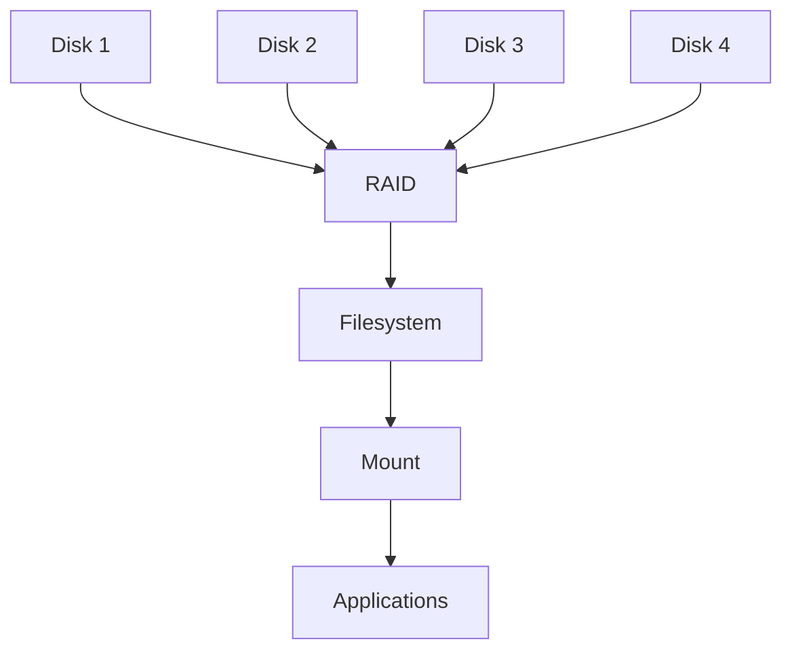
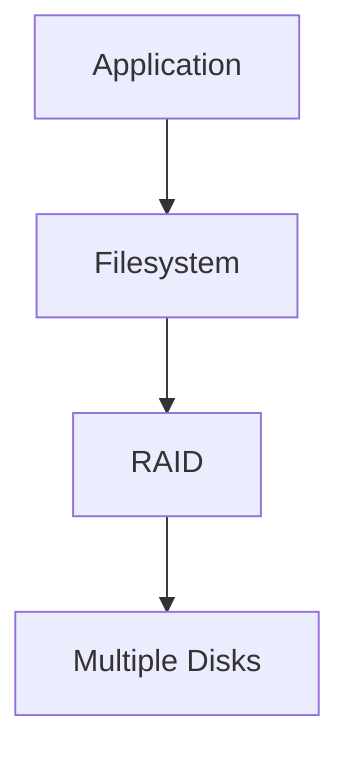
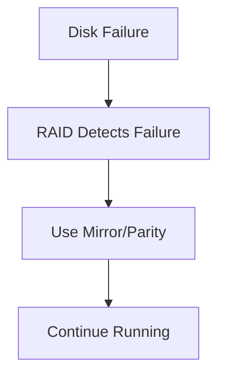
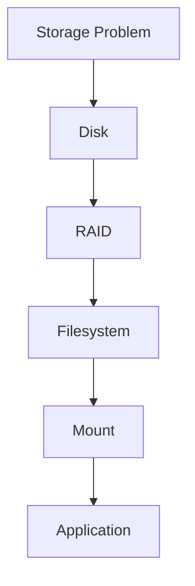

# RAID (Redundant Array of Independent Disks)

> RAID is one of the oldest distributed systems in computing.
>
> Great Linux engineers don't think:
>
> "I have four disks."
>
> They think:
>
> "I have one storage system built from multiple disks."
>
> RAID solves one of computing's oldest problems:
>
> **Disks eventually fail.**

---

# Why This File Exists

Imagine this.

```text
1 Disk

↓

Database

↓

Disk Failure

↓

Everything Lost
```

Problem.

Disks are mechanical and electronic devices.

Every disk eventually dies.

Question:

```text
How do we build reliable systems from unreliable hardware?
```

Answer:

```text
RAID
```

---

# Problem It Solves

This file answers:

```text
What is RAID?

Why was RAID invented?

Why do disks fail?

How does RAID work?

Why do enterprises use RAID?

Why do databases care?

Why is RAID not backup?
```

---

# Mental Model: Teamwork

Imagine moving furniture.

One person.

```text
Slow

Fragile

Single Point Of Failure
```

Four people.

```text
Faster

Safer

Shared Work
```

RAID does the same.

---

# First Principles

Question:

What is wrong with a single disk?

Problems:

```text
Single Point Of Failure

Limited Speed

Limited Capacity

Poor Fault Tolerance
```

Single disks are dangerous.

---

# The Big Idea

RAID combines multiple disks.

Visual:

```text
Disk 1

Disk 2

Disk 3

Disk 4

↓

One Storage System
```

---

# What Does RAID Mean?

```text
Redundant

Array

Independent

Disks
```

Simple definition:

> RAID is a technology that combines multiple physical disks into one logical storage system.

---

# Where RAID Fits In Linux

Memorize this.

```text
Physical Disks

↓

RAID

↓

LVM (optional)

↓

Filesystem

↓

Mount Point

↓

Applications
```

Very important.

---

# Linux Storage Architecture



---

# Three Goals Of RAID

Every RAID system optimizes for one or more goals.

```text
Performance

Availability

Capacity
```

There are always tradeoffs.

---

# The Storage Triangle

```text
          Performance

             / \

            /   \

           /     \

Availability-----Capacity
```

You rarely maximize all three.

---

# Hardware RAID vs Software RAID

## Hardware RAID

Dedicated controller.

```text
Disks

↓

RAID Controller

↓

Linux
```

Pros:

```text
Fast

Offloads CPU
```

Cons:

```text
Expensive

Vendor Dependency
```

---

## Software RAID

Linux manages everything.

```text
Disks

↓

Linux mdadm

↓

Filesystem
```

Pros:

```text
Flexible

Cheap

Popular
```

Cons:

```text
Uses CPU
```

Modern CPUs make this negligible.

---

# Linux Software RAID

Linux commonly uses:

```text
mdadm
```

Think:

```text
RAID Manager
```

---

# RAID 0 (Striping)

Goal:

```text
Speed
```

Visual:

```text
File

A B C D E F G H

↓

Disk1

A C E G

Disk2

B D F H
```

Data is split.

---

# RAID 0 Characteristics

Advantages:

```text
Fast

Large Capacity
```

Disadvantages:

```text
No Redundancy
```

If one disk dies:

```text
Everything Lost
```

Use cases:

```text
Temporary Data

Scratch Storage

Video Editing
```

---

# RAID 1 (Mirroring)

Goal:

```text
Redundancy
```

Visual:

```text
Disk1

A B C D

Disk2

A B C D
```

Everything is duplicated.

---

# RAID 1 Characteristics

Advantages:

```text
High Availability

Simple Recovery
```

Disadvantages:

```text
50% Capacity Loss
```

2 TB storage:

```text
1 TB usable
```

Use cases:

```text
OS

Critical Servers

Small Databases
```

---

# RAID 5 (Parity)

Goal:

```text
Balance
```

Visual:

```text
Disk1

A

B

P

Disk2

B

P

C

Disk3

P

C

D
```

`P`

```text
Parity Information
```

Parity allows recovery.

---

# RAID 5 Characteristics

Advantages:

```text
Efficient

Fault Tolerant

Good Capacity
```

Disadvantages:

```text
Slower Writes

Rebuild Expensive
```

Can survive:

```text
1 Disk Failure
```

---

# RAID 6

Similar to RAID 5.

Extra parity.

Can survive:

```text
2 Disk Failures
```

Tradeoff:

```text
More Safety

Less Capacity
```

---

# RAID 10 (1+0)

Enterprise favorite.

Combines:

```text
RAID 1

+

RAID 0
```

Visual:

```text
Disk1

Mirror

Disk2


Disk3

Mirror

Disk4

↓

Stripe Across Mirrors
```

---

# RAID 10 Characteristics

Advantages:

```text
Fast

Reliable

Excellent Recovery
```

Disadvantages:

```text
50% Capacity Loss
```

Common for:

```text
Databases

High Traffic Servers
```

---

# RAID Comparison Table

| RAID | Speed | Redundancy | Capacity Efficiency | Disk Failure Tolerance |
|------|------|-----------|-------------------|----------------------|
| RAID 0 | Excellent | None | 100% | 0 |
| RAID 1 | Good | Excellent | 50% | 1 |
| RAID 5 | Good | Good | High | 1 |
| RAID 6 | Good | Excellent | Medium | 2 |
| RAID 10 | Excellent | Excellent | 50% | Multiple (depends) |

---

# Why Parity Is Powerful

Imagine this.

```text
Disk1

10

Disk2

20

Disk3

30

Parity

60
```

If one disk dies.

Linux reconstructs it.

Amazing engineering.

---

# The Linux Workflow

Memorize this.

```text
Disk

↓

RAID

↓

LVM

↓

Filesystem

↓

Mount

↓

Applications
```

---

# Core Linux Commands

## Create RAID

```bash
sudo mdadm --create
```

---

## Show RAID

```bash
cat /proc/mdstat
```

---

## Detailed Information

```bash
sudo mdadm --detail /dev/md0
```

---

## Scan RAID

```bash
sudo mdadm --examine
```

---

# Data Flow

Suppose an application writes data.



---

# What Happens During Disk Failure?

Visual:



This is why RAID exists.

---

# Rebuilding

After replacing a failed disk:

```text
Insert New Disk

↓

RAID Rebuilds Data

↓

Healthy Again
```

Rebuilds can take hours.

Large disks:

```text
Several Hours

Sometimes Days
```

---

# RAID Is NOT Backup

This is one of the most important lessons.

RAID protects against:

```text
Disk Failure
```

RAID does NOT protect against:

```text
Accidental Delete

Ransomware

Fire

Flood

Data Corruption

Human Error
```

Never confuse them.

---

# Enterprise Example

Database Server.

```text
4 NVMe Drives

↓

RAID 10

↓

LVM

↓

Filesystem

↓

PostgreSQL
```

Very common.

---

# Docker Example

Docker hosts often use:

```text
RAID 1

or

RAID 10
```

to protect containers.

---

# Kubernetes Example

Kubernetes nodes often separate:

```text
OS

Container Runtime

Logs
```

using RAID.

---

# Cloud Perspective

Cloud changes the game.

Cloud providers already replicate disks.

Examples:

```text
AWS EBS

Azure Managed Disk

Google Persistent Disk
```

Many cloud systems do not require traditional RAID.

Think carefully.

---

# Startup Founder Perspective

Question:

Should your startup use RAID?

Small startup:

```text
Maybe
```

Large startup:

```text
Absolutely
```

Especially for:

```text
Databases

Logs

Critical Systems
```

---

# Performance Considerations

Questions engineers ask:

```text
Read Heavy?

Write Heavy?

Database?

Containers?

Analytics?
```

RAID selection depends on workload.

---

# Security Considerations

Protect against:

```text
Single Disk Failure
```

But also remember:

```text
RAID ≠ Security
```

---

# Observability Tools

Useful commands.

```bash
cat /proc/mdstat

mdadm --detail

lsblk

df -h
```

---

# Troubleshooting Workflow

Storage issue?

Ask:

```text
Disk Healthy?

↓

RAID Healthy?

↓

Filesystem Healthy?

↓

Mounted?

↓

Application Healthy?
```

Visual:



---

# Common Mistakes

## Mistake 1

Thinking RAID is backup.

Wrong.

---

## Mistake 2

Using RAID 0 for critical data.

Very dangerous.

---

## Mistake 3

Ignoring rebuild times.

Modern disks are huge.

---

## Mistake 4

Ignoring monitoring.

Always monitor RAID health.

---

## Mistake 5

Choosing RAID before understanding workload.

Always understand requirements first.

---

# Engineering Mindset

Whenever you hear RAID, visualize:

```text
Multiple Disks

↓

One Reliable System
```

Do not think:

```text
Disk Feature
```

Think:

```text
Fault Tolerant Storage Infrastructure
```

That's how engineers think.

---

# Interview Questions

## Beginner

1. What is RAID?

2. Why does RAID exist?

3. Is RAID backup?

4. What problem does RAID solve?

---

## Intermediate

5. Explain RAID 0.

6. Explain RAID 1.

7. Explain RAID 5.

8. Explain RAID 10.

---

## Advanced

9. Design storage for a database server.

10. Explain RAID in cloud systems.

11. Explain parity.

12. Explain rebuild challenges.

---

# Cheat Sheet

```text
Storage Pipeline

Disk

↓

RAID

↓

LVM

↓

Filesystem

↓

Mount


RAID Goals

Performance

Availability

Capacity


Remember

RAID 0 → Speed

RAID 1 → Mirror

RAID 5 → Parity

RAID 6 → Double Parity

RAID 10 → Performance + Redundancy


Golden Rule

RAID is NOT backup.
```
