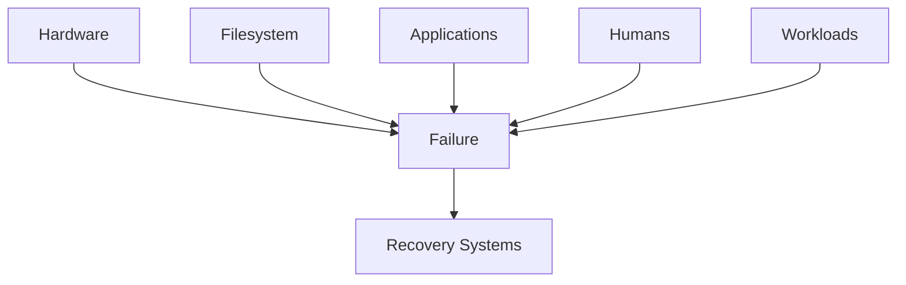
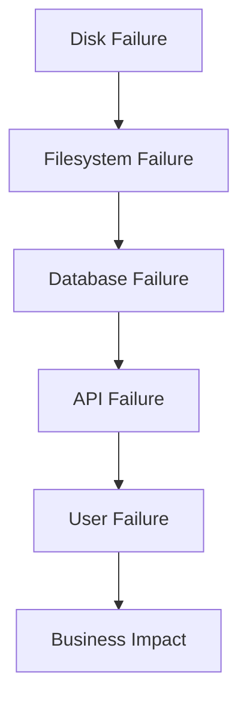
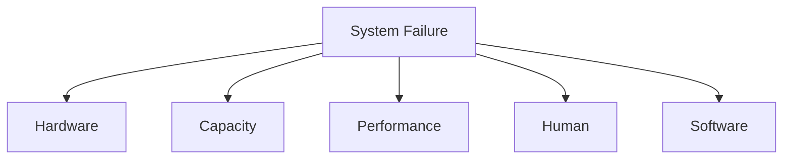

# Storage Failure Thinking

> Great Linux engineers don't build storage systems.
>
> They build systems that continue working when storage fails.
>
> Failure is not an exception.
>
> Failure is the default state of computing.
>
> Every disk will eventually fail.
>
> Every server will eventually fail.
>
> Every filesystem will eventually become full.
>
> Every startup will eventually hit infrastructure limits.
>
> The question is never:
>
> "Will it fail?"
>
> The question is:
>
> **"How will the system behave when it fails?"**

---

# Why This File Exists

Most Linux tutorials teach:

```text
Disk

↓

Filesystem

↓

Mount

↓

Done
```

Reality:

```text
Disk

↓

Failure

↓

Recovery

↓

Business Continuity
```

Storage engineering is failure engineering.

---

# Problem It Solves

This file answers:

```text
Why do storage systems fail?

How do engineers think about failures?

How do enterprises survive failures?

How do cloud systems survive failures?

How do startups design for growth?

What mental models do senior engineers use?
```

---

# Mental Model: Airplane Engineering

Question:

Do airplanes assume engines never fail?

No.

Airplanes assume:

```text
Engine Failure

↓

Backup Systems

↓

Safe Landing
```

Linux engineers think similarly.

Storage should be designed around failure.

---

# First Principles

Every component eventually fails.

Examples:

```text
Disk Failure

Filesystem Corruption

Memory Pressure

Human Error

Power Loss

Application Bugs

Ransomware

Network Failure
```

Failure is normal.

---

# The Five Universal Storage Failures

Memorize these forever.

```text
Hardware Failure

Capacity Failure

Performance Failure

Human Failure

Software Failure
```

Almost every storage problem belongs here.

---

# Big Picture Architecture



---

# Failure Type 1: Hardware Failure

Examples:

```text
SSD Failure

HDD Failure

Controller Failure

Cable Failure

Power Failure
```

Symptoms:

```text
Disk Missing

Read Errors

I/O Errors

Boot Failure
```

Solutions:

```text
RAID

Backups

Monitoring

Redundancy
```

---

# Failure Type 2: Capacity Failure

Examples:

```text
Disk Full

Inodes Full

Log Explosion

Docker Growth

Database Growth
```

Symptoms:

```text
No Space Left On Device
```

Solutions:

```text
Capacity Planning

Monitoring

Alerts

Growth Forecasting
```

---

# Failure Type 3: Performance Failure

Examples:

```text
Slow HDD

Swap Thrashing

Metadata Bottlenecks

Random I/O Explosion
```

Symptoms:

```text
Slow System

High Latency

Application Timeouts
```

Solutions:

```text
NVMe

Caching

Isolation

Optimization
```

---

# Failure Type 4: Human Failure

Most common.

Examples:

```text
rm -rf

Wrong Disk

Wrong Mount

Wrong fstab

Wrong Permissions
```

Humans are dangerous.

Solutions:

```text
Automation

Documentation

Backups

Testing
```

---

# Failure Type 5: Software Failure

Examples:

```text
Kernel Bugs

Filesystem Bugs

Container Bugs

Database Bugs
```

Solutions:

```text
Snapshots

Testing

Backups

Versioning
```

---

# Mental Model: Dominoes

Never think:

```text
Disk Failure

↓

Only Disk Problem
```

Think:

```text
Disk Failure

↓

Filesystem

↓

Database

↓

Application

↓

Users

↓

Business
```

Failures cascade.

---

# Cascading Failure Architecture



Senior engineers think this way.

---

# The Five Questions Engineers Always Ask

Question 1

```text
What can fail?
```

Question 2

```text
When will it fail?
```

Question 3

```text
How will we detect it?
```

Question 4

```text
How will we recover?
```

Question 5

```text
What is the blast radius?
```

Memorize these forever.

---

# Failure Domains

Another important concept.

Visual:

```text
Disk

↓

Server

↓

Rack

↓

Data Center

↓

Region
```

Every layer can fail.

---

# The Blast Radius Concept

Question:

If one disk fails.

What breaks?

Bad design:

```text
Entire Company Offline
```

Good design:

```text
One Service Degraded
```

Smaller blast radius.

---

# Storage Design Evolution

## Beginner

```text
One Disk

↓

Everything
```

Bad.

---

## Intermediate

```text
Multiple Partitions
```

Better.

---

## Advanced

```text
RAID

↓

LVM

↓

Isolation
```

Good.

---

## Production

```text
RAID

↓

LVM

↓

Snapshots

↓

Backups

↓

Monitoring
```

Excellent.

---

# The Layered Defense Model

Visual:

```text
Disk Failure

↓

RAID

↓

Filesystem Failure

↓

Snapshots

↓

Human Error

↓

Backups

↓

Disaster

↓

Offsite Backup
```

Never trust one protection layer.

---

# Mental Model: Castle Defense

Good systems have layers.

```text
Wall

↓

Gate

↓

Guards

↓

Vault
```

Storage systems need layers too.

---

# The Golden Rule

Always assume:

```text
Something Is Already Broken
```

This is how SREs think.

---

# LVM's Job

LVM solves:

```text
Capacity Failure
```

---

# RAID's Job

RAID solves:

```text
Disk Failure
```

---

# Swap's Job

Swap solves:

```text
Memory Pressure
```

---

# Backups Solve

```text
Human Failure
```

---

# Monitoring Solves

```text
Detection Failure
```

---

# Storage Responsibility Map

```text
Problem

↓

Technology


Disk Failure

↓

RAID


Capacity Growth

↓

LVM


Memory Pressure

↓

Swap


Human Error

↓

Backup


Detection

↓

Monitoring
```

---

# Production Example: Docker Host

Common failures:

```text
Container Logs

↓

/var Full

↓

Containers Crash
```

Solution:

```text
Dedicated Storage

Monitoring

Cleanup Policies
```

---

# Production Example: Kubernetes Node

Common failures:

```text
Images Grow

↓

Disk Full

↓

Pods Fail
```

Solution:

```text
Dedicated Volumes

Garbage Collection

Monitoring
```

---

# Production Example: Database Server

Common failures:

```text
WAL Logs Grow

↓

Storage Full

↓

Database Down
```

Solution:

```text
Separate Storage

Alerts

Capacity Planning
```

---

# Startup Founder Perspective

Think:

```text
Today

↓

100 Users


Tomorrow

↓

100,000 Users
```

Will storage survive?

This is founder thinking.

---

# Cloud Perspective

Cloud changed infrastructure.

Cloud providers already solve:

```text
Hardware Failure
```

But you still solve:

```text
Growth

Observability

Architecture
```

---

# Modern Storage Design Pattern

Visual:

```text
RAID

↓

LVM

↓

Filesystem

↓

Snapshots

↓

Monitoring

↓

Backups
```

This is excellent infrastructure.

---

# The Three Engineering Rules

Rule 1

```text
Everything Fails
```

Rule 2

```text
Everything Grows
```

Rule 3

```text
Humans Make Mistakes
```

Memorize forever.

---

# Observability Mindset

Monitor:

```text
Disk Health

Capacity

Latency

Growth Rate

IOPS

Error Rate
```

---

# Troubleshooting Workflow

Question:

```text
System Broken?
```

Ask:

```text
Hardware?

↓

Capacity?

↓

Performance?

↓

Human?

↓

Software?
```

Visual:



---

# Common Mistakes

## Mistake 1

Building systems that never expect failure.

Impossible.

---

## Mistake 2

Thinking RAID is backup.

Wrong.

---

## Mistake 3

Ignoring growth.

Everything grows.

---

## Mistake 4

Ignoring observability.

Invisible systems eventually fail.

---

## Mistake 5

Putting everything on one disk.

Bad architecture.

---

# Engineering Mindset

Whenever you build storage, ask:

```text
What breaks?

What survives?

What recovers?

Who notices?

How fast?
```

This is how senior engineers think.

---

# Interview Questions

## Beginner

1. Why do storage systems fail?

2. What is blast radius?

3. Why is monitoring important?

4. Why is RAID not backup?

---

## Intermediate

5. Explain cascading failures.

6. Explain capacity failures.

7. Explain layered defense.

8. Explain failure domains.

---

## Advanced

9. Design resilient storage for a startup.

10. Design resilient storage for Kubernetes.

11. Design resilient storage for databases.

12. Explain storage engineering philosophy.

---

# Cheat Sheet

```text
Failure Types

Hardware

Capacity

Performance

Human

Software


Golden Rules

Everything Fails

Everything Grows

Humans Make Mistakes


Questions

What breaks?

What survives?

What recovers?

What is the blast radius?


Storage Stack

RAID

↓

LVM

↓

Filesystem

↓

Monitoring

↓

Backups
```
